## 들어가며

서비스에 실시간 알림 기능을 넣어야 할 때, 가장 먼저 떠오르는 질문이 있습니다. **WebSocket을 쓸까, SSE를 쓸까?**

둘 다 서버에서 클라이언트로 데이터를 실시간으로 밀어주는(push) 기술이지만, 동작 방식과 적합한 시나리오가 전혀 다릅니다. 이 차이를 제대로 이해하려면 HTTP의 연결 방식부터 짚고 넘어가야 합니다. HTTP가 왜 실시간에 부적합한지를 모르면, SSE와 WebSocket이 각각 어떤 문제를 해결하는 기술인지 제대로 파악할 수 없기 때문입니다.

이 글에서는 다음 범위를 다룹니다.

- **네트워크 기초**: TCP 3-way handshake, HTTP/1.0 → HTTP/1.1 → HTTP/2 연결 모델의 변화
- **실시간 통신 기법 발전**: Short Polling → Long Polling → SSE → WebSocket
- **SSE vs WebSocket 심층 비교**: 프로토콜 스펙, 프레임 오버헤드, HTTP/2에서의 변화
- **Spring Boot 구현**: SseEmitter 내부 동작, Servlet 비동기 처리 원리, 메모리 추정
- **운영 주의점**: Nginx 설정, 로드밸런서 전략, Last-Event-ID 복구

---

## 네트워크 기초: HTTP 연결 모델의 한계

### TCP 3-way Handshake

HTTP는 TCP 위에서 동작합니다. TCP 연결을 수립하려면 반드시 **3-way handshake** 과정을 거쳐야 합니다.

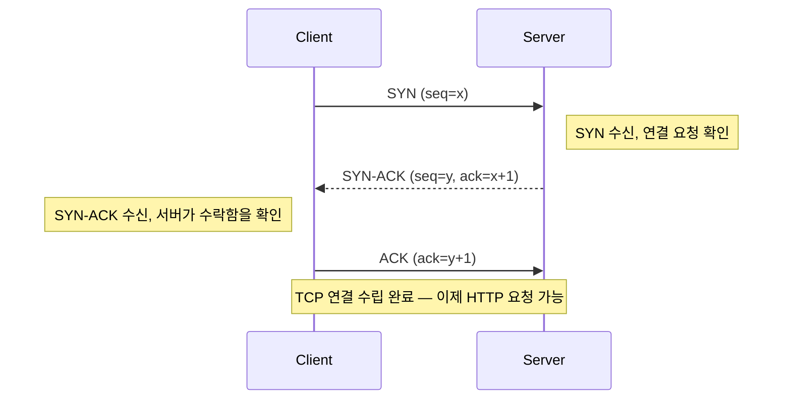
```mermaid
sequenceDiagram
    participant C as Client
    participant S as Server
    C->>S: SYN (seq=x)
    Note right of S: SYN 수신, 연결 요청 확인
    S-->>C: SYN-ACK (seq=y, ack=x+1)
    Note left of C: SYN-ACK 수신, 서버가 수락함을 확인
    C->>S: ACK (ack=y+1)
    Note over C,S: TCP 연결 수립 완료 — 이제 HTTP 요청 가능
```

각 단계를 풀어보면 다음과 같습니다.

1. **SYN**: 클라이언트가 서버에 연결을 요청합니다. 자신의 초기 시퀀스 번호(x)를 전달합니다.
2. **SYN-ACK**: 서버가 요청을 수락하며, 자신의 초기 시퀀스 번호(y)와 클라이언트 시퀀스에 대한 확인 응답(x+1)을 보냅니다.
3. **ACK**: 클라이언트가 서버의 시퀀스를 확인(y+1)하며, 연결이 수립됩니다.

이 과정에 걸리는 시간은 **1.5 RTT(Round Trip Time)**입니다. 서울-미국 서부 기준 RTT가 약 150ms라면, TCP 연결 수립에만 약 225ms가 소요됩니다. 이 비용은 HTTP 요청을 보내기 **전에** 매번 발생합니다.

### HTTP/1.0 vs HTTP/1.1 vs HTTP/2

TCP 연결 수립 비용이 크기 때문에, HTTP 프로토콜은 연결 재사용 방식을 점진적으로 개선해왔습니다.

#### HTTP/1.0: 요청마다 새 연결

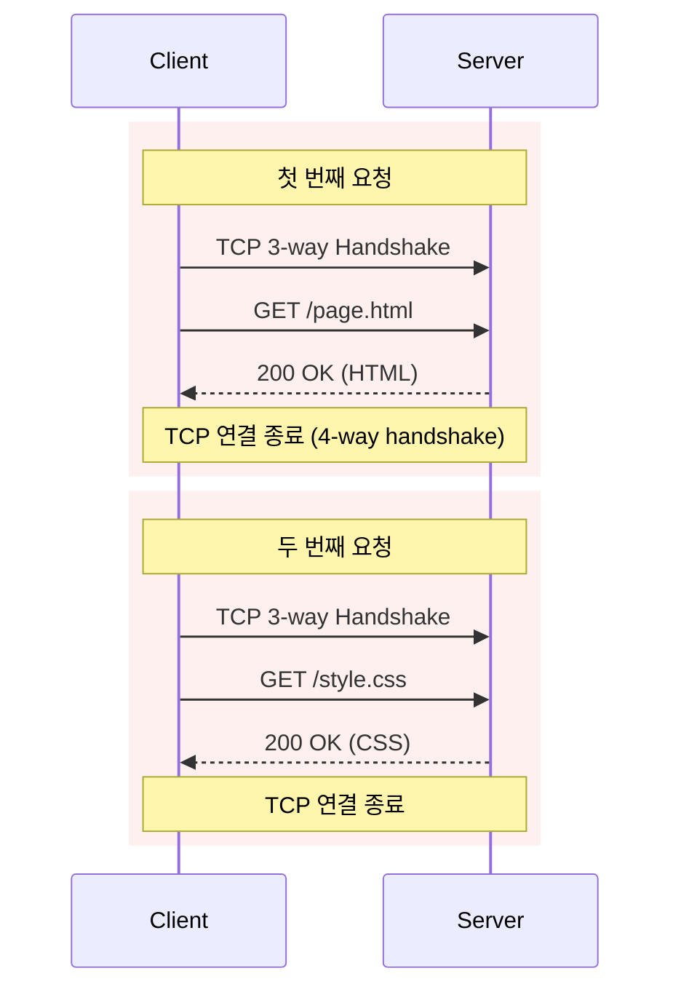
```mermaid
sequenceDiagram
    participant C as Client
    participant S as Server
    rect rgb(255, 240, 240)
        Note over C,S: 첫 번째 요청
        C->>S: TCP 3-way Handshake
        C->>S: GET /page.html
        S-->>C: 200 OK (HTML)
        Note over C,S: TCP 연결 종료 (4-way handshake)
    end
    rect rgb(255, 240, 240)
        Note over C,S: 두 번째 요청
        C->>S: TCP 3-way Handshake
        C->>S: GET /style.css
        S-->>C: 200 OK (CSS)
        Note over C,S: TCP 연결 종료
    end
```

HTTP/1.0은 **요청-응답 한 쌍마다 TCP 연결을 새로 수립하고 종료**합니다. 웹 페이지 하나를 로드하는 데 HTML, CSS, JS, 이미지 등 수십 개의 리소스가 필요한데, 매번 TCP handshake를 반복하면 지연이 누적됩니다.

요청 10개를 보내면: **10 x (TCP handshake + HTTP 요청/응답 + TCP 종료)** = 막대한 오버헤드

#### HTTP/1.1: Keep-Alive (연결 재사용)

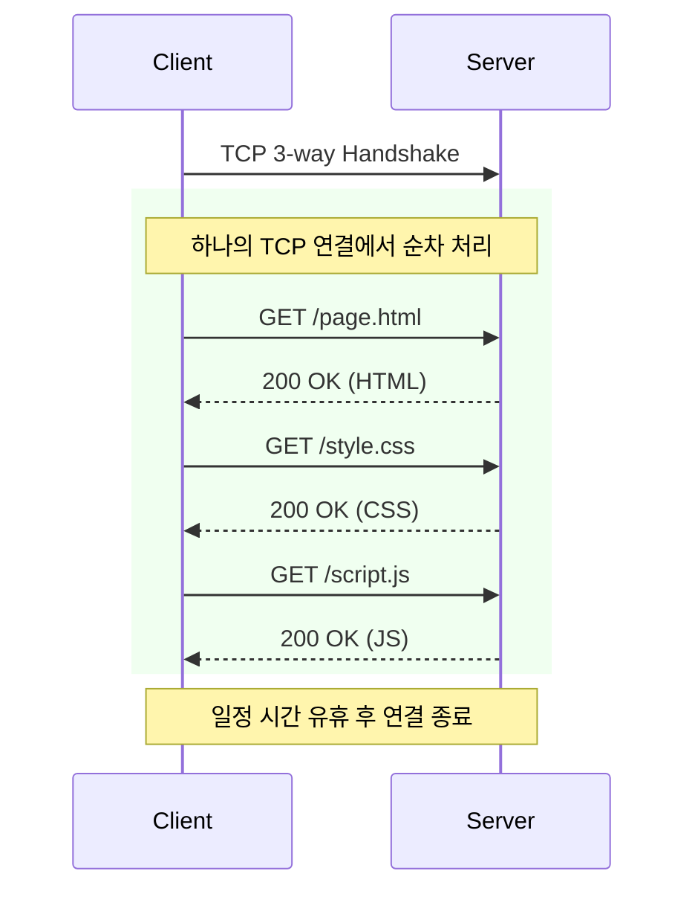
```mermaid
sequenceDiagram
    participant C as Client
    participant S as Server
    C->>S: TCP 3-way Handshake
    rect rgb(240, 255, 240)
        Note over C,S: 하나의 TCP 연결에서 순차 처리
        C->>S: GET /page.html
        S-->>C: 200 OK (HTML)
        C->>S: GET /style.css
        S-->>C: 200 OK (CSS)
        C->>S: GET /script.js
        S-->>C: 200 OK (JS)
    end
    Note over C,S: 일정 시간 유휴 후 연결 종료
```

HTTP/1.1은 `Connection: keep-alive`를 **기본값으로 설정**해, 하나의 TCP 연결을 여러 요청에 재사용합니다. TCP handshake 비용이 첫 요청에서만 발생하므로, 전체 지연이 크게 줄어듭니다.

하지만 한 가지 치명적인 한계가 있습니다. **Head-of-Line(HOL) Blocking**입니다. 하나의 연결에서 요청은 **반드시 순서대로** 처리되어야 합니다. 첫 번째 요청의 응답이 느리면 뒤의 모든 요청이 대기합니다.

이를 우회하기 위해 브라우저는 **도메인당 6개의 동시 TCP 연결**을 엽니다. 하지만 이는 근본적 해결이 아닌 회피책입니다.

#### HTTP/2: 멀티플렉싱

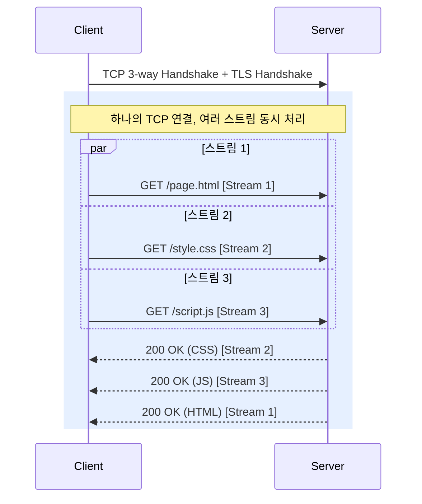
```mermaid
sequenceDiagram
    participant C as Client
    participant S as Server
    C->>S: TCP 3-way Handshake + TLS Handshake
    rect rgb(230, 240, 255)
        Note over C,S: 하나의 TCP 연결, 여러 스트림 동시 처리
        par 스트림 1
            C->>S: GET /page.html [Stream 1]
        and 스트림 2
            C->>S: GET /style.css [Stream 2]
        and 스트림 3
            C->>S: GET /script.js [Stream 3]
        end
        S-->>C: 200 OK (CSS) [Stream 2]
        S-->>C: 200 OK (JS) [Stream 3]
        S-->>C: 200 OK (HTML) [Stream 1]
    end
```

HTTP/2는 **하나의 TCP 연결에서 여러 스트림을 동시에 처리**합니다. 요청과 응답을 바이너리 프레임으로 분할하고, 프레임에 스트림 ID를 부여해 순서와 무관하게 인터리빙(interleaving)합니다.

세 프로토콜의 핵심 차이를 정리하면 다음과 같습니다.

| 항목 | HTTP/1.0 | HTTP/1.1 | HTTP/2 |
|------|----------|----------|--------|
| **연결 방식** | 요청마다 새 TCP 연결 | Keep-Alive (연결 재사용) | 멀티플렉싱 (1 TCP, N 스트림) |
| **동시 요청** | 불가 | 도메인당 6개 TCP 연결로 우회 | 1개 연결에서 수백 스트림 |
| **HOL Blocking** | 연결 자체가 분리 | 존재 (같은 연결 내 순차) | 스트림 레벨에서 해소 |
| **헤더** | 텍스트, 매 요청마다 전송 | 텍스트, 매 요청마다 전송 | 바이너리, HPACK 압축 |
| **서버 푸시** | 불가 | 불가 | Server Push 지원 |

### 왜 HTTP 기본 모델로는 실시간이 어려운가

HTTP는 본질적으로 **요청-응답(Request-Response)** 모델입니다. 클라이언트가 요청을 보내야만 서버가 응답할 수 있고, 서버가 먼저 클라이언트에게 데이터를 보내는 것은 **프로토콜 스펙상 불가능**합니다.

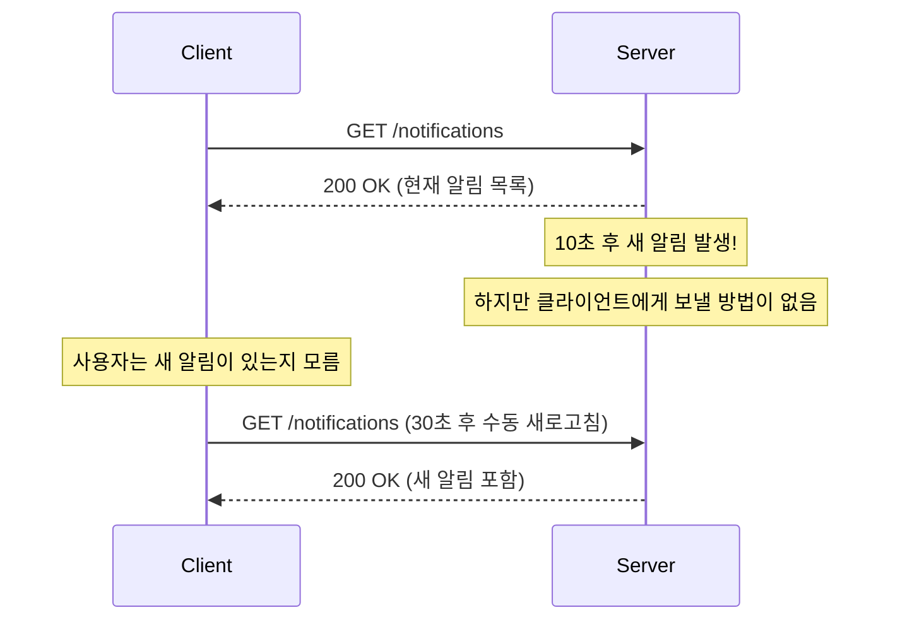
```mermaid
sequenceDiagram
    participant C as Client
    participant S as Server
    C->>S: GET /notifications
    S-->>C: 200 OK (현재 알림 목록)
    Note over S: 10초 후 새 알림 발생!
    Note over S: 하지만 클라이언트에게 보낼 방법이 없음
    Note over C: 사용자는 새 알림이 있는지 모름
    C->>S: GET /notifications (30초 후 수동 새로고침)
    S-->>C: 200 OK (새 알림 포함)
```

서버에 새로운 이벤트(알림, 메시지 등)가 발생해도, 클라이언트가 다시 요청하기 전까지 전달할 수 없습니다. 이 한계를 극복하기 위해 여러 기법이 발전해왔습니다.

---

## 실시간 통신 기법의 발전 과정

### 1. Short Polling

가장 단순한 방법입니다. 클라이언트가 일정 간격으로 서버에 반복 요청을 보내 새 데이터가 있는지 확인합니다.

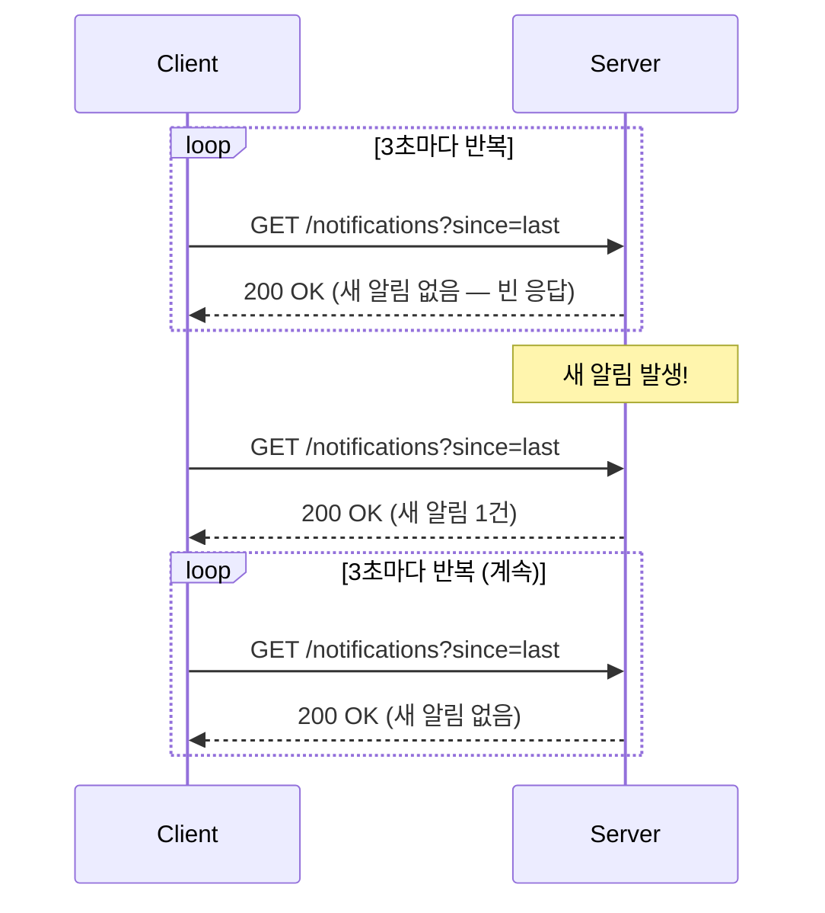
```mermaid
sequenceDiagram
    participant C as Client
    participant S as Server
    loop 3초마다 반복
        C->>S: GET /notifications?since=last
        S-->>C: 200 OK (새 알림 없음 — 빈 응답)
    end
    Note over S: 새 알림 발생!
    C->>S: GET /notifications?since=last
    S-->>C: 200 OK (새 알림 1건)
    loop 3초마다 반복 (계속)
        C->>S: GET /notifications?since=last
        S-->>C: 200 OK (새 알림 없음)
    end
```

클라이언트 구현은 단순합니다.

```javascript
// Short Polling - 클라이언트
function pollNotifications() {
    setInterval(async () => {
        const response = await fetch('/api/notifications?since=' + lastEventId);
        const data = await response.json();
        if (data.length > 0) {
            data.forEach(notification => renderNotification(notification));
            lastEventId = data[data.length - 1].id;
        }
    }, 3000); // 3초 간격
}
```

#### 정량적 문제점 분석

Short Polling의 가장 큰 문제는 **대부분의 요청이 빈 응답**이라는 것입니다. 정량적으로 계산해 보겠습니다.

**가정**: 동시 접속 사용자 10,000명, 폴링 간격 3초, 사용자당 평균 알림 빈도 10분에 1건

- 초당 요청 수: 10,000 / 3 = **3,333 req/s**
- 10분간 총 요청 수: 3,333 x 600 = **2,000,000건**
- 10분간 실제 알림이 있는 요청: 10,000건 (사용자당 1건)
- **유효 요청 비율**: 10,000 / 2,000,000 = **0.5%**

즉 **99.5%의 요청이 서버 자원만 소모하는 빈 응답**입니다. 각 요청마다 TCP 연결(keep-alive라면 재사용), HTTP 헤더 파싱, 인증 검증, DB 조회가 발생하므로 서버 부하는 상당합니다.

요청 1건당 오버헤드를 추정하면:

| 항목 | 크기 |
|------|------|
| HTTP 요청 헤더 (Method, URL, Host, Cookie, User-Agent 등) | ~400 bytes |
| HTTP 응답 헤더 (Status, Content-Type, Set-Cookie 등) | ~300 bytes |
| 응답 본문 (빈 배열 `[]`) | ~2 bytes |
| **합계** | **~702 bytes** |

초당 3,333건 x 702 bytes = **약 2.3 MB/s의 네트워크 대역폭**이 순수 오버헤드로 소모됩니다.

### 2. Long Polling

Short Polling의 빈 응답 문제를 줄이기 위한 개선입니다. 서버가 **새 데이터가 생길 때까지 응답을 지연**시킵니다. 이 패턴을 **Comet 패턴**이라고 부르기도 합니다.

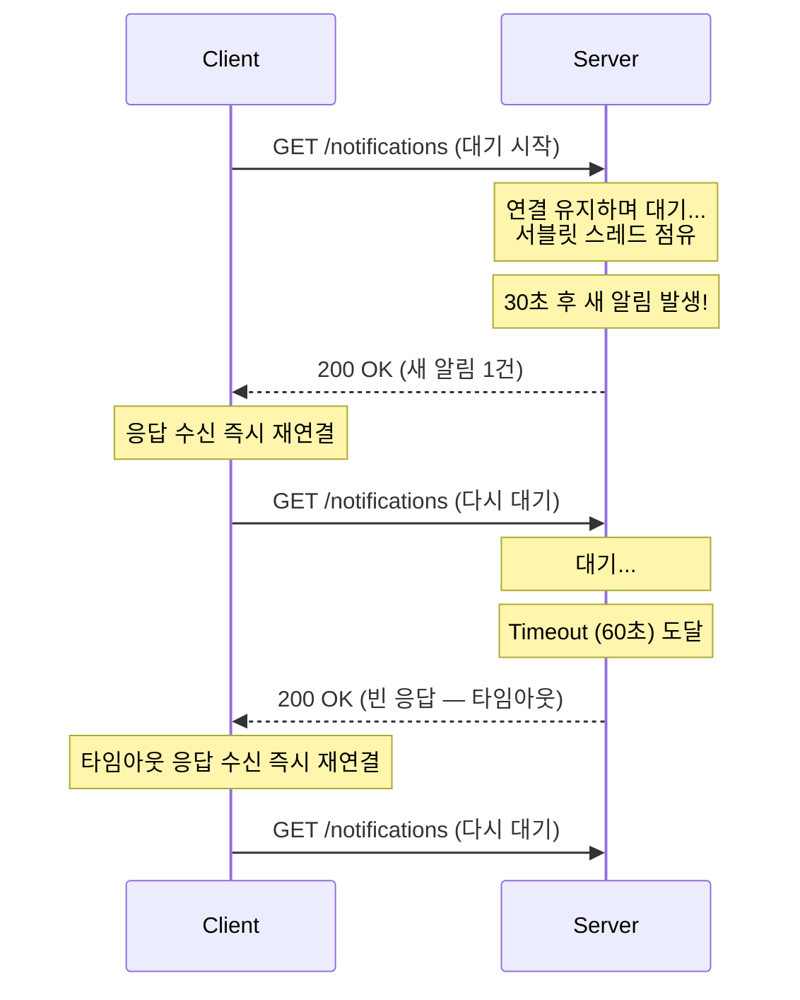
```mermaid
sequenceDiagram
    participant C as Client
    participant S as Server
    C->>S: GET /notifications (대기 시작)
    Note over S: 연결 유지하며 대기...<br/>서블릿 스레드 점유
    Note over S: 30초 후 새 알림 발생!
    S-->>C: 200 OK (새 알림 1건)
    Note over C: 응답 수신 즉시 재연결
    C->>S: GET /notifications (다시 대기)
    Note over S: 대기...
    Note over S: Timeout (60초) 도달
    S-->>C: 200 OK (빈 응답 — 타임아웃)
    Note over C: 타임아웃 응답 수신 즉시 재연결
    C->>S: GET /notifications (다시 대기)
```

```javascript
// Long Polling - 클라이언트
async function longPoll() {
    try {
        const response = await fetch('/api/notifications/poll?since=' + lastEventId, {
            signal: AbortSignal.timeout(65000) // 서버 타임아웃보다 약간 길게
        });
        const data = await response.json();
        if (data.length > 0) {
            data.forEach(notification => renderNotification(notification));
            lastEventId = data[data.length - 1].id;
        }
    } catch (e) {
        // 네트워크 오류 시 잠시 대기 후 재시도
        await new Promise(resolve => setTimeout(resolve, 1000));
    }
    longPoll(); // 즉시 재연결
}
```

#### Comet 패턴과 그 한계

Long Polling은 2000년대 중반 **Comet**이라는 이름으로 널리 사용되었습니다. Gmail, Facebook 등이 초기 실시간 기능에 이 방식을 사용했습니다.

하지만 근본적인 한계가 있습니다.

1. **이벤트마다 연결 재수립**: 이벤트가 발생할 때마다 응답이 완료되고, 클라이언트는 새 HTTP 요청을 보내야 합니다. Keep-Alive가 있더라도 HTTP 요청/응답 헤더의 오버헤드가 반복됩니다.
2. **서버 자원 점유**: 대기 중인 연결이 서블릿 스레드를 점유합니다. 동시 접속 10,000명이면 10,000개의 스레드가 대기 상태로 묶입니다. Tomcat 기본 스레드 풀이 200개인 점을 고려하면, 별도의 비동기 처리 없이는 확장이 어렵습니다.
3. **이벤트 유실 가능성**: 응답 → 재연결 사이의 짧은 간극에 이벤트가 발생하면 놓칠 수 있습니다.

### 3. SSE (Server-Sent Events)

SSE는 HTTP 연결을 **끊지 않고 유지한 채**, 서버가 지속적으로 이벤트를 스트리밍합니다. Long Polling의 재연결 문제를 근본적으로 해결합니다.

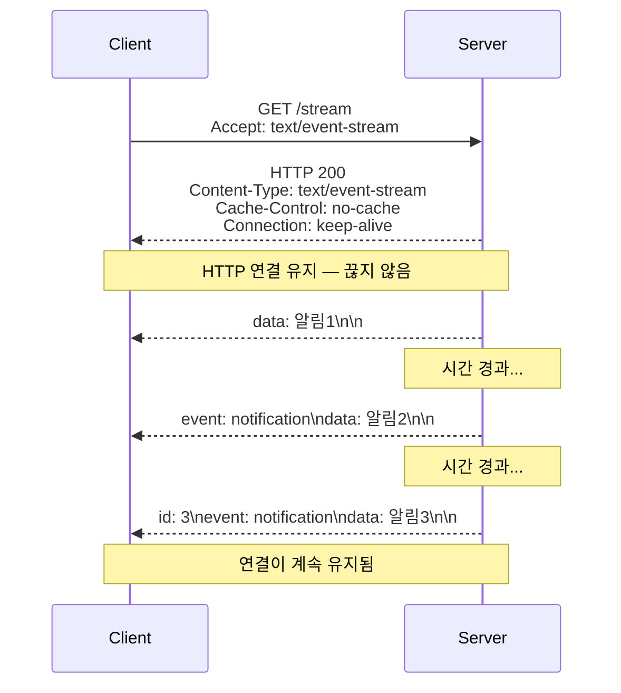
```mermaid
sequenceDiagram
    participant C as Client
    participant S as Server
    C->>S: GET /stream<br/>Accept: text/event-stream
    S-->>C: HTTP 200<br/>Content-Type: text/event-stream<br/>Cache-Control: no-cache<br/>Connection: keep-alive
    Note over C,S: HTTP 연결 유지 — 끊지 않음
    S-->>C: data: 알림1\n\n
    Note over S: 시간 경과...
    S-->>C: event: notification\ndata: 알림2\n\n
    Note over S: 시간 경과...
    S-->>C: id: 3\nevent: notification\ndata: 알림3\n\n
    Note over C,S: 연결이 계속 유지됨
```

#### text/event-stream 프로토콜 스펙 상세

SSE의 데이터 형식은 [W3C Server-Sent Events 스펙](https://html.spec.whatwg.org/multipage/server-sent-events.html)에 정의되어 있습니다. 매우 단순한 텍스트 기반 프로토콜입니다.

하나의 이벤트는 **빈 줄(`\n\n`)**로 구분되며, 각 줄은 **필드명: 값** 형식입니다.

```
[필드명]: [값]\n
[필드명]: [값]\n
\n
```

스펙에 정의된 필드는 4가지입니다.

| 필드 | 역할 | 예시 |
|------|------|------|
| **data** | 이벤트 데이터 본문. 여러 줄 가능 (각 줄 앞에 `data:` 반복) | `data: {"userId": 1, "message": "hello"}` |
| **event** | 이벤트 타입 이름. 생략하면 `message`가 기본값 | `event: notification` |
| **id** | 이벤트 ID. 재연결 시 `Last-Event-ID` 헤더로 전송됨 | `id: 1709523600000` |
| **retry** | 재연결 대기 시간(ms). 브라우저의 자동 재연결 간격을 서버가 제어 | `retry: 3000` |

실제 전송되는 원시 데이터의 예시입니다.

```
retry: 3000\n
\n
id: 1\n
event: connect\n
data: 연결 성공\n
\n
id: 2\n
event: notification\n
data: {"type": "COMMENT", "postId": 42, "message": "새 댓글"}\n
\n
id: 3\n
event: notification\n
data: {"type": "LIKE", "postId": 42, "message": "좋아요"}\n
\n
```

주의할 점:
- **data 필드가 여러 줄**이면 각 줄 앞에 `data:`를 붙입니다. 클라이언트는 줄바꿈(`\n`)으로 연결해 하나의 문자열로 조합합니다.
- **콜론(`:`)으로 시작하는 줄**은 주석으로 처리됩니다. 서버가 `: keep-alive\n\n`을 주기적으로 보내 연결 유지 신호로 활용할 수 있습니다.
- **알 수 없는 필드명**은 무시됩니다. 하위 호환성을 보장합니다.

#### SSE가 HTTP 위에서 스트리밍되는 원리: Chunked Transfer Encoding

SSE 이벤트가 연결을 끊지 않고 계속 전달될 수 있는 이유는 **HTTP/1.1 Chunked Transfer Encoding** 덕분입니다. 일반적인 HTTP 응답은 `Content-Length` 헤더로 본문 크기를 미리 알려주고, 그 크기만큼 전송 후 완료됩니다. 하지만 SSE는 응답 본문의 크기를 미리 알 수 없습니다. 이벤트가 언제, 몇 개나 발생할지 서버도 모르기 때문입니다.

Chunked Transfer Encoding은 이 문제를 해결합니다. 응답 본문을 **chunk 단위로 분할**해서, 각 chunk의 크기를 16진수로 명시한 뒤 데이터를 전송합니다.

```
HTTP/1.1 200 OK
Content-Type: text/event-stream
Transfer-Encoding: chunked
Cache-Control: no-cache
Connection: keep-alive

2f\r\n                              ← chunk 크기 (47바이트, 16진수)
id: 1\nevent: notification\ndata: hello\n\n\r\n   ← chunk 데이터
\r\n
0\r\n                               ← 종료 chunk (크기 0)
\r\n
```

각 SSE 이벤트가 하나의 chunk로 전송됩니다. 서버는 이벤트가 발생할 때마다 새로운 chunk를 기록하고, 연결은 종료 chunk(크기 0)가 올 때까지 유지됩니다. SSE에서는 연결을 명시적으로 닫기 전까지 종료 chunk를 보내지 않으므로, 스트리밍이 지속됩니다.

HTTP/2에서는 Chunked Transfer Encoding이 사용되지 않습니다. HTTP/2는 자체 **프레임 기반 전송**을 사용하며, DATA 프레임 단위로 응답 본문을 분할합니다. 각 DATA 프레임에 길이 정보가 포함되어 있으므로 별도의 chunked 인코딩이 불필요합니다.

#### TCP Nagle 알고리즘과 SSE 지연 문제

SSE 이벤트가 서버에서 전송되었는데 클라이언트에 즉시 도착하지 않는 현상이 발생할 수 있습니다. 원인 중 하나가 **TCP Nagle 알고리즘**입니다.

Nagle 알고리즘은 1984년 John Nagle이 제안한 TCP 최적화 기법으로, **작은 패킷을 모아서 한 번에 전송**합니다. 규칙은 단순합니다.

```
if (미확인(unACKed) 데이터가 없음) {
    즉시 전송
} else {
    버퍼에 쌓아두고 다음 조건 중 하나가 충족되면 전송:
    1. 이전 데이터의 ACK가 도착
    2. 버퍼가 MSS(Maximum Segment Size, 보통 1460bytes)에 도달
}
```

Nagle 알고리즘이 활성화된 상태에서 SSE 이벤트(보통 수십~수백 바이트)를 전송하면, MSS에 한참 미달하므로 **ACK를 기다리며 전송이 지연**될 수 있습니다. 특히 **Delayed ACK**(수신 측이 ACK를 200ms까지 지연시키는 TCP 최적화)와 결합되면, 최악의 경우 200ms의 추가 지연이 발생합니다.

```
[서버] SSE 이벤트 전송 (50 bytes)
  → Nagle: 이전 ACK 대기 중이므로 버퍼에 보류
  → [클라이언트] Delayed ACK: 200ms까지 ACK 지연
  → 200ms 후 ACK 도착
  → Nagle: ACK 수신, 이제 버퍼의 데이터 전송
[클라이언트] SSE 이벤트 수신 (200ms 지연 발생)
```

해결 방법은 **TCP_NODELAY** 옵션입니다. 이 옵션을 활성화하면 Nagle 알고리즘이 비활성화되어 데이터가 즉시 전송됩니다.

```java
// Spring Boot에서 Tomcat의 TCP_NODELAY 설정
@Bean
public WebServerFactoryCustomizer<TomcatServletWebServerFactory> tomcatCustomizer() {
    return factory -> factory.addConnectorCustomizers(connector -> {
        if (connector.getProtocolHandler() instanceof AbstractProtocol<?> protocol) {
            protocol.setTcpNoDelay(true); // Nagle 알고리즘 비활성화
        }
    });
}
```

Tomcat은 기본적으로 `TCP_NODELAY`가 **활성화(true)**되어 있어 Nagle 알고리즘이 꺼져 있습니다. 하지만 Nginx와 같은 리버스 프록시 뒤에 배치된 경우, **Nginx → 클라이언트 구간**에서도 `tcp_nodelay on` 설정이 필요합니다.

```nginx
# Nginx에서 TCP_NODELAY 활성화
http {
    tcp_nodelay on;  # 기본값이 on이지만 명시적으로 선언
    tcp_nopush on;   # sendfile과 함께 사용 시 헤더와 데이터를 하나의 패킷으로 전송
}
```

`tcp_nopush`와 `tcp_nodelay`는 상충되는 것처럼 보이지만, Nginx는 이 둘을 **조합해서 사용**합니다. `tcp_nopush`는 응답 헤더와 본문 시작 부분을 하나의 패킷으로 묶어 전송하고, 이후 `tcp_nodelay`가 활성화되어 나머지 데이터는 즉시 전송됩니다.

클라이언트 구현은 브라우저 내장 `EventSource` API를 사용합니다.

```javascript
// SSE - 클라이언트 (EventSource API)
const eventSource = new EventSource('/api/notifications/stream');

// 기본 message 이벤트 (event 필드 생략 시)
eventSource.onmessage = (event) => {
    console.log('기본 이벤트:', event.data);
};

// 커스텀 이벤트 타입
eventSource.addEventListener('notification', (event) => {
    const notification = JSON.parse(event.data);
    renderNotification(notification);
    console.log('이벤트 ID:', event.lastEventId); // id 필드 값
});

// 연결 상태 변경
eventSource.onopen = () => {
    console.log('SSE 연결 성공');
};

// 에러 및 자동 재연결
eventSource.onerror = (event) => {
    if (eventSource.readyState === EventSource.CONNECTING) {
        console.log('재연결 시도 중...');
        // 브라우저가 자동으로 retry 간격 후 재연결
        // 이때 Last-Event-ID 헤더에 마지막 id 값을 포함
    }
};
```

**EventSource의 자동 재연결 메커니즘**: 연결이 끊어지면 브라우저가 `retry` 필드에 지정된 간격(기본 3초) 후 자동으로 재연결합니다. 이때 HTTP 요청 헤더에 `Last-Event-ID: [마지막 수신한 id 값]`을 포함하므로, 서버가 놓친 이벤트를 복구할 수 있습니다.

#### EventSource API의 한계와 대안

브라우저 내장 `EventSource` API는 편리하지만 몇 가지 한계가 있습니다.

| 한계 | 상세 | 영향 |
|------|------|------|
| **커스텀 헤더 불가** | Authorization 헤더를 설정할 수 없음 | JWT 기반 인증 시 쿼리 파라미터로 토큰 전달 필요 |
| **POST 불가** | GET 요청만 지원 | 요청 본문에 필터 조건을 보낼 수 없음 |
| **바이너리 미지원** | text/event-stream만 파싱 | Base64 인코딩 필요 (33% 크기 증가) |
| **재연결 제어 제한** | exponential backoff 미지원 | 서버 장애 시 모든 클라이언트가 동시에 재연결 (thundering herd) |

커스텀 헤더가 필요한 경우 **fetch API + ReadableStream**을 사용해 직접 구현할 수 있습니다.

```javascript
// fetch 기반 SSE 구현 — 커스텀 헤더 지원
async function connectSSE(url, token) {
    const response = await fetch(url, {
        headers: {
            'Accept': 'text/event-stream',
            'Authorization': `Bearer ${token}`,
        },
    });

    const reader = response.body.getReader();
    const decoder = new TextDecoder();
    let buffer = '';

    while (true) {
        const { done, value } = await reader.read();
        if (done) break;

        buffer += decoder.decode(value, { stream: true });

        // 이벤트 경계(\n\n)로 분할
        const events = buffer.split('\n\n');
        buffer = events.pop(); // 마지막은 불완전할 수 있으므로 버퍼에 보관

        for (const event of events) {
            if (event.trim()) {
                const parsed = parseSSEEvent(event);
                handleEvent(parsed);
            }
        }
    }
}

function parseSSEEvent(raw) {
    const result = { data: '', event: 'message', id: null };
    for (const line of raw.split('\n')) {
        if (line.startsWith('data: ')) result.data += line.slice(6);
        else if (line.startsWith('event: ')) result.event = line.slice(7);
        else if (line.startsWith('id: ')) result.id = line.slice(4);
    }
    return result;
}
```

이 방식은 자동 재연결을 직접 구현해야 하지만, **인증 헤더 전달, exponential backoff, AbortController를 통한 연결 해제** 등 세밀한 제어가 가능합니다.

**Thundering Herd 방지를 위한 Jittered Backoff**:

서버 장애 후 복구 시 수천 개의 클라이언트가 동시에 재연결을 시도하면 서버에 순간적인 부하 폭증이 발생합니다. 이를 방지하려면 재연결 간격에 **랜덤 지터(jitter)**를 추가합니다.

```javascript
// Exponential Backoff with Full Jitter
function getReconnectDelay(attempt) {
    const baseDelay = 1000;  // 1초
    const maxDelay = 30000;  // 30초
    const exponential = Math.min(maxDelay, baseDelay * Math.pow(2, attempt));
    return Math.random() * exponential; // Full Jitter
}

// 사용
let attempt = 0;
async function reconnect() {
    const delay = getReconnectDelay(attempt++);
    await new Promise(resolve => setTimeout(resolve, delay));
    try {
        await connectSSE('/api/notifications/stream', getToken());
        attempt = 0; // 성공 시 카운터 초기화
    } catch (e) {
        reconnect();
    }
}
```

AWS의 **Exponential Backoff and Jitter** 분석에 따르면, Full Jitter 전략이 Equal Jitter나 Decorrelated Jitter보다 경합(contention)을 가장 효과적으로 분산시킵니다.

### 4. WebSocket

WebSocket은 HTTP와 **완전히 다른 프로토콜**(RFC 6455)입니다. HTTP를 이용해 연결을 수립(Upgrade)한 뒤, TCP 위에서 **양방향 전이중(full-duplex)** 통신을 수행합니다.

#### HTTP Upgrade 과정 상세

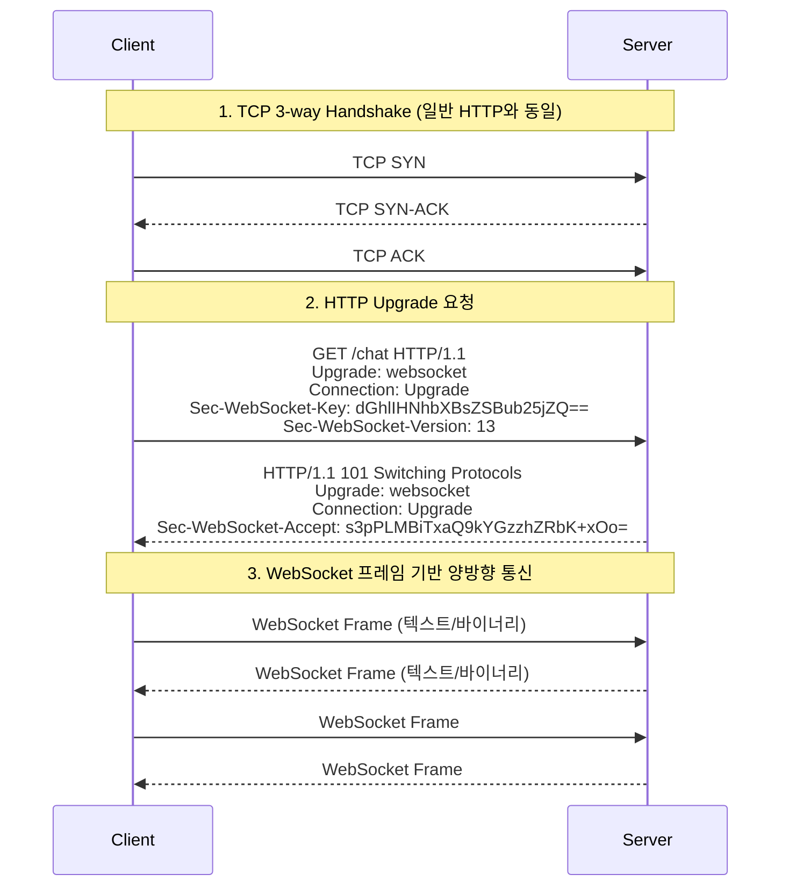
```mermaid
sequenceDiagram
    participant C as Client
    participant S as Server
    Note over C,S: 1. TCP 3-way Handshake (일반 HTTP와 동일)
    C->>S: TCP SYN
    S-->>C: TCP SYN-ACK
    C->>S: TCP ACK
    Note over C,S: 2. HTTP Upgrade 요청
    C->>S: GET /chat HTTP/1.1<br/>Upgrade: websocket<br/>Connection: Upgrade<br/>Sec-WebSocket-Key: dGhlIHNhbXBsZSBub25jZQ==<br/>Sec-WebSocket-Version: 13
    S-->>C: HTTP/1.1 101 Switching Protocols<br/>Upgrade: websocket<br/>Connection: Upgrade<br/>Sec-WebSocket-Accept: s3pPLMBiTxaQ9kYGzzhZRbK+xOo=
    Note over C,S: 3. WebSocket 프레임 기반 양방향 통신
    C->>S: WebSocket Frame (텍스트/바이너리)
    S-->>C: WebSocket Frame (텍스트/바이너리)
    C->>S: WebSocket Frame
    S-->>C: WebSocket Frame
```

Upgrade 과정의 핵심 헤더를 살펴보겠습니다.

**클라이언트 요청**:
- `Upgrade: websocket`: 프로토콜 전환 요청
- `Sec-WebSocket-Key`: Base64 인코딩된 16바이트 랜덤 값. 서버가 WebSocket을 제대로 이해하는지 검증하는 용도
- `Sec-WebSocket-Version: 13`: WebSocket 프로토콜 버전

**서버 응답**:
- `101 Switching Protocols`: 프로토콜 전환 승인
- `Sec-WebSocket-Accept`: 클라이언트의 Key에 매직 GUID(`258EAFA5-E914-47DA-95CA-C5AB0DC85B11`)를 붙이고 SHA-1 해시 → Base64 인코딩한 값. 이 값이 일치해야 클라이언트가 연결을 신뢰합니다.

#### WebSocket 프레임 구조

Upgrade 이후에는 HTTP가 아닌 **WebSocket 프레임** 단위로 통신합니다.

```
 0               1               2               3
 0 1 2 3 4 5 6 7 0 1 2 3 4 5 6 7 0 1 2 3 4 5 6 7 0 1 2 3 4 5 6 7
+-+-+-+-+-------+-+-------------+-------------------------------+
|F|R|R|R| opcode|M| Payload len |    Extended payload length    |
|I|S|S|S|  (4)  |A|     (7)     |             (16/64)           |
|N|V|V|V|       |S|             |   (if payload len == 126/127) |
| |1|2|3|       |K|             |                               |
+-+-+-+-+-------+-+-------------+-------------------------------+
|     Extended payload length continued, if payload len == 127  |
+-------------------------------+-------------------------------+
|                Masking-key, if MASK set to 1                  |
+-------------------------------+-------------------------------+
|                        Payload Data                           |
+---------------------------------------------------------------+
```

핵심 필드:
- **FIN(1bit)**: 메시지의 마지막 프레임인지 표시
- **opcode(4bit)**: 프레임 타입 (0x1 = 텍스트, 0x2 = 바이너리, 0x8 = 닫기, 0x9 = Ping, 0xA = Pong)
- **MASK(1bit)**: 클라이언트 → 서버 프레임은 반드시 마스킹
- **Payload length(7bit)**: 페이로드 길이. 126이면 추가 2바이트, 127이면 추가 8바이트로 확장

**최소 프레임 크기**: 헤더 2바이트 + (마스킹 키 4바이트, 클라이언트→서버만) = **2~6바이트**. HTTP 헤더의 수백 바이트에 비하면 극도로 가볍습니다.

---

## SSE vs WebSocket 심층 비교

### 네트워크 계층 비교

| 항목 | SSE | WebSocket |
|------|-----|-----------|
| **프로토콜** | HTTP/1.1 또는 HTTP/2 | ws:// 또는 wss:// (TCP 기반 독자 프로토콜) |
| **통신 방향** | 서버 → 클라이언트 (단방향) | 양방향 (전이중) |
| **연결 수립** | 일반 HTTP GET 요청 | HTTP Upgrade → 프로토콜 전환 (101 응답) |
| **데이터 형식** | text/event-stream (텍스트 전용) | 텍스트 또는 바이너리 |
| **자동 재연결** | 브라우저 내장 (EventSource API) | 직접 구현 필요 |
| **Last-Event-ID** | 스펙에 포함 (자동 전송) | 직접 구현 필요 |
| **인프라 호환성** | 높음 (일반 HTTP 요청) | 낮음 (Upgrade 미지원 프록시 존재) |

### 메시지당 오버헤드 비교

실시간 통신에서 **메시지당 오버헤드**는 대량 메시지를 처리할 때 성능에 직접적인 영향을 미칩니다.

#### SSE 메시지 오버헤드

SSE는 연결 수립 이후 HTTP 헤더를 다시 보내지 않습니다. 이벤트 하나의 오버헤드는 필드명과 구분자뿐입니다.

```
id: 42\n                    →  7 bytes (필드명 3 + 값 2 + \n 1 + 구분 공백 1)
event: notification\n       → 21 bytes
data: {"msg":"hello"}\n     → 21 bytes
\n                          →  1 byte (이벤트 구분자)
                            ─────────
총 오버헤드 (data 제외):     약 30 bytes
```

#### WebSocket 메시지 오버헤드

WebSocket 프레임의 최소 헤더는 **2바이트**(서버→클라이언트), **6바이트**(클라이언트→서버, 마스킹 포함)입니다.

페이로드 크기에 따른 헤더 크기:

| 페이로드 크기 | 헤더 크기 (서버→클라) | 헤더 크기 (클라→서버) |
|-------------|---------------------|---------------------|
| 0~125 bytes | 2 bytes | 6 bytes |
| 126~65535 bytes | 4 bytes | 8 bytes |
| 65536+ bytes | 10 bytes | 14 bytes |

#### 정량 비교: 알림 1,000건 전송 시

알림 본문이 평균 100바이트라고 가정합니다.

| 방식 | 메시지당 오버헤드 | 1,000건 총 오버헤드 |
|------|-----------------|-------------------|
| **Short Polling** | ~700 bytes (HTTP 헤더) | ~700 KB |
| **Long Polling** | ~700 bytes (재연결마다 HTTP 헤더) | ~700 KB |
| **SSE** | ~30 bytes (필드명 + 구분자) | ~30 KB |
| **WebSocket** | ~2 bytes (프레임 헤더) | ~2 KB |

WebSocket이 프레임 오버헤드 면에서 가장 효율적이지만, **단방향 알림에 양방향 프로토콜을 사용하는 것은 과설계**입니다. SSE의 30바이트 오버헤드는 알림 시나리오에서 충분히 가볍습니다.

### HTTP/2에서의 SSE 성능 변화

SSE의 가장 큰 약점 중 하나가 HTTP/1.1의 **도메인당 동시 연결 6개 제한**이었습니다. SSE가 이 중 하나를 상시 점유하면 나머지 API 요청에 사용 가능한 연결이 5개로 줄어듭니다.

HTTP/2에서는 이 문제가 **근본적으로 해소**됩니다.

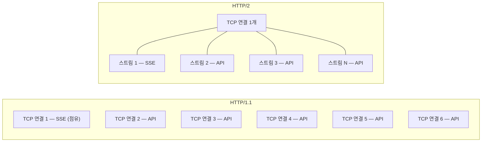
```mermaid
flowchart LR
    subgraph HTTP/1.1
        direction TB
        TCP1["TCP 연결 1 — SSE (점유)"]
        TCP2["TCP 연결 2 — API"]
        TCP3["TCP 연결 3 — API"]
        TCP4["TCP 연결 4 — API"]
        TCP5["TCP 연결 5 — API"]
        TCP6["TCP 연결 6 — API"]
    end
    subgraph HTTP/2
        direction TB
        TCP["TCP 연결 1개"]
        S1["스트림 1 — SSE"]
        S2["스트림 2 — API"]
        S3["스트림 3 — API"]
        SN["스트림 N — API"]
        TCP --- S1
        TCP --- S2
        TCP --- S3
        TCP --- SN
    end
```

HTTP/2에서는 SSE 스트림이 하나의 TCP 연결 내 수백 개의 스트림 중 하나일 뿐이므로, **다른 API 요청에 전혀 영향을 주지 않습니다**. 이 변화로 SSE의 실용성이 크게 향상되었습니다.

#### HTTP/2 Flow Control과 SSE 스트림 우선순위

HTTP/2는 하나의 TCP 연결에서 여러 스트림이 대역폭을 공유하므로, **Flow Control**과 **Stream Priority** 메커니즘이 중요합니다.

**Flow Control**: HTTP/2는 스트림 레벨의 흐름 제어를 제공합니다. 수신 측이 **WINDOW_UPDATE** 프레임으로 수신 가능한 바이트 수를 알려주고, 송신 측은 이 윈도우 내에서만 데이터를 보낼 수 있습니다.

```
초기 윈도우 크기: 65,535 bytes (HTTP/2 기본값)

[서버 → 클라이언트]
  DATA frame (SSE 이벤트, 200 bytes) → 남은 윈도우: 65,335 bytes
  DATA frame (SSE 이벤트, 200 bytes) → 남은 윈도우: 65,135 bytes
  ...
[클라이언트 → 서버]
  WINDOW_UPDATE (65,535 bytes) → 윈도우 복원
```

SSE 스트림은 메시지가 작고(수십~수백 바이트) 간격이 길어서 윈도우를 소진할 가능성이 거의 없습니다. 하지만 **대량 이벤트를 한꺼번에 전송하는 경우**(예: 재연결 후 missed events 복구)에는 윈도우 크기가 제약이 될 수 있습니다. 이때 서버는 SETTINGS 프레임으로 **초기 윈도우 크기를 조정**할 수 있습니다.

```
SETTINGS frame:
  SETTINGS_INITIAL_WINDOW_SIZE = 1048576 (1MB)
```

**Stream Priority(RFC 7540)와 RFC 9218 변경점**: 초기 HTTP/2 스펙(RFC 7540)은 스트림 간 의존 관계와 가중치(weight)로 우선순위를 표현했습니다. SSE 스트림의 우선순위를 낮게 설정하면 API 응답이 먼저 처리됩니다.

하지만 이 복잡한 우선순위 체계는 실제 구현에서 제대로 지원되지 않는 경우가 많았고, RFC 9218(**Extensible Prioritization Scheme**)에서 단순한 **urgency + incremental** 모델로 대체되었습니다.

```
# RFC 9218 Priority 헤더 예시
Priority: u=3, i        ← urgency=3(보통), incremental=true(점진적 전송)
Priority: u=0           ← urgency=0(가장 높음), API 응답에 적합
```

SSE 스트림에는 `i`(incremental) 파라미터가 적합합니다. 이 파라미터는 **전체가 완료되기 전에도 부분 데이터가 유용하다**는 것을 의미하며, 스트리밍 응답의 특성과 정확히 부합합니다.

### 시나리오별 선택 기준

| 기준 | SSE 선택 | WebSocket 선택 |
|------|---------|---------------|
| **통신 방향** | 서버 → 클라이언트 단방향 | 양방향 필요 |
| **메시지 빈도** | 초당 수 건 이하 | 초당 수십~수백 건 |
| **데이터 형식** | JSON/텍스트 | 바이너리 (이미지, 오디오, 게임 상태) |
| **인프라 제약** | 프록시/방화벽이 WebSocket 미지원 | 인프라 제어 가능 |
| **재연결 처리** | 자동 (브라우저 내장) | 직접 구현 |
| **구현 복잡도** | 낮음 (일반 HTTP 엔드포인트) | 높음 (별도 핸들러, 세션 관리) |
| **대표 사례** | 알림, 실시간 피드, 주가, 진행률 | 채팅, 게임, 공동 편집, 화상 통화 시그널링 |

**두 기술을 조합하는 경우**: 하나의 서비스에서 양방향 통신(WebSocket)과 서버 푸시(SSE)의 역할이 명확히 분리되는 경우가 있습니다. 예를 들어, 위치 전송(WebSocket) + 알림 수신(SSE)처럼 **생명주기와 특성이 다른 두 스트림**을 각각의 적합한 기술로 처리하는 것이 합리적입니다.

---

## Spring Boot에서 SSE 구현

### SseEmitter 내부 동작

Spring에서 SSE를 구현하는 핵심 클래스는 `org.springframework.web.servlet.mvc.method.annotation.SseEmitter`입니다. 이 클래스의 상속 구조를 먼저 살펴보겠습니다.

```
ResponseBodyEmitter
    └── SseEmitter
```

`SseEmitter`는 `ResponseBodyEmitter`를 상속하며, `ResponseBodyEmitter`는 내부적으로 **DeferredResult** 패턴과 유사한 비동기 응답 처리 메커니즘을 사용합니다.

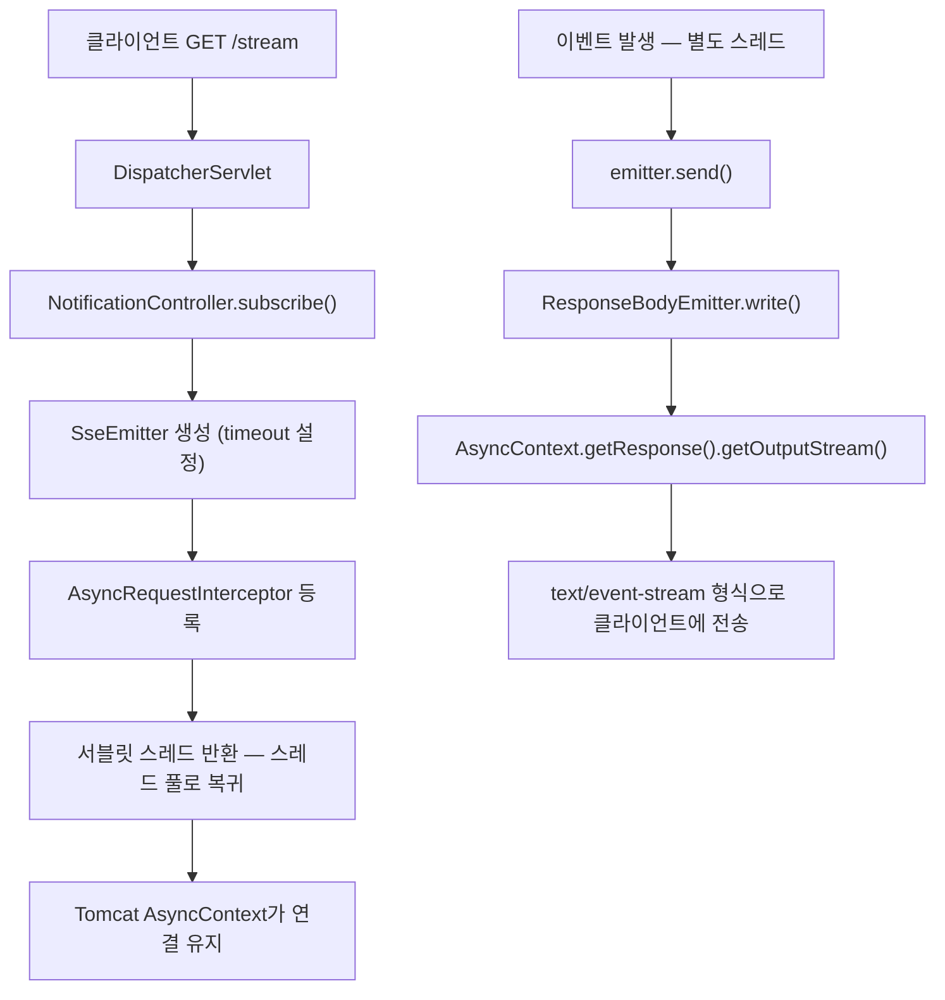
```mermaid
flowchart TD
    A["클라이언트 GET /stream"] --> B["DispatcherServlet"]
    B --> C["NotificationController.subscribe()"]
    C --> D["SseEmitter 생성 (timeout 설정)"]
    D --> E["AsyncRequestInterceptor 등록"]
    E --> F["서블릿 스레드 반환 — 스레드 풀로 복귀"]
    F --> G["Tomcat AsyncContext가 연결 유지"]

    H["이벤트 발생 — 별도 스레드"] --> I["emitter.send()"]
    I --> J["ResponseBodyEmitter.write()"]
    J --> K["AsyncContext.getResponse().getOutputStream()"]
    K --> L["text/event-stream 형식으로 클라이언트에 전송"]
```

핵심은 **서블릿 스레드가 즉시 반환된다**는 것입니다. SseEmitter를 Controller에서 반환하는 순간, 서블릿 스레드는 스레드 풀로 돌아갑니다. 실제 연결 유지는 **Servlet 3.0+ 비동기 처리 API(AsyncContext)**가 담당합니다.

### Servlet 3.0+ 비동기 처리와 SSE의 관계

전통적인 서블릿 모델에서는 요청 하나당 스레드 하나가 응답 완료까지 점유됩니다. SSE처럼 연결을 장시간 유지해야 하는 경우, 이 모델은 치명적입니다.

```mermaid
flowchart LR
    subgraph 동기 모델
        direction TB
        T1["스레드 1 — 요청 처리 중 (점유)"]
        T2["스레드 2 — SSE 대기 중 (점유)"]
        T3["스레드 3 — SSE 대기 중 (점유)"]
        TN["스레드 200 — SSE 대기 중 (점유)"]
        WARN["더 이상 요청 수용 불가!"]
    end
    subgraph 비동기 모델 — Servlet 3.0+
        direction TB
        AT1["스레드 1 — 요청 처리 후 반환"]
        AT2["스레드 2 — 요청 처리 후 반환"]
        ATN["스레드 N — 요청 처리 후 반환"]
        AC["AsyncContext — 수천 개 연결 유지"]
        NIO["NIO Selector — OS 레벨 이벤트 루프"]
        AC --- NIO
    end
```

Servlet 3.0의 `AsyncContext` 동작 원리:

1. `request.startAsync()` 호출 → AsyncContext 생성
2. 서블릿 스레드가 즉시 반환 → 스레드 풀로 복귀
3. AsyncContext는 NIO 기반으로 소켓 연결을 유지
4. 이벤트 발생 시, **임의의 스레드**에서 `AsyncContext.getResponse().getOutputStream()`을 통해 데이터 전송
5. 완료 시 `AsyncContext.complete()` 호출

Spring의 SseEmitter는 이 과정을 추상화합니다. 개발자가 `AsyncContext`를 직접 다룰 필요 없이, `emitter.send()`만 호출하면 됩니다.

**스레드 사용량 비교**:

| 방식 | 동시 SSE 연결 1,000개 시 필요 스레드 |
|------|----------------------------------|
| 동기 서블릿 | 1,000개 (연결당 1스레드, Tomcat 기본 200이면 불가) |
| 비동기 서블릿 (SseEmitter) | 이벤트 전송 시에만 스레드 사용 (대기 중 0개) |

### SseEmitter 생명주기

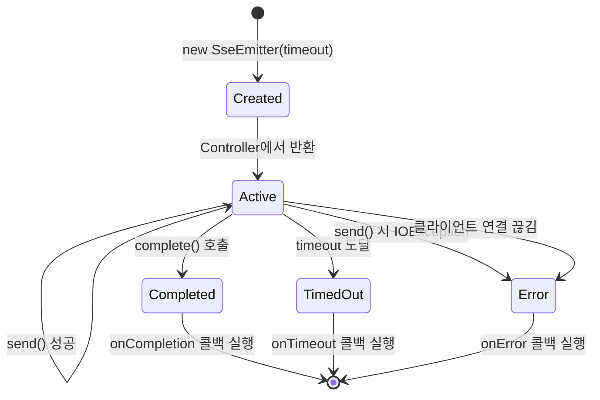
```mermaid
stateDiagram-v2
    [*] --> Created: new SseEmitter(timeout)
    Created --> Active: Controller에서 반환
    Active --> Active: send() 성공
    Active --> Completed: complete() 호출
    Active --> TimedOut: timeout 도달
    Active --> Error: send() 시 IOException
    Active --> Error: 클라이언트 연결 끊김
    Completed --> [*]: onCompletion 콜백 실행
    TimedOut --> [*]: onTimeout 콜백 실행
    Error --> [*]: onError 콜백 실행
```

각 상태 전이를 설명합니다.

- **Created → Active**: SseEmitter 객체를 Controller에서 반환하면, Spring이 AsyncContext를 시작하고 연결을 유지합니다.
- **Active → Active (send)**: `emitter.send()`가 성공하면 연결은 유지됩니다. 여러 번 호출 가능합니다.
- **Active → Completed**: `emitter.complete()`를 명시적으로 호출하면 연결이 정상 종료됩니다.
- **Active → TimedOut**: 설정한 timeout이 지나면 Spring이 자동으로 연결을 종료합니다.
- **Active → Error**: `send()` 중 IOException이 발생하면 (클라이언트가 이미 연결을 끊은 경우) 에러 상태로 전이합니다.

### 구현 코드

#### Controller

```java
@RestController
@RequiredArgsConstructor
public class NotificationController {

    private final SseEmitterManager emitterManager;

    /**
     * SSE 연결 엔드포인트
     * Accept: text/event-stream 헤더로 요청
     *
     * Last-Event-ID: 재연결 시 브라우저가 자동으로 보내는 헤더
     * 이 값으로 놓친 이벤트를 복구할 수 있음
     */
    @GetMapping(value = "/api/notifications/stream", produces = MediaType.TEXT_EVENT_STREAM_VALUE)
    public SseEmitter subscribe(
            @AuthenticationPrincipal Long userId,
            @RequestHeader(value = "Last-Event-ID", required = false) String lastEventId) {
        return emitterManager.create(userId, lastEventId);
    }
}
```

#### EmitterManager

```java
@Slf4j
@Component
public class SseEmitterManager {

    /**
     * userId → SseEmitter 매핑
     *
     * ConcurrentHashMap을 선택한 이유:
     * - 여러 스레드에서 동시에 put/remove/get 호출 가능
     * - Segment 기반 락 → 전체 Map을 잠그지 않으므로 read 성능이 우수
     * - SSE 특성상 read(send 시 get) > write(connect/disconnect) 비율이 높음
     *
     * Collections.synchronizedMap 대비 장점:
     * - synchronizedMap은 모든 연산에 전체 락 → 동시 send에서 병목
     * - ConcurrentHashMap은 서로 다른 Segment의 동시 접근 허용
     */
    private final Map<Long, SseEmitter> emitters = new ConcurrentHashMap<>();

    private static final long TIMEOUT = 60 * 60 * 1000L; // 1시간

    public SseEmitter create(Long userId, String lastEventId) {
        // 기존 연결이 있으면 정리
        SseEmitter existing = emitters.get(userId);
        if (existing != null) {
            existing.complete();
        }

        SseEmitter emitter = new SseEmitter(TIMEOUT);
        emitters.put(userId, emitter);

        // 연결 종료 시 정리 — 세 가지 콜백 모두 등록 필수
        emitter.onCompletion(() -> {
            emitters.remove(userId);
            log.debug("SSE 연결 종료: userId={}", userId);
        });
        emitter.onTimeout(() -> {
            emitters.remove(userId);
            log.debug("SSE 타임아웃: userId={}", userId);
        });
        emitter.onError(e -> {
            emitters.remove(userId);
            log.debug("SSE 에러: userId={}, error={}", userId, e.getMessage());
        });

        // 연결 직후 더미 이벤트 전송 (503 방지)
        sendToUser(userId, "connect", "connected");

        // 재연결 시 놓친 이벤트 복구
        if (lastEventId != null && !lastEventId.isEmpty()) {
            resendMissedEvents(userId, lastEventId);
        }

        return emitter;
    }

    public void sendToUser(Long userId, String eventName, Object data) {
        SseEmitter emitter = emitters.get(userId);
        if (emitter == null) return;

        try {
            emitter.send(SseEmitter.event()
                    .id(String.valueOf(System.currentTimeMillis()))
                    .name(eventName)
                    .data(data)
                    .reconnectTime(3000)); // retry: 3000
        } catch (IOException e) {
            // 클라이언트 연결이 이미 끊어진 경우
            // 예외를 상위로 전파하면 다른 사용자 알림에 영향
            emitters.remove(userId);
            log.debug("SSE 전송 실패 (연결 끊김): userId={}", userId);
        }
    }

    public void broadcast(Set<Long> userIds, String eventName, Object data) {
        userIds.forEach(userId -> sendToUser(userId, eventName, data));
    }

    public int getActiveConnectionCount() {
        return emitters.size();
    }

    private void resendMissedEvents(Long userId, String lastEventId) {
        // 구현 예: lastEventId 이후의 이벤트를 DB에서 조회하여 재전송
        // 이 부분은 이벤트 저장소 설계에 따라 달라짐
    }
}
```

#### NotificationService

```java
@Service
@RequiredArgsConstructor
public class NotificationService {

    private final SseEmitterManager emitterManager;
    private final NotificationRepository notificationRepository;

    /**
     * 알림 생성 및 실시간 전송
     * 트랜잭션 커밋 후 SSE 전송을 보장하기 위해
     * @TransactionalEventListener 사용도 고려할 수 있음
     */
    public void sendNotification(Long targetUserId, NotificationType type, String message) {
        // 1. DB에 알림 저장 (재연결 시 복구용)
        Notification notification = Notification.builder()
                .userId(targetUserId)
                .type(type)
                .message(message)
                .createdAt(LocalDateTime.now())
                .read(false)
                .build();
        notificationRepository.save(notification);

        // 2. SSE로 실시간 전송
        NotificationResponse response = NotificationResponse.from(notification);
        emitterManager.sendToUser(targetUserId, "notification", response);
    }

    /**
     * 여러 사용자에게 동시 알림
     * 예: 게시글에 달린 댓글 알림을 구독자 전원에게 전송
     */
    public void broadcastNotification(Set<Long> targetUserIds, NotificationType type, String message) {
        // 1. 각 사용자별로 DB 저장
        List<Notification> notifications = targetUserIds.stream()
                .map(userId -> Notification.builder()
                        .userId(userId)
                        .type(type)
                        .message(message)
                        .createdAt(LocalDateTime.now())
                        .read(false)
                        .build())
                .toList();
        notificationRepository.saveAll(notifications);

        // 2. SSE 브로드캐스트
        NotificationResponse response = NotificationResponse.builder()
                .type(type)
                .message(message)
                .build();
        emitterManager.broadcast(targetUserIds, "notification", response);
    }
}
```

### 핵심 설계 포인트

#### 1. 더미 이벤트 전송 이유

SseEmitter를 생성하고 아무 이벤트도 보내지 않으면 두 가지 문제가 발생합니다.

첫째, **일부 프록시나 로드밸런서가 유휴 연결로 판단해 끊어버립니다**. 특히 Nginx의 `proxy_read_timeout`이 기본 60초인데, 60초 내에 아무 데이터도 전송되지 않으면 502 Bad Gateway를 반환합니다.

둘째, **브라우저(특히 구형 브라우저)가 응답 본문이 비어있으면 연결을 제대로 인식하지 못하는 경우**가 있습니다. 첫 데이터를 받아야 `EventSource.onopen` 이벤트가 정상적으로 발생합니다.

```java
// 연결 직후 503 방지를 위한 더미 이벤트
emitter.send(SseEmitter.event()
        .name("connect")
        .data("connected"));
```

#### 2. ConcurrentHashMap 선택 이유

SSE 환경에서 Emitter Map에 대한 동시 접근 패턴을 분석해 보겠습니다.

| 연산 | 발생 시점 | 빈도 |
|------|---------|------|
| **put** | 사용자 SSE 연결 시 | 낮음 (사용자당 1회) |
| **remove** | 연결 종료, 타임아웃, 에러 시 | 낮음 |
| **get** | 알림 전송 시 (send) | 높음 (알림 발생마다) |

**read(get) 빈도가 write(put/remove)보다 압도적으로 높습니다.** ConcurrentHashMap은 read 연산에 락을 걸지 않으므로(Java 8+ 기준), 이 패턴에 최적입니다.

대안 비교:

| 구현체 | read 동시성 | write 동시성 | SSE 적합도 |
|--------|-----------|------------|-----------|
| HashMap | 스레드 안전하지 않음 | 스레드 안전하지 않음 | 사용 불가 |
| Collections.synchronizedMap | 전체 락 | 전체 락 | 비효율 |
| ConcurrentHashMap | 락 없음 (volatile read) | Bucket 단위 락 | 최적 |
| CopyOnWriteArrayList | 락 없음 | 전체 복사 | write 비용 과다 |

#### ConcurrentHashMap 내부 구조: Linked List → Red-Black Tree 전환

Java 8부터 ConcurrentHashMap은 해시 충돌이 심한 버킷에 대해 **Linked List에서 Red-Black Tree로 자동 전환**하는 최적화를 도입했습니다.

```
해시 버킷 구조 변화:

[버킷 0] → Node → Node → Node (충돌 3개: Linked List)
[버킷 1] → Node (충돌 없음)
[버킷 2] → TreeBin → TreeNode (좌) / TreeNode (우) ... (충돌 8개 이상: Red-Black Tree)
```

전환 기준:
- **TREEIFY_THRESHOLD = 8**: 하나의 버킷에 노드가 8개 이상이면 Red-Black Tree로 전환
- **UNTREEIFY_THRESHOLD = 6**: 노드가 6개 이하로 줄어들면 다시 Linked List로 복원
- **MIN_TREEIFY_CAPACITY = 64**: 전체 테이블 크기가 64 미만이면 트리화 대신 **테이블 리사이즈** 수행

SSE Emitter Map에서 이 동작이 의미하는 바를 분석하면:

| 시나리오 | 해시 충돌 가능성 | 자료구조 | 탐색 시간 |
|---------|----------------|---------|----------|
| userId가 Long 타입 | 매우 낮음 (Long.hashCode()는 값 자체를 기반으로 분산) | Linked List | O(1) 수준 |
| userId가 String 타입 | 낮음 (String.hashCode()가 잘 분산됨) | Linked List | O(1) 수준 |
| 해시 충돌 발생 (이론적) | 8개 이상 충돌 시 | Red-Black Tree | O(log n) |

**실제 SSE 환경에서는 userId를 키로 사용하므로 해시 충돌이 거의 발생하지 않습니다.** Long 타입의 hashCode는 `(int)(value ^ (value >>> 32))`로, 값 자체가 고르게 분포되어 있으면 버킷 분산이 우수합니다. 따라서 Red-Black Tree 전환은 발생하지 않지만, ConcurrentHashMap이 최악의 경우에도 O(log n) 탐색을 보장한다는 점은 안정성 측면에서 의미가 있습니다.

**ConcurrentHashMap의 read 연산이 락 없이 동작하는 원리**: `get()` 메서드는 `volatile` 읽기만으로 구현됩니다. Node 클래스의 `val`과 `next` 필드가 `volatile`로 선언되어 있어, **happens-before** 관계가 보장됩니다. 다른 스레드에서 `put()`으로 값을 갱신하면, `volatile` 쓰기-읽기 순서에 의해 `get()`에서 즉시 최신 값을 볼 수 있습니다.

```java
// ConcurrentHashMap.Node (Java 17 소스 참고)
static class Node<K,V> implements Map.Entry<K,V> {
    final int hash;
    final K key;
    volatile V val;     // volatile 선언 → 읽기 시 락 불필요
    volatile Node<K,V> next;  // volatile 선언
}
```

이 구조 덕분에 SSE에서 `emitters.get(userId)`로 Emitter를 조회하는 연산은 **CAS(Compare-And-Swap)나 락 없이 수행**되어, 높은 동시성에서도 성능 저하가 발생하지 않습니다.

#### 3. IOException 처리 전략

`emitter.send()`에서 IOException이 발생하면, 클라이언트 연결이 **이미 끊어진 상태**입니다. 이 예외를 상위로 전파하면 다른 사용자의 알림 전송 로직까지 중단될 수 있으므로, **개별 사용자 단위로 격리해야 합니다**.

```java
// 잘못된 패턴: 하나의 실패가 전체에 영향
public void broadcast(Set<Long> userIds, String eventName, Object data) {
    for (Long userId : userIds) {
        SseEmitter emitter = emitters.get(userId);
        emitter.send(...); // IOException 발생 시 나머지 사용자에게 전달 안 됨
    }
}

// 올바른 패턴: 개별 격리
public void broadcast(Set<Long> userIds, String eventName, Object data) {
    userIds.forEach(userId -> sendToUser(userId, eventName, data));
    // sendToUser 내부에서 try-catch로 IOException을 잡아 처리
}
```

### 연결 수 추정 + 메모리 사용량 계산

SseEmitter 1개가 차지하는 메모리를 추정해 보겠습니다.

```
SseEmitter 객체 자체:
  - 객체 헤더:              16 bytes (64bit JVM, compressed oops)
  - timeout (long):         8 bytes
  - handler 참조:           8 bytes (ResponseBodyEmitter.Handler)
  - completeWithError 참조: 8 bytes
  - 기타 필드:             ~32 bytes
  소계:                    ~72 bytes

내부 참조 객체들:
  - AsyncRequestInterceptor:  ~64 bytes
  - DefaultAsyncRequestInterceptor 콜백 리스트: ~128 bytes
  - Tomcat AsyncContext:      ~256 bytes (NIO 소켓 버퍼 참조 포함)
  - 출력 버퍼 (기본 8KB):    8,192 bytes
  소계:                      ~8,640 bytes

ConcurrentHashMap Entry:
  - Node 객체:              ~32 bytes (hash, key, value, next)
  - Long 키 (박싱):         ~24 bytes
  소계:                     ~56 bytes

총합: 약 8,768 bytes ≈ 8.6 KB / 연결
```

동시 접속 규모별 메모리 추정:

| 동시 접속 수 | SseEmitter 메모리 | 비고 |
|-------------|------------------|------|
| 1,000명 | ~8.4 MB | 소규모 서비스 |
| 10,000명 | ~84 MB | 중규모 서비스 |
| 50,000명 | ~420 MB | JVM 힙 1GB면 여유 부족 |
| 100,000명 | ~840 MB | 단일 서버로는 한계, 분산 필요 |

여기에 **NIO 소켓 버퍼(Off-heap)**가 추가됩니다. Tomcat NIO는 연결당 약 **16KB**(read 8KB + write 8KB)의 direct buffer를 사용합니다. 10,000 연결이면 약 156MB의 off-heap 메모리가 추가로 필요합니다.

```
10,000 연결 총 메모리:
  - Heap (SseEmitter):     ~84 MB
  - Off-heap (NIO buffer): ~156 MB
  - 합계:                  ~240 MB
```

### GC가 SSE 연결에 미치는 영향

SSE 연결은 장시간 유지되므로, SseEmitter 객체와 관련 참조가 **Old Generation으로 승격**됩니다. 이는 GC 동작에 영향을 미칩니다.

```
JVM 힙 메모리 구조와 SSE 객체 생명주기:

[Young Gen]
  Eden → SseEmitter 생성 (최초)
  Survivor 0/1 → Minor GC에서 살아남음
  (age threshold 도달)
    ↓
[Old Gen]
  SseEmitter → 1시간 동안 유지 (timeout까지)
  ConcurrentHashMap Entry → 연결 해제까지 유지
  AsyncContext 참조 → 연결 해제까지 유지
```

**문제 시나리오**: 동시 접속 10,000명일 때 Old Gen에 ~84MB의 장수명 객체가 쌓입니다. 연결이 해제되면 이 객체들이 한꺼번에 unreachable 상태가 됩니다. timeout이 동일하면 **만료 시점이 겹쳐** Major GC 부하가 집중될 수 있습니다.

**완화 전략**:

1. **timeout에 랜덤 오프셋 추가**: 만료 시점을 분산시켜 GC 부하를 평탄화합니다.

```java
private static final long BASE_TIMEOUT = 55 * 60 * 1000L; // 55분
private static final long JITTER_RANGE = 10 * 60 * 1000L;  // 10분
private static final Random random = new Random();

public SseEmitter create(Long userId, String lastEventId) {
    long timeout = BASE_TIMEOUT + random.nextLong(JITTER_RANGE); // 55~65분
    SseEmitter emitter = new SseEmitter(timeout);
    // ...
}
```

2. **GC 알고리즘 선택**: 대규모 SSE 연결에서는 **ZGC** 또는 **Shenandoah GC**가 적합합니다. 이 GC들은 pause time이 10ms 이내로, SSE 이벤트 전송 지연을 최소화합니다.

| GC 알고리즘 | 최대 Pause Time | SSE 적합도 | 비고 |
|------------|----------------|-----------|------|
| G1GC | 수십~수백 ms | 보통 | Java 9+ 기본 |
| ZGC | <10 ms | 우수 | Java 15+ 프로덕션 |
| Shenandoah | <10 ms | 우수 | Red Hat 계열 |

```bash
# ZGC 적용 예시 (Java 17+)
java -XX:+UseZGC -XX:+ZGenerational \
     -Xmx2g -Xms2g \
     -jar app.jar
```

3. **Off-heap 메모리 모니터링**: NIO direct buffer는 GC가 관리하지 않으므로, `System.gc()` 호출 없이는 회수되지 않을 수 있습니다. `-XX:MaxDirectMemorySize`로 상한을 설정하고, `jcmd`로 모니터링합니다.

```bash
# Direct Buffer 사용량 확인
jcmd <pid> VM.native_memory summary | grep -A 5 "Internal"
```

---

## Spring WebFlux 기반 SSE 대안

### Servlet Stack vs Reactive Stack

지금까지 살펴본 SseEmitter는 **Servlet Stack** 기반입니다. Spring은 Reactive Stack인 **WebFlux**에서도 SSE를 지원하며, 대규모 연결 처리에 더 적합한 구조를 제공합니다.

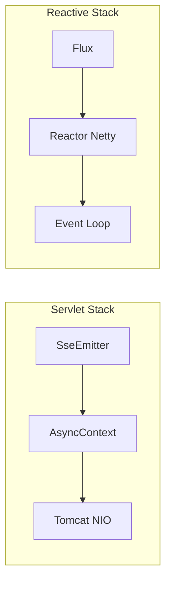
```mermaid
flowchart LR
    subgraph Servlet Stack
        direction TB
        ST["SseEmitter"]
        SAC["AsyncContext"]
        SNIO["Tomcat NIO"]
        ST --> SAC --> SNIO
    end
    subgraph Reactive Stack
        direction TB
        RF["Flux<ServerSentEvent>"]
        RN["Reactor Netty"]
        REL["Event Loop"]
        RF --> RN --> REL
    end
```

| 항목 | SseEmitter (Servlet) | Flux SSE (WebFlux) |
|------|---------------------|--------------------|
| **스레드 모델** | Thread-per-request + AsyncContext | Event Loop (Non-blocking) |
| **기반 서버** | Tomcat, Jetty | Netty (기본), Tomcat, Undertow |
| **연결당 스레드** | 0 (비동기 후 반환) | 0 (Event Loop 공유) |
| **Backpressure** | 미지원 | Reactor 기반 지원 |
| **연결당 메모리** | ~8.6 KB (Heap) + 16 KB (NIO) | ~2 KB (Netty 기반) |
| **최대 동시 연결** | 수만 (NIO 버퍼 한계) | 수십만 (Event Loop 효율) |
| **학습 곡선** | 낮음 (Spring MVC 익숙) | 높음 (Reactive 패러다임) |

#### WebFlux SSE 구현 예시

```java
@RestController
@RequiredArgsConstructor
public class ReactiveNotificationController {

    private final Sinks.Many<NotificationEvent> sink =
            Sinks.many().multicast().onBackpressureBuffer(1024);

    @GetMapping(value = "/api/notifications/stream",
                produces = MediaType.TEXT_EVENT_STREAM_VALUE)
    public Flux<ServerSentEvent<NotificationResponse>> stream(
            @AuthenticationPrincipal Long userId) {

        return sink.asFlux()
                .filter(event -> event.getTargetUserId().equals(userId))
                .map(event -> ServerSentEvent.<NotificationResponse>builder()
                        .id(String.valueOf(event.getId()))
                        .event("notification")
                        .data(NotificationResponse.from(event))
                        .retry(Duration.ofSeconds(3))
                        .build())
                .doOnCancel(() -> log.debug("SSE 연결 해제: userId={}", userId));
    }

    public void publish(NotificationEvent event) {
        sink.tryEmitNext(event);
    }
}
```

### Backpressure와 SSE

**Backpressure**는 데이터 생산 속도가 소비 속도보다 빠를 때 발생하는 문제를 제어하는 메커니즘입니다. SSE 환경에서는 서버의 이벤트 생산 속도가 네트워크 전송 속도나 클라이언트 처리 속도보다 빠른 경우 문제가 됩니다.

```
서버 이벤트 생산: 1,000 events/sec
네트워크 전송 가능: 500 events/sec

→ Backpressure 없이: 메모리에 이벤트가 계속 쌓임 → OOM
→ Backpressure 있음: 생산 속도를 소비 속도에 맞춤 또는 버퍼 초과 시 drop
```

**SseEmitter의 Backpressure 부재**: SseEmitter는 `send()` 호출 시 내부 출력 버퍼에 데이터를 기록합니다. TCP 송신 버퍼가 가득 차면 `send()`가 블로킹될 수 있지만, 이는 **TCP 레벨의 흐름 제어**이지 애플리케이션 레벨의 Backpressure가 아닙니다. 버퍼가 차기 전까지는 제한 없이 이벤트를 쌓을 수 있어, 메모리 문제가 발생할 수 있습니다.

**WebFlux의 Backpressure 전략**: Reactor의 `Sinks.Many`에서는 버퍼 정책을 선택할 수 있습니다.

```java
// 전략 1: 버퍼 크기 제한 (초과 시 oldest drop)
Sinks.many().multicast().onBackpressureBuffer(1024, oldest -> {
    log.warn("Backpressure: dropping oldest event {}", oldest);
});

// 전략 2: 최신 값만 유지 (실시간 위치 추적 등)
Sinks.many().multicast().directBestEffort();

// 전략 3: 느린 구독자에게 에러 전파
Sinks.many().multicast().onBackpressureError();
```

| 전략 | 동작 | 적합한 시나리오 |
|------|------|----------------|
| **Buffer (bounded)** | 버퍼 크기 제한, 초과 시 오래된 이벤트 삭제 | 일반 알림 (순서 중요, 일부 유실 허용) |
| **DirectBestEffort** | 즉시 전달 시도, 불가능하면 drop | 실시간 위치 (최신 값만 의미 있음) |
| **Error** | 소비 속도가 느리면 에러 전파 | 데이터 유실 불가, 재연결 유도 |

SseEmitter 환경에서 Backpressure를 간접적으로 구현하려면, **이벤트 큐를 별도로 관리**하고 큐 크기 제한과 overflow 정책을 직접 구현해야 합니다.

```java
// SseEmitter 기반 간이 Backpressure 구현
@Component
public class BufferedSseEmitterManager {

    private final Map<Long, BlockingQueue<NotificationEvent>> userQueues
            = new ConcurrentHashMap<>();
    private final Map<Long, SseEmitter> emitters = new ConcurrentHashMap<>();
    private static final int MAX_QUEUE_SIZE = 256;

    public void enqueue(Long userId, NotificationEvent event) {
        BlockingQueue<NotificationEvent> queue = userQueues.get(userId);
        if (queue == null) return;

        if (!queue.offer(event)) {
            // 큐가 가득 찬 경우: 가장 오래된 이벤트 제거 후 삽입
            queue.poll();
            queue.offer(event);
            log.warn("Backpressure 발동: userId={}, dropped oldest event", userId);
        }
    }

    @Scheduled(fixedDelay = 100) // 100ms 간격으로 큐에서 꺼내 전송
    public void flush() {
        userQueues.forEach((userId, queue) -> {
            NotificationEvent event;
            while ((event = queue.poll()) != null) {
                sendToUser(userId, "notification", event);
            }
        });
    }
}
```

---

## 운영 시 주의점

### 브라우저 도메인당 연결 수 제한

HTTP/1.1 환경에서 브라우저는 도메인당 동시 TCP 연결 수를 제한합니다.

| 브라우저 | 도메인당 최대 연결 수 (HTTP/1.1) |
|---------|-------------------------------|
| Chrome | 6 |
| Firefox | 6 |
| Safari | 6 |
| Edge | 6 |

SSE가 이 중 하나를 상시 점유하면, **나머지 5개로 모든 API 요청, 이미지 로딩, 기타 리소스 다운로드를 처리**해야 합니다. 탭을 여러 개 열면 탭마다 SSE 연결이 생기므로 문제가 심화됩니다.

**해결 방법**:

1. **HTTP/2 사용**: 멀티플렉싱으로 연결 수 제한이 사실상 해소됩니다. 하나의 TCP 연결에서 SSE 스트림과 API 요청이 공존합니다.
2. **SharedWorker 활용**: 여러 탭이 하나의 SSE 연결을 공유합니다.

```javascript
// SharedWorker를 사용한 SSE 연결 공유 (worker.js)
let eventSource = null;
const ports = [];

self.onconnect = function(e) {
    const port = e.ports[0];
    ports.push(port);

    if (!eventSource) {
        eventSource = new EventSource('/api/notifications/stream');
        eventSource.addEventListener('notification', (event) => {
            // 모든 탭에 이벤트 전달
            ports.forEach(p => p.postMessage(event.data));
        });
    }

    port.onmessage = function(e) {
        if (e.data === 'close') {
            ports.splice(ports.indexOf(port), 1);
            if (ports.length === 0 && eventSource) {
                eventSource.close();
                eventSource = null;
            }
        }
    };
};
```

```javascript
// 메인 페이지에서 SharedWorker 사용
const worker = new SharedWorker('/worker.js');
worker.port.start();

worker.port.onmessage = (event) => {
    const notification = JSON.parse(event.data);
    renderNotification(notification);
};

// 페이지 종료 시
window.addEventListener('beforeunload', () => {
    worker.port.postMessage('close');
});
```

### Timeout 전략 설계

SseEmitter의 timeout은 서버 자원 점유와 재연결 빈도 사이의 **트레이드오프**입니다.

| timeout | 장점 | 단점 |
|---------|------|------|
| 짧음 (5분) | 자원 빠르게 회수 | 재연결 빈번, TCP handshake 비용 반복 |
| 중간 (30분~1시간) | 균형 잡힌 선택 | - |
| 길음 (6시간+) | 재연결 거의 없음 | 비정상 종료된 연결이 오래 잔류, 메모리 누수 위험 |

**권장 전략**: timeout을 30분~1시간으로 설정하되, **주기적인 heartbeat**를 보내 연결 상태를 확인합니다.

```java
@Component
@RequiredArgsConstructor
public class SseHeartbeatScheduler {

    private final SseEmitterManager emitterManager;

    /**
     * 30초마다 모든 활성 연결에 heartbeat 전송
     *
     * 목적:
     * 1. 프록시/로드밸런서의 유휴 연결 종료 방지
     * 2. 끊어진 연결 조기 감지 (send 실패 시 emitters에서 제거)
     * 3. 클라이언트 측 연결 상태 확인
     */
    @Scheduled(fixedRate = 30000)
    public void sendHeartbeat() {
        emitterManager.broadcastAll("heartbeat", "ping");
    }
}
```

heartbeat가 `send()` 시 IOException을 유발하면, 해당 연결은 이미 끊어진 것이므로 Map에서 제거됩니다. 이렇게 **끊어진 연결을 능동적으로 탐지**할 수 있습니다.

### 로드밸런서 환경: Sticky Session vs Redis Pub/Sub

서버가 여러 대인 환경에서는 **SSE 연결이 맺어진 서버와 알림을 발생시킨 서버가 다를 수 있습니다**.

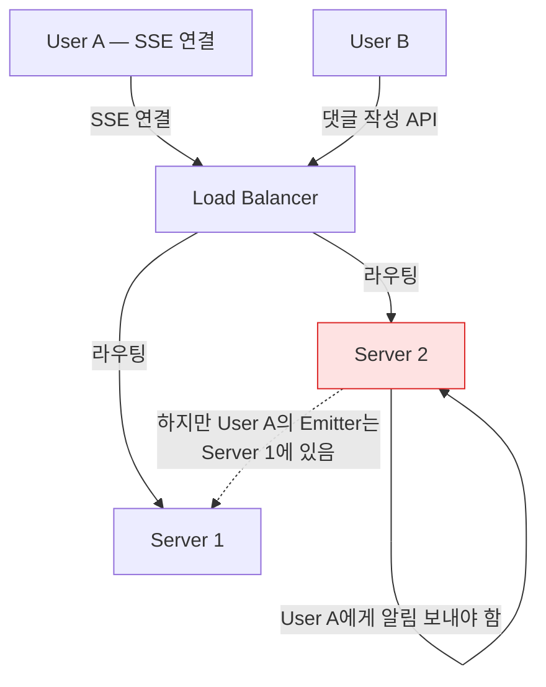
```mermaid
flowchart TD
    LB["Load Balancer"]
    S1["Server 1"]
    S2["Server 2"]
    U1["User A — SSE 연결"]
    U2["User B"]

    U1 -->|SSE 연결| LB
    LB -->|라우팅| S1
    U2 -->|댓글 작성 API| LB
    LB -->|라우팅| S2
    S2 -->|User A에게 알림 보내야 함| S2
    S2 -.->|하지만 User A의 Emitter는<br/>Server 1에 있음| S1

    style S2 fill:#fee2e2,stroke:#dc2626
```

#### 방법 1: Sticky Session

같은 사용자의 요청이 항상 같은 서버로 가도록 로드밸런서를 설정합니다.

```nginx
# Nginx Sticky Session 설정
upstream backend {
    ip_hash;  # 클라이언트 IP 기반 고정 라우팅
    server 192.168.1.10:8080;
    server 192.168.1.11:8080;
}
```

**장점**: 구현이 단순합니다. 알림 발생 서버와 SSE 연결 서버가 항상 동일합니다.

**단점**: 서버 간 부하 불균형이 발생할 수 있습니다. 서버가 다운되면 해당 서버에 고정된 모든 사용자의 SSE 연결이 끊어지고, 재배치 시 세션 유실이 발생합니다.

#### 방법 2: Redis Pub/Sub

알림 이벤트를 Redis를 통해 모든 서버에 브로드캐스트하고, 각 서버가 자신이 보유한 Emitter에 대해서만 전송합니다.

```mermaid
flowchart LR
    S2["Server 2<br/>(알림 발생)"] -->|PUBLISH notification| R["Redis"]
    R -->|SUBSCRIBE| S1["Server 1<br/>(User A의 Emitter 보유)"]
    R -->|SUBSCRIBE| S2
    R -->|SUBSCRIBE| S3["Server 3"]
    S1 -->|emitter.send()| U1["User A"]
```

```java
// Redis Pub/Sub 기반 알림 전파
@Component
@RequiredArgsConstructor
public class NotificationEventPublisher {

    private final RedisTemplate<String, String> redisTemplate;
    private final ObjectMapper objectMapper;

    private static final String CHANNEL = "notification:broadcast";

    public void publish(NotificationEvent event) {
        try {
            String message = objectMapper.writeValueAsString(event);
            redisTemplate.convertAndSend(CHANNEL, message);
        } catch (JsonProcessingException e) {
            log.error("알림 이벤트 직렬화 실패", e);
        }
    }
}

@Component
@RequiredArgsConstructor
public class NotificationEventSubscriber implements MessageListener {

    private final SseEmitterManager emitterManager;
    private final ObjectMapper objectMapper;

    @Override
    public void onMessage(Message message, byte[] pattern) {
        try {
            NotificationEvent event = objectMapper.readValue(
                    message.getBody(), NotificationEvent.class);
            // 이 서버가 해당 사용자의 Emitter를 가지고 있으면 전송
            emitterManager.sendToUser(
                    event.getTargetUserId(),
                    "notification",
                    event.getData());
        } catch (IOException e) {
            log.error("알림 이벤트 역직렬화 실패", e);
        }
    }
}
```

**장점**: 서버 추가/제거가 자유롭습니다. 로드밸런서에 Sticky Session이 불필요합니다.

**단점**: Redis 의존성이 추가됩니다. 모든 서버가 모든 알림 메시지를 수신하므로, 서버가 많아질수록 **불필요한 메시지 수신**이 증가합니다. (해결: 사용자 ID 기반 채널 분리)

| 기준 | Sticky Session | Redis Pub/Sub |
|------|---------------|---------------|
| **구현 복잡도** | 낮음 | 중간 |
| **스케일아웃** | 어려움 (부하 불균형) | 용이 |
| **장애 복구** | 서버 다운 시 세션 유실 | 재연결 시 다른 서버로 자연스럽게 분배 |
| **추가 인프라** | 없음 | Redis |
| **권장 규모** | 서버 2~3대 | 서버 4대 이상 |

#### Redis Pub/Sub vs Redis Streams: 어떤 것을 선택할 것인가

Redis Pub/Sub은 **Fire-and-Forget** 방식입니다. 구독자가 없거나 메시지 수신 시점에 연결이 끊어져 있으면 메시지가 유실됩니다. 이를 보완하는 대안이 **Redis Streams**입니다.

```
Redis Pub/Sub:
  PUBLISH notification:broadcast {"userId":1,"msg":"hello"}
    → 구독 중인 서버만 수신
    → 구독자가 없으면 메시지 소멸
    → 과거 메시지 조회 불가

Redis Streams:
  XADD notification:stream * userId 1 msg hello
    → 메시지가 Stream에 영구 저장 (maxlen 설정 가능)
    → Consumer Group으로 분산 소비
    → XRANGE/XREAD로 과거 메시지 조회 가능
```

| 항목 | Redis Pub/Sub | Redis Streams |
|------|---------------|---------------|
| **메시지 영속성** | 없음 (Fire-and-Forget) | 있음 (Stream에 저장) |
| **Consumer Group** | 미지원 (모든 구독자가 모든 메시지 수신) | 지원 (메시지를 그룹 내 하나의 소비자만 처리) |
| **과거 메시지 조회** | 불가 | XRANGE, XREAD로 가능 |
| **ACK 메커니즘** | 없음 | XACK로 처리 완료 확인 |
| **메모리 사용량** | 최소 (전달 즉시 폐기) | 축적됨 (MAXLEN/MINID로 제한 필요) |
| **지연 시간** | 극히 낮음 (직접 전달) | 낮음 (폴링 또는 XREADGROUP BLOCK) |

**SSE 알림에서의 선택 기준**:

- **Pub/Sub이 적합한 경우**: 이벤트 유실을 허용할 수 있고, 모든 서버가 모든 메시지를 수신해야 하는 경우. SSE 서버 간 브로드캐스트에 적합합니다.
- **Streams가 적합한 경우**: 이벤트 유실이 불가하고, Consumer Group으로 **하나의 서버만 처리**해야 하는 경우. 또는 서버 재시작 후 놓친 메시지를 **재처리**해야 하는 경우.

Redis Streams를 SSE 서버 간 메시지 전파에 적용하는 패턴:

```java
@Component
@RequiredArgsConstructor
public class NotificationStreamConsumer {

    private final SseEmitterManager emitterManager;
    private final StringRedisTemplate redisTemplate;

    private static final String STREAM_KEY = "notification:stream";
    private static final String GROUP_NAME = "sse-servers";

    @PostConstruct
    public void init() {
        // Consumer Group 생성 (이미 존재하면 무시)
        try {
            redisTemplate.opsForStream().createGroup(STREAM_KEY, GROUP_NAME);
        } catch (Exception ignored) {}
    }

    @Scheduled(fixedDelay = 100) // 100ms 간격으로 Stream 폴링
    public void consume() {
        List<MapRecord<String, Object, Object>> records = redisTemplate.opsForStream()
                .read(Consumer.from(GROUP_NAME, getConsumerName()),
                      StreamReadOptions.empty().count(100).block(Duration.ofMillis(50)),
                      StreamOffset.create(STREAM_KEY, ReadOffset.lastConsumed()));

        if (records == null) return;

        for (MapRecord<String, Object, Object> record : records) {
            Long targetUserId = Long.valueOf(
                    record.getValue().get("userId").toString());

            // 이 서버가 해당 사용자의 Emitter를 보유하고 있을 때만 전송
            if (emitterManager.hasEmitter(targetUserId)) {
                emitterManager.sendToUser(targetUserId, "notification",
                        record.getValue().get("data"));
            }

            // 처리 완료 ACK
            redisTemplate.opsForStream().acknowledge(
                    STREAM_KEY, GROUP_NAME, record.getId());
        }
    }

    private String getConsumerName() {
        // 서버 인스턴스 고유 이름 (호스트명 + 포트)
        return System.getenv("HOSTNAME") + ":" + System.getenv("SERVER_PORT");
    }
}
```

Consumer Group을 사용하면 **하나의 메시지가 그룹 내 하나의 서버에만 전달**됩니다. 하지만 SSE 시나리오에서는 알림 대상 사용자의 Emitter가 어떤 서버에 있는지 모르므로, 모든 서버가 메시지를 수신하되 해당 사용자가 없으면 무시하는 방식이 현실적입니다. 이 경우에는 각 서버가 **독립적인 Consumer Group**을 생성하거나 Pub/Sub을 그대로 사용하는 것이 더 단순합니다.

### Nginx Proxy 설정

Nginx를 리버스 프록시로 사용할 때, SSE를 위한 설정이 필요합니다. 기본 설정으로는 SSE가 제대로 동작하지 않습니다.

```nginx
location /api/notifications/stream {
    proxy_pass http://backend;

    # SSE 핵심 설정
    proxy_set_header Connection '';     # keep-alive 유지
    proxy_http_version 1.1;            # HTTP/1.1 필수 (chunked transfer)

    # 버퍼링 비활성화 — 이벤트 즉시 전달
    proxy_buffering off;               # 응답 버퍼링 끔
    proxy_cache off;                   # 캐시 끔

    # 청크 인코딩 관련
    chunked_transfer_encoding on;      # 청크 전송 허용

    # 타임아웃 설정
    proxy_read_timeout 3600s;          # 1시간 (SseEmitter timeout과 맞춤)
    proxy_send_timeout 3600s;          # 1시간

    # 헤더 전달
    proxy_set_header Host $host;
    proxy_set_header X-Real-IP $remote_addr;
    proxy_set_header X-Forwarded-For $proxy_add_x_forwarded_for;
    proxy_set_header Last-Event-ID $http_last_event_id;
}
```

각 설정이 필요한 이유:

- **proxy_buffering off**: Nginx는 기본적으로 응답을 버퍼에 모아서 클라이언트에게 보냅니다. SSE 이벤트는 **즉시 전달**되어야 하므로 버퍼링을 꺼야 합니다. 이 설정이 없으면 이벤트가 버퍼에 쌓여 일정량이 차야 전달되는 문제가 발생합니다.
- **proxy_read_timeout**: 기본값이 60초입니다. SSE는 서버가 데이터를 보내지 않는 유휴 시간이 길 수 있으므로, SseEmitter의 timeout과 동일하게 맞추거나 약간 길게 설정해야 합니다.
- **proxy_http_version 1.1**: HTTP/1.0은 chunked transfer encoding을 지원하지 않으므로, SSE 스트리밍이 불가능합니다.

#### X-Accel-Buffering 헤더: 애플리케이션 레벨 버퍼링 제어

`proxy_buffering off`는 Nginx 설정 파일에서 전역적으로 버퍼링을 비활성화합니다. 하지만 **SSE 엔드포인트만 선택적으로** 버퍼링을 끄고 싶은 경우, 애플리케이션에서 **X-Accel-Buffering** 응답 헤더를 사용할 수 있습니다.

```java
@GetMapping(value = "/api/notifications/stream",
            produces = MediaType.TEXT_EVENT_STREAM_VALUE)
public ResponseEntity<SseEmitter> subscribe(
        @AuthenticationPrincipal Long userId,
        @RequestHeader(value = "Last-Event-ID", required = false) String lastEventId) {

    SseEmitter emitter = emitterManager.create(userId, lastEventId);

    return ResponseEntity.ok()
            .header("X-Accel-Buffering", "no")  // Nginx 버퍼링 비활성화
            .header("Cache-Control", "no-cache")
            .body(emitter);
}
```

Nginx가 이 헤더를 감지하면, 해당 응답에 대해서만 버퍼링을 비활성화합니다. 이렇게 하면 일반 API 응답은 버퍼링의 성능 이점을 유지하면서, SSE 스트리밍만 즉시 전달할 수 있습니다.

```nginx
# proxy_buffering은 on으로 유지 (일반 API 성능 최적화)
# SSE 엔드포인트에서 X-Accel-Buffering: no 헤더로 선택적 비활성화
location /api/ {
    proxy_pass http://backend;
    proxy_buffering on;  # 기본 API는 버퍼링 활성화
    proxy_http_version 1.1;
    # X-Accel-Buffering 헤더가 no이면 자동으로 버퍼링 비활성화
}
```

### 배포 시 Connection Draining

서버를 배포할 때 기존 SSE 연결을 **즉시 끊으면 모든 클라이언트가 동시에 재연결**을 시도합니다. 이를 방지하기 위해 **Graceful Shutdown**과 **Connection Draining** 전략이 필요합니다.

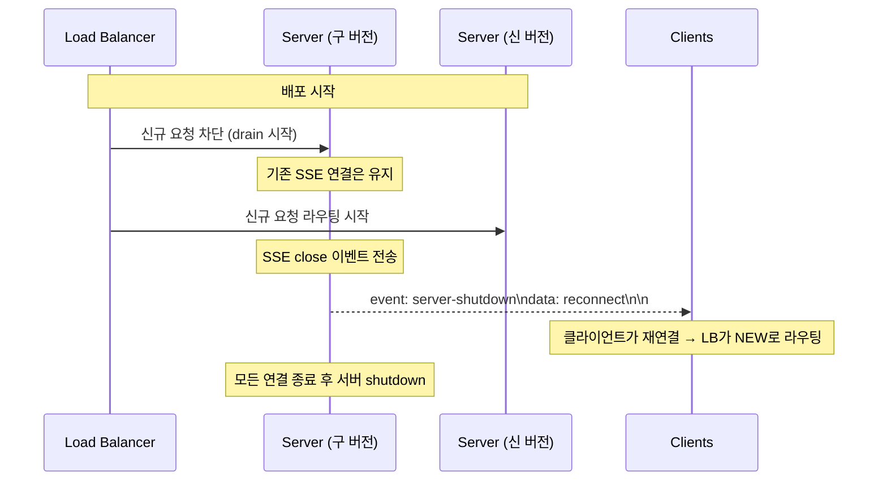
```mermaid
sequenceDiagram
    participant LB as Load Balancer
    participant OLD as Server (구 버전)
    participant NEW as Server (신 버전)
    participant C as Clients

    Note over LB,NEW: 배포 시작
    LB->>OLD: 신규 요청 차단 (drain 시작)
    Note over OLD: 기존 SSE 연결은 유지
    LB->>NEW: 신규 요청 라우팅 시작
    Note over OLD: SSE close 이벤트 전송
    OLD-->>C: event: server-shutdown\ndata: reconnect\n\n
    Note over C: 클라이언트가 재연결 → LB가 NEW로 라우팅
    Note over OLD: 모든 연결 종료 후 서버 shutdown
```

Spring Boot의 Graceful Shutdown 설정:

```yaml
# application.yml
server:
  shutdown: graceful

spring:
  lifecycle:
    timeout-per-shutdown-phase: 30s  # 최대 30초 대기
```

서버 종료 시 모든 SSE 클라이언트에 재연결을 유도하는 이벤트를 전송합니다.

```java
@Component
@RequiredArgsConstructor
public class SseGracefulShutdown implements DisposableBean {

    private final SseEmitterManager emitterManager;

    @Override
    public void destroy() {
        // 모든 활성 연결에 종료 예고 이벤트 전송
        emitterManager.broadcastAll("server-shutdown", "reconnect");

        // 클라이언트가 재연결할 시간을 주기 위해 잠시 대기
        try {
            Thread.sleep(5000);
        } catch (InterruptedException e) {
            Thread.currentThread().interrupt();
        }

        // 남은 연결 정리
        emitterManager.closeAll();
    }
}
```

클라이언트에서는 `server-shutdown` 이벤트를 수신하면 **지터를 포함한 재연결**을 수행합니다.

```javascript
eventSource.addEventListener('server-shutdown', () => {
    eventSource.close(); // 기존 연결 종료
    const jitter = Math.random() * 5000; // 0~5초 랜덤 지연
    setTimeout(() => {
        connectSSE(); // 재연결 (LB가 새 서버로 라우팅)
    }, jitter);
});
```

이 패턴으로 수천 개의 클라이언트 재연결이 5초에 걸쳐 분산되어, 새 서버에 대한 순간 부하가 완화됩니다.

### 재연결 처리: Last-Event-ID와 Missed Event 복구

SSE의 가장 강력한 기능 중 하나는 **자동 재연결과 이벤트 복구** 메커니즘입니다.

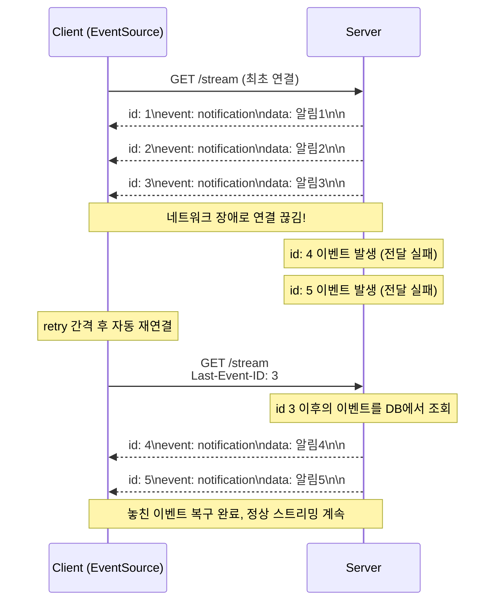
```mermaid
sequenceDiagram
    participant C as Client (EventSource)
    participant S as Server

    C->>S: GET /stream (최초 연결)
    S-->>C: id: 1\nevent: notification\ndata: 알림1\n\n
    S-->>C: id: 2\nevent: notification\ndata: 알림2\n\n
    S-->>C: id: 3\nevent: notification\ndata: 알림3\n\n

    Note over C,S: 네트워크 장애로 연결 끊김!

    Note over S: id: 4 이벤트 발생 (전달 실패)
    Note over S: id: 5 이벤트 발생 (전달 실패)

    Note over C: retry 간격 후 자동 재연결
    C->>S: GET /stream<br/>Last-Event-ID: 3

    Note over S: id 3 이후의 이벤트를 DB에서 조회
    S-->>C: id: 4\nevent: notification\ndata: 알림4\n\n
    S-->>C: id: 5\nevent: notification\ndata: 알림5\n\n
    Note over C,S: 놓친 이벤트 복구 완료, 정상 스트리밍 계속
```

이 메커니즘이 동작하려면 서버 측에서 두 가지를 구현해야 합니다.

1. **이벤트에 id를 부여**: `SseEmitter.event().id(...)` 호출
2. **Last-Event-ID 기반 복구 로직**: 재연결 시 전달받은 ID 이후의 이벤트를 DB에서 조회하여 재전송

```java
/**
 * Last-Event-ID 기반 missed event 복구
 *
 * 이벤트 저장소(DB)에 알림을 저장하고 있으므로,
 * 재연결 시 마지막 수신 ID 이후의 알림을 조회하여 재전송
 */
private void resendMissedEvents(Long userId, String lastEventId) {
    try {
        long lastId = Long.parseLong(lastEventId);

        // lastId 이후에 생성된 미읽은 알림 조회
        List<Notification> missedNotifications = notificationRepository
                .findByUserIdAndCreatedAtAfterOrderByCreatedAtAsc(
                        userId,
                        Instant.ofEpochMilli(lastId));

        for (Notification notification : missedNotifications) {
            sendToUser(userId, "notification", NotificationResponse.from(notification));
        }

        log.info("Missed events 복구: userId={}, lastEventId={}, count={}",
                userId, lastEventId, missedNotifications.size());
    } catch (NumberFormatException e) {
        log.warn("유효하지 않은 Last-Event-ID: {}", lastEventId);
    }
}
```

**id 전략 선택**: id 값으로 타임스탬프를 사용하면 시간 기반 범위 쿼리가 가능해 복구 로직이 단순해집니다. DB의 auto-increment ID를 사용하면 순서가 보장되지만, 서버 간 ID 충돌 가능성을 고려해야 합니다.

### Event Store 설계: SSE 이벤트 저장과 TTL 관리

Last-Event-ID 복구가 동작하려면 이벤트를 **일정 기간 저장**해야 합니다. 이 저장소의 설계를 살펴보겠습니다.

#### RDB 기반 Event Store

```sql
CREATE TABLE sse_event (
    id          BIGINT AUTO_INCREMENT PRIMARY KEY,
    user_id     BIGINT NOT NULL,
    event_type  VARCHAR(50) NOT NULL,
    event_data  TEXT NOT NULL,
    created_at  TIMESTAMP NOT NULL DEFAULT CURRENT_TIMESTAMP,
    INDEX idx_user_created (user_id, created_at)  -- 복합 인덱스
);
```

```java
@Repository
public interface SseEventRepository extends JpaRepository<SseEvent, Long> {

    // Last-Event-ID(타임스탬프) 이후의 이벤트 조회
    List<SseEvent> findByUserIdAndCreatedAtAfterOrderByCreatedAtAsc(
            Long userId, Instant createdAt);

    // 오래된 이벤트 삭제 (배치)
    @Modifying
    @Query("DELETE FROM SseEvent e WHERE e.createdAt < :cutoff")
    int deleteEventsOlderThan(@Param("cutoff") Instant cutoff);
}
```

TTL 관리를 위한 스케줄러:

```java
@Scheduled(cron = "0 0 3 * * *") // 매일 새벽 3시
public void cleanupOldEvents() {
    Instant cutoff = Instant.now().minus(Duration.ofHours(24));
    int deleted = sseEventRepository.deleteEventsOlderThan(cutoff);
    log.info("만료된 SSE 이벤트 삭제: {}건", deleted);
}
```

#### Redis 기반 Event Store

대규모 서비스에서는 RDB 대신 **Redis Sorted Set**을 Event Store로 활용할 수 있습니다. 타임스탬프를 score로 사용하면 범위 조회와 TTL 관리가 모두 효율적입니다.

```java
@Component
@RequiredArgsConstructor
public class RedisEventStore {

    private final StringRedisTemplate redisTemplate;
    private final ObjectMapper objectMapper;

    private static final Duration EVENT_TTL = Duration.ofHours(24);

    public void save(Long userId, NotificationEvent event) {
        String key = "sse:events:" + userId;
        double score = System.currentTimeMillis();
        String value = serialize(event);

        redisTemplate.opsForZSet().add(key, value, score);
        redisTemplate.expire(key, EVENT_TTL); // 키 전체 TTL
    }

    public List<NotificationEvent> getAfter(Long userId, long lastEventTimestamp) {
        String key = "sse:events:" + userId;
        // score가 lastEventTimestamp 초과인 이벤트 조회
        Set<String> events = redisTemplate.opsForZSet()
                .rangeByScore(key, lastEventTimestamp + 1, Double.MAX_VALUE);

        return events.stream()
                .map(this::deserialize)
                .toList();
    }

    /**
     * 오래된 이벤트 제거 (TTL 외에 추가 정리)
     * Sorted Set에서 score 기반 범위 삭제
     */
    public void cleanup(Long userId) {
        String key = "sse:events:" + userId;
        double cutoff = System.currentTimeMillis() - EVENT_TTL.toMillis();
        redisTemplate.opsForZSet().removeRangeByScore(key, 0, cutoff);
    }
}
```

| 항목 | RDB (MySQL/PostgreSQL) | Redis Sorted Set |
|------|----------------------|-----------------|
| **범위 조회 성능** | O(log n) + 디스크 I/O | O(log n + m), 인메모리 |
| **TTL 관리** | 배치 삭제 필요 | Key TTL + ZREMRANGEBYSCORE |
| **영속성** | 보장 (트랜잭션) | AOF/RDB (설정에 따라) |
| **동시성** | 트랜잭션 격리 | 단일 스레드 (경합 없음) |
| **메모리 사용량** | 디스크 기반 | 메모리 기반 (비용 높음) |
| **권장 시나리오** | 이벤트 영구 보존 필요 | 24시간 이내 복구만 필요 |

### SSE 모니터링 메트릭 설계

SSE 연결의 상태를 모니터링하려면 다음 메트릭을 수집해야 합니다.

```java
@Component
@RequiredArgsConstructor
public class SseMetrics {

    private final MeterRegistry meterRegistry;
    private final SseEmitterManager emitterManager;

    // 활성 SSE 연결 수 (Gauge — 현재 값)
    @PostConstruct
    public void registerGauges() {
        Gauge.builder("sse.connections.active", emitterManager::getActiveConnectionCount)
                .description("현재 활성 SSE 연결 수")
                .register(meterRegistry);
    }

    // SSE 이벤트 전송 수 (Counter — 누적 값)
    public void recordEventSent(String eventType) {
        Counter.builder("sse.events.sent")
                .tag("type", eventType)
                .description("전송된 SSE 이벤트 수")
                .register(meterRegistry)
                .increment();
    }

    // SSE 이벤트 전송 실패 수 (Counter)
    public void recordEventFailed(String reason) {
        Counter.builder("sse.events.failed")
                .tag("reason", reason)
                .description("전송 실패한 SSE 이벤트 수")
                .register(meterRegistry)
                .increment();
    }

    // SSE 연결 지속 시간 (Timer)
    public Timer.Sample startConnectionTimer() {
        return Timer.start(meterRegistry);
    }

    public void stopConnectionTimer(Timer.Sample sample) {
        sample.stop(Timer.builder("sse.connection.duration")
                .description("SSE 연결 지속 시간")
                .register(meterRegistry));
    }

    // 재연결 빈도 (Counter)
    public void recordReconnection() {
        Counter.builder("sse.reconnections")
                .description("SSE 재연결 횟수")
                .register(meterRegistry)
                .increment();
    }
}
```

Grafana에서 사용할 PromQL 쿼리 예시:

```promql
# 현재 활성 SSE 연결 수
sse_connections_active

# 분당 SSE 이벤트 전송률
rate(sse_events_sent_total[1m])

# SSE 전송 실패율
rate(sse_events_failed_total[5m]) / rate(sse_events_sent_total[5m]) * 100

# SSE 연결 평균 지속 시간
sse_connection_duration_seconds_sum / sse_connection_duration_seconds_count

# 분당 재연결 빈도 (높으면 네트워크 문제 의심)
rate(sse_reconnections_total[5m])
```

핵심 알림 규칙:

```yaml
# Prometheus Alert Rules
groups:
  - name: sse-alerts
    rules:
      - alert: SseConnectionDrop
        expr: delta(sse_connections_active[5m]) < -100
        for: 1m
        labels:
          severity: warning
        annotations:
          summary: "SSE 연결 급감 (5분간 100개 이상 감소)"

      - alert: SseHighFailureRate
        expr: rate(sse_events_failed_total[5m]) > 10
        for: 2m
        labels:
          severity: critical
        annotations:
          summary: "SSE 이벤트 전송 실패율 증가"
```

---

## SSE vs gRPC Server Streaming 비교

SSE와 유사한 서버-to-클라이언트 스트리밍 기술로 **gRPC Server Streaming**이 있습니다. 두 기술의 차이점을 비교합니다.

### gRPC Server Streaming 개요

gRPC는 Protocol Buffers를 기반으로 한 RPC 프레임워크로, HTTP/2 위에서 동작합니다. Server Streaming RPC는 클라이언트가 한 번 요청하면 서버가 **스트림으로 여러 응답**을 보내는 패턴입니다.

```protobuf
// notification.proto
service NotificationService {
    // Server Streaming RPC
    rpc SubscribeNotifications(SubscribeRequest)
        returns (stream NotificationEvent);
}

message SubscribeRequest {
    int64 user_id = 1;
    string last_event_id = 2;
}

message NotificationEvent {
    string id = 1;
    string type = 2;
    string data = 3;
    int64 timestamp = 4;
}
```

### 심층 비교

| 항목 | SSE | gRPC Server Streaming |
|------|-----|-----------------------|
| **프로토콜** | HTTP/1.1 또는 HTTP/2 (텍스트) | HTTP/2 (바이너리, Protocol Buffers) |
| **데이터 직렬화** | JSON (텍스트) | Protobuf (바이너리, 2~10x 작음) |
| **타입 안전성** | 없음 (문자열 파싱) | 강타입 (.proto에서 생성) |
| **브라우저 지원** | 네이티브 (EventSource API) | grpc-web 라이브러리 필요 |
| **프록시 호환성** | 매우 높음 (일반 HTTP) | 제한적 (Envoy 등 gRPC 프록시 필요) |
| **자동 재연결** | 브라우저 내장 | 직접 구현 필요 |
| **양방향 스트리밍** | 불가 | 가능 (Bidirectional Streaming) |
| **메시지 크기** | 큼 (JSON + 이벤트 필드명 오버헤드) | 작음 (Protobuf 바이너리 인코딩) |
| **코드 생성** | 수동 | protoc 자동 생성 |

**메시지 크기 비교 예시**: 동일한 알림 데이터를 전송할 때:

```
SSE (text/event-stream):
  id: 1709523600000\n
  event: notification\n
  data: {"type":"COMMENT","postId":42,"userId":7,"message":"새 댓글"}\n
  \n
  → 약 120 bytes

gRPC (Protobuf):
  [field 1 (id): varint] [field 2 (type): length-delimited]
  [field 3 (data): length-delimited] [field 4 (timestamp): varint]
  → 약 45 bytes
```

Protobuf가 약 **62% 더 작습니다**. 초당 수천 건의 이벤트를 전송하는 경우 이 차이가 대역폭에 유의미한 영향을 미칩니다.

### 선택 가이드

| 시나리오 | 권장 기술 | 이유 |
|---------|----------|------|
| **웹 브라우저 대상 알림** | SSE | 브라우저 네이티브 지원, 인프라 호환성 |
| **모바일 앱 대상 알림** | gRPC Streaming | Protobuf 효율, 타입 안전성, 배터리 절약 |
| **마이크로서비스 간 이벤트 전파** | gRPC Streaming | 서비스 간 스키마 계약, 코드 생성 |
| **공개 API** | SSE | 클라이언트 라이브러리 없이 curl로 테스트 가능 |
| **고빈도 소형 메시지 (IoT 등)** | gRPC Streaming | Protobuf 바이너리 효율 |

### 모바일 환경에서의 SSE 한계

모바일 앱에서 SSE를 사용할 때는 데스크톱 브라우저와 다른 제약이 있습니다.

| 제약 | 상세 | 영향 |
|------|------|------|
| **백그라운드 제한** | iOS/Android 모두 백그라운드 앱의 네트워크 연결 유지를 제한 | SSE 연결이 강제 종료됨 |
| **배터리 소모** | 장시간 TCP 연결 유지는 라디오 모듈을 켜놓는 것과 동일 | 배터리 드레인 |
| **네트워크 전환** | Wi-Fi ↔ Cellular 전환 시 TCP 연결 끊김 | 잦은 재연결 발생 |
| **Doze 모드 (Android 6+)** | 화면 꺼진 후 일정 시간 지나면 네트워크 차단 | SSE 이벤트 수신 불가 |

**모바일에서의 대안**: 백그라운드 알림이 필요한 경우 **FCM(Firebase Cloud Messaging)** 또는 **APNs(Apple Push Notification Service)**를 사용하고, 포그라운드에서만 SSE를 활용하는 **하이브리드 전략**이 현실적입니다.

```
모바일 하이브리드 전략:

[포그라운드] → SSE 연결 (실시간, 낮은 지연)
[백그라운드] → FCM/APNs (OS가 배터리 최적화 관리)
[앱 실행 복귀] → SSE 재연결 + Last-Event-ID로 누락 이벤트 복구
```

---

## 마치며

SSE는 서버에서 클라이언트로의 **단방향 실시간 푸시에 최적화된 기술**입니다. 이 글에서 다룬 내용을 계층별로 정리합니다.

**네트워크 계층**: TCP 3-way handshake 비용, HTTP/1.0 → 1.1 → 2 연결 모델의 진화, Chunked Transfer Encoding이 SSE 스트리밍을 가능하게 하는 원리, TCP Nagle 알고리즘이 이벤트 전송 지연을 유발하는 메커니즘까지 살펴보았습니다.

**프로토콜 계층**: text/event-stream 스펙의 4가지 필드(data, event, id, retry), HTTP/2에서의 Flow Control과 Stream Priority(RFC 9218), EventSource API의 한계와 fetch + ReadableStream 대안, Thundering Herd 방지를 위한 Jittered Backoff 전략을 다루었습니다.

**구현 계층**: Spring SseEmitter의 Servlet 3.0+ AsyncContext 기반 비동기 처리, ConcurrentHashMap의 volatile read와 Red-Black Tree 전환 메커니즘, WebFlux Flux SSE의 Backpressure 제어, 메모리 추정과 GC 영향 분석(ZGC 권장 근거)을 정리했습니다.

**운영 계층**: Nginx proxy_buffering/X-Accel-Buffering 설정, Redis Pub/Sub vs Redis Streams 선택 기준, Last-Event-ID 기반 복구와 Event Store 설계(RDB vs Redis Sorted Set), Connection Draining을 포함한 배포 전략, Micrometer 기반 모니터링 메트릭과 Prometheus 알림 규칙을 다루었습니다.

**기술 선택 판단 기준**:

| 요구사항 | SSE | WebSocket | gRPC Streaming |
|---------|-----|-----------|----------------|
| **서버→클라이언트 단방향 (웹)** | 최적 | 과설계 | 프록시 호환성 문제 |
| **양방향 통신** | 불가 | 최적 | 가능 |
| **모바일 백그라운드 푸시** | 불가 | 불가 | 불가 (FCM/APNs 필요) |
| **마이크로서비스 간 스트리밍** | 부적합 | 부적합 | 최적 |
| **인프라 호환성 우선** | 최적 | 중간 | 낮음 |

모든 실시간 기능에 WebSocket을 쓸 필요는 없습니다. 기술 선택의 핵심은 **통신 방향, 메시지 빈도, 클라이언트 환경, 인프라 제약을 먼저 분석**하고 거기에 맞는 프로토콜을 고르는 것입니다. 단방향 푸시만 필요한 웹 서비스라면 SSE가 가장 단순하고, HTTP 인프라와 자연스럽게 호환되며, 브라우저 내장 재연결 메커니즘까지 제공하는 합리적인 선택입니다.
