## 들어가며

재난문자 속에 실종 경보가 묻히는 경험, 한 번쯤 해보셨을 겁니다.

실종자 발생 알림은 현재 재난문자(CBS)를 통해 전달되지만, 긴급재난문자와 안전안내문자 사이에 묻혀 실제 전달력이 크게 떨어지고 있습니다. 2023년 기준 CBS 발송 건수는 월평균 약 1,200건인데, 이 가운데 실종 관련 경보는 전체의 5% 미만입니다. 대다수 사용자는 재난문자가 도착하면 내용을 확인하지 않고 닫는 패턴이 고착화되어 있고, 특히 시간이 생명인 실종 상황에서 **경보를 본 사람이 실종 현장 주변에 있는지조차 구분되지 않는** 구조적 문제가 존재했습니다.

**Reconnect**는 이 문제를 해결하기 위해 만든 앱 서비스입니다. 실종자 발생 시 **5km 반경 내 사용자에게만 실시간 알림**을 보내고, 위치 기반으로 실종자를 검색하거나 제보할 수 있는 기능을 제공합니다. 오픈플랫폼개발자커뮤니티 이사장상을 수상했으며, 이 프로젝트에서 저는 **백엔드 시스템 설계**를 담당했습니다.

이 글에서는 구현 코드보다 **왜 이런 설계를 선택했는지**, 어떤 대안을 검토하고 어떤 근거로 결정했는지를 중심으로 정리합니다. 특히 실시간 통신 프로토콜의 TCP/HTTP 계층 비교, Haversine 기반 위치 필터링의 수학적 배경, Multi DB 분리 기준과 스키마, 그리고 스케일아웃 시 고려 사항까지 설계 전반을 다룹니다.

---

## 서비스 전체 구조

### 핵심 기능 요약

Reconnect의 핵심 기능은 세 가지입니다.

- **실시간 알림**: 실종자 등록 시 반경 5km 내 사용자에게 즉시 알림 전송
- **위치 기반 검색**: 현재 위치 주변의 실종자 정보 조회
- **제보 및 신고**: 실종자 목격 시 사진과 위치 정보를 함께 제보

### 전체 아키텍처

```mermaid
graph TB
    subgraph Client["Android Client (Kotlin Coroutine)"]
        A[위치 추적 서비스<br/>Foreground Service] --> B[SupervisorJob<br/>Coroutine Scope]
        B --> C[WebSocket 연결<br/>위치 전송 Job]
        B --> D[SSE 수신<br/>알림 수신 Job]
    end

    subgraph Server["Spring Boot Server"]
        E[WebSocket Handler<br/>STOMP Endpoint] --> F[위치 갱신 서비스]
        F --> H[Haversine 필터링<br/>Bounding Box + 정밀 계산]
        G[SSE Emitter 관리<br/>ConcurrentHashMap] --> H
        H --> I[알림 브로드캐스트]
    end

    subgraph Storage["Multi DB"]
        J[(MySQL<br/>Core: 실종자, 신고, 사용자)]
        K[(MongoDB<br/>Log: 위치, 알림 이력, 세션)]
    end

    C <-->|"양방향: 위치 좌표 전송<br/>WS 프레임 2~10 bytes 페이로드"| E
    D <--|"단방향: 실종 알림 이벤트 스트림<br/>text/event-stream"| G
    F --> K
    I --> J
    I --> K
```

이 구조에서 가장 많은 고민이 필요했던 설계 결정은 크게 세 가지입니다. **실시간 통신 프로토콜 선택**, **위치 기반 필터링 알고리즘**, 그리고 **Multi DB 분리 기준**입니다.

---

## 실시간 통신 프로토콜 이론 비교

설계에 앞서, 실시간 통신에 사용할 수 있는 네 가지 방식을 TCP/HTTP 계층 수준에서 깊이 비교했습니다.

### 1. Short Polling

클라이언트가 **일정 간격으로 HTTP 요청을 반복**하는 가장 단순한 방식입니다.

```
[클라이언트]                        [서버]
    |--- GET /api/alerts ---------->|
    |<-- 200 OK (변경 없음) --------|     ← 빈 응답
    |         (3초 대기)            |
    |--- GET /api/alerts ---------->|
    |<-- 200 OK (변경 없음) --------|     ← 빈 응답
    |         (3초 대기)            |
    |--- GET /api/alerts ---------->|
    |<-- 200 OK (새 알림 1건) ------|     ← 데이터 응답
```

**핸드셰이크 비용**: 매 요청마다 TCP 3-way handshake + TLS handshake(HTTPS라면) + HTTP 요청/응답 사이클이 반복됩니다. HTTP/1.1의 Keep-Alive로 TCP 연결을 재사용할 수 있지만, 유휴 시간이 길면 연결이 닫힙니다.

**오버헤드 정량 분석**:

```
HTTP 요청 1건의 오버헤드:
  - HTTP 요청 헤더: ~200~800 bytes
    (Method, URL, Host, User-Agent, Accept, Cookie, Authorization 등)
  - HTTP 응답 헤더: ~200~400 bytes
    (Status, Content-Type, Content-Length, Set-Cookie 등)
  - TCP/IP 헤더: 40 bytes (IP 20 + TCP 20)
  - TLS 레코드 헤더: 5 bytes + MAC/패딩

  변경 없는 빈 응답이어도: 최소 ~500 bytes 오버헤드

3초 간격 Polling, 동시 접속 1,000명:
  - 초당 요청: 1,000 / 3 = 333 req/s
  - 대역폭: 333 × 500 bytes = ~163 KB/s (순수 오버헤드만)
  - 10,000명이면: ~1.6 MB/s, 3,333 req/s
```

실종 알림은 하루에 수 건 발생하지만, Polling은 알림이 없어도 지속적으로 요청을 보냅니다. **이벤트 발생 빈도 대비 요청 빈도의 비율이 극단적으로 불균형**한 구조입니다.

### 2. Long Polling

클라이언트가 요청을 보내면 서버가 **이벤트가 발생할 때까지 응답을 보류**하는 방식입니다.

```
[클라이언트]                           [서버]
    |--- GET /api/alerts ------------>|
    |          (서버가 응답을 보류)     |
    |          ...30초간 대기...       |
    |<-- 200 OK (새 알림 1건) --------|   ← 이벤트 발생 시 즉시 응답
    |--- GET /api/alerts ------------>|   ← 즉시 재요청
    |          (서버가 다시 보류)       |
```

Short Polling보다 불필요한 요청이 줄어들지만, **이벤트가 발생할 때마다 TCP 연결을 새로 맺어야** 한다는 근본적인 한계가 있습니다. 특히 알림이 연속으로 발생하면 매 이벤트마다 HTTP 요청/응답 사이클이 반복됩니다.

**서버 자원 관점**: 서버는 응답을 보류하는 동안 해당 요청을 위한 스레드(또는 비동기 핸들러)를 유지해야 합니다. 1,000명이 Long Polling으로 대기하면 1,000개의 보류 중인 요청이 서버에 존재합니다.

### 3. Server-Sent Events (SSE)

HTTP/1.1 기반으로 서버에서 클라이언트로 **이벤트 스트림을 단방향 전송**하는 방식입니다.

```
[클라이언트]                                   [서버]
    |--- GET /api/subscribe ----------------->|
    |    Accept: text/event-stream            |
    |<-- 200 OK                               |
    |    Content-Type: text/event-stream       |
    |    Transfer-Encoding: chunked            |
    |                                          |
    |<-- data: {"type":"alert","id":1}\n\n ----|   ← 이벤트 1
    |          ...연결 유지...                  |
    |<-- data: {"type":"alert","id":2}\n\n ----|   ← 이벤트 2
    |          ...연결 유지...                  |
```

**프로토콜 특성**:
- HTTP/1.1 위에서 동작하므로 별도의 프로토콜 업그레이드가 불필요
- `Content-Type: text/event-stream`으로 응답을 시작하고, 연결을 닫지 않음
- 각 이벤트는 `data:` 접두사 + 개행 2회(`\n\n`)로 구분
- **자동 재접속**: 연결이 끊어지면 브라우저(또는 클라이언트)가 자동으로 재접속 (Last-Event-ID 헤더 활용)
- **텍스트 전용**: 바이너리 데이터 전송 불가

**프레임 오버헤드**: SSE는 HTTP chunked transfer encoding을 사용하므로, 이벤트 하나당 오버헤드가 매우 작습니다.

```
SSE 이벤트 1건의 프레임 구조:
  - Chunk 크기 (hex + CRLF): ~4 bytes
  - "data: " 접두사: 6 bytes
  - 페이로드 (JSON): 가변
  - "\n\n" 종료: 2 bytes
  - Chunk 종료 CRLF: 2 bytes
  ──────────────────────
  오버헤드: ~14 bytes/이벤트

  cf. HTTP Polling 1건: ~500 bytes/응답
  → SSE는 이벤트당 오버헤드가 Polling의 약 1/35
```

**제약**: 단방향(서버 → 클라이언트)만 가능하므로, 클라이언트에서 서버로 데이터를 보내려면 별도의 HTTP 요청이 필요합니다.

### 4. WebSocket

HTTP 연결을 **TCP 기반의 양방향 전이중(full-duplex) 통신**으로 업그레이드하는 방식입니다.

```
[클라이언트]                                   [서버]
    |--- GET /ws HTTP/1.1 ------------------->|
    |    Upgrade: websocket                    |
    |    Connection: Upgrade                   |
    |    Sec-WebSocket-Key: dGhlIHNhbXBsZQ==   |
    |                                          |
    |<-- HTTP/1.1 101 Switching Protocols -----|
    |    Upgrade: websocket                    |
    |    Sec-WebSocket-Accept: s3pPLMBi...     |
    |                                          |
    |<========= WebSocket 프레임 =============>|   ← 양방향 전이중
    |--- {lat: 37.56, lng: 126.97} ---------->|   ← 클라이언트 → 서버
    |<-- {type: "ack"} -----------------------|   ← 서버 → 클라이언트
```

**핸드셰이크 비용**: 최초 연결 시 HTTP Upgrade 요청 1회가 필요합니다. 이후에는 TCP 연결 위에서 WebSocket 프레임만 교환하므로 HTTP 오버헤드가 없습니다.

**프레임 오버헤드**: WebSocket 프레임은 HTTP와 완전히 다른 경량 바이너리 구조입니다.

```
WebSocket 프레임 헤더:
  - 최소 2 bytes (페이로드 125 bytes 이하)
  - 4 bytes (페이로드 126~65535 bytes)
  - 10 bytes (페이로드 65536 bytes 이상)
  - 클라이언트→서버: +4 bytes 마스킹 키

위치 데이터 전송 1건:
  - WebSocket 헤더: 2 + 4 = 6 bytes (마스킹 포함)
  - 페이로드: {"lat":37.5665,"lng":126.978} = ~32 bytes
  - 합계: ~38 bytes

  cf. 같은 데이터를 HTTP POST로 보내면:
  - HTTP 헤더: ~500 bytes
  - 페이로드: ~32 bytes
  - 합계: ~532 bytes
  → WebSocket은 HTTP 대비 약 1/14의 대역폭
```

### 네 방식의 정량 비교

동시 접속 1,000명, 위치 전송 간격 5초, 알림 하루 10건 기준으로 추정합니다.

| 지표 | Short Polling | Long Polling | SSE | WebSocket |
|------|-------------|-------------|-----|-----------|
| **연결 방식** | 매번 새 HTTP 요청 | 이벤트마다 재연결 | HTTP 연결 유지 (단방향) | TCP 연결 유지 (양방향) |
| **핸드셰이크** | 매 요청 | 이벤트마다 | 최초 1회 | 최초 1회 (HTTP Upgrade) |
| **프레임 오버헤드** | ~500 bytes/요청 | ~500 bytes/이벤트 | ~14 bytes/이벤트 | ~6 bytes/메시지 |
| **위치 전송 대역폭** (1,000명, 5초 간격) | ~100 KB/s | N/A (서버→클 전용) | N/A (서버→클 전용) | **~7.6 KB/s** |
| **알림 전송 대역폭** (하루 10건) | Polling 요청에 포함 | ~5 KB/이벤트 | **~0.5 KB/이벤트** | ~0.4 KB/이벤트 |
| **초당 서버 요청** | 200 req/s | 이벤트 빈도에 비례 | 0 (연결 유지) | 200 msg/s (프레임) |
| **방화벽/프록시 호환** | 매우 좋음 | 좋음 | **좋음 (HTTP 기반)** | 제한적 (Upgrade 차단 가능) |
| **자동 재접속** | 클라이언트 구현 필요 | 클라이언트 구현 필요 | **내장 (Last-Event-ID)** | 클라이언트 구현 필요 |

---

## WebSocket + SSE 조합 설계 결정

### 두 가지 성격이 다른 실시간 요구사항

Reconnect에서는 **방향이 반대인 두 가지 실시간 요구사항**이 공존했습니다.

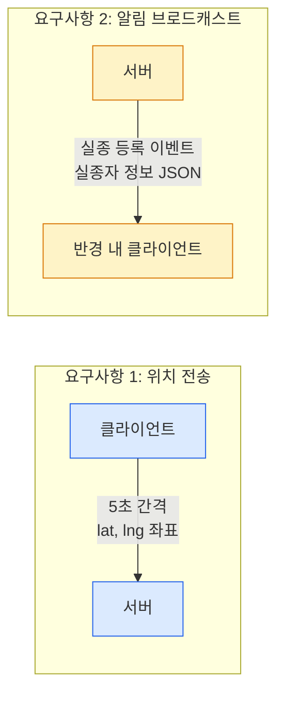

**요구사항 1 — 클라이언트 → 서버: 위치 데이터 전송**

사용자의 현재 GPS 좌표를 5초 간격으로 서버에 보내야 합니다. 이 데이터의 특성은 다음과 같습니다.

- **방향**: 클라이언트 → 서버 (단방향)
- **빈도**: 5초에 1회, 동시 접속 1,000명 기준 초당 200건
- **페이로드 크기**: lat + lng = ~32 bytes (매우 작음)
- **중요도**: 최신 위치만 의미 있고, 이전 위치는 덮어써도 무방

**요구사항 2 — 서버 → 클라이언트: 실종 알림 브로드캐스트**

실종자가 등록되면 반경 5km 내 사용자에게 알림을 보내야 합니다.

- **방향**: 서버 → 클라이언트 (단방향)
- **빈도**: 하루 수 건 ~ 수십 건 (매우 낮음)
- **페이로드 크기**: 실종자 정보 JSON ~500 bytes
- **중요도**: 반드시 전달되어야 하며, 놓치면 안 됨

### 왜 단일 프로토콜을 배제했는가

#### WebSocket 단독 사용의 문제

WebSocket은 양방향이므로 두 요구사항 모두 처리할 수 있습니다. 하지만 하나의 WebSocket 연결에 두 역할을 묶으면 다음 문제가 발생합니다.

**첫째, 생명주기 불일치.** 위치 전송은 앱이 포그라운드에 있을 때만 활성화됩니다. GPS를 백그라운드에서 지속 추적하면 배터리 소모가 크기 때문입니다. 반면 알림 수신은 백그라운드에서도 동작해야 합니다. 하나의 연결에 두 역할을 묶으면, 포그라운드 전환 시 위치 전송을 위해 연결을 열고, 백그라운드 전환 시 알림만 받기 위해 연결을 유지해야 하는데, 이 전환 로직이 복잡해집니다.

**둘째, 장애 격리 불가.** WebSocket 연결이 네트워크 불안정으로 끊어지면 위치 전송과 알림 수신이 동시에 중단됩니다. 위치 전송이 일시적으로 실패하더라도 실종 알림은 계속 받을 수 있어야 하는데, 단일 채널에서는 불가능합니다.

**셋째, 인프라 복잡도.** WebSocket은 HTTP와 다른 프로토콜이므로, 로드밸런서에서 Sticky Session 설정이 필요하고, 리버스 프록시(nginx 등)에서 Upgrade 지원을 별도로 구성해야 합니다. 알림처럼 단순한 서버→클라이언트 푸시에 이런 인프라 비용을 감수할 이유가 없습니다.

#### SSE 단독 사용의 문제

SSE는 서버→클라이언트 단방향만 지원하므로, 위치 전송(클라이언트→서버)을 별도의 HTTP POST 요청으로 보내야 합니다.

```
위치 전송을 HTTP POST로 처리할 경우:
  - 5초 간격, 1,000명: 200 req/s
  - 요청당 오버헤드: ~500 bytes (HTTP 헤더)
  - 초당 대역폭: 200 × 532 = ~104 KB/s

  cf. WebSocket으로 처리할 경우:
  - 동일 조건: 200 msg/s
  - 메시지당 오버헤드: ~6 bytes (WS 프레임 헤더)
  - 초당 대역폭: 200 × 38 = ~7.6 KB/s

  → HTTP POST 방식은 WebSocket 대비 약 14배의 대역폭 소모
```

5초 간격의 반복 전송에 매번 HTTP 헤더를 붙이는 것은 비효율적입니다. 또한 매 요청마다 서버 측에서 HTTP 요청 파싱, 라우팅, 컨트롤러 진입 등의 오버헤드가 발생합니다.

### STOMP 프로토콜: WebSocket 위의 메시징 계층

WebSocket은 **프레임 전송 프로토콜**일 뿐, 메시지의 의미(어디로 보낼 것인지, 어떤 형식인지)는 정의하지 않습니다. 이를 보완하기 위해 WebSocket 위에 **STOMP(Simple Text Oriented Messaging Protocol)** 를 올렸습니다.

#### STOMP 프레임 구조

```
COMMAND\n
header1:value1\n
header2:value2\n
\n
Body^@
```

STOMP 프레임은 **COMMAND**, **헤더 블록**, **본문**, 그리고 NULL 바이트(`^@`)로 구성됩니다. HTTP 요청 구조와 유사해 직관적입니다.

#### 핵심 커맨드

| 커맨드 | 방향 | 역할 | Reconnect에서의 사용 |
|--------|------|------|---------------------|
| **CONNECT** | 클라→서버 | STOMP 세션 시작 | 앱 시작 시 WebSocket 연결 후 STOMP 핸드셰이크 |
| **SUBSCRIBE** | 클라→서버 | 특정 destination 구독 | `/topic/location` 구독 (위치 ACK 수신) |
| **SEND** | 클라→서버 | destination으로 메시지 전송 | `/app/location` 으로 GPS 좌표 전송 |
| **MESSAGE** | 서버→클라 | 구독 중인 destination에 메시지 배달 | 위치 수신 확인 ACK |
| **DISCONNECT** | 클라→서버 | 세션 종료 | 앱 백그라운드 전환 시 |

#### 위치 전송 시 STOMP 프레임 예시

```
SEND
destination:/app/location
content-type:application/json

{"lat":37.5665,"lng":126.978,"accuracy":15.2,"timestamp":1709523600000}^@
```

이 프레임의 바이트 단위 오버헤드를 분석하면:

```
STOMP 프레임 오버헤드:
  - COMMAND (SEND\n):              5 bytes
  - destination 헤더:             25 bytes
  - content-type 헤더:            30 bytes
  - 헤더-본문 구분자 (\n):         1 byte
  - NULL 종료 (^@):               1 byte
  ─────────────────────────
  STOMP 오버헤드: ~62 bytes
  + WebSocket 프레임 헤더: ~6 bytes (마스킹 포함)
  ─────────────────────────
  총 프로토콜 오버헤드: ~68 bytes

  cf. HTTP POST로 동일 데이터 전송 시: ~500 bytes
  → STOMP + WebSocket은 HTTP 대비 약 1/7 오버헤드
```

#### SimpleBroker vs 외부 메시지 브로커

Spring은 STOMP 메시지 라우팅을 위해 두 가지 브로커 옵션을 제공합니다.

| 항목 | SimpleBroker | RabbitMQ / ActiveMQ |
|------|-------------|---------------------|
| **구현** | Spring 내장, 인메모리 | 외부 프로세스 |
| **메시지 영속화** | 불가 | 가능 (디스크 저장) |
| **클러스터링** | 불가 (단일 인스턴스) | 가능 |
| **프로토콜 지원** | STOMP만 | AMQP, MQTT, STOMP 등 |
| **처리량** | 수천 msg/s | 수만~수십만 msg/s |
| **인프라 복잡도** | 없음 | 별도 브로커 운영 필요 |
| **적합한 경우** | 단일 서버, 소규모 | 다중 서버, 대규모 |

Reconnect 초기 버전에서는 **SimpleBroker를 선택**했습니다. 위치 데이터는 최신 값만 의미 있고 영속화가 불필요하며, 단일 인스턴스로 시작하는 MVP 단계이므로 외부 브로커의 운영 비용을 감수할 이유가 없었습니다.

### 역할 분리 설계

두 요구사항의 성격이 명확히 다르므로, 각 역할에 최적화된 프로토콜을 분리 배정했습니다.

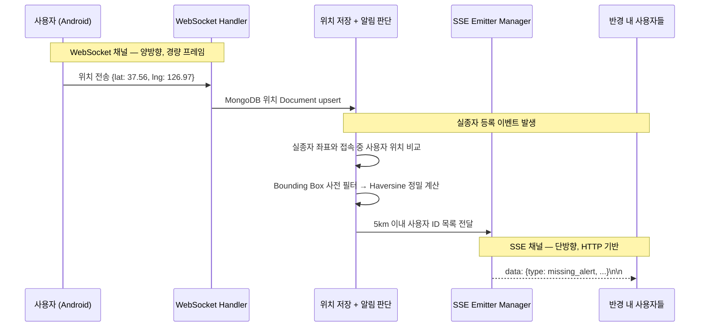

| 프로토콜 | 담당 역할 | 선택 이유 |
|---------|---------|---------|
| **WebSocket** | 위치 전송 (클→서) | 5초 간격 반복 전송에 적합한 경량 프레임 (6 bytes 오버헤드), TCP 연결 유지로 핸드셰이크 비용 제거 |
| **SSE** | 알림 브로드캐스트 (서→클) | HTTP 기반이라 방화벽/프록시 호환성 우수, 자동 재접속 내장, 알림 빈도가 낮아 연결 유지 비용 미미 |

### FCM 대신 SSE를 선택한 근거

모바일 푸시 알림이라면 FCM(Firebase Cloud Messaging)이 가장 먼저 떠오릅니다. 실제로 검토한 뒤 SSE를 주 채널로 선택한 근거는 다음과 같습니다.

| 비교 항목 | FCM | SSE (직접 구현) |
|----------|-----|----------------|
| **지연 시간** | 수백ms ~ 수초 (Google 서버 경유) | 수십ms (서버 → 클라이언트 직접) |
| **필터링 제어** | Topic/Condition 기반, 5km 반경 같은 복잡 조건은 서버에서 사전 필터 후 개별 전송 필요 | 서버에서 Haversine 계산 후 대상 Emitter에 직접 전송, **필터링과 전송이 한 단계** |
| **앱 종료 시** | **수신 가능** (FCM 서비스가 백그라운드 동작) | 수신 불가 (앱 프로세스 종료 시 SSE 연결 끊김) |
| **인프라 의존** | Google 서버 의존, 장애 시 제어 불가 | 자체 서버에서 완전 제어 |
| **메시지 크기** | 최대 4KB | 제한 없음 (HTTP chunked) |

**지연 시간**이 가장 결정적인 요소였습니다. 실종 상황에서 알림이 1~2초 늦게 도착하는 것은 골든타임 관점에서 치명적입니다. FCM은 Google의 서버를 경유하는 구조이므로 네트워크 홉이 추가되고, Google 서버 부하 상태에 따라 지연이 변동합니다.

**다만 SSE의 한계는 명확합니다.** 앱이 완전히 종료되면 알림을 받을 수 없습니다. 이 문제에 대해서는 **FCM을 보조 채널로 추가하는 하이브리드 구조**를 확장 설계안으로 남겨두었습니다. SSE로 연결 중인 사용자에게는 SSE로 즉시 전송하고, SSE 연결이 없는(오프라인) 사용자에게는 FCM fallback으로 보내는 방식입니다.

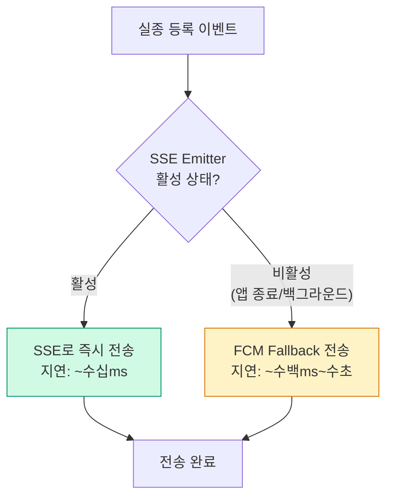

---

## 위치 기반 5km 반경 필터링 설계

실종자가 등록되면, 서버는 현재 접속 중인 사용자의 위치 데이터를 기반으로 **반경 5km 이내의 사용자만 필터링**해 알림을 보냅니다. 5km라는 기준은 경찰청의 실종자 초동 대응 매뉴얼에서 **골든타임(실종 후 4시간) 동안 도보 이동 가능 범위**를 참고해 설정했습니다.

### Haversine 공식의 수학적 배경

지구 표면의 두 지점 사이 거리를 계산하는 가장 보편적인 공식이 **Haversine 공식**입니다. 지구를 완전한 구(sphere)로 가정하고, 두 지점의 위도와 경도를 입력받아 대원 거리(great-circle distance)를 계산합니다.

**수학적 정의**:

```
주어진 두 지점:
  지점 A: (φ₁, λ₁) — 위도, 경도 (라디안)
  지점 B: (φ₂, λ₂) — 위도, 경도 (라디안)

Haversine 공식:
  a = sin²((φ₂ - φ₁) / 2) + cos(φ₁) · cos(φ₂) · sin²((λ₂ - λ₁) / 2)
  c = 2 · atan2(√a, √(1 - a))
  d = R · c

  여기서:
  - R = 지구 반지름 ≈ 6,371 km
  - d = 두 지점 사이의 대원 거리 (km)
  - φ = 위도 (latitude), λ = 경도 (longitude)
```

**왜 Haversine인가**: 단순히 위도/경도 차이에 km 환산 계수를 곱하는 방식(Equirectangular Approximation)은 적도 부근에서만 정확합니다. 위도가 높아질수록 경도 1도에 해당하는 거리가 줄어들기 때문입니다. 서울(위도 37.5도)에서 경도 1도는 약 88.7km이지만, 적도에서는 약 111.3km입니다. Haversine은 이 차이를 정확히 보정합니다.

**오차 범위**: 지구를 완전한 구로 가정하므로 실제 타원체(WGS-84)와의 오차가 최대 약 0.3% 발생합니다. 5km 반경에서 0.3%는 약 15m이므로, 실종자 알림 서비스의 목적에서는 무시할 수 있는 수준입니다.

#### Haversine vs Vincenty 공식 비교

Haversine보다 정밀한 **Vincenty 공식**은 지구를 타원체(WGS-84)로 모델링합니다.

| 항목 | Haversine | Vincenty |
|------|-----------|---------|
| **지구 모델** | 완전한 구 (반지름 6,371km) | 타원체 (장반경 6,378.137km, 단반경 6,356.752km) |
| **오차** | 최대 0.3% (~15m/5km) | 0.5mm 이하 |
| **연산 비용** | sin/cos/atan2 각 수회 | **반복 수렴 알고리즘** (평균 3~5회 반복) |
| **단일 계산 시간** | ~50ns | ~200ns |
| **적합한 용도** | 5km 이하 근거리, 대량 필터링 | 대륙 횡단 측량, 항법 시스템 |

5km 반경 필터링에서 15m 오차는 GPS 자체의 오차(평균 10~15m)보다 크지 않습니다. Vincenty의 정밀도가 필요 없으므로 Haversine이 합리적인 선택이었습니다.

### Bounding Box 사전 필터링 최적화

Haversine 공식은 삼각함수 연산(sin, cos, atan2, sqrt)을 포함하므로, 접속 중인 모든 사용자에 대해 계산하면 비용이 큽니다.

```
Haversine 연산 1건의 비용:
  - sin() 4회, cos() 2회, atan2() 1회, sqrt() 2회
  - FPU 연산 총 약 9회

동시 접속 10,000명에 대해 전부 계산:
  - 9 × 10,000 = 90,000회의 부동소수점 연산
```

**Bounding Box 사전 필터링**은 비싼 Haversine 계산 전에 단순한 사각형 범위 비교로 후보를 대폭 줄이는 최적화 기법입니다.

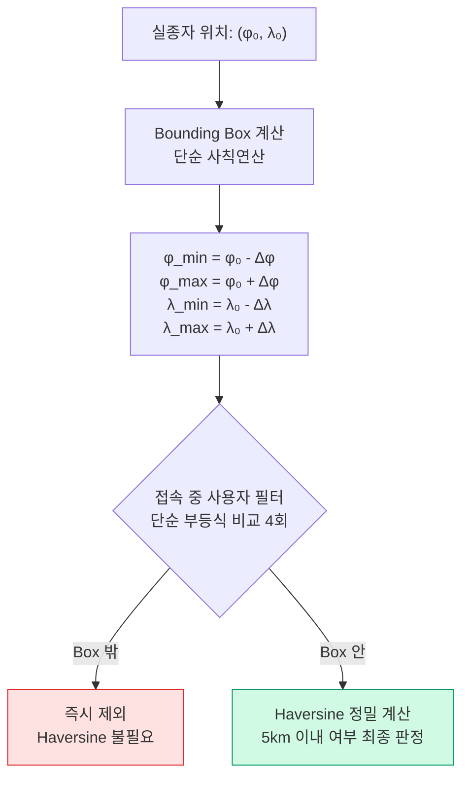

**Bounding Box 크기 계산**:

```
반경 r = 5 km, 지구 반지름 R = 6,371 km

위도 변화량:
  Δφ = r / R = 5 / 6,371 ≈ 0.000785 rad ≈ 0.04496°

경도 변화량 (위도에 따라 다름):
  Δλ = r / (R · cos(φ₀))

서울 기준 (φ₀ = 37.5°):
  Δλ = 5 / (6,371 × cos(37.5°)) ≈ 5 / 5,055 ≈ 0.000989 rad ≈ 0.05666°

Bounding Box:
  위도: 37.5° ± 0.045° → [37.455°, 37.545°]
  경도: 126.978° ± 0.057° → [126.921°, 127.035°]
```

**필터링 효과 추정**:

```
서울 전체 면적: ~605 km²
Bounding Box 면적: (2 × 5km) × (2 × 5km) = 100 km²
실제 원 면적: π × 5² ≈ 78.5 km²

서울 전체에 10,000명이 균등 분포한다고 가정:
  - Bounding Box 통과: 10,000 × (100 / 605) ≈ 1,653명
  - 이 중 실제 5km 이내: 10,000 × (78.5 / 605) ≈ 1,298명

  → Bounding Box로 10,000명 → 1,653명으로 축소 (약 83% 제외)
  → Haversine은 1,653명에 대해서만 계산
  → 전체 Haversine 연산: 90,000 → 14,877로 약 83% 감소
```

Bounding Box 비교는 단순 부등식 4회(`φ_min ≤ φ ≤ φ_max`, `λ_min ≤ λ ≤ λ_max`)이므로 Haversine의 삼각함수 9회 대비 연산 비용이 무시할 수 있는 수준입니다.

### 전체 필터링 흐름

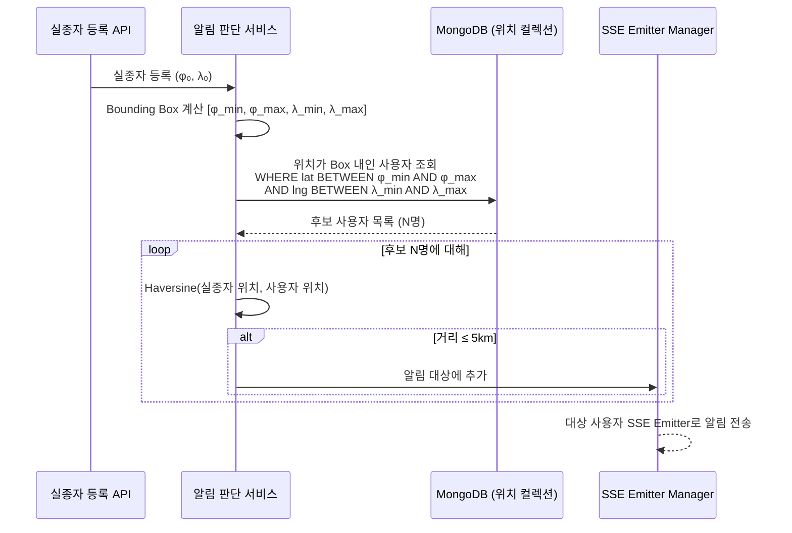

---

## MongoDB 2dsphere 인덱스 심층 분석

설계 회고에서도 언급하겠지만, Bounding Box + Haversine을 애플리케이션 레벨에서 구현한 것은 MongoDB의 **2dsphere 인덱스**를 충분히 검토하지 못한 결과입니다. 여기서는 2dsphere 인덱스의 내부 동작을 분석하고, 두 접근법의 트레이드오프를 정리합니다.

### S2 Geometry 기반 공간 분할

MongoDB의 2dsphere 인덱스는 Google의 **S2 Geometry Library**를 기반으로 동작합니다. S2는 지구 표면을 **셀(Cell)** 단위로 분할하는 계층적 공간 인덱싱 시스템입니다.

```
S2 셀 계층 구조:
  Level 0: 지구를 6개의 정사각형 면으로 분할 (정육면체 투영)
  Level 1: 각 면을 4등분 → 24개 셀
  Level 2: 다시 4등분 → 96개 셀
  ...
  Level 30: 약 6×10^18개 셀 (셀 크기 ≈ 1cm²)

  각 셀에는 64비트 정수 ID가 부여됨 (Hilbert 곡선 기반)
  → 공간적으로 가까운 점이 ID 공간에서도 가까움
  → B-Tree 인덱스로 효율적인 범위 탐색 가능
```

### $nearSphere 쿼리 동작 원리

```javascript
// $nearSphere로 5km 이내 사용자 조회
db.user_location.find({
  location: {
    $nearSphere: {
      $geometry: {
        type: "Point",
        coordinates: [126.978, 37.5665]  // 실종자 위치
      },
      $maxDistance: 5000  // 5km (미터 단위)
    }
  }
})
```

이 쿼리의 내부 실행 과정:

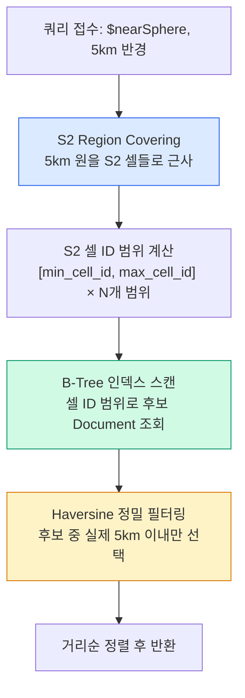

핵심은 **S2 Region Covering**입니다. 원형 반경을 S2 셀들로 덮은 뒤, 해당 셀 ID 범위를 B-Tree 인덱스로 스캔합니다. 이후 정밀 필터링에 Haversine을 적용하므로, 우리가 애플리케이션 레벨에서 했던 것과 **동일한 2단계 필터링(Bounding → 정밀)**이 DB 내부에서 일어납니다.

### 애플리케이션 레벨 vs DB 레벨 필터링 비교

| 항목 | 앱 레벨 (현재 구현) | DB 레벨 ($nearSphere) |
|------|-------------------|----------------------|
| **1단계 필터링** | Bounding Box (사칙연산 4회) | S2 Region Covering (셀 ID 범위) |
| **2단계 필터링** | Haversine (삼각함수 9회) | Haversine (동일) |
| **데이터 전송** | MongoDB → 앱: Box 내 전체 Document | MongoDB 내부 처리, 결과만 반환 |
| **네트워크 비용** | Box 내 1,653명의 Document 전체 전송 | 5km 이내 1,298명의 결과만 전송 |
| **인덱스 활용** | `userId + timestamp` 복합 인덱스 | 2dsphere 전용 공간 인덱스 |
| **코드 복잡도** | Bounding Box 계산 + Haversine 직접 구현 | 쿼리 한 줄 |
| **거리순 정렬** | 직접 구현 필요 | 기본 제공 |

**네트워크 비용 정량 비교**:

```
앱 레벨 방식:
  - Bounding Box 내 사용자: ~1,653명
  - Document 1건: ~200 bytes
  - 전송량: 1,653 × 200 = ~323 KB
  - 이 중 5km 밖인 355명(1,653 - 1,298)의 데이터는 불필요

DB 레벨 방식:
  - 5km 이내 사용자만 반환: ~1,298명
  - Document 1건: ~200 bytes
  - 전송량: 1,298 × 200 = ~254 KB
  - 불필요한 전송 없음

  → 네트워크 절감: ~69 KB (약 21%)
```

설계 당시 $nearSphere를 활용했다면 코드가 더 단순해지고, 불필요한 데이터 전송도 줄일 수 있었습니다.

---

## Multi DB 설계: MongoDB + MySQL 분리

### 왜 단일 DB로 해결하지 않았는가

Reconnect에서 다루는 데이터는 크게 두 가지 성격으로 나뉩니다.

| 데이터 성격 | 예시 | 쓰기 빈도 | 읽기 패턴 | 정합성 요구 |
|-----------|------|---------|---------|-----------|
| **구조적, 정합성 중요** | 실종자 정보, 신고 내역, 사용자 계정 | 낮음 (일 수십 건) | JOIN 다수, 복잡 조건 | ACID 트랜잭션 필수 |
| **비정형, 실시간, 대량** | 위치 로그, 알림 이력, 접속 로그 | 매우 높음 (초당 수백 건) | 최신 데이터 단건 조회 | 최종 일관성으로 충분 |

#### MySQL 단독 사용 시의 문제

```
위치 로그 쓰기 부하 추정:
  - 동시 접속 1,000명 × 5초 간격 = 200 writes/s
  - 동시 접속 10,000명 기준 = 2,000 writes/s

InnoDB 쓰기 경로:
  요청 → Buffer Pool → Redo Log (fsync) → Binlog → Undo Log → MVCC 버전 관리

  위치 로그는:
  - FK 참조 무결성 불필요 (위치 데이터는 독립적)
  - 트랜잭션 격리 불필요 (동시에 같은 사용자의 위치를 수정할 일 없음)
  - MVCC 스냅샷 불필요 (최신 위치만 의미)

  → InnoDB의 Redo Log, Undo Log, MVCC 비용이 전부 불필요한 오버헤드
```

또한 위치 로그의 대량 쓰기가 Core 데이터(실종자 정보, 신고 내역)의 읽기 성능에 영향을 줄 수 있습니다. InnoDB의 Buffer Pool은 공유 자원이므로, 위치 로그의 dirty page가 실종자 정보의 캐시 페이지를 밀어낼 수 있습니다.

#### MongoDB 단독 사용 시의 문제

```
실종자-신고-사용자 간의 참조 관계:

  실종자 등록 → 신고 접수 → 실종자 상태 변경 (수색 중 → 발견)

이 과정에서 필요한 보장:
  1. 신고가 존재하는 실종자에 대해서만 접수되어야 함 (참조 무결성)
  2. 실종자 상태 변경과 신고 내역 갱신이 원자적이어야 함 (트랜잭션)
  3. 실종자 목록을 신고 건수, 상태별로 복합 조회해야 함 (JOIN)

MongoDB 4.0부터 다중 Document 트랜잭션을 지원하지만:
  - 성능 패널티가 큼 (WiredTiger의 낙관적 동시성 제어 → 충돌 시 재시도)
  - 컬렉션 간 JOIN 미지원 ($lookup은 LEFT OUTER JOIN만, 성능 제한적)
  - 참조 무결성 미지원 (FK 제약 조건 없음)
```

### InnoDB vs WiredTiger: 스토리지 엔진 관점의 분리 근거

MySQL(Core)과 MongoDB(Log)의 분리가 단순히 기능적 차이가 아니라, **스토리지 엔진 레벨에서의 설계 철학 차이**에 근거한다는 점을 깊이 분석합니다.

#### InnoDB (MySQL) — ACID 최적화

```
InnoDB 쓰기 경로:
  요청 → Buffer Pool (메모리)
       → Redo Log (WAL, fsync로 디스크 영속화)
       → Undo Log (MVCC 이전 버전 저장)
       → Binlog (복제용)
       → Background: Dirty Page Flush → Tablespace

각 단계의 목적:
  - Buffer Pool: 디스크 I/O 최소화 (읽기/쓰기 캐시)
  - Redo Log: 크래시 복구 보장 (Write-Ahead Logging)
  - Undo Log: 트랜잭션 롤백 + MVCC 스냅샷 읽기
  - Binlog: 주-복제 서버 간 데이터 동기화
```

이 구조는 **데이터 유실을 절대 허용하지 않는** 시나리오에 최적화되어 있습니다. 실종자 정보, 신고 내역처럼 한 건도 유실되면 안 되는 Core 데이터에 적합합니다.

#### WiredTiger (MongoDB) — 고속 쓰기 최적화

```
WiredTiger 쓰기 경로:
  요청 → 인메모리 B-Tree (WT Cache)
       → Journal (WAL, 기본 100ms 간격 fsync)
       → Background: Checkpoint (60초 간격, 스냅샷 → 디스크)

InnoDB와의 핵심 차이:
  - Document 단위 동시성 제어 (행 단위 Lock이 아닌 낙관적 제어)
  - 압축 지원 (Snappy, Zlib, Zstd) → 디스크 I/O 감소
  - Journal fsync 간격이 100ms (InnoDB는 매 커밋마다)
  → 쓰기 처리량이 높지만, 100ms 데이터 유실 가능성 존재
```

**Write Concern 선택**: 위치 로그처럼 유실 허용 가능한 데이터에는 `w:1`(Primary 확인만)을 사용합니다.

| Write Concern | 동작 | Latency | 데이터 안전성 | Reconnect 적용 |
|---------------|------|---------|-------------|---------------|
| `w:0` | 확인 없이 즉시 반환 | ~0.1ms | 유실 가능 | 위치 로그에도 과도 |
| **`w:1`** | Primary 메모리 기록 확인 | ~1ms | Journal 미반영 시 유실 가능 | **위치 로그에 적합** |
| `w:majority` | 과반수 노드 기록 확인 | ~5~50ms | 높음 | 알림 이력에 적합 |
| `w:1, j:true` | Primary Journal 반영 확인 | ~5ms | 높음 | Core 데이터 수준 필요 시 |

### DB 분리 기준과 데이터 흐름

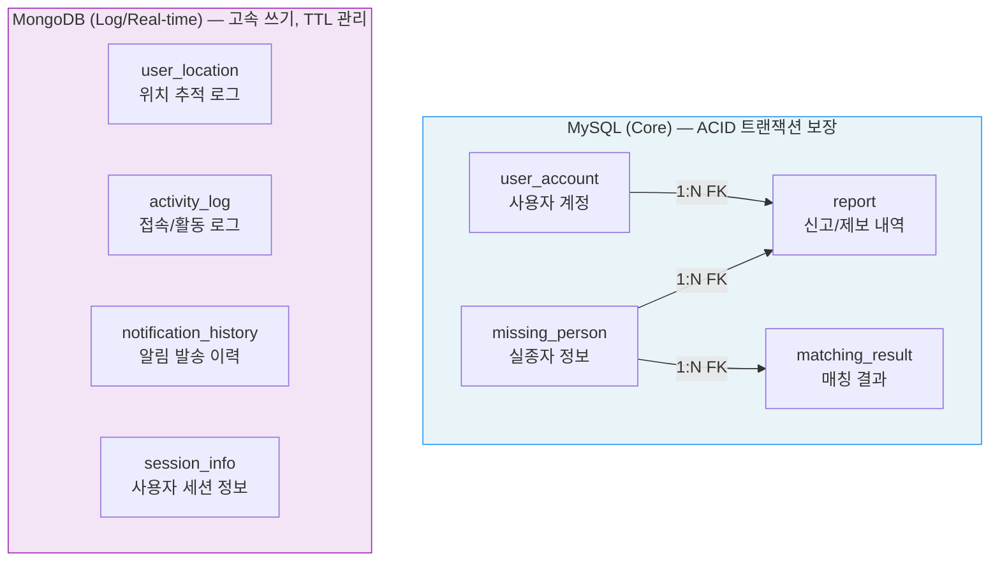

**분리 기준의 판단 흐름**:

```
데이터를 저장할 DB를 선택할 때 적용한 질문 순서:

Q1. 다른 테이블과 FK 참조 관계가 필요한가?
    → Yes: MySQL
    → No: Q2로

Q2. 다중 엔티티 간 트랜잭션 보장이 필요한가?
    → Yes: MySQL
    → No: Q3로

Q3. 쓰기 빈도가 초당 수십 건 이상인가?
    → Yes: MongoDB
    → No: Q4로

Q4. 스키마가 자주 변할 수 있는가?
    → Yes: MongoDB
    → No: 기본적으로 MySQL
```

### 실제 스키마 설계

#### MySQL — Core 테이블

```sql
CREATE TABLE user_account (
    user_id         BIGINT          AUTO_INCREMENT PRIMARY KEY,
    login_id        VARCHAR(50)     NOT NULL UNIQUE,
    password_hash   VARCHAR(255)    NOT NULL,
    nickname        VARCHAR(30)     NOT NULL,
    phone           VARCHAR(20),
    created_at      DATETIME        NOT NULL DEFAULT CURRENT_TIMESTAMP,
    updated_at      DATETIME        NOT NULL DEFAULT CURRENT_TIMESTAMP ON UPDATE CURRENT_TIMESTAMP,
    status          ENUM('ACTIVE', 'INACTIVE', 'BANNED') NOT NULL DEFAULT 'ACTIVE',
    INDEX idx_status (status)
) ENGINE=InnoDB DEFAULT CHARSET=utf8mb4;

CREATE TABLE missing_person (
    missing_id      BIGINT          AUTO_INCREMENT PRIMARY KEY,
    reporter_id     BIGINT          NOT NULL,
    name            VARCHAR(50)     NOT NULL,
    age             INT,
    gender          ENUM('M', 'F', 'UNKNOWN') NOT NULL DEFAULT 'UNKNOWN',
    description     TEXT            NOT NULL COMMENT '인상착의',
    photo_url       VARCHAR(500),
    missing_lat     DECIMAL(10, 7)  NOT NULL COMMENT '실종 위치 위도',
    missing_lng     DECIMAL(10, 7)  NOT NULL COMMENT '실종 위치 경도',
    missing_address VARCHAR(200),
    status          ENUM('SEARCHING', 'FOUND', 'CLOSED') NOT NULL DEFAULT 'SEARCHING',
    missing_at      DATETIME        NOT NULL COMMENT '실종 시각',
    created_at      DATETIME        NOT NULL DEFAULT CURRENT_TIMESTAMP,
    updated_at      DATETIME        NOT NULL DEFAULT CURRENT_TIMESTAMP ON UPDATE CURRENT_TIMESTAMP,
    FOREIGN KEY (reporter_id) REFERENCES user_account(user_id),
    INDEX idx_status_created (status, created_at),
    INDEX idx_location (missing_lat, missing_lng)
) ENGINE=InnoDB DEFAULT CHARSET=utf8mb4;

CREATE TABLE report (
    report_id       BIGINT          AUTO_INCREMENT PRIMARY KEY,
    missing_id      BIGINT          NOT NULL,
    reporter_id     BIGINT          NOT NULL,
    content         TEXT            NOT NULL COMMENT '제보 내용',
    photo_url       VARCHAR(500),
    report_lat      DECIMAL(10, 7)  COMMENT '제보 위치 위도',
    report_lng      DECIMAL(10, 7)  COMMENT '제보 위치 경도',
    report_address  VARCHAR(200),
    created_at      DATETIME        NOT NULL DEFAULT CURRENT_TIMESTAMP,
    FOREIGN KEY (missing_id) REFERENCES missing_person(missing_id),
    FOREIGN KEY (reporter_id) REFERENCES user_account(user_id),
    INDEX idx_missing_id (missing_id)
) ENGINE=InnoDB DEFAULT CHARSET=utf8mb4;

CREATE TABLE matching_result (
    matching_id     BIGINT          AUTO_INCREMENT PRIMARY KEY,
    missing_id      BIGINT          NOT NULL,
    report_id       BIGINT          NOT NULL,
    similarity      DECIMAL(5, 2)   COMMENT '유사도 점수',
    status          ENUM('PENDING', 'CONFIRMED', 'REJECTED') NOT NULL DEFAULT 'PENDING',
    created_at      DATETIME        NOT NULL DEFAULT CURRENT_TIMESTAMP,
    FOREIGN KEY (missing_id) REFERENCES missing_person(missing_id),
    FOREIGN KEY (report_id) REFERENCES report(report_id)
) ENGINE=InnoDB DEFAULT CHARSET=utf8mb4;
```

**설계 포인트**:
- `missing_person.missing_lat/lng`에 `DECIMAL(10, 7)` 사용: 소수점 7자리는 약 1.1cm 정밀도이며, GPS 좌표 저장에 충분
- `idx_location` 인덱스: Bounding Box 쿼리 시 위도/경도 범위 검색에 활용
- `status` 컬럼에 ENUM 사용: 상태 전이(SEARCHING → FOUND → CLOSED)가 명확하고, 잘못된 값 삽입 방지

#### MongoDB — Log/Real-time Document

```javascript
// user_location 컬렉션 — 위치 추적 로그
{
    _id: ObjectId("..."),
    userId: "user_123",
    location: {
        type: "Point",
        coordinates: [126.9780, 37.5665]   // [lng, lat] — GeoJSON 표준
    },
    accuracy: 15.2,                         // GPS 정확도 (미터)
    source: "GPS",                          // GPS | NETWORK | FUSED
    timestamp: ISODate("2026-03-04T10:30:00Z"),
    createdAt: ISODate("2026-03-04T10:30:00Z")  // TTL 기준 필드
}

// 인덱스 설계
db.user_location.createIndex({ userId: 1, timestamp: -1 })      // 사용자별 최신 위치 조회
db.user_location.createIndex({ "location": "2dsphere" })         // 지리 공간 쿼리
db.user_location.createIndex({ createdAt: 1 }, { expireAfterSeconds: 3600 })  // TTL: 1시간

// notification_history 컬렉션 — 알림 발송 이력
{
    _id: ObjectId("..."),
    missingId: 42,                          // MySQL missing_person.missing_id 참조 (논리적)
    targetUserId: "user_456",
    channel: "SSE",                         // SSE | FCM
    status: "DELIVERED",                    // SENT | DELIVERED | FAILED
    sentAt: ISODate("2026-03-04T10:31:00Z"),
    deliveredAt: ISODate("2026-03-04T10:31:05Z"),
    payload: {
        missingName: "...",
        distance: 2.3                       // km
    },
    createdAt: ISODate("2026-03-04T10:31:00Z")
}

// 인덱스 설계
db.notification_history.createIndex({ missingId: 1 })             // 실종자별 알림 이력
db.notification_history.createIndex({ targetUserId: 1, sentAt: -1 })
db.notification_history.createIndex({ createdAt: 1 }, { expireAfterSeconds: 2592000 })  // TTL: 30일

// activity_log 컬렉션 — 접속/활동 로그
{
    _id: ObjectId("..."),
    userId: "user_123",
    action: "APP_OPEN",                     // APP_OPEN | SSE_CONNECT | WS_CONNECT | SEARCH | REPORT
    metadata: {
        appVersion: "1.2.0",
        os: "Android 14",
        deviceModel: "Pixel 8"
    },
    timestamp: ISODate("2026-03-04T10:00:00Z"),
    createdAt: ISODate("2026-03-04T10:00:00Z")
}

db.activity_log.createIndex({ userId: 1, timestamp: -1 })
db.activity_log.createIndex({ createdAt: 1 }, { expireAfterSeconds: 7776000 })  // TTL: 90일
```

### TTL 전략: 데이터 수명 설계

위치 로그는 모든 데이터를 영구 보관할 필요가 없습니다. 각 컬렉션의 데이터 특성에 따라 TTL을 차등 적용했습니다.

| 컬렉션 | TTL | 근거 |
|--------|-----|------|
| `user_location` | **1시간** | 알림 판단에 필요한 것은 현재 위치뿐. 1시간 이전 위치는 이미 의미 없음 |
| `notification_history` | **30일** | 알림 전달 성공률 분석, 월간 통계에 활용. 30일 이후에는 집계 결과만 보관 |
| `activity_log` | **90일** | 사용자 행동 분석, 분기별 리포트에 활용 |

**TTL 인덱스의 WiredTiger 내부 동작**:

```
MongoDB TTL 인덱스:
  - 백그라운드 스레드(TTL Monitor)가 60초 간격으로 만료 Document를 스캔
  - 만료 기준: 지정 필드의 ISODate 값 + expireAfterSeconds < 현재 시각
  - 삭제는 비동기이므로 만료 직후 즉시 삭제되지는 않음 (최대 60초 지연)

WiredTiger에서의 삭제 과정:
  1. TTL Monitor가 만료 Document 식별
  2. Document에 삭제 마커(tombstone) 기록
  3. 다음 Checkpoint(60초 간격)에서 물리적 삭제
  4. 삭제된 공간은 즉시 OS에 반환되지 않음 (WiredTiger 내부 재사용)

  → 대량 TTL 만료 시 일시적으로 디스크 사용량이 줄어들지 않을 수 있음
  → db.collection.stats()의 storageSize와 실제 데이터 크기에 차이 발생 가능
  → compact 명령으로 수동 디스크 회수 가능 (운영 시 주의)

  → 별도의 배치 삭제 작업 없이 MongoDB가 자동으로 오래된 데이터를 정리
```

**디스크 사용량 추정**:

```
user_location 컬렉션:
  - Document 1건 크기: ~200 bytes (BSON 인코딩 포함)
  - 동시 접속 1,000명 × 5초 간격 × 3,600초(1시간) = 720,000건
  - 디스크: 720,000 × 200 = ~137 MB

  → TTL 1시간이므로 최대 ~137 MB만 유지
  → 동시 접속 10,000명이어도 ~1.37 GB

notification_history 컬렉션:
  - Document 1건 크기: ~400 bytes
  - 하루 10건 알림 × 평균 500명 수신 × 30일 = 150,000건
  - 디스크: 150,000 × 400 = ~57 MB

  → 30일 TTL로 최대 ~57 MB만 유지
```

### 트랜잭션 경계 설계

Multi DB 환경에서 가장 까다로운 문제는 **두 DB에 걸친 트랜잭션**입니다. Reconnect에서 이 문제가 발생하는 시나리오와 해결 방식을 정리합니다.

**시나리오: 실종자 등록 + 알림 발송 이력 저장**

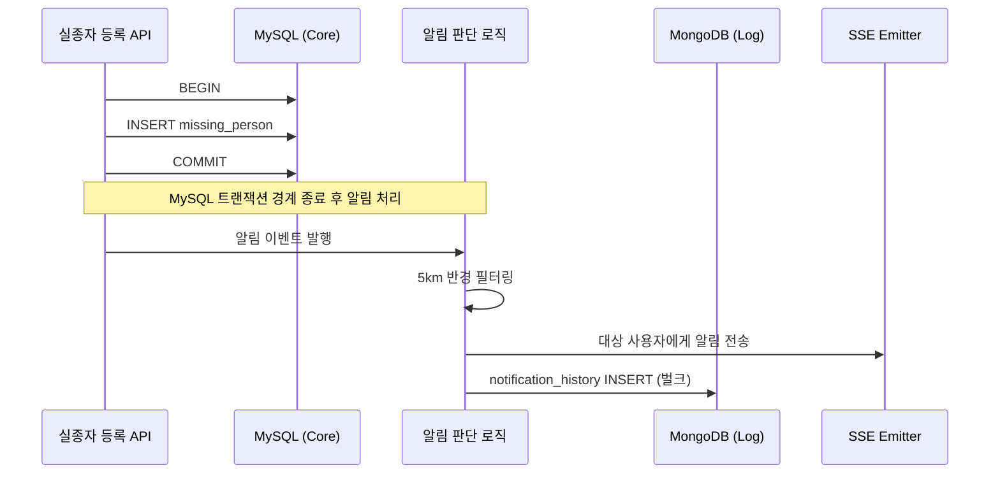

**설계 원칙: 분산 트랜잭션을 사용하지 않는다.**

MySQL의 실종자 등록과 MongoDB의 알림 이력 저장을 하나의 트랜잭션으로 묶으려면 2PC(Two-Phase Commit)나 Saga 패턴이 필요합니다. 하지만 이 두 작업의 중요도가 다릅니다.

- **실종자 등록**: 반드시 성공해야 하고, 실패 시 롤백되어야 함 → **ACID 필수**
- **알림 이력 저장**: 실종자 등록이 성공한 후의 부가 작업. 실패해도 알림 자체는 이미 전송됨 → **최종 일관성으로 충분**

따라서 MySQL 트랜잭션이 커밋된 후에 알림 처리와 MongoDB 저장을 수행하는 **이벤트 기반 비동기 처리** 구조를 채택했습니다. MongoDB 저장이 실패하면 재시도 큐에 넣고, 일정 횟수 실패 시 로그로 남겨 수동 대응합니다.

### 분산 트랜잭션 회피 패턴 비교

검토한 세 가지 패턴을 비교합니다.

| 패턴 | 원리 | 일관성 보장 | 복잡도 | Reconnect 적합성 |
|------|------|-----------|--------|-----------------|
| **2PC (Two-Phase Commit)** | 코디네이터가 prepare → commit/rollback | 강한 일관성 | 매우 높음 | 과잉 — 알림 이력은 최종 일관성으로 충분 |
| **Saga 패턴** | 각 단계를 로컬 트랜잭션으로 실행, 실패 시 보상 트랜잭션 | 최종 일관성 | 높음 | 보상 트랜잭션 정의가 불필요 (알림은 취소 불가) |
| **이벤트 기반 비동기** | 핵심 트랜잭션 커밋 후 이벤트 발행 | 최종 일관성 | **낮음** | **선택** — 가장 단순하고 요구에 부합 |

#### Spring @TransactionalEventListener 활용

```java
@Service
@RequiredArgsConstructor
public class MissingPersonService {

    private final MissingPersonRepository missingPersonRepository;
    private final ApplicationEventPublisher eventPublisher;

    @Transactional
    public MissingPerson register(MissingPersonRequest request) {
        // 1. MySQL 트랜잭션 내에서 실종자 정보 저장
        MissingPerson missingPerson = MissingPerson.from(request);
        missingPersonRepository.save(missingPerson);

        // 2. 이벤트 발행 (아직 처리되지 않음)
        eventPublisher.publishEvent(new MissingPersonRegisteredEvent(missingPerson));

        return missingPerson;
        // 3. 트랜잭션 커밋 → 이벤트 리스너 실행
    }
}

@Component
@RequiredArgsConstructor
public class MissingAlertEventHandler {

    private final AlertService alertService;
    private final NotificationHistoryRepository notificationHistoryRepo;

    /**
     * AFTER_COMMIT: MySQL 트랜잭션이 성공적으로 커밋된 후에만 실행
     * → 실종자 등록이 롤백되었는데 알림이 나가는 상황 방지
     */
    @TransactionalEventListener(phase = TransactionPhase.AFTER_COMMIT)
    @Async  // 별도 스레드에서 비동기 실행
    public void handleMissingAlert(MissingPersonRegisteredEvent event) {
        MissingPerson person = event.getMissingPerson();

        // 4. 반경 5km 사용자 필터링 + SSE 알림 전송
        Set<Long> targetUserIds = alertService.findUsersInRadius(
            person.getMissingLat(), person.getMissingLng(), 5.0);
        alertService.broadcastAlert(targetUserIds, person);

        // 5. MongoDB에 알림 이력 저장 (실패 시 재시도)
        try {
            notificationHistoryRepo.saveAll(
                targetUserIds.stream()
                    .map(userId -> NotificationHistory.of(person, userId))
                    .toList());
        } catch (Exception e) {
            // MongoDB 저장 실패 → 로그 + 재시도 큐
            log.error("알림 이력 저장 실패, 재시도 예정: missingId={}", person.getMissingId(), e);
        }
    }
}
```

`AFTER_COMMIT`이 핵심입니다. 이 설정이 없으면 트랜잭션이 아직 커밋되지 않은 상태에서 이벤트가 실행되어, 롤백 시 실종자는 저장되지 않았는데 알림은 이미 전송된 상황이 발생합니다.

#### Outbox 패턴과의 비교

더 강한 전달 보장이 필요하면 **Outbox 패턴**을 고려할 수 있습니다.

```
이벤트 기반 비동기 (현재):
  MySQL COMMIT → @TransactionalEventListener → 알림 + MongoDB
  ⚠️ 알림 전송 도중 서버 크래시 시 이벤트 유실

Outbox 패턴:
  MySQL COMMIT (실종자 + outbox 테이블에 이벤트 저장)
  → 별도 Poller가 outbox에서 미처리 이벤트 조회 → 알림 + MongoDB
  → 처리 완료 후 outbox 레코드 삭제(또는 상태 변경)
  ✅ 서버 크래시 후에도 outbox에서 미처리 이벤트를 재발견

하지만 Reconnect에서 Outbox가 과잉인 이유:
  - 실종 알림은 하루 수 건 수준 (유실 확률 극히 낮음)
  - 서버 크래시 후 재기동 시 SSE 재연결로 놓친 알림 조회 가능
  - Outbox 테이블 + Poller 구현/운영 비용이 이점 대비 과다
```

---

## 클라이언트 비동기 처리 설계

Android 클라이언트는 **Kotlin Coroutine**을 활용해 WebSocket 위치 전송과 SSE 알림 수신을 비동기로 병렬 처리하도록 설계했습니다.

### SupervisorJob 기반 구조

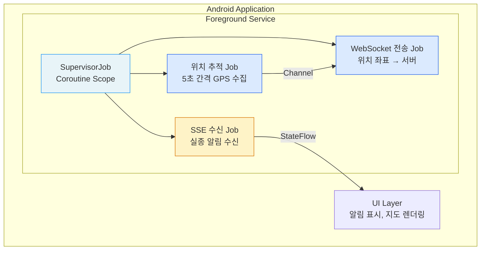

### CoroutineContext 구성 요소

코루틴의 동작을 결정하는 **CoroutineContext**는 네 가지 핵심 요소로 구성됩니다.

| 요소 | 역할 | Reconnect에서의 설정 |
|------|------|---------------------|
| **Job** | 코루틴의 생명주기 관리, 부모-자식 계층 | SupervisorJob (실패 격리) |
| **CoroutineDispatcher** | 어떤 스레드에서 실행할지 결정 | Dispatchers.IO (네트워크/DB I/O) |
| **CoroutineExceptionHandler** | 미처리 예외 처리 | 로그 기록 + 재연결 로직 |
| **CoroutineName** | 디버깅용 이름 | 각 Job별 명명 |

```kotlin
// Reconnect의 Coroutine Scope 설정
private val scope = CoroutineScope(
    SupervisorJob() +
    Dispatchers.IO +
    CoroutineExceptionHandler { _, throwable ->
        Log.e("ReconnectService", "Coroutine 예외", throwable)
    } +
    CoroutineName("ReconnectScope")
)
```

#### Dispatcher 선택 기준

| Dispatcher | 스레드 풀 크기 | 최적화 대상 | Reconnect 사용처 |
|-----------|--------------|-----------|-----------------|
| **Dispatchers.Main** | UI 스레드 1개 | UI 업데이트 | 알림 표시, 지도 렌더링 |
| **Dispatchers.IO** | 최대 64개 (기본) | 네트워크/파일/DB I/O | WebSocket 전송, SSE 수신 |
| **Dispatchers.Default** | CPU 코어 수 | CPU 집약 연산 | Haversine 계산 (서버 측) |

### 왜 SupervisorJob인가

일반 `Job`을 사용하면 자식 코루틴 하나가 실패할 때 **부모와 모든 형제 코루틴이 함께 취소**됩니다. 이것이 코루틴의 기본 동작인 **구조적 동시성(Structured Concurrency)** 입니다.

```
일반 Job의 실패 전파:

  Job (Parent)
  ├── WebSocket Job — 네트워크 오류로 실패
  ├── SSE Job      — 정상 동작 중이었으나 함께 취소됨!
  └── 위치 추적 Job  — 정상 동작 중이었으나 함께 취소됨!

SupervisorJob의 실패 격리:

  SupervisorJob (Parent)
  ├── WebSocket Job — 네트워크 오류로 실패 → 자체 재시도
  ├── SSE Job      — 영향 없음, 계속 동작
  └── 위치 추적 Job  — 영향 없음, 계속 동작
```

Reconnect에서 이 격리가 중요한 이유는 명확합니다. GPS 정확도가 떨어지거나 네트워크가 불안정해 WebSocket 전송이 실패하더라도, **SSE를 통한 실종 알림 수신은 계속 동작해야** 합니다.

#### 예외 전파 메커니즘의 차이

```
일반 Job에서의 예외 전파:
  1. 자식 코루틴에서 Exception 발생
  2. 자식 → 부모로 Exception 전파
  3. 부모가 모든 자식에게 CancellationException 전파 (취소)
  4. 부모 자신도 취소됨

SupervisorJob에서의 예외 처리:
  1. 자식 코루틴에서 Exception 발생
  2. 자식의 Exception은 부모로 전파되지 않음
  3. CoroutineExceptionHandler가 처리 (설정된 경우)
  4. 다른 자식 코루틴에 영향 없음

  ⚠️ 단, CancellationException은 두 경우 모두 부모로 전파되지 않음
     (코루틴 스펙상 취소는 정상 흐름으로 간주)
```

이 차이가 실제 장애 시나리오에서 어떻게 동작하는지:

```kotlin
// WebSocket 전송 실패 시 재연결 로직
scope.launch(CoroutineName("WebSocketJob")) {
    while (isActive) {  // 취소되지 않는 한 계속
        try {
            websocketSession.send(locationData)
            delay(5000)  // 5초 간격
        } catch (e: Exception) {
            if (e is CancellationException) throw e  // 취소는 재전파
            Log.w("WS", "전송 실패, 3초 후 재시도", e)
            delay(3000)  // 재시도 대기
            reconnectWebSocket()  // 재연결
        }
    }
}

// SSE 수신 — WebSocket 실패와 무관하게 동작
scope.launch(CoroutineName("SSEJob")) {
    while (isActive) {
        try {
            sseClient.connect("/api/subscribe")
                .collect { event -> handleAlert(event) }
        } catch (e: Exception) {
            if (e is CancellationException) throw e
            Log.w("SSE", "연결 끊김, 재연결", e)
            delay(3000)
        }
    }
}
```

### 포그라운드/백그라운드 생명주기 관리

| 상태 | 위치 추적 Job | WebSocket Job | SSE Job |
|------|-------------|---------------|---------|
| **포그라운드** | 활성 (5초 간격) | 활성 | 활성 |
| **백그라운드** | **비활성** (배터리 절약) | **비활성** | **활성** (Foreground Service) |
| **앱 종료** | 비활성 | 비활성 | 비활성 (FCM fallback 필요) |

Android에서 백그라운드 SSE 수신을 유지하기 위해 **Foreground Service**를 사용합니다. Foreground Service는 상태바에 알림을 표시하는 대신, 시스템에 의해 강제 종료되지 않는 보장을 받습니다.

---

## 스케일아웃 시 고려 사항

초기 버전은 단일 인스턴스로 설계했지만, 사용자 수가 증가하면 서버를 수평 확장해야 합니다. 이때 발생하는 문제와 해결 방안을 설계 단계에서 검토해 두었습니다.

### 문제 1: SSE Emitter의 인스턴스 국소성

SSE Emitter는 **HTTP 연결 위에서 동작하는 서버 측 객체**입니다. 사용자 A가 서버 인스턴스 1에 연결되어 있으면, A의 SSE Emitter는 인스턴스 1의 메모리에만 존재합니다.

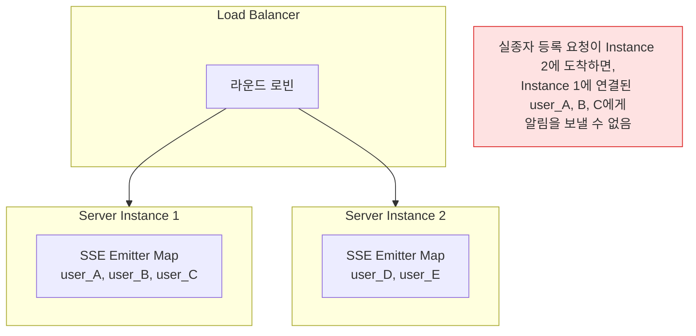

### 해결 방안: Redis Pub/Sub 이벤트 브로커

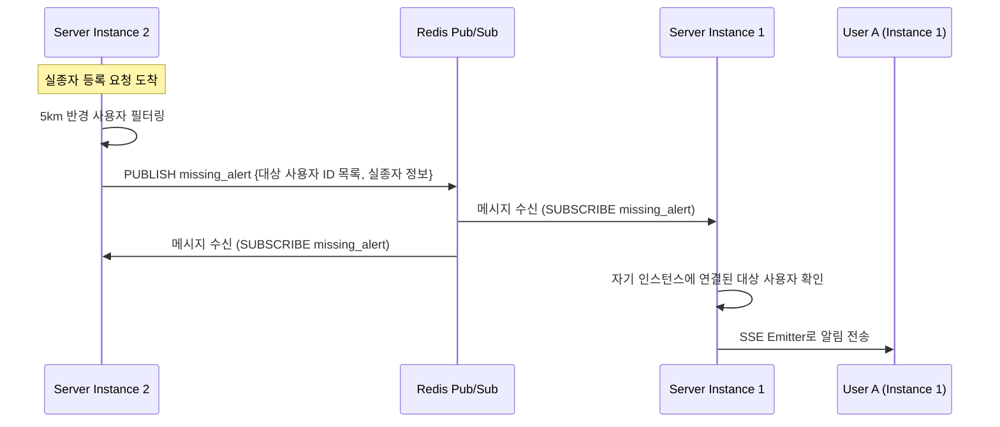

**Redis Pub/Sub 선택 이유**:

| 방안 | 장점 | 단점 |
|------|------|------|
| **Redis Pub/Sub** | 구현 단순, 지연 낮음 (~1ms), Spring Data Redis로 즉시 연동 | 메시지 유실 가능 (구독자 없으면 소실), 메시지 영속화 없음 |
| **Kafka** | 메시지 영속화, 순서 보장, 재처리 가능 | 인프라 복잡도 높음, 지연이 Redis 대비 높음 (~수ms) |
| **RabbitMQ** | 메시지 보장, Fanout Exchange로 브로드캐스트 | 설정 복잡도 중간, 처리량이 Kafka 대비 낮음 |

실종 알림은 발생 빈도가 낮고(하루 수십 건), 알림이 유실되더라도 SSE 재접속 시 놓친 알림을 조회하는 보조 메커니즘을 두면 되므로, **구현 단순성과 낮은 지연**이 가장 중요했습니다. Kafka의 영속성과 순서 보장은 이 시나리오에서는 과잉 설계입니다.

#### Redis Pub/Sub vs Redis Streams

Redis Pub/Sub의 가장 큰 약점은 **구독자가 없으면 메시지가 소실**된다는 것입니다. 서버 인스턴스가 재시작 중이면 그 사이에 발행된 알림을 놓칩니다.

| 항목 | Redis Pub/Sub | Redis Streams |
|------|-------------|---------------|
| **메시지 영속화** | 없음 (Fire-and-forget) | 있음 (AOF/RDB 연동) |
| **구독자 부재 시** | **메시지 소실** | 스트림에 보관, 나중에 소비 가능 |
| **Consumer Group** | 미지원 | 지원 (부하 분산) |
| **ACK 메커니즘** | 없음 | XACK로 처리 완료 확인 |
| **메시지 재처리** | 불가 | XRANGE로 과거 메시지 조회 가능 |
| **Latency** | ~0.1ms | ~0.5ms (ID 생성 + 저장) |
| **구현 복잡도** | 매우 낮음 | 중간 (Consumer Group 관리) |

Reconnect에서 Redis Pub/Sub의 메시지 소실이 문제가 되지 않는 이유:

```
알림 소실 시나리오와 대응:
  1. 서버 인스턴스 B가 재시작 중
  2. 실종 알림이 Pub/Sub으로 발행됨
  3. 인스턴스 B는 알림을 수신하지 못함
  4. 인스턴스 B에 연결된 사용자들은 SSE 연결이 끊어진 상태
  5. 사용자 클라이언트가 자동 재연결 (EventSource / 커스텀 재연결)
  6. 재연결 시 Last-Event-ID 또는 MongoDB 조회로 놓친 알림 복구

  → Pub/Sub 소실이 최종 사용자에게는 영향 없음
  → Redis Streams의 추가 복잡도가 불필요
```

서비스가 성장해 알림 빈도가 높아지거나, 알림 전달 보장이 법적으로 요구된다면 Redis Streams로 전환하는 것이 합리적입니다.

### 문제 2: WebSocket의 Sticky Session

WebSocket은 최초 HTTP Upgrade 이후 TCP 연결이 유지되므로, 해당 연결이 **같은 서버 인스턴스로 계속 라우팅**되어야 합니다. 일반적인 라운드 로빈 로드밸런싱을 사용하면 TCP 연결이 끊어질 수 있습니다.

**해결 방안**:
- **L4 로드밸런서**: IP/포트 기반으로 동일 서버에 라우팅. TCP 연결 수준에서 Sticky Session 보장
- **L7 로드밸런서 + Cookie**: 최초 HTTP Upgrade 요청에서 서버 식별 쿠키를 설정하고, 이후 재접속 시 같은 서버로 라우팅

### 문제 3: SSE Emitter의 동시 연결 수 한계

SSE는 HTTP 연결을 유지하므로, 동시 연결 수가 서버의 파일 디스크립터 제한과 직결됩니다.

```
SSE 동시 연결 한계 추정:

Linux 기본 파일 디스크립터 제한: 1,024 (ulimit -n)
  → SSE 연결만으로 최대 1,024명

ulimit 조정 후: 65,536
  → 기타 소켓(DB, Redis 등) 제외 시 실질적으로 ~50,000 SSE 연결 가능

톰캣 기본 max-connections: 8,192
  → SSE + 일반 HTTP 요청이 공유

Emitter 메모리 사용량:
  - SseEmitter 1개: ~500 bytes (객체 헤더 + 내부 상태)
  - ConcurrentHashMap 엔트리: ~64 bytes
  - 10,000명: ~5.5 MB
  → 메모리보다는 파일 디스크립터와 연결 수 제한이 병목
```

**설계 시 적용한 운영 파라미터**:

```
SseEmitter 설정:
  - timeout: 30분 (유휴 연결 해제, 클라이언트 자동 재접속)
  - 최대 동시 Emitter: 10,000개 (ConcurrentHashMap size 모니터링)
  - heartbeat: 15초 간격으로 빈 이벤트 전송 (연결 유지, 프록시 timeout 방지)

톰캣 설정:
  - server.tomcat.max-connections: 20,000
  - server.tomcat.threads.max: 200 (비동기 처리이므로 스레드 수는 적게)
```

---

## 커넥션 풀 사이징 설계

WebSocket + SSE + DB 커넥션이 공존하는 환경에서 각 커넥션 풀의 적정 크기를 산정합니다.

### Tomcat Thread Pool

```
SSE는 비동기(AsyncContext) 처리이므로 스레드를 점유하지 않음
WebSocket도 Upgrade 이후 별도 스레드 모델

Tomcat 스레드가 처리하는 요청:
  - 실종자 등록 API
  - 신고/제보 API
  - 사용자 인증 API
  - 기타 REST API

동시 API 요청 추정: 피크 시 ~50 req/s, 평균 처리 시간 ~100ms
필요 스레드: 50 × 0.1 = 5개 (이론상)
안전 마진 포함: × 4 = 20개

server.tomcat.threads.max: 200 (기본값)으로 충분
server.tomcat.threads.min-spare: 20
```

### HikariCP Connection Pool (MySQL)

```
HikariCP 권장 공식 (PostgreSQL wiki 기반, MySQL에도 적용 가능):
  pool_size = (core_count × 2) + effective_spindle_count

  4코어 서버, SSD(spindle 0):
  pool_size = (4 × 2) + 0 = 8

하지만 이 공식은 DB-intensive 워크로드 기준.
Reconnect는 DB 접근이 빈번하지 않으므로:
  - 실종자 등록: 1일 수 건
  - 신고/제보: 1일 수십 건
  - 사용자 조회: 인증 시
  - @TransactionalEventListener에서의 비동기 DB 접근

  maximumPoolSize: 10 (기본 10으로 충분)
  minimumIdle: 5
  connectionTimeout: 30000 (30초)
```

### MongoDB Connection Pool

```
MongoDB Java Driver 기본값:
  maxPoolSize: 100
  minPoolSize: 0
  maxIdleTimeMS: 0 (무제한)

Reconnect에서의 MongoDB 접근 패턴:
  - 위치 로그 쓰기: 200 writes/s (동시 1,000명)
  - 알림 이력 쓰기: 하루 수 건 × 대상 사용자 수
  - 위치 조회 (Bounding Box): 알림 발생 시에만

위치 쓰기 200 writes/s, 각 쓰기 ~2ms:
  필요 커넥션: 200 × 0.002 = 0.4개 (이론상)
  피크 시 × 10 안전 마진 = 4개

  maxPoolSize: 20 (넉넉하게)
  minPoolSize: 5
```

---

## 모니터링 메트릭 설계

운영 환경에서 시스템 상태를 파악하기 위해 Micrometer + Prometheus 기반 메트릭을 설계합니다.

### 핵심 메트릭 정의

| 메트릭 | 타입 | 설명 | 알람 기준 |
|--------|------|------|---------|
| `reconnect.ws.connections` | Gauge | WebSocket 활성 연결 수 | > 서버 capacity의 80% |
| `reconnect.sse.emitters` | Gauge | SSE Emitter 활성 수 | > 10,000 (단일 서버) |
| `reconnect.alert.sent.total` | Counter | 알림 전송 성공 건수 | - |
| `reconnect.alert.failed.total` | Counter | 알림 전송 실패 건수 | 실패율 > 5% |
| `reconnect.filter.duration` | Timer | Haversine 필터링 소요 시간 | p99 > 500ms |
| `reconnect.location.writes` | Counter | 위치 로그 쓰기 건수 | 급격한 감소 시 |

### 메트릭 등록 코드

```java
@Component
@RequiredArgsConstructor
public class ReconnectMetrics {

    private final MeterRegistry registry;
    private final SseEmitterManager emitterManager;

    private AtomicInteger wsConnections = new AtomicInteger(0);

    @PostConstruct
    public void registerMetrics() {
        // SSE 활성 연결 수 (Gauge)
        Gauge.builder("reconnect.sse.emitters",
                emitterManager, SseEmitterManager::getActiveConnectionCount)
            .description("Active SSE emitter count")
            .register(registry);

        // WebSocket 활성 연결 수 (Gauge)
        Gauge.builder("reconnect.ws.connections",
                wsConnections, AtomicInteger::get)
            .description("Active WebSocket connection count")
            .register(registry);
    }

    // 알림 전송 시 호출
    public void recordAlertSent(boolean success) {
        Counter.builder("reconnect.alert.sent")
            .tag("result", success ? "success" : "failure")
            .register(registry)
            .increment();
    }

    // Haversine 필터링 시간 측정
    public void recordFilterDuration(long durationMs) {
        Timer.builder("reconnect.filter.duration")
            .register(registry)
            .record(Duration.ofMillis(durationMs));
    }

    public void onWsConnect() { wsConnections.incrementAndGet(); }
    public void onWsDisconnect() { wsConnections.decrementAndGet(); }
}
```

### Grafana 대시보드 쿼리 예시

```promql
# SSE 연결 수 추이
reconnect_sse_emitters

# 알림 전송 실패율 (5분 윈도우)
rate(reconnect_alert_sent_total{result="failure"}[5m])
/ rate(reconnect_alert_sent_total[5m]) * 100

# Haversine 필터링 p99 지연
histogram_quantile(0.99, rate(reconnect_filter_duration_seconds_bucket[5m]))

# 위치 로그 쓰기 초당 건수
rate(reconnect_location_writes_total[1m])
```

---

## 설계 회고

### 잘한 점

**프로토콜 역할 분리**: WebSocket과 SSE를 역할에 맞게 분리한 것은 장애 격리와 관심사 분리 측면에서 올바른 선택이었습니다. 실제로 개발 중 WebSocket 연결 불안정 이슈가 있었는데, 알림 수신에는 영향이 없었습니다. 또한 각 프로토콜의 설정(timeout, heartbeat 등)을 독립적으로 튜닝할 수 있어 운영 유연성이 높았습니다.

**Multi DB 분리 기준의 명확성**: 트랜잭션이 필요한 Core 데이터와 대량 쓰기가 필요한 Log 데이터를 분리한 기준이 명확해서, 이후 기능 추가 시에도 어떤 DB에 저장할지 혼란이 없었습니다. 특히 TTL 기반 자동 정리 전략은 운영 부담을 크게 줄여주었습니다.

**Bounding Box 사전 필터링**: 설계 단계에서 Haversine 계산 비용을 미리 추정하고, Bounding Box로 후보를 줄이는 최적화를 초기 설계에 포함한 것이 좋았습니다. 사용자 수가 늘어나도 필터링 성능이 선형적으로 증가하지 않도록 한 것은 확장성 측면에서 유의미했습니다.

### 아쉬운 점

**Connection Pool 사전 산정 부재**: WebSocket과 SSE 동시 연결 수가 늘어났을 때의 서버 자원 한계를 초기 설계에서 정량적으로 산정하지 못했습니다. SSE Emitter의 timeout, 최대 동시 연결 수, heartbeat 간격 같은 운영 파라미터를 설계 문서에 포함했어야 했습니다. 이 글의 스케일아웃 섹션에서 뒤늦게 정리한 내용이지만, 초기 설계에 포함되었다면 더 좋았을 것입니다.

**모니터링 메트릭 설계 부재**: WebSocket 연결 수, SSE Emitter 활성 수, 알림 발송 성공/실패 비율, Haversine 필터링 소요 시간 같은 메트릭을 수집하는 구조를 설계하지 못했습니다. 운영 환경에서는 이런 지표 없이 장애의 원인을 파악하기 어렵고, 성능 저하를 사전에 감지할 수 없습니다.

**오프라인 사용자 알림 보장**: SSE는 연결이 끊어진 사용자에게는 알림을 보낼 수 없습니다. FCM 보조 채널을 확장 설계안으로만 남겨두고 실제 구현하지 못한 것이 아쉽습니다. 또한 재접속 시 놓친 알림을 조회하는 구조(Last-Event-ID 기반 또는 MongoDB에서 미수신 알림 조회)를 초기 버전에 포함했어야 했습니다.

**GeoJSON 2dsphere 인덱스 미활용**: MongoDB의 GeoJSON과 `$nearSphere` 쿼리를 활용하면 Bounding Box + Haversine 계산을 애플리케이션 레벨이 아닌 **DB 레벨에서 처리**할 수 있었습니다. 이렇게 하면 필터링 로직이 더 단순해지고, MongoDB의 B-tree 기반 공간 인덱스를 활용해 성능도 개선될 수 있습니다. 설계 당시 MongoDB의 지리 공간 쿼리 기능을 충분히 검토하지 못한 것이 아쉽습니다.
