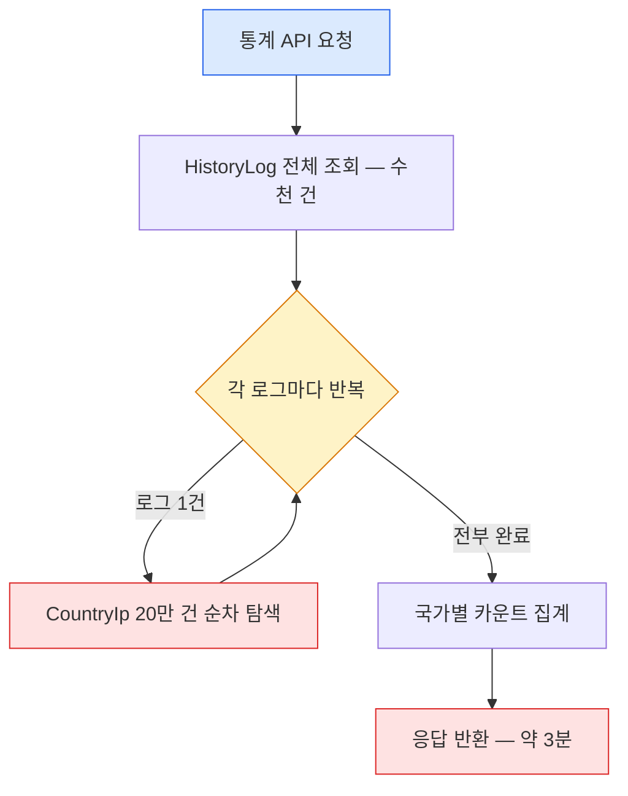
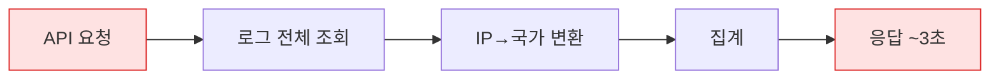
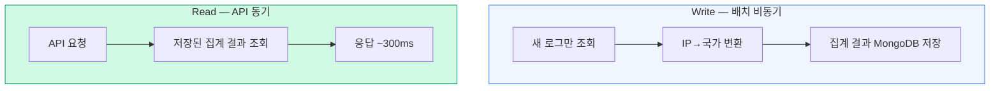
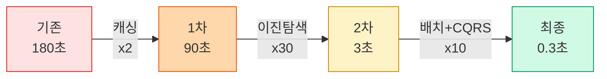

## 들어가며

인턴으로 합류해 가장 처음 마주한 운영 이슈가 ShortURL History Log가 너무 느리다는 것이었습니다.

사내에서 운영하는 URL 단축 서비스는 단축 URL을 생성하고, 해당 URL의 클릭 로그를 수집해 국가별 통계를 보여주는 기능을 포함하고 있었습니다. 문제는 이 통계 API의 응답 시간이 **약 3분**이었다는 것입니다. 사내 서비스라 사용자 수가 많지는 않았지만, 통계 페이지에 진입할 때마다 3분을 기다려야 하는 건 분명 비정상이었습니다.

이 글에서는 왜 3분이나 걸렸는지를 진단하고, 단순히 서버 스펙을 올리는 것이 아닌 **데이터 구조 자체의 병목**을 찾아 해결하기까지의 전 과정을 실제 코드와 함께 공유하려 합니다.

---

## 서비스 전체 구조 이해

### ShortURL 서비스 개요

ShortURL 서비스는 다음과 같은 기능을 제공합니다.

- **단축 URL 생성/수정**: `ShortUrl` 엔티티를 MariaDB에 저장하고, QR 코드 생성과 연동
- **클릭 로그 수집**: 단축 URL 클릭 시 접속 IP, 타임스탬프를 기록
- **국가별 통계**: 수집된 IP를 국가 코드로 변환해 JP, KR, US, TW, ETC별 호출 횟수 집계

핵심 Repository 구조는 이렇습니다.

```
MariaDB (Core)
├── ShortUrlRepository         ── 단축 URL CRUD
├── ShortUrlQueryRepository    ── QueryDSL 기반 조건검색·페이징
├── OrganizationRepository      ── 조직명 마스터
└── ServiceInfoRepository     ── 사이트 정보 마스터

MongoDB (Log & Cache)
├── CountryIpRepository                ── IP 대역 → 국가 매핑 (약 20만 건)
├── ShortUrlLogCountRepository         ── urlSn별 국가 카운트 집계 결과
└── ShortUrlCountCallTimeRepository    ── 배치 마지막 실행 시점 기록
```

문제의 핵심은 **CountryIp 컬렉션(20만 건)을 어떻게 탐색하고, 그 결과를 언제 집계하느냐**에 있었습니다.

---

## 기존 구조 분석: 왜 3분이나 걸렸을까

### IP → 국가 매핑 데이터

외부 GeoIP API 대신, **IP2Location CSV 데이터를 MongoDB `CountryIp` 컬렉션에 적재**해 사용하고 있었습니다.

```javascript
// MongoDB - CountryIp Document 예시
{
    "_id": ObjectId("..."),
    "startIntegerIp": 3232235520,  // 192.168.0.0을 숫자로 변환한 값
    "endIntegerIp": 3232235775,    // 192.168.0.255
    "country": "KR"
}
```

IP 주소를 정수(Long)로 변환한 뒤, `startIntegerIp <= ipLong <= endIntegerIp` 범위에 해당하는 Document를 찾으면 국가 코드를 알 수 있습니다.

### IP → Long 변환 로직

IP 문자열을 정수로 변환하는 공식은 다음과 같습니다.

```java
private Long dot2LongIP(String ipstring) {
    try {
        String[] ip = ipstring.split("[.]");
        return Integer.parseInt(ip[0]) * 16777216L   // 2^24
             + Integer.parseInt(ip[1]) * 65536L      // 2^16
             + Integer.parseInt(ip[2]) * 256L         // 2^8
             + Integer.parseInt(ip[3]);
    } catch (NumberFormatException e) {
        try {
            // 도메인 이름인 경우 InetAddress로 IPv4 주소를 해석해 재시도
            String inetAddress = String.valueOf(InetAddress.getByName(ipstring));
            inetAddress = inetAddress.replace("/", "");
            String[] ip = inetAddress.split("[.]");
            return Integer.parseInt(ip[0]) * 16777216L
                 + Integer.parseInt(ip[1]) * 65536L
                 + Integer.parseInt(ip[2]) * 256L
                 + Integer.parseInt(ip[3]);
        } catch (Exception ex) {
            return 0L; // 변환 불가 시 0L → ETC 처리
        }
    }
}
```

이 변환의 원리를 풀어보면:

```
IP: 192.168.1.100
= 192 × 2^24 + 168 × 2^16 + 1 × 2^8 + 100
= 192 × 16,777,216 + 168 × 65,536 + 1 × 256 + 100
= 3,232,235,876
```

IPv4 주소가 4개의 8비트(옥텟)로 구성되므로, 각 옥텟을 비트 시프트 연산의 결과에 해당하는 가중치로 곱하면 **32비트 정수 공간에서의 순서가 보존**됩니다. 이 순서 보존 덕분에 범위 비교(`startIntegerIp <= ipLong <= endIntegerIp`)가 가능한 것입니다.

`dot2LongIP`에서 주의할 점은, 로그에 **도메인 이름**이 들어올 수도 있다는 것입니다. 이 경우 `InetAddress.getByName()`으로 DNS 해석을 시도하고, 그마저도 실패하면 `0L`을 반환해 ETC로 처리합니다.

### 기존 매핑 로직의 문제

기존에는 통계 API를 호출할 때마다 다음이 실시간으로 실행되었습니다.

```
[통계 API 요청]
  → 전체 HistoryLog 조회 (수천~수만 건)
  → 각 로그마다:
      → CountryIp 컬렉션에서 해당 IP의 국가 찾기 (20만 건 순회)
  → 국가별 카운트 집계
  → 응답 반환
```

**로그 1,000건 × CountryIp 20만 건 = 약 2억 번의 비교 연산**이 매 API 호출마다 발생했습니다. 이것이 3분이라는 응답 시간의 원인이었습니다.



> 핵심 병목: 1,000건 x 200,000건 = **2억 번 비교** — 매 API 호출마다 반복

---

## 1차 개선: Spring Cache로 CountryIp 로컬 캐싱

### 접근 방식

가장 먼저 떠오른 개선은 매번 MongoDB에서 20만 건을 읽어올 필요가 없다는 것이었습니다. IP-국가 매핑 데이터는 사실상 **불변 데이터**(갱신 주기가 월 단위 이상)이므로, 한 번 읽으면 메모리에 캐싱해두면 됩니다.

Spring Cache의 `@Cacheable`을 적용했습니다.

```java
@Cacheable("shortUrlCountryIp")
public List<CountryIp> getAllCountryIp() {
    return countryIpRepository.findAllByOrderByStartIntegerIpDesc();
}
```

이 한 줄로:
- 첫 호출 시 MongoDB에서 20만 건을 로드 (`startIntegerIp` 내림차순 정렬)
- 이후 호출부터는 **메모리 캐시에서 즉시 반환** (MongoDB 접근 없음)

캐시를 수동으로 갱신해야 할 때(예: IP2Location CSV가 업데이트된 경우)를 위해 `@CacheEvict` 메서드도 추가했습니다.

```java
@CacheEvict(value = "shortUrlCountryIp", allEntries = true)
public void removeAndGetAllCountryIp() {
    cacheManager.getCacheNames();
    this.getAllCountryIp(); // 캐시 비우고 다시 로드
}
```

### Spring Cache 추상화의 내부 동작

`@Cacheable`이 어떻게 동작하는지 조금 더 깊이 살펴보겠습니다. Spring Cache는 **추상화 계층**으로, 실제 캐시 구현체와 비즈니스 로직 사이를 분리합니다.

핵심 인터페이스는 `CacheManager`와 `Cache`입니다.

```java
// Spring Cache 내부 구조 (간략화)
public interface CacheManager {
    Cache getCache(String name);        // 이름으로 캐시 조회
    Collection<String> getCacheNames(); // 전체 캐시 이름 목록
}

public interface Cache {
    ValueWrapper get(Object key);       // 키로 값 조회
    void put(Object key, Object value); // 키-값 저장
    void evict(Object key);             // 키 삭제
    void clear();                       // 전체 삭제
}
```

별도 설정 없이 `@EnableCaching`만 선언하면, Spring Boot는 기본 구현체인 `ConcurrentMapCacheManager`를 등록합니다. 이 구현체는 내부적으로 `ConcurrentHashMap`을 사용합니다.

```
@Cacheable("shortUrlCountryIp") 호출 흐름:

1. AOP 프록시가 메서드 호출을 가로챔
2. CacheManager에서 "shortUrlCountryIp" 캐시 조회
3. 캐시에서 key(기본값: 메서드 파라미터)로 값 조회
4-a. 값 있음 → 캐시 값 반환, 원본 메서드 실행하지 않음
4-b. 값 없음 → 원본 메서드 실행 → 결과를 캐시에 저장 후 반환
```

이 프로젝트에서 `getAllCountryIp()`는 파라미터가 없으므로, 캐시 키는 `SimpleKey.EMPTY`가 됩니다. 즉, **단일 엔트리**로 20만 건의 리스트 전체가 캐싱됩니다.

### 캐시 워밍(Cache Warming) 전략

캐시 워밍이란 **서버가 실제 트래픽을 받기 전에 캐시를 미리 채워두는 것**을 말합니다. 워밍 전략은 크게 두 가지입니다.

**1. Lazy Loading (최초 요청 시 로드)**

```
서버 시작 → (캐시 비어 있음) → 첫 요청 → 20만 건 로드 (느림) → 이후 요청 (빠름)
```

장점은 구현이 간단하다는 것이고, 단점은 첫 번째 사용자가 느린 응답을 경험한다는 것입니다.

**2. Eager Loading (서버 시작 시 로드)**

```java
@Component
public class CacheWarmingRunner implements ApplicationRunner {
    @Override
    public void run(ApplicationArguments args) {
        shortUrlService.getAllCountryIp(); // 서버 시작 시 캐시 워밍
    }
}
```

```
서버 시작 → 20만 건 로드 → (캐시 준비 완료) → 첫 요청부터 빠름
```

이 프로젝트에서는 배치가 주기적으로 `getAllCountryIp()`를 호출하므로, 배치 최초 실행 시 자연스럽게 워밍이 되는 구조였습니다. 명시적인 Eager Loading을 추가하지는 않았지만, 통계 API가 배치 이전에 호출될 가능성이 있다면 `ApplicationRunner`를 통한 사전 워밍도 고려할 만합니다.

### 캐시 사이즈 추정: 20만 건 CountryIp의 메모리 사용량

캐시를 메모리에 올리기로 했으니, 실제로 얼마나 메모리를 사용하는지 추정해 보겠습니다.

```
CountryIp 객체 1건:
  - Object header (Java 64비트): 16 bytes
  - startIntegerIp (Long):       24 bytes (Long 객체 = 16 header + 8 value)
  - endIntegerIp (Long):         24 bytes
  - country (String, 평균 3자):  ~56 bytes (String header + char[] + 패딩)
  - _id (ObjectId):              ~32 bytes
  - 패딩 및 참조:                ~16 bytes
  ─────────────────────────────
  합계: 약 168 bytes / 건

20만 건: 168 × 200,000 = 약 33.6 MB
ArrayList 오버헤드: ~1.6 MB (Object[] 참조 배열)
─────────────────────────────
총 추정: 약 35 MB
```

35MB는 일반적인 JVM 힙 사이즈(256MB~2GB)에서 부담 없는 수준입니다. 만약 이 데이터가 100만 건 이상으로 늘어난다면 약 170MB가 되므로, 그때는 **Caffeine의 maximumSize 설정**이나 **off-heap 캐시**(예: EhCache)를 고려해야 합니다.

### 캐시 갱신 주기와 데이터 신선도의 트레이드오프

IP2Location 데이터는 월 1회 정도 갱신됩니다. 캐시 갱신 전략을 설계할 때 고려한 점들입니다.

| 전략 | 신선도 | 복잡도 | 적합한 경우 |
|---|---|---|---|
| 수동 갱신 (`@CacheEvict` API) | 갱신 시점에 즉시 반영 | 낮음 | 갱신 빈도가 낮고 예측 가능 |
| TTL 기반 자동 만료 | 만료 주기만큼 지연 | 중간 | 갱신 빈도가 일정 |
| 이벤트 기반 갱신 | 즉시 반영 | 높음 | 갱신이 불규칙하고 즉시성 필요 |

이 프로젝트에서는 **수동 갱신** 방식을 선택했습니다. IP2Location CSV가 업데이트되면 관리자가 `removeAndGetAllCountryIp()` API를 호출해 캐시를 갱신합니다. 갱신 빈도가 월 1회 이하이므로, 복잡한 자동화보다 단순한 수동 방식이 더 적합했습니다.

### 다른 캐시 구현체와의 비교

Spring Cache는 추상화이므로, 실제 구현체를 교체할 수 있습니다. 각 구현체의 특성을 비교하면:

| 구현체 | 만료 정책 | 최대 크기 제한 | 분산 캐시 | 적합한 경우 |
|---|---|---|---|---|
| ConcurrentMapCache (기본) | 없음 | 없음 | 불가 | 단순한 경우, 소량 데이터 |
| Caffeine | TTL, TTI | 지원 (LRU 등) | 불가 | 로컬 캐시, 고성능 필요 |
| EhCache | TTL, TTI | 지원 + off-heap | 제한적 | 대용량 로컬 캐시 |
| Redis | TTL | 메모리 제한 | **지원** | 다중 인스턴스, 분산 환경 |

이 프로젝트에서는 **단일 인스턴스** 환경이고 데이터 크기가 35MB 수준이므로, 기본 `ConcurrentMapCache`로 충분했습니다. 만약 서비스가 다중 인스턴스로 확장된다면, 인스턴스 간 캐시 일관성을 위해 **Redis**로 전환하거나, 각 인스턴스가 독립적으로 캐시를 가지되 갱신 이벤트를 Pub/Sub으로 전파하는 방식을 고려해야 합니다.

### 왜 내림차순(Desc) 정렬인가

`findAllByOrderByStartIntegerIpDesc` — 내림차순으로 정렬한 이유는, 이후 이진 탐색의 구현 방식과 관련이 있습니다.

내림차순 정렬 리스트에서는 **인덱스가 클수록 IP가 작아집니다**. 이는 이진 탐색의 분기 조건에 영향을 줍니다.

```
인덱스:    [0]       [1]       [2]       [3]       ...
값:     큰 IP ←──────────────────────────────→ 작은 IP
```

이 정렬 방향은 MongoDB의 `startIntegerIp` 필드에 걸린 **인덱스의 정렬 방향과 일치**시켜, DB 쿼리 시 추가 정렬 비용을 피하기 위함입니다 (이에 대해서는 뒤에서 자세히 다룹니다).

### 1차 결과

| 지표 | 기존 | 1차 개선 후 |
|---|---|---|
| CountryIp 로드 | 매 요청마다 20만 건 DB 조회 | 최초 1회만, 이후 메모리 캐시 |
| 탐색 방식 | 여전히 선형 탐색 O(n) | 여전히 선형 탐색 O(n) |
| 응답 시간 | ~3분 | ~1분 30초 |

DB I/O를 제거해 절반 정도 줄였지만, **선형 탐색(O(n))의 연산 비용**은 그대로였습니다. 문제가 I/O가 아니라 **탐색 알고리즘** 자체에 있다는 것이 명확해졌습니다.

---

## 2차 개선: 이진 탐색(Binary Search)으로 O(n) → O(log n)

### 핵심 아이디어

**같은 데이터를 더 적은 연산으로 확인할 수 있을까?**

CountryIp 데이터의 특성을 다시 보면:
- 각 레코드는 `startIntegerIp` ~ `endIntegerIp` **범위**를 가짐
- **범위가 겹치지 않음** (하나의 IP는 하나의 국가에만 속함)
- `startIntegerIp` 기준으로 이미 **정렬되어 캐시에 올라와 있음**

이 조건이면 **이진 탐색(Binary Search)** 을 적용할 수 있습니다.

| 탐색 방식 | 비교 횟수 (20만 건) |
|---|---|
| 선형 탐색 O(n) | 최대 **200,000번** |
| 이진 탐색 O(log n) | 최대 **약 18번** (log₂(200,000) ≈ 17.6) |

단일 IP 조회 기준으로 **약 11,000배의 연산 감소**입니다.

### 이진 탐색의 원론적 이해

이진 탐색을 구현하기 전에, 이 알고리즘이 **왜 정확하게 동작하는지** 그 수학적 근거를 짚어보겠습니다.

#### 불변 조건(Loop Invariant)과 정확성 증명

이진 탐색의 정확성은 **불변 조건(loop invariant)** 으로 증명됩니다. 불변 조건이란, 루프의 매 반복 시작 시점에 항상 참인 조건을 말합니다.

정렬된 배열에서 값 `target`을 찾는 표준 이진 탐색의 불변 조건은 다음과 같습니다.

```
불변 조건: 만약 target이 배열에 존재한다면,
          arr[start] ~ arr[end] 범위 안에 반드시 포함되어 있다.
```

이 조건이 왜 성립하는지 단계별로 살펴보면:

```
[초기화] start = 0, end = n-1
  → 전체 배열이 탐색 범위이므로 불변 조건 성립

[유지] 매 반복에서 mid = (start + end) / 2를 계산하고:
  - arr[mid] == target → 찾음, 종료
  - arr[mid] < target  → target은 mid 오른쪽에 있음 → start = mid + 1
  - arr[mid] > target  → target은 mid 왼쪽에 있음 → end = mid - 1
  → 어느 경우든, target이 존재할 수 있는 범위만 남기므로 불변 조건 유지

[종료] start > end
  → 탐색 범위가 비었으므로 target은 배열에 없음
```

이 증명이 중요한 이유는, 분기 조건을 잘못 작성하면 **불변 조건이 깨져서** 무한 루프에 빠지거나 잘못된 결과를 반환하기 때문입니다. 실제로 이진 탐색은 구현 실수가 매우 빈번한 알고리즘으로 알려져 있습니다.

#### 오름차순 vs 내림차순에서의 분기 방향 차이

오름차순과 내림차순에서 분기 방향이 정확히 반대라는 점을 수학적으로 정리하면:

```
[오름차순] arr[0] ≤ arr[1] ≤ ... ≤ arr[n-1]
  - arr[mid] < target → target은 (mid, end] 구간 → start = mid + 1
  - arr[mid] > target → target은 [start, mid) 구간 → end = mid - 1

[내림차순] arr[0] ≥ arr[1] ≥ ... ≥ arr[n-1]
  - arr[mid] < target → target은 [start, mid) 구간 → end = mid - 1
  - arr[mid] > target → target은 (mid, end] 구간 → start = mid + 1
```

내림차순에서는 **부등호의 방향이 인덱스의 방향과 반대**이므로, 분기 조건이 오름차순과 정반대가 됩니다. 이것이 실제 구현 코드에서 `start = mid + 1`과 `end = mid - 1`의 위치가 바뀌는 이유입니다.

이를 시각적으로 표현하면:

```
오름차순: [10, 20, 30, 40, 50]   target = 35
  mid=2, arr[mid]=30 < 35 → 오른쪽으로 → start = 3

내림차순: [50, 40, 30, 20, 10]   target = 35
  mid=2, arr[mid]=30 < 35 → 왼쪽으로 → end = 1

같은 30 < 35 조건이지만, 이동 방향이 반대
```

#### 이진 탐색의 변형들: lower_bound, upper_bound, 범위 탐색

표준 이진 탐색은 **정확히 일치하는 값**을 찾습니다. 하지만 실무에서는 변형이 더 자주 필요합니다.

**lower_bound**: target 이상인 첫 번째 위치를 찾습니다.

```java
// 오름차순 배열에서 target 이상인 첫 번째 인덱스
int lowerBound(int[] arr, int target) {
    int lo = 0, hi = arr.length;
    while (lo < hi) {
        int mid = lo + (hi - lo) / 2;
        if (arr[mid] < target) lo = mid + 1;
        else hi = mid;
    }
    return lo;
}
```

**upper_bound**: target 초과인 첫 번째 위치를 찾습니다.

```java
// 오름차순 배열에서 target 초과인 첫 번째 인덱스
int upperBound(int[] arr, int target) {
    int lo = 0, hi = arr.length;
    while (lo < hi) {
        int mid = lo + (hi - lo) / 2;
        if (arr[mid] <= target) lo = mid + 1;
        else hi = mid;
    }
    return lo;
}
```

**범위 탐색**: lower_bound와 upper_bound를 조합하면 특정 값의 범위(개수)를 O(log n)에 구할 수 있습니다.

```
count(target) = upperBound(target) - lowerBound(target)
```

#### Java의 Collections.binarySearch()를 사용하지 않고 직접 구현한 이유

Java 표준 라이브러리에는 `Collections.binarySearch()`가 있습니다. 그런데 이것을 사용하지 않고 직접 구현한 이유가 있습니다.

```java
// Collections.binarySearch의 시그니처
public static <T> int binarySearch(List<? extends Comparable<? super T>> list, T key)
```

이 메서드는 **정확히 일치하는 값(exact match)** 을 찾도록 설계되어 있습니다. 내부적으로 `key.compareTo(list.get(mid))`를 호출해서 0이면 일치, 양수면 오른쪽, 음수면 왼쪽으로 이동합니다.

그런데 이 프로젝트의 요구사항은 **범위 매칭(range match)** 입니다.

```
요구사항: startIntegerIp <= ipnumber <= endIntegerIp 인 레코드를 찾아라

Collections.binarySearch:
  - ipnumber와 정확히 같은 startIntegerIp를 찾음
  - "ipnumber가 startIntegerIp와 endIntegerIp 사이에 있는가?"를 판단할 수 없음
```

`Comparator`를 커스터마이징해서 범위 매칭을 흉내 낼 수는 있지만, `compareTo`의 계약(대칭성, 추이성)을 위반할 수 있어 동작이 보장되지 않습니다. 직접 구현하면 **탐색 조건(범위 포함 여부)을 명시적으로 제어**할 수 있으므로, 정확성과 가독성 모두에서 유리합니다.

### 실제 구현: 내림차순 리스트에서의 이진 탐색

캐시에 올라온 리스트가 `startIntegerIp` **내림차순**이므로, 일반적인 이진 탐색과 분기 방향이 반대입니다.

```java
/**
 * numberIp로 CountryIp 리스트의 index를 찾는 이진 탐색
 * @param ipnumber dot2LongIP로 변환된 IP 정수값
 * @param ip2LocList startIntegerIp 내림차순 정렬된 CountryIp 리스트
 * @return 매칭 인덱스 (없으면 -1)
 */
private int searchIp2LocIndex(Long ipnumber, List<CountryIp> ip2LocList) {
    int index = -1;

    int start = 0;
    int end = ip2LocList.size() - 1;

    while (start <= end) {
        int mid = (start + end) / 2;
        CountryIp ip2Loc = ip2LocList.get(mid);

        if ((ip2Loc.getStartIntegerIp() <= ipnumber)
                && (ip2Loc.getEndIntegerIp() >= ipnumber)) {
            // 범위 안에 있음 → 찾았다
            index = mid;
            break;
        } else if (ip2Loc.getStartIntegerIp() > ipnumber) {
            // 현재 mid의 시작 IP가 찾는 값보다 크다
            // → 내림차순이므로, 더 작은 값은 오른쪽에 있다
            start = mid + 1;
        } else {
            // 현재 mid의 끝 IP가 찾는 값보다 작다
            // → 내림차순이므로, 더 큰 값은 왼쪽에 있다
            end = mid - 1;
        }
    }

    return index;
}
```

이 구현의 불변 조건을 앞서 설명한 프레임워크로 검증해 보면:

```
불변 조건: ipnumber를 포함하는 CountryIp 레코드가 존재한다면,
          ip2LocList[start] ~ ip2LocList[end] 범위 안에 반드시 있다.

[유지 검증]
  Case 1: startIp <= ipnumber <= endIp → 찾음, break로 종료 (불변 조건 유지 불필요)
  Case 2: startIp > ipnumber
    → 내림차순이므로 ip2LocList[0..mid]의 모든 startIp >= startIp(mid) > ipnumber
    → ipnumber를 포함할 가능성은 ip2LocList[mid+1..end]에만 있음
    → start = mid + 1은 올바름 (불변 조건 유지)
  Case 3: endIp < ipnumber
    → 내림차순이므로 ip2LocList[mid..end]의 모든 endIp <= endIp(mid) < ipnumber
    → ipnumber를 포함할 가능성은 ip2LocList[start..mid-1]에만 있음
    → end = mid - 1은 올바름 (불변 조건 유지)
```

**내림차순에서의 이진 탐색 동작을 그림으로 보면:**

```
내림차순 리스트 (index 0이 가장 큰 IP):
  [0] 4000~4500 (US)
  [1] 3000~3500 (JP)
  [2] 2000~2500 (KR)    ← 찾는 값: 2300
  [3] 1000~1500 (TW)

1회차: mid = 1, startIp=3000 > 2300 → start = 2 (오른쪽으로)
2회차: mid = 2, 2000 <= 2300 <= 2500 → 찾음! country = "KR"
```

여기서 주의할 점은 `(start + end) / 2` 공식입니다. 만약 리스트가 매우 크다면 `start + end`에서 **정수 오버플로우**가 발생할 수 있습니다. 20만 건 수준에서는 `int` 범위(약 21억)를 넘지 않으므로 문제 없지만, 더 큰 데이터셋에서는 `start + (end - start) / 2`로 바꿔야 합니다.

### index가 -1인 경우: 왜 발생하는가

이진 탐색에서 index < 0이 반환되는 경우는 세 가지입니다.

```java
/* index < 0 발생 원인:
 * 1. dot2LongIP에서 변환 실패 → 0L 반환 → 어떤 범위에도 속하지 않음
 * 2. IP2Location CSV가 최신이 아님 → 신규 할당된 IP 대역이 누락
 * 3. IPv4가 아닌 형태 (IPv6 등)에서 도메인 주소 변환도 불가
 */
if (index < 0) {
    // → "ETC" 국가로 분류
}
```

실제 코드에서는 이를 ETC로 처리해, 통계에서 기타 국가로 표시합니다.

### 2차 결과

| 지표 | 1차 개선 | 2차 개선 후 |
|---|---|---|
| 단일 IP 조회 | O(n) = 20만 회 비교 | O(log n) = ~18회 비교 |
| 1,000건 로그 처리 | ~2억 회 비교 | ~18,000회 비교 |
| 응답 시간 | ~1분 30초 | ~3초 |

탐색 자체는 극적으로 빨라졌지만, 여전히 3초가 걸렸습니다.
원인은 **매 API 호출마다 모든 HistoryLog를 읽고, 하나씩 IP → 국가 변환을 수행**하고 있었기 때문입니다.
읽기(Read) 자체의 구조를 바꿔야 했습니다.

---

## 3차 (최종) 개선: 배치 사전 집계 + 결과 조회 분리

### 근본적 문제 재정의

통계 데이터의 특성상, **이미 지난 시점의 로그는 변하지 않습니다**. 같은 urlSn에 대해 매번 전체 로그를 처음부터 다시 집계할 이유가 없었습니다.

이것은 전형적인 **CQRS(Command Query Responsibility Segregation)** 패턴의 적용 대상이었습니다.

**Before — API 호출 시 모든 것을 동기 처리**



**After — CQRS: 배치(Write)와 API(Read) 분리**



### CQRS 패턴의 원론적 이해

CQRS를 적용하기로 결정한 만큼, 이 패턴의 이론적 배경을 정리해 두겠습니다.

#### 정의와 탄생 배경

CQRS는 **Bertrand Meyer**가 제안한 **CQS(Command-Query Separation)** 원칙에서 파생된 아키텍처 패턴입니다. CQS의 핵심은 단순합니다.

```
- Command(명령): 상태를 변경하되, 값을 반환하지 않는다
- Query(쿼리): 값을 반환하되, 상태를 변경하지 않는다
```

**Greg Young**은 이 원칙을 메서드 수준에서 **시스템 아키텍처 수준**으로 확장했습니다. 읽기와 쓰기의 **모델 자체를 분리**하자는 것이 CQRS의 핵심입니다.

```
[전통적 CRUD]
  하나의 모델이 읽기와 쓰기를 모두 담당
  → 읽기에 최적화하면 쓰기가 복잡해지고, 그 반대도 마찬가지

[CQRS]
  Write Model: 쓰기에 최적화된 구조
  Read Model:  읽기에 최적화된 구조
  → 각각 독립적으로 최적화 가능
```

#### 명령(Command)과 쿼리(Query)의 분리 원칙

CQRS에서 Command와 Query는 다음과 같이 구분됩니다.

| 구분 | Command (명령) | Query (쿼리) |
|---|---|---|
| 목적 | 상태 변경 | 데이터 조회 |
| 부수 효과 | 있음 | 없음 |
| 반환값 | 없음 (또는 성공/실패) | 데이터 |
| 최적화 방향 | 데이터 정합성, 트랜잭션 | 응답 속도, 편의성 |

이 분리를 통해 **각 측면을 독립적으로 스케일링**할 수 있습니다. 예를 들어, 읽기가 쓰기보다 100배 많은 시스템이라면 Read Model만 여러 인스턴스로 확장하면 됩니다.

#### 이벤트 소싱과의 관계

CQRS는 종종 **이벤트 소싱(Event Sourcing)** 과 함께 언급됩니다. 이벤트 소싱은 상태를 직접 저장하는 대신, **상태 변경 이벤트의 시퀀스**를 저장하는 패턴입니다.

```
[일반적인 상태 저장]
  현재 상태: { KR: 1523, JP: 842 }

[이벤트 소싱]
  Event 1: { type: "CLICK", country: "KR", timestamp: "..." }
  Event 2: { type: "CLICK", country: "JP", timestamp: "..." }
  ...
  → 이벤트들을 재생(replay)하면 현재 상태를 복원할 수 있음
```

CQRS + 이벤트 소싱의 조합에서는 이벤트 스토어가 Write Model이 되고, 이벤트를 기반으로 구축된 비정규화된 뷰가 Read Model이 됩니다.

이 프로젝트에서는 **완전한 이벤트 소싱까지는 적용하지 않았습니다**. 원본 로그(HistoryLog)가 이미 이벤트 성격의 데이터이고, 이를 배치로 집계해 Read Model(ShortUrlLogCount)을 구축하는 것이 **사실상 간소화된 CQRS**입니다.

#### 우리 시스템에서의 CQRS 적용

이 프로젝트에서 CQRS가 어떻게 매핑되는지 정리하면:

```
Write Side (Command):
  - 배치 잡: getShortUrlHistoryCntUpdate()
  - 새 로그 조회 → IP 변환 → 국가별 카운트 집계 → ShortUrlLogCount 저장
  - 최적화 방향: 정확성, 증분 처리

Read Side (Query):
  - API: getShortUrlHistoryDetail(urlSeq)
  - ShortUrlLogCount에서 _id로 단건 조회 → 응답
  - 최적화 방향: 응답 속도
```

Write와 Read가 **서로 다른 시점에 실행**되므로, 최신 로그가 반영되기까지 약간의 지연(eventual consistency)이 있습니다. 하지만 통계 데이터의 특성상 수 분~수 시간의 지연은 허용 가능했습니다.

#### CQRS가 적합한 경우와 부적합한 경우

| 적합한 경우 | 부적합한 경우 |
|---|---|
| 읽기와 쓰기의 비율이 크게 다름 | 읽기/쓰기가 비슷한 단순 CRUD |
| 읽기/쓰기 모델의 최적 구조가 다름 | 데이터 모델이 단순함 |
| 최종 일관성(eventual consistency) 허용 | 강한 일관성(strong consistency) 필수 |
| 복잡한 도메인, 다양한 읽기 뷰 필요 | 단일 뷰만 필요 |

이 프로젝트에서는 **읽기(통계 조회)가 쓰기(로그 적재)보다 빈번**하고, 읽기에 최적화된 사전 집계 구조와 쓰기에 최적화된 로그 구조가 **근본적으로 다르므로**, CQRS가 적합한 케이스였습니다.

### MongoDB 컬렉션 설계

**1. `ShortUrlLogCount` — 사전 집계 결과 저장**

```javascript
// _id에 urlSn을 직접 사용 → 별도 인덱스 없이 O(1) 조회 가능
{
    "_id": 142,                    // urlSn (ShortUrl의 PK)
    "count": {
        "KR": 1523,
        "JP": 842,
        "US": 331,
        "TW": 127,
        "ETC": 45,
        "TOTAL": 2868
    }
}
```

핵심 설계 포인트는 `_id`에 urlSn을 직접 사용한 것입니다. MongoDB에서 `_id` 필드는 **자동으로 유니크 인덱스가 생성**되므로, `findBy_id(urlSeq)`는 인덱스 스캔으로 O(1)에 가깝게 조회됩니다. 별도 인덱스를 만들 필요가 없습니다.

그리고 국가별 카운트를 **Embedded Document(Map)** 형태로 저장해, 하나의 urlSn에 대한 모든 국가 통계를 **단일 Document 조회**로 가져올 수 있게 했습니다.

**2. `ShortUrlCountCallTime` — 배치 마지막 실행 시점**

```javascript
{
    "_id": ObjectId("..."),
    "callDateTime": ISODate("2023-12-01T00:05:00Z")
}
```

배치가 실행될 때마다 현재 시각을 저장해, 다음 실행 시 **이미 처리한 로그를 다시 읽지 않도록** 합니다.

### 배치 집계 로직: `getShortUrlHistoryCntUpdate()`

이 메서드가 최적화의 핵심입니다. 실제 코드의 전체 흐름을 단계별로 분석합니다.

**Step 1. 증분 조회 기준점 결정**

```java
ShortUrlCountCallTime shortUrlCntCallTime =
    shortUrlCountCallTimeRepository.findTopByOrderByCallDateTimeDesc();

List<UrlLogDto> urlLogs;
if (shortUrlCntCallTime == null)
    urlLogs = urlLogQueryRepository.findAll();  // 최초 실행: 전체 로그
else
    urlLogs = urlLogQueryRepository
        .findAllByCallDateBetween(shortUrlCntCallTime.getCallDateTime());  // 이후: 증분만
```

`findTopByOrderByCallDateTimeDesc()`는 가장 최근 배치 실행 시점을 가져옵니다. 이 쿼리가 효율적으로 동작하려면 `callDateTime` 필드에 인덱스가 필요합니다 (뒤에서 상세 설명).

**Step 2. 기존 집계 데이터 로드**

```java
List<Long> urlSns = urlLogs.stream().map(UrlLogDto::getUrlSn).toList();

HashMap<Long, Map<String, Long>> hashMap = new HashMap<>();
List<ShortUrlLogCount> shortUrlLogCounts =
    shortUrlLogCountRepository.findAllBy_idIn(urlSns);

for (ShortUrlLogCount shortUrlLogCount : shortUrlLogCounts)
    hashMap.put(shortUrlLogCount.get_id(), shortUrlLogCount.getCount());
```

새 로그가 속한 urlSn들의 **기존 카운트 데이터**를 먼저 가져옵니다. `findAllBy_idIn(urlSns)`는 MongoDB의 `$in` 쿼리로 변환되며, `_id` 인덱스를 사용하므로 효율적입니다.

**Step 3. IP → 국가 변환 + 카운트 집계**

```java
// Spring Cache에서 정렬된 CountryIp 전체를 가져옴
List<CountryIp> ip2LocList = this.getAllCountryIp();

for (UrlLogDto urlLog : urlLogs) {
    Long numberIp = this.dot2LongIP(urlLog.getIp());
    int index = this.searchIp2LocIndex(numberIp, ip2LocList);

    String country = (index < 0) ? "ETC" : ip2LocList.get(index).getCountry();
    Long urlSn = urlLog.getUrlSn();

    // hashMap에 urlSn별 → 국가별 카운트 누적
    hashMap.computeIfAbsent(urlSn, k -> new HashMap<>())
           .merge(country, 1L, Long::sum);
}
```

여기서 캐시된 `ip2LocList`와 이진 탐색 `searchIp2LocIndex`가 핵심 역할을 합니다. 20만 건 선형 탐색 대신 **약 18번의 비교**로 국가를 찾습니다.

> 참고: 실제 코드에서는 `computeIfAbsent`/`merge` 대신 null 체크 + 수동 put을 사용했지만,
> 로직의 의미는 동일합니다. 위 코드는 가독성을 위해 정리한 버전입니다.

**Step 4. TOTAL 계산 + MongoDB 저장**

```java
for (Long key : hashMap.keySet()) {
    hashMap.get(key).remove("TOTAL");  // 기존 TOTAL 제거 후 재계산

    AtomicReference<Long> cnt = new AtomicReference<>(0L);
    hashMap.get(key).forEach((s, aLong) -> cnt.updateAndGet(v -> v + aLong));
    hashMap.get(key).put("TOTAL", cnt.get());

    shortUrlLogCounts1.add(ShortUrlLogCount.builder()
            ._id(key)
            .count(hashMap.get(key))
            .build());
}

shortUrlLogCountRepository.saveAll(shortUrlLogCounts1);
shortUrlCountCallTimeRepository.save(
    ShortUrlCountCallTime.builder().callDateTime(LocalDateTime.now()).build());
```

`saveAll`을 사용해 **일괄 저장**합니다. `_id`가 이미 존재하면 업데이트, 없으면 삽입되는 MongoDB의 upsert 동작을 활용합니다.

`AtomicReference<Long>`을 사용한 이유는, lambda 내에서 외부 변수를 변경하려면 effectively final이어야 하기 때문입니다. 일반 `long` 변수는 lambda에서 재할당할 수 없으므로, `AtomicReference`로 감싸서 `updateAndGet`으로 값을 변경합니다.

### 증분 처리(Incremental Processing)의 설계 원칙

배치 집계의 핵심은 **전체 재계산이 아닌 증분 처리**라는 점입니다. 이 설계 선택의 이론적 배경을 정리하겠습니다.

#### 전체 재계산 vs 증분 처리의 트레이드오프

| 방식 | 정확성 | 성능 | 복잡도 | 복구 용이성 |
|---|---|---|---|---|
| 전체 재계산 | 항상 정확 | O(전체 데이터) | 낮음 | 매우 쉬움 |
| 증분 처리 | 설계에 따라 다름 | O(신규 데이터) | 높음 | 설계에 따라 다름 |

전체 재계산은 단순하고 항상 정확하지만, 데이터가 쌓일수록 처리 시간이 선형적으로 증가합니다. 로그가 100만 건이면 매 배치마다 100만 건을 다시 처리해야 합니다.

증분 처리는 **마지막 처리 지점 이후의 데이터만** 처리하므로, 배치 실행 간격 동안의 신규 데이터만큼만 비용이 듭니다. 로그가 100만 건이어도, 배치 간격 동안 1,000건이 추가되었다면 1,000건만 처리합니다.

이 프로젝트에서는 로그가 시간이 지남에 따라 지속적으로 쌓이므로, **증분 처리가 필수적**이었습니다.

#### 체크포인트(callDateTime) 설계의 중요성

증분 처리의 핵심은 **어디까지 처리했는지를 정확하게 기록**하는 것입니다. 이 프로젝트에서는 `callDateTime`이 그 체크포인트 역할을 합니다.

```
배치 1회차 (callDateTime 없음):
  전체 로그 처리 → callDateTime = T1 저장

배치 2회차:
  callDateTime = T1 로드 → T1 이후 로그만 조회 → 처리 → callDateTime = T2 저장

배치 3회차:
  callDateTime = T2 로드 → T2 이후 로그만 조회 → 처리 → callDateTime = T3 저장
```

체크포인트 설계에서 중요한 점은 **경계 조건의 처리**입니다. 만약 `findAllByCallDateBetween`이 `callDateTime`과 정확히 같은 시각의 로그를 **포함**하면, 이미 처리한 로그가 다시 처리될 수 있습니다. 반대로 **미포함(초과)**하면, 정확히 같은 시각에 생성된 로그가 누락될 수 있습니다.

이 프로젝트에서는 callDateTime **이후(초과)** 조건으로 조회하되, 배치 시작 시점의 callDateTime을 체크포인트로 사용하므로, 로그 생성과 배치 실행 사이에 충분한 시간 간격이 있어 실질적인 누락 위험은 낮았습니다.

#### 배치 실패 시 복구 전략: at-least-once vs exactly-once

분산 시스템에서 메시지(또는 데이터) 처리의 보장 수준은 세 가지입니다.

```
at-most-once:  최대 1번 처리 (누락 가능, 중복 없음)
at-least-once: 최소 1번 처리 (중복 가능, 누락 없음)
exactly-once:  정확히 1번 처리 (중복 없음, 누락 없음)
```

이 프로젝트의 배치는 **at-least-once** 수준입니다. 그 이유를 살펴보면:

```
정상 흐름:
  1. 로그 조회 (T1 이후)
  2. IP 변환 + 카운트 집계
  3. ShortUrlLogCount 저장 (saveAll)
  4. callDateTime = T2 저장

만약 3번에서 실패하면?
  → callDateTime이 갱신되지 않음 (여전히 T1)
  → 다음 배치에서 T1 이후 로그를 다시 조회 → 다시 처리
  → 같은 로그가 두 번 처리될 수 있음 (at-least-once)
```

그렇다면 중복 처리가 문제가 되는지 확인해야 합니다. 이것이 **멱등성(idempotency)** 질문으로 이어집니다.

#### 멱등성(Idempotency) 보장

멱등성이란 **같은 연산을 여러 번 수행해도 결과가 동일한 성질**을 말합니다.

이 배치의 집계 로직은 다음과 같이 동작합니다.

```
기존 카운트: { KR: 100 }
새 로그: [KR, KR, JP]

처리 후: { KR: 102, JP: 1 }
```

만약 같은 로그 `[KR, KR, JP]`가 두 번 처리되면:

```
1차: { KR: 100 } + [KR, KR, JP] = { KR: 102, JP: 1 }
2차: { KR: 102, JP: 1 } + [KR, KR, JP] = { KR: 104, JP: 2 }  ← 오차 발생!
```

현재 구현은 **엄밀한 의미에서 멱등하지 않습니다**. 같은 로그가 중복 처리되면 카운트가 실제보다 많아집니다. 다만 이 프로젝트에서는 다음 이유로 실질적 문제가 되지 않았습니다.

- 배치 중간 실패 확률이 매우 낮음 (사내 안정적 환경)
- 통계의 약간의 오차는 비즈니스 영향이 미미함
- 전체 재계산 배치를 별도로 돌릴 수 있음 (보정 가능)

만약 정확한 멱등성이 필요하다면, 다음과 같은 방법을 고려할 수 있습니다.

```
방법 1: 로그에 "처리됨" 플래그를 추가
  → 이미 처리된 로그는 건너뜀
  → 단점: 로그 수정이 필요함

방법 2: 처리된 로그 ID를 별도로 기록
  → 중복 여부를 ID로 판별
  → 단점: 추가 저장 공간 필요

방법 3: 전체 재계산 + 결과 교체 (idempotent by design)
  → 항상 전체를 계산하되, 결과를 덮어씀
  → 단점: 성능 (하지만 주기적 보정용으로는 적합)
```

#### 실패 시나리오 분석

구체적인 실패 시나리오별로 영향을 분석해 보겠습니다.

**시나리오 1: 배치 중간에 애플리케이션이 종료됨**

```
1. 로그 조회 완료 (T1 이후 1,000건)
2. IP 변환 500건 완료, 500건 미처리 → 여기서 종료
3. saveAll 실행되지 않음
4. callDateTime 갱신되지 않음

→ 다음 배치에서 T1 이후 1,000건 + 추가 로그를 모두 다시 처리
→ 영향: 카운트가 최대 500건만큼 과다 집계될 수 있음
```

**시나리오 2: MongoDB 연결이 saveAll 도중 끊김**

```
1~3단계 정상 수행
4. saveAll에서 일부만 저장되고 연결 끊김
5. callDateTime 갱신되지 않음

→ 다음 배치에서 동일 로그 재처리
→ 영향: 이미 저장된 urlSn의 카운트가 과다 집계될 수 있음
```

**시나리오 3: callDateTime 저장만 실패**

```
1~4단계 정상 수행 (saveAll 성공)
5. callDateTime 저장 실패

→ 다음 배치에서 이전 callDateTime 기준으로 로그 재조회
→ 영향: 이미 집계된 로그가 다시 처리되어 카운트 과다
```

이 모든 시나리오에서 공통적으로 **데이터 유실은 없고, 과다 집계만 발생**합니다. 이는 at-least-once 보장의 특성입니다. 필요 시 전체 재계산 배치를 한 번 돌리면 정확한 값으로 보정됩니다.

### 읽기 API: `getShortUrlHistoryDetail()`

배치가 집계를 끝내면, 읽기 API는 놀라울 정도로 단순해집니다.

```java
public Map<String, Long> getShortUrlHistoryDetail(Long urlSeq) {
    ShortUrlLogCount shortUrlCountMap = shortUrlLogCountRepository.findBy_id(urlSeq);

    Map<String, Long> response = new HashMap<>();
    response.put("JP", 0L);
    response.put("KR", 0L);
    response.put("US", 0L);
    response.put("TW", 0L);
    response.put("TOTAL", 0L);
    response.put("ETC", 0L);

    if (shortUrlCountMap != null)
        for (String key : shortUrlCountMap.getCount().keySet()) {
            switch (key) {
                case "JP", "KR", "US", "TW", "TOTAL" ->
                    response.put(key, shortUrlCountMap.getCount().get(key));
                default ->
                    response.put("ETC", response.get("ETC")
                        + shortUrlCountMap.getCount().get(key));
            }
        }

    return response;
}
```

`findBy_id(urlSeq)` — MongoDB `_id` 인덱스를 타므로 **O(1)에 가까운 조회**입니다.

주요 국가(JP, KR, US, TW)는 그대로 내려주고, 나머지 국가 코드들은 모두 **ETC로 합산**합니다. 이렇게 하면 프론트에서는 항상 고정된 6개 키(JP, KR, US, TW, ETC, TOTAL)만 다루면 됩니다.

---

## MongoDB 인덱스 설계

이 최적화에서 MongoDB 인덱스는 성능의 핵심이었습니다. 사용된 인덱스를 정리합니다.

### MongoDB 내부 구조와 인덱스 원리

인덱스를 설계하기 전에, MongoDB가 내부적으로 데이터를 어떻게 저장하고 인덱스를 어떻게 관리하는지 이해해 두면 더 나은 설계 판단을 할 수 있습니다.

#### WiredTiger 스토리지 엔진의 기본 원리

MongoDB 3.2 이후의 기본 스토리지 엔진은 **WiredTiger**입니다. WiredTiger의 핵심 특성을 정리하면:

```
WiredTiger 주요 특성:
  - Document 수준의 동시성 제어 (document-level concurrency)
  - 압축 지원 (snappy, zlib, zstd)
  - 체크포인트 기반 저널링 (60초 간격)
  - B-Tree 기반 인덱스 구조
```

WiredTiger는 데이터를 **페이지(page)** 단위로 관리합니다. 디스크에서 데이터를 읽을 때 페이지 단위로 메모리에 올리고, **내부 캐시(WiredTiger cache)** 에 유지합니다. 이 캐시는 기본적으로 `(RAM - 1GB) / 2` 크기로 설정됩니다.

```
[디스크]                    [WiredTiger Cache]              [애플리케이션]
  페이지들 ──→ 필요한 페이지 로드 ──→ 읽기/쓰기
              ←── 더티 페이지 플러시 ←──
```

인덱스도 페이지로 관리되므로, **자주 사용되는 인덱스 페이지는 캐시에 유지**되어 디스크 I/O 없이 빠르게 접근할 수 있습니다.

#### B-Tree vs B+Tree: MongoDB가 B-Tree를 사용하는 이유

관계형 데이터베이스(MySQL InnoDB 등)는 보통 **B+Tree**를 사용하지만, MongoDB의 WiredTiger는 **B-Tree** 변형을 사용합니다. 두 구조의 차이를 이해하면 인덱스 동작을 더 잘 이해할 수 있습니다.

```
[B-Tree]
  - 모든 노드에 키와 데이터(또는 데이터 포인터)가 있음
  - 찾는 키가 중간 노드에 있으면 거기서 바로 반환 가능
  - 범위 스캔 시 트리를 오가며 탐색해야 함

[B+Tree]
  - 내부 노드에는 키만, 리프 노드에만 데이터가 있음
  - 항상 리프까지 내려가야 데이터를 얻음
  - 리프 노드끼리 연결 리스트로 연결 → 범위 스캔에 유리
```

MongoDB가 B-Tree를 선택한 이유는 **Document 지향 데이터 모델**과 관련이 있습니다. 관계형 DB에서는 범위 스캔(예: `WHERE age BETWEEN 20 AND 30`)이 빈번하므로 리프 노드 간 연결이 유리합니다. 반면 MongoDB는 **_id 기반의 단건 조회**가 주요 패턴이고, Document가 중간 노드에서 바로 찾아질 수 있으면 트리를 끝까지 탐색하지 않아도 되므로 B-Tree가 더 효율적입니다.

다만 이것은 일반론이고, MongoDB도 내부적으로 **리프 노드 간 연결을 일부 지원**하는 변형을 사용합니다. 순수한 B-Tree와는 차이가 있으므로, 공식 문서에서는 단순히 B-Tree 인덱스라고 표현합니다.

#### 인덱스 선택성(Selectivity)과 카디널리티의 관계

인덱스 설계에서 가장 중요한 개념 중 하나가 **선택성(Selectivity)** 입니다.

```
선택성 = 고유한 값의 수 / 전체 Document 수
```

선택성이 높을수록 인덱스가 효과적입니다. 극단적인 예를 들면:

```
높은 선택성 (좋은 인덱스 후보):
  - _id: 모든 값이 고유 → 선택성 = 1.0
  - startIntegerIp: 거의 모든 값이 고유 → 선택성 ≈ 1.0

낮은 선택성 (나쁜 인덱스 후보):
  - country: 5가지 값만 존재 → 선택성 = 5/200000 ≈ 0.000025
  - boolean 필드: 2가지 값 → 선택성 = 2/n
```

**카디널리티(Cardinality)** 는 필드의 고유한 값의 수를 말합니다. 카디널리티가 높을수록 선택성이 높고, 인덱스가 효과적입니다.

이 프로젝트에서:
- `startIntegerIp`: 카디널리티 ≈ 20만 (매우 높음) → 인덱스 효과 높음
- `callDateTime`: 카디널리티 = 배치 실행 횟수 (중간) → 인덱스 효과 있음
- `_id` (urlSn): 카디널리티 = URL 수 (높음) → 자동 인덱스, 효과 높음

#### explain() 실행 계획 분석 방법과 실제 예시

MongoDB에서 쿼리가 인덱스를 제대로 사용하고 있는지 확인하는 방법은 `explain()`입니다.

```javascript
// CountryIp 전체 조회 + 내림차순 정렬의 실행 계획
db.countryIp.find().sort({ startIntegerIp: -1 }).explain("executionStats")
```

실행 계획에서 확인해야 할 핵심 필드들:

```javascript
// 인덱스를 사용하는 경우 (IXSCAN)
{
    "queryPlanner": {
        "winningPlan": {
            "stage": "FETCH",
            "inputStage": {
                "stage": "IXSCAN",           // 인덱스 스캔
                "keyPattern": { "startIntegerIp": -1 },
                "direction": "forward"        // 인덱스 방향과 정렬 방향 일치
            }
        }
    },
    "executionStats": {
        "totalDocsExamined": 200000,         // 검사한 Document 수
        "totalKeysExamined": 200000,         // 검사한 인덱스 키 수
        "executionTimeMillis": 450           // 실행 시간
    }
}
```

```javascript
// 인덱스를 사용하지 않는 경우 (COLLSCAN)
{
    "queryPlanner": {
        "winningPlan": {
            "stage": "SORT",                  // 메모리 정렬 발생!
            "inputStage": {
                "stage": "COLLSCAN"           // 컬렉션 풀 스캔
            }
        }
    },
    "executionStats": {
        "totalDocsExamined": 200000,
        "executionTimeMillis": 3200           // 7배 이상 느림
    }
}
```

**IXSCAN vs COLLSCAN**이 가장 중요한 판단 기준입니다. COLLSCAN이 나타나면 인덱스가 없거나, 쿼리가 인덱스를 활용하지 못하고 있다는 신호입니다.

추가로 확인할 지표:

| 지표 | 의미 | 이상적인 값 |
|---|---|---|
| totalDocsExamined / nReturned | 검사 대비 반환 비율 | 1에 가까울수록 좋음 |
| totalKeysExamined / nReturned | 인덱스 키 검사 비율 | 1에 가까울수록 좋음 |
| stage | 실행 단계 | IXSCAN, FETCH (COLLSCAN, SORT 회피) |

#### 인덱스 크기와 워킹 셋(Working Set)의 관계

**워킹 셋(Working Set)** 은 빈번하게 접근되는 데이터와 인덱스의 집합을 말합니다. 워킹 셋이 WiredTiger 캐시에 들어가야 디스크 I/O 없이 빠르게 응답할 수 있습니다.

인덱스 크기를 확인하는 방법:

```javascript
db.countryIp.stats().indexSizes
// 출력 예시:
// { "_id_": 4194304, "startIntegerIp_-1": 6291456 }
// → _id 인덱스: 4MB, startIntegerIp 인덱스: 6MB
```

이 프로젝트에서 인덱스 크기를 추정하면:

```
countryIp.startIntegerIp 인덱스:
  - 키 1건: Long(8 bytes) + 포인터(~12 bytes) + B-Tree 오버헤드(~4 bytes) ≈ 24 bytes
  - 20만 건: 24 × 200,000 ≈ 4.8 MB
  - B-Tree 내부 노드 오버헤드: ~20%
  - 총 추정: 약 6 MB

전체 인덱스 (3개 컬렉션):
  - countryIp: _id(4MB) + startIntegerIp(6MB) = 10MB
  - shortUrlLogCount: _id(수 KB~수 MB, URL 수에 비례)
  - shortUrlCountCallTime: _id + callDateTime(수 KB)
  - 총 추정: 약 12~15 MB
```

15MB의 인덱스는 기본 WiredTiger 캐시(수 GB)에 여유롭게 들어가므로, **모든 인덱스가 메모리에 상주**할 수 있습니다. 인덱스가 메모리에 들어가지 않으면 디스크 I/O가 빈번하게 발생해 성능이 급격히 저하됩니다.

### 1. `CountryIp` 컬렉션: `startIntegerIp` 인덱스

```javascript
// startIntegerIp 필드에 내림차순(-1) 인덱스
db.countryIp.createIndex({ "startIntegerIp": -1 })
```

이 인덱스가 있어야 `findAllByOrderByStartIntegerIpDesc()`가 **인메모리 정렬 없이** 인덱스 순서대로 바로 결과를 반환할 수 있습니다.

MongoDB의 인덱스 정렬 방향이 쿼리의 정렬 방향과 일치하지 않으면, 쿼리 엔진이 **별도의 정렬 단계(SORT stage)를 추가**합니다. 20만 건을 메모리에서 정렬하는 것은 비용이 크고, MongoDB의 기본 정렬 메모리 제한(100MB)을 초과할 수도 있습니다.

```
[인덱스 없을 때] COLLSCAN → SORT (20만 건 메모리 정렬) → 결과
[인덱스 있을 때] IXSCAN (인덱스 순서대로 바로 반환) → 결과
```

이 인덱스는 **앱 기동 시 캐시 워밍 한 번**에만 사용되지만, 워밍 시간이 길어지면 서비스 시작이 지연되므로 중요합니다.

### 2. `ShortUrlLogCount` 컬렉션: `_id` 활용

```javascript
// _id에 urlSn을 직접 사용 → 별도 인덱스 불필요
{
    "_id": 142,  // urlSn 값을 _id로 사용
    "count": { "KR": 1523, "JP": 842, ... }
}
```

MongoDB는 `_id` 필드에 **자동으로 유니크 인덱스를 생성**합니다. 별도의 `urlSeq` 필드를 두고 인덱스를 만드는 대신, `_id`에 비즈니스 키를 직접 넣으면:

- 추가 인덱스 생성 불필요 → **저장 공간 절약**
- `findBy_id()` → `_id` 인덱스로 직접 조회 → **최고 효율**
- `findAllBy_idIn(urlSns)` → `$in` 쿼리가 `_id` 인덱스 사용 → **배치 조회도 빠름**

다만 이 설계는 `_id`가 **자연스럽게 유니크한 비즈니스 키일 때만** 적합합니다. urlSn은 MariaDB에서 AUTO_INCREMENT로 생성되므로 유니크가 보장되어 안전합니다.

### 3. `ShortUrlCountCallTime` 컬렉션: `callDateTime` 인덱스

```javascript
db.shortUrlCountCallTime.createIndex({ "callDateTime": -1 })
```

`findTopByOrderByCallDateTimeDesc()`는 가장 최근 시점 하나만 가져오는 쿼리입니다. 내림차순 인덱스가 있으면:

```
[인덱스 있을 때] IXSCAN → LIMIT 1 → 결과 (인덱스 첫 번째 항목 = 최신)
[인덱스 없을 때] COLLSCAN → SORT → LIMIT 1 → 결과
```

데이터가 많지는 않지만, 배치가 매번 호출하는 쿼리이므로 인덱스를 걸어두는 것이 좋습니다.

### 4. HistoryLog 컬렉션: TTL 인덱스

```javascript
// createdAt 기준 TTL 인덱스: 일정 기간 후 자동 삭제
db.historyLog.createIndex(
    { "createdAt": 1 },
    { expireAfterSeconds: 7776000 }  // 90일
)
```

TTL 인덱스는 MongoDB가 백그라운드에서 **만료된 Document를 자동 삭제**하는 기능입니다. 원본 로그는 90일 후에 정리되지만, 집계 결과(`ShortUrlLogCount`)는 영구 보관되므로 통계 데이터는 유실되지 않습니다.

TTL 인덱스의 주의점:
- MongoDB 백그라운드 스레드가 **60초 간격**으로 만료 체크 → 정확한 시점 삭제는 아님
- TTL 인덱스는 **단일 필드에만** 적용 가능 (복합 인덱스 불가)
- 해당 필드가 **Date 타입**이어야 동작

### 인덱스 전체 요약

| 컬렉션 | 필드 | 타입 | 용도 |
|---|---|---|---|
| `countryIp` | `startIntegerIp` | 내림차순(-1) | 캐시 워밍 시 정렬 없는 조회 |
| `shortUrlLogCount` | `_id` (= urlSn) | 자동 유니크 | 통계 조회 O(1), 배치 $in 조회 |
| `shortUrlCountCallTime` | `callDateTime` | 내림차순(-1) | 최신 배치 시점 조회 |
| `historyLog` | `createdAt` | TTL (90일) | 오래된 로그 자동 삭제 |

---

## 성능 측정과 프로파일링 방법론

성능 개선이 실제로 효과가 있었는지 어떻게 확인할 수 있을까요? 이 프로젝트에서의 경험을 바탕으로, 성능 측정에 대한 방법론을 정리하겠습니다.

### 성능 개선을 측정하는 방법: 평균 vs p95/p99

응답 시간을 측정할 때 **평균(mean)** 만 보면 위험할 수 있습니다.

```
예시: 100건의 요청 응답 시간 (ms)
  99건: 10ms
   1건: 10,000ms

  평균: (99 × 10 + 1 × 10,000) / 100 = 109ms
  p99:  10,000ms
```

평균은 109ms로 괜찮아 보이지만, 100번 중 1번은 **10초**가 걸립니다. 사용자 100명 중 1명은 매우 나쁜 경험을 하는 것입니다.

이런 이유로 실무에서는 **백분위(percentile)** 지표를 함께 봅니다.

| 지표 | 의미 | 용도 |
|---|---|---|
| p50 (median) | 50%의 요청이 이 시간 이내 | 일반적인 사용자 경험 |
| p95 | 95%의 요청이 이 시간 이내 | 대부분의 사용자 경험 |
| p99 | 99%의 요청이 이 시간 이내 | 최악에 가까운 경험 |
| max | 가장 느린 요청 | 최악의 경우 |

이 프로젝트에서는 사내 서비스로 트래픽이 적어 평균으로도 충분했지만, 운영 환경에서 성능을 모니터링할 때는 **최소한 p95까지 확인**하는 것이 좋습니다.

### 병목 지점을 찾는 방법론: Amdahl's Law 적용

**암달의 법칙(Amdahl's Law)** 은 시스템 일부를 개선했을 때 전체 성능이 얼마나 향상되는지를 수학적으로 표현합니다.

```
전체 속도 향상 = 1 / ((1 - P) + P / S)

P: 개선 가능한 부분의 비율
S: 개선된 부분의 속도 향상 배수
```

이 프로젝트에 적용해 보면:

```
기존 전체 시간: 180초 (3분)
  - CountryIp DB 로드: 90초 (50%)
  - 선형 탐색 연산:    85초 (47%)
  - 기타 (네트워크 등):  5초 (3%)

1차 개선 (캐싱으로 DB 로드 제거):
  P = 0.50, S = ∞ (0초로 줄임)
  속도 향상 = 1 / (0.50 + 0) = 2배
  예상: 180 / 2 = 90초 → 실제: ~90초 (일치)

2차 개선 (이진 탐색으로 연산 감소):
  남은 시간 기준, P = 85/90 ≈ 0.94, S = 11000
  속도 향상 ≈ 1 / (0.06 + 0.94/11000) ≈ 16.6배
  예상: 90 / 16.6 ≈ 5.4초 → 실제: ~3초 (근사 일치)
```

암달의 법칙의 핵심 교훈은, **가장 큰 비중을 차지하는 병목을 먼저 해결해야 한다**는 것입니다. 3%밖에 차지하지 않는 네트워크 오버헤드를 아무리 줄여도 전체 시간은 거의 변하지 않습니다.

이 프로젝트에서 1차(50% 차지하는 DB I/O 제거) → 2차(47% 차지하는 선형 탐색 개선) → 3차(구조 자체 변경) 순서가 자연스러웠던 것도, 매 단계에서 **가장 큰 병목을 식별하고 해결**했기 때문입니다.

### MongoDB 모니터링 도구

MongoDB의 성능을 모니터링하는 데 유용한 도구들을 정리합니다.

**mongostat: 실시간 서버 상태 모니터링**

```bash
mongostat --host localhost:27017

# 출력 예시:
insert query update delete getmore command dirty  used  flushes vsize  res  qrw arw  net_in net_out conn  time
  *0    *0     *0     *0       0     2|0  0.0%  0.1%        0 1.54G  49.0M 0|0  0|0   158b  62.3k   5  09:15:01
```

주요 지표:
- **query**: 초당 쿼리 수. 배치 실행 중 급증하면 정상
- **dirty**: WiredTiger 캐시의 더티 페이지 비율. 5% 이상이면 디스크 쓰기 병목 의심
- **used**: WiredTiger 캐시 사용률. 80% 이상이면 캐시 부족 우려
- **res**: 상주 메모리. 인덱스 + 워킹 셋이 이 안에 들어가야 함

**mongotop: 컬렉션별 읽기/쓰기 시간 분석**

```bash
mongotop 5  # 5초 간격으로 갱신

# 출력 예시:
                    ns    total    read    write
urlsvc.countryIp        450ms    450ms      0ms
urlsvc.historyLog       120ms     80ms     40ms
urlsvc.shortUrlLogCount  30ms      5ms     25ms
```

배치 실행 중에 `countryIp`의 read 시간이 높다면 캐시 워밍이 아직 안 된 것이고, `shortUrlLogCount`의 write 시간이 높다면 집계 결과 저장이 병목인 것입니다.

### Spring Boot Actuator + Micrometer로 응답 시간 모니터링

애플리케이션 레벨에서의 성능 모니터링은 **Spring Boot Actuator**와 **Micrometer**를 활용할 수 있습니다.

```yaml
# application.yml
management:
  endpoints:
    web:
      exposure:
        include: health,metrics,prometheus
  metrics:
    distribution:
      percentiles-histogram:
        http.server.requests: true
      percentiles:
        http.server.requests: 0.5, 0.95, 0.99
```

이 설정으로 모든 HTTP 요청의 p50, p95, p99 응답 시간이 자동으로 수집됩니다.

```bash
# Actuator 엔드포인트로 특정 API의 응답 시간 확인
curl localhost:8080/actuator/metrics/http.server.requests \
  -d 'tag=uri:/api/url/history/{urlId}'

# 출력 예시:
# COUNT: 1247
# TOTAL_TIME: 15.234s
# MAX: 0.892s
# P50: 0.008s (8ms)
# P95: 0.015s (15ms)
# P99: 0.312s (312ms)
```

Micrometer는 **커스텀 타이머**도 지원하므로, 배치 처리 시간을 별도로 측정할 수 있습니다.

```java
@Autowired
private MeterRegistry meterRegistry;

public void getShortUrlHistoryCntUpdate() {
    Timer.Sample sample = Timer.start(meterRegistry);

    // ... 배치 로직 ...

    sample.stop(Timer.builder("batch.shorturl.aggregate")
        .description("ShortURL 통계 배치 집계 시간")
        .register(meterRegistry));
}
```

이렇게 하면 Prometheus + Grafana 등을 통해 배치 실행 시간 추이를 시각화하고, 이상 징후를 조기에 감지할 수 있습니다.

---

## 최종 결과

| 지표 | 기존 | 1차 (캐싱) | 2차 (이진탐색) | 최종 (배치+사전집계) |
|---|---|---|---|---|
| CountryIp 로드 | 매 요청마다 DB | 캐시 (1회) | 캐시 (1회) | 캐시 (1회) |
| IP 탐색 복잡도 | O(n) | O(n) | **O(log n)** | O(log n) (배치에서) |
| 로그 처리 시점 | API 호출 시 | API 호출 시 | API 호출 시 | **배치 사전처리** |
| 통계 조회 | 로그 전체 재계산 | 로그 전체 재계산 | 로그 전체 재계산 | **_id 조회 1건** |
| **응답 시간** | **~3분** | **~1분 30초** | **~3초** | **~300ms** |



최종적으로 **3분 → 300ms**로, 약 **600배의 성능 개선**을 달성했습니다.

이 300ms의 구성을 분해하면:
- MongoDB `_id` 인덱스 조회: ~1ms
- Map → Response 변환: ~1ms
- 나머지: 네트워크 오버헤드, 스프링 필터 체인 등

**실질적인 비즈니스 로직은 수 ms 이내**로 완료됩니다.

---

## 개선 과정에서 배운 것들

### 1. 서버 성능과 데이터 구조 문제를 구분해야 한다

처음에 이 이슈를 받았을 때, 서버 스펙이 부족한 거 아닌가 하는 생각이 들 수 있었습니다. 하지만 실제로는 순전히 **알고리즘적 비효율**이었습니다.

서버를 아무리 좋은 사양으로 올려도, O(n) x m (n=20만, m=로그 수)의 시간 복잡도는 선형적으로만 줄어듭니다. 반면 O(log n)으로 바꾸면 n이 아무리 커져도 거의 일정한 시간에 처리됩니다.

### 2. 인덱스 설계는 쿼리 패턴에서 출발한다

MongoDB 인덱스를 설계할 때 이 컬렉션에 어떤 쿼리가 날아가는가를 먼저 파악해야 합니다.

- `CountryIp`: 전체 조회 + 내림차순 정렬 → `startIntegerIp: -1` 인덱스
- `ShortUrlLogCount`: urlSn으로 단건 조회 + $in 조회 → `_id`에 urlSn 직접 사용
- `ShortUrlCountCallTime`: 최신 1건 조회 → `callDateTime: -1` 인덱스

특히 `_id` 필드를 비즈니스 키로 활용하면 **추가 인덱스 없이도 최적의 조회 성능**을 얻을 수 있다는 것이 유용했습니다.

### 3. 단계적 개선이 근본 원인을 드러낸다

캐싱 → 이진 탐색 → 배치 순서로 하나씩 개선하면서 **병목의 진짜 원인이 무엇인지**가 점점 선명해졌습니다.

- 1차(캐싱): I/O가 아니라 연산이 문제구나
- 2차(이진탐색): 연산은 줄였는데, 실시간 처리 자체가 문제구나
- 3차(배치): 읽기와 쓰기를 분리하니 진짜 빠르구나

만약 처음부터 배치로만 갔다면, 이진 탐색 없이 선형 탐색으로 배치를 돌렸을 테고, **배치 자체가 느려지는** 또 다른 문제가 생겼을 것입니다. 각 단계가 다음 단계의 전제 조건이 되는 셈이었습니다.

### 4. 실시간 계산이 항상 좋은 것은 아니다

통계 데이터처럼 **과거 데이터가 변하지 않는 경우**, 매번 처음부터 계산하는 것은 낭비입니다. CQRS의 기본 철학처럼, **쓰기와 읽기의 모델을 분리**하면 각각에 최적화된 구조를 가져갈 수 있습니다.

---

## 마치며

이 최적화는 인턴 기간 중 가장 기억에 남는 작업이었습니다. 3분에서 300ms라는 숫자 자체도 의미 있었지만, **문제를 진단하고, 가설을 세우고, 단계적으로 검증하는 과정**이 실무에서 성능 문제를 다루는 방법을 처음으로 체감하게 해준 경험이었습니다.

돌이켜보면, 가장 중요한 질문은 코드를 어떻게 더 빠르게 만들까가 아니라 **같은 데이터를 더 적은 연산으로 확인할 수 있을까**였습니다. 이 관점의 전환이 O(n)에서 O(log n)으로, 실시간에서 배치 사전 집계로 이어지는 자연스러운 흐름을 만들어주었다고 생각합니다.

그리고 그 흐름을 뒷받침하는 것이 **인덱스 설계**였습니다. 아무리 좋은 알고리즘을 써도, DB에서 데이터를 가져오는 단계에서 풀 스캔을 하면 의미가 없습니다. 알고리즘과 인덱스, 그리고 아키텍처(배치 분리)가 **함께 맞물려야** 진정한 성능 개선이 이루어진다는 것을 배운 경험이었습니다.
