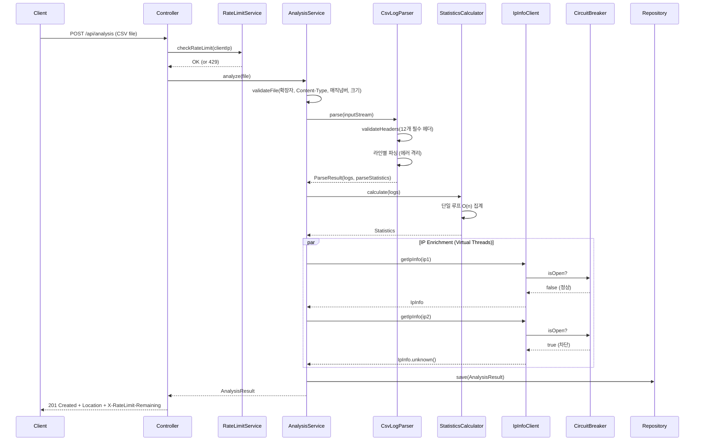

## 들어가며

사내 웹 서비스의 접속 로그(CSV)를 업로드하면 **통계 분석 + IP 지리 정보 조회**를 수행하고, 결과를 REST API로 제공하는 서비스를 설계해야 했습니다.

단순히 "CSV 읽고 통계 뿌려주기"로 끝날 수도 있지만, 실제로 구현하면서 마주친 문제들은 예상보다 훨씬 깊었습니다.

- 20만 줄의 CSV를 어떻게 안전하게 파싱할 것인가
- 외부 API(ipinfo.io)가 느리거나 죽으면 전체 분석이 멈추는 것을 어떻게 막을 것인가
- 인메모리 저장소의 동시성과 메모리 상한을 어떻게 제어할 것인가
- 파일 업로드 보안 검증은 어디까지 해야 하는가

이 글에서는 **아키텍처 설계부터 동시성 제어, 장애 격리, 보안, 그리고 개발 프로세스까지** 전체 설계 과정을 코드와 함께 공유합니다.

---

## 프로젝트 개요

### 기능 요약

```
사용자 → CSV 파일 업로드 (POST /api/analysis)
          ↓
      [파일 검증] → 확장자, Content-Type, 매직 넘버, 바이너리 검사
          ↓
      [CSV 파싱] → 헤더 검증, 라인별 에러 격리, BOM 처리
          ↓
      [통계 계산] → 단일 루프 O(n) 집계 (상태 코드, 경로, IP, 메서드, 응답시간)
          ↓
      [IP Enrichment] → Virtual Threads 병렬 처리 + 타임아웃 + 캐시 + Circuit Breaker
          ↓
      [결과 저장] → Caffeine Cache (TTL 24h, 최대 1000건)
          ↓
      [응답 반환] → 201 Created + Location 헤더
```

### 기술 스택

| 영역 | 기술 | 선택 이유 |
|------|------|----------|
| Language | Java 21 | Record, Virtual Threads, Pattern Matching |
| Framework | Spring Boot 3.2.2 | 생태계, ConfigurationProperties Record 지원 |
| CSV Parsing | Apache Commons CSV 1.10 | RFC 4180 준수, 스트리밍 파싱, BOM 처리 |
| Caching | Caffeine 3.1.8 | Window TinyLFU 알고리즘, 85%+ 적중률 |
| API Docs | springdoc-openapi 2.3 | OpenAPI 3.0 자동 생성 |
| Build | Gradle Kotlin DSL | 타입 안전한 빌드 스크립트 |

---

## 개발 프로세스: 19개 이슈와 25개 PR

이 프로젝트는 **이슈 기반 개발(Issue-Driven Development)** 을 철저히 따랐습니다. 모든 코드 변경은 이슈에서 시작하고, PR로 구현하며, 코드 리뷰를 거쳐 병합됩니다.

### 브랜치 전략: Git Flow

```
main ──────────────────────────────────────────────
  │                                              ↑
  └─→ develop ─────────────────────────────────→ merge
        ├─→ feature/domain ─────────→ PR #6
        ├─→ feature/infrastructure ──→ PR #7
        ├─→ feature/application ─────→ PR #8
        ├─→ feature/api ────────────→ PR #9
        ├─→ fix/issue-1 ~ fix/issue-9 → PR #25~#35 (도메인 강화)
        ├─→ hotfix/issue-5 ~ hotfix/issue-9 → PR #36~#38 (안정성)
        └─→ feature/issue-10 ~ issue-14 → PR #39~#44 (성능/보안/기능)
```

커밋 컨벤션: `feat:`, `fix:`, `refactor:`, `perf:`, `security:`, `chore:`, `test:`, `docs:`

### 개발 타임라인: 점진적 개선의 기록

이 프로젝트의 가장 큰 특징은 **한 번에 완벽한 코드를 작성한 것이 아니라, 19개의 이슈를 통해 점진적으로 개선했다**는 것입니다. 각 이슈는 구체적인 문제 정의 → 복수의 개선안 비교 → 선택 근거를 포함합니다.

#### Phase 1: 초기 구현 (2/7)

| PR | 제목 | 변경 |
|----|------|------|
| #5 | 프로젝트 작업 흐름 표준화 및 컨벤션 문서화 | CODE_CONVENTION.md, CONTRIBUTING.md, 이슈/PR 템플릿 |
| #6 | 도메인 모델 구현 (AccessLog, IpInfo, AnalysisResult) | +209 |
| #7 | 로그 파싱 및 외부 API 연동 인프라 구현 | +445 |
| #8 | 로그 분석 오케스트레이션 서비스 구현 | +288 |
| #9 | REST API 및 전역 예외 처리 구현 | +376 |

이 단계에서 **기본 동작하는 MVP**가 완성되었습니다. 하지만 여기서 끝내지 않고, 도메인 모델의 취약점들을 이슈로 등록합니다.

#### Phase 2: 도메인 강화 (2/8)

| 이슈 | 문제 | PR | 해결 |
|------|------|-----|------|
| #1 | Builder에서 필수 필드 누락 시 NPE 발생 시점이 늦음 | #25 | `@NonNull`로 빌드 시점 검증 |
| #2 | Statistics의 List/Map이 외부에서 변경 가능 | #26 | Record 전환 + `List.copyOf()` 방어적 복사 |
| #3 | IpInfo 생성 시 null/blank 필드가 그대로 노출 | #27 | Compact Constructor로 "UNKNOWN" 치환 |
| #4 | 도메인 비즈니스 로직 테스트 부재 | #28 | 단위 테스트 +532줄 추가 |

**Issue #1의 문제 인식 과정:**

```java
// Before: 빌더에서 analysisId를 누락해도 컴파일/빌드 성공
AnalysisResult result = AnalysisResult.builder()
    .completedAt(LocalDateTime.now())
    .statistics(stats)
    .build();  // analysisId가 null — 이후 getAnalysisId() 호출 시점에 NPE

// After: @NonNull → 빌드 시점에 즉시 NullPointerException
@NonNull String analysisId;  // builder.build() 호출 시 null이면 즉시 예외
```

이슈에서 **3가지 대안을 비교**했습니다:
1. `@NonNull` (Lombok) — 빌드 시점 검증, 간결
2. `@Builder.Default` — 기본값 제공, 하지만 analysisId에 기본값은 부적절
3. 별도 validate() 메서드 — 명시적이지만 호출 누락 가능

**선택: `@NonNull`** — 컴파일 타임에 가장 가까운 시점에서 실패하고, 코드 변경량이 최소

#### Phase 3: 인프라 안정성 (2/9)

| 이슈 | 문제 | PR | 해결 |
|------|------|-----|------|
| #10 | CSV 파서가 헤더 검증 없이 파싱, 에러 시 전체 중단 | #29 | 헤더 검증 + 라인별 에러 격리 + ParseStatistics |
| #11 | ipinfo.io 장애 시 전체 분석 실패 | #30 | Retry + Circuit Breaker + Timeout |
| #12 | Repository가 ConcurrentHashMap — 메모리 상한 없음 | #31 | Caffeine Cache (1000건, TTL 24h) |
| #13 | 동시성 회귀 테스트 부재 | #32 | 멀티스레드 안전성 테스트 +351줄 |
| #14 | 커스텀 예외 체계 부재 — Spring 기본 예외 사용 | #33 | LogAnalyzerException 기반 예외 계층 |

**Issue #12: ConcurrentHashMap → Caffeine 전환의 근거**

이슈에서 3가지 옵션을 비교했습니다:
1. `ConcurrentHashMap` + 수동 TTL 관리 — 복잡하고 버그 위험
2. `Caffeine Cache` — Window TinyLFU, 높은 적중률, TTL/크기 제한 내장
3. `Redis` — 분산 환경 지원, 하지만 단일 서버에서는 과잉

**선택: Caffeine** — 단일 서버 환경에서 최적, DIP 덕분에 추후 Redis로 교체 가능

#### Phase 4: 성능 최적화 (2/11)

| 이슈 | 문제 | PR | 해결 |
|------|------|-----|------|
| #15 | IP enrichment 순차 처리 — 10개 IP × 3초 = 30초 | #39 | Virtual Threads 병렬 처리 (+351/-38) |
| #16 | 통계 계산이 6회 순회 | #40 | 단일 루프 최적화 (+45/-60) |

#### Phase 5: 보안 및 API 개선 (2/12)

| 이슈 | 문제 | PR | 해결 |
|------|------|-----|------|
| #17 | 파일 업로드 보안 검증 부재 | #41 | 매직 넘버, Path Traversal, CRLF 방지 (+383/-136) |
| #18 | IP enrichment 실패 시 전체 분석 실패 | #43 | Graceful Degradation + warnings 필드 |
| #19 | Rate Limiting 없음 | #44 | Caffeine 기반 IP별 Rate Limit |
| #20 | REST API 모범 사례 미적용 | #42 | 201 Created + Location, DIP 인터페이스 추출 |

### PR 템플릿: 계층별 체크리스트

모든 PR은 **코드 컨벤션 체크리스트**를 포함합니다:

```markdown
## Code Convention Checklist

### 1. 객체 생성 & 수명 관리
- [ ] 정적 팩터리 메서드 또는 빌더로 캡슐화
- [ ] 자원 사용 시 try-with-resources 적용

### 2. 불변성 & 스레드 안정성
- [ ] 도메인 객체는 불변(record / @Value)으로 설계
- [ ] 내부 상태는 외부에서 수정할 수 없도록 보호

### 3. 메서드 계약
- [ ] public 메서드는 매개변수 유효성 검사 수행
- [ ] null 대신 Optional 또는 빈 컬렉션 반환

### 4. 계층 분리
- [ ] Domain 레이어는 외부 의존성 없음
- [ ] 외부 시스템 연동은 Infrastructure에 격리
```

이 체크리스트는 `docs/CODE_CONVENTION.md`에 정의된 **5가지 원칙**을 기반으로 합니다:
1. 객체 생성과 수명 관리 (정적 팩터리, Builder, DI, try-with-resources)
2. 불변성과 스레드 안정성 (Record, 방어적 복사, ConcurrentHashMap)
3. 메서드 계약과 방어적 프로그래밍 (Fail-Fast, null 반환 금지)
4. 계층 분리 원칙 (Domain 순수성, Infrastructure 격리)
5. 예외와 로깅 (도메인 예외, 민감 정보 비로깅)

### 이슈 템플릿: 트레이드오프 기반 의사결정

이슈 템플릿에서 가장 중요한 섹션은 **"개선 방안"**과 **"선택 및 근거"**입니다:

```markdown
## 개선 방안
### 방법 1 (코드 예시)
### 방법 2 (코드 예시)
### 방법 3 (코드 예시)

## 선택 및 근거
실제로 선택할 방법을 명시하고,
다른 방법을 선택하지 않은 이유를 설명합니다.

고려한 기준:
- 컴파일 타임 / 런타임 안전성
- 코드 컨벤션과의 일관성
- 복잡도 대비 효과
- 유지보수 비용
```

이 템플릿 구조 덕분에 모든 설계 결정의 **"왜?"**가 기록으로 남아있습니다.

---

## 아키텍처: 계층형 + DIP

### 왜 DIP(의존성 역전)를 부분 적용했는가

일반적인 계층형 아키텍처에서는 `Service → Repository`처럼 상위 계층이 하위 계층의 **구현체**를 직접 의존합니다. 이 경우 저장소를 ConcurrentHashMap에서 Caffeine으로 교체하거나, 추후 PostgreSQL로 전환할 때 서비스 계층 코드가 변경되어야 합니다.

이 프로젝트에서는 **교체 가능성이 높은 컴포넌트**인 파서와 저장소에 한해 Application 계층에 인터페이스를 두고, Infrastructure 계층이 이를 구현하는 **DIP(Dependency Inversion Principle)**를 적용했습니다. 전체를 Hexagonal Architecture로 만든 것은 아니고, `IpInfoClient`처럼 교체 가능성이 낮은 컴포넌트는 구현체를 직접 의존합니다.

```
┌─────────────────────────────────────────────────────────┐
│                    API Layer (api/)                      │
│  AnalysisController ← GlobalExceptionHandler            │
│  요청/응답 DTO, HTTP 상태 코드 매핑                        │
└────────────────────────┬────────────────────────────────┘
                         │ (의존)
┌────────────────────────▼────────────────────────────────┐
│              Application Layer (application/)            │
│  AnalysisService (오케스트레이터)                          │
│  StatisticsCalculator (통계 계산)                         │
│  RateLimitService (IP별 요청 제한)                        │
│                                                          │
│  <<interface>> LogParser          ← Port (SPI)           │
│  <<interface>> AnalysisResultRepository  ← Port (SPI)    │
└────────────────────────┬────────────────────────────────┘
                         │ (구현)
┌────────────────────────▼────────────────────────────────┐
│            Infrastructure Layer (infrastructure/)        │
│  CsvLogParser implements LogParser                       │
│  AnalysisRepository implements AnalysisResultRepository  │
│  IpInfoClient + IpInfoCircuitBreaker                    │
└─────────────────────────────────────────────────────────┘
                         │
┌────────────────────────▼────────────────────────────────┐
│                 Domain Layer (domain/)                    │
│  AccessLog, IpInfo, AnalysisResult (순수 모델)            │
│  ParseError, ParseStatistics (Value Object)              │
│  예외 계층 (LogAnalyzerException 기반)                    │
│  ※ 외부 의존성 Zero — Spring 어노테이션조차 없음            │
└─────────────────────────────────────────────────────────┘
```

### DIP 적용의 실제 코드

Application 계층에 정의된 Port:

```java
// application/LogParser.java — 파서 추상화
public interface LogParser {
    ParseResult parse(InputStream inputStream);

    record ParseResult(List<AccessLog> logs, ParseStatistics parseStatistics) {
        public ParseResult {
            logs = List.copyOf(logs);  // 방어적 복사
            Objects.requireNonNull(parseStatistics);
        }
    }
}
```

```java
// application/AnalysisResultRepository.java — 저장소 추상화
public interface AnalysisResultRepository {
    void save(AnalysisResult result);
    Optional<AnalysisResult> findById(String analysisId);
    List<AnalysisResult> findAll();
    boolean deleteById(String analysisId);
    long count();
}
```

AnalysisService는 이 **인터페이스만 의존**합니다:

```java
@Service
@RequiredArgsConstructor
public class AnalysisService {
    private final LogParser logParser;                    // 인터페이스
    private final AnalysisResultRepository repository;    // 인터페이스
    private final IpInfoClient ipInfoClient;
    private final StatisticsCalculator statisticsCalculator;
    private final LogAnalysisProperties properties;
    private final Executor ipEnrichmentExecutor;
}
```

이 구조 덕분에 저장소를 `ConcurrentHashMap` → `Caffeine Cache` → 추후 `JPA`로 교체해도, `AnalysisService`는 한 줄도 수정할 필요가 없습니다. 실제로 프로젝트 히스토리(Issue #12 → PR #31)에서 `ConcurrentHashMap`을 `Caffeine Cache`로 전환했는데, 서비스 계층은 전혀 변경되지 않았습니다.

### 분석 처리 흐름 (Sequence Diagram)



---

## 도메인 모델: 불변성과 방어적 복사

### Record를 선택한 이유

Java 16에서 정식 도입된 Record는 **불변성(immutability), 값 동등성(value equality), 간결함**을 보장합니다. 도메인 모델은 여러 스레드에서 동시에 읽힐 수 있으므로, 불변 객체는 동기화 없이도 Thread-safe합니다.

코드 컨벤션에서도 이를 명시합니다:

> "도메인 객체는 Java 17의 record 또는 Lombok의 @Value를 사용하여 정의한다. 객체는 생성 이후 상태가 변경되지 않으며, 모든 변경은 새 객체를 생성하는 방식으로 처리한다."

### AccessLog — 접속 로그 엔티티

```java
public record AccessLog(
    LocalDateTime timeGenerated,
    String clientIp,
    String httpMethod,
    String requestUri,
    String userAgent,
    Integer httpStatus,
    String httpVersion,
    Long receivedBytes,
    Long sentBytes,
    Double clientResponseTime,
    String sslProtocol,
    String originalRequestUriWithArgs
) {
    public boolean isSuccessful() {
        return httpStatus != null && httpStatus >= 200 && httpStatus < 300;
    }

    public String statusCategory() {
        if (httpStatus == null) return "Unknown";
        if (httpStatus >= 200 && httpStatus < 300) return "2xx";
        if (httpStatus >= 300 && httpStatus < 400) return "3xx";
        if (httpStatus >= 400 && httpStatus < 500) return "4xx";
        if (httpStatus >= 500 && httpStatus < 600) return "5xx";
        return "Unknown";
    }
}
```

모든 필드가 null을 허용하는 이유는 **CSV 파싱 시 특정 필드가 누락되더라도 나머지 데이터로 통계를 산출할 수 있어야 하기 때문**입니다. 비즈니스 로직(`isSuccessful`, `statusCategory`)은 null을 안전하게 처리합니다.

### IpInfo — Compact Constructor와 Null Safety

```java
public record IpInfo(
    String ip, String country, String region, String city, String organization
) {
    public IpInfo {
        if (ip == null || ip.isBlank()) {
            throw new IllegalArgumentException("IP는 null이거나 비어있을 수 없습니다");
        }
        country = country != null && !country.isBlank() ? country : "UNKNOWN";
        region  = region  != null && !region.isBlank()  ? region  : "UNKNOWN";
        city    = city    != null && !city.isBlank()     ? city    : "UNKNOWN";
        organization = organization != null && !organization.isBlank()
                     ? organization : "UNKNOWN";
    }

    public static IpInfo unknown(String ip) {
        return new IpInfo(ip, "UNKNOWN", "UNKNOWN", "UNKNOWN", "UNKNOWN");
    }

    public static IpInfo of(String ip, String country, String region,
                            String city, String organization) {
        return new IpInfo(ip, country, region, city, organization);
    }

    public boolean isValid() {
        return country != null && !"UNKNOWN".equals(country);
    }
}
```

**Issue #3에서 개선된 부분:**

초기 구현에서는 `new IpInfo(ip, null, null, null, null)`이 허용되었고, 사용 측에서 매번 null 체크를 해야 했습니다. Compact Constructor 도입으로 **생성 시점에 null → "UNKNOWN" 치환**이 이루어져, 외부에서 IpInfo를 사용하는 모든 코드가 null 체크 없이 안전하게 값을 읽을 수 있습니다.

정적 팩터리 메서드 `unknown(ip)`과 `of(...)`는 코드 컨벤션의 핵심 원칙입니다:

> "값 객체는 재사용 가능하면 정적 팩터리로 제공한다. `IpInfo.unknown(ip)` 호출은 단순히 객체를 만든다는 사실보다, '이 IP는 정보가 없는 상태다'라는 의미를 함께 전달한다."

`isValid()` 메서드는 캐싱 정책에서 핵심적인 역할을 합니다. `@Cacheable`의 `unless` 조건에서 유효하지 않은 결과(country가 UNKNOWN)는 캐시하지 않아, API가 복구되면 다시 조회할 수 있도록 합니다.

### AnalysisResult — Aggregate Root와 방어적 복사

```java
@Value
@Builder
public class AnalysisResult {
    @NonNull String analysisId;
    @NonNull LocalDateTime completedAt;
    Long processingTimeMs;
    @NonNull Statistics statistics;
    @Singular("ipDetail") Map<String, IpInfo> ipDetails;
    List<String> warnings;
    ParseStatistics parseStatistics;

    public AnalysisResult(/* ... */) {
        // ...
        this.ipDetails = (ipDetails == null) ? Map.of() : Map.copyOf(ipDetails);
        this.warnings = (warnings == null) ? Collections.emptyList() : List.copyOf(warnings);
        this.parseStatistics = (parseStatistics == null) ? ParseStatistics.empty() : parseStatistics;
    }

    // Getter에서도 방어적 복사
    public Map<String, IpInfo> getIpDetails() {
        return Map.copyOf(ipDetails);
    }
}
```

**이중 방어적 복사** (Issue #2에서 도입):

1. **생성자에서 `Map.copyOf()`**: 외부에서 전달된 Map의 참조를 끊어, 생성 후 외부에서 원본 Map을 수정해도 AnalysisResult에 영향이 없습니다.
2. **Getter에서 `Map.copyOf()`**: 반환된 Map을 통해 내부 상태를 변경하는 것을 방지합니다.

### Statistics — Record 기반 불변 통계 (Issue #2 → PR #26)

초기에는 `@Value @Builder` 클래스였지만, Issue #2에서 **Record로 전환**했습니다:

```java
@Builder
public record Statistics(
    long totalRequests,
    long successCount,
    long redirectCount,
    long clientErrorCount,
    long serverErrorCount,
    List<TopItem> topPaths,
    List<TopItem> topStatusCodes,
    List<TopItem> topIps,
    Map<String, Long> methodStats,
    double avgResponseTime,
    double avgSentBytes,
    long totalTraffic
) {
    public Statistics {
        topPaths = (topPaths != null) ? List.copyOf(topPaths) : List.of();
        topStatusCodes = (topStatusCodes != null) ? List.copyOf(topStatusCodes) : List.of();
        topIps = (topIps != null) ? List.copyOf(topIps) : List.of();
        methodStats = (methodStats != null) ? Map.copyOf(methodStats) : Map.of();
    }

    public double successRate() { return calculateRate(successCount); }
    public double clientErrorRate() { return calculateRate(clientErrorCount); }

    private double calculateRate(long count) {
        if (totalRequests == 0) return 0.0;
        return Math.round((count * 100.0 / totalRequests) * 100.0) / 100.0;
    }
}
```

### ParseStatistics — 불변량(Invariant) 검증

```java
public record ParseStatistics(
    long totalLines, long successCount, long errorCount,
    Map<String, Integer> errorsByType, List<ParseError> errorSamples
) {
    public static final int MAX_ERROR_SAMPLES = 10;

    public ParseStatistics {
        if (totalLines < 0) throw new IllegalArgumentException("totalLines는 음수일 수 없습니다");
        if (successCount < 0) throw new IllegalArgumentException("successCount는 음수일 수 없습니다");
        if (errorCount < 0) throw new IllegalArgumentException("errorCount는 음수일 수 없습니다");
        if (successCount + errorCount > totalLines) {
            throw new IllegalArgumentException(
                "successCount + errorCount는 totalLines를 초과할 수 없습니다");
        }
        errorsByType = (errorsByType != null) ? Map.copyOf(errorsByType) : Map.of();
        errorSamples = (errorSamples != null) ? List.copyOf(errorSamples) : List.of();
    }
}
```

`successCount + errorCount > totalLines`라는 비즈니스 불변량을 생성 시점에 강제합니다. 이 검증이 없으면 "100줄 중 성공 80줄, 에러 30줄"이라는 논리적으로 불가능한 상태가 만들어질 수 있습니다.

---

## 예외 계층: 도메인 예외 기반 HTTP 매핑

### 설계 원칙 (Issue #14 → PR #33)

예외 처리에서 가장 중요한 결정은 **"도메인 예외와 HTTP 상태 코드를 어디서 매핑할 것인가"**입니다.

Issue #14에서 3가지 접근을 비교했습니다:
1. Spring의 `ResponseStatusException` 사용 — 도메인이 HTTP를 알게 됨 (위반)
2. 도메인 예외 + `@ResponseStatus` 어노테이션 — 도메인에 Spring 의존성
3. **도메인 예외 + GlobalExceptionHandler 매핑** — 도메인 순수성 유지

**선택: 방법 3** — 도메인 예외가 HTTP를 모르게 하면서도, `errorCode`를 통해 클라이언트가 프로그래밍적으로 에러를 구분

```
LogAnalyzerException (abstract, RuntimeException)
├── InvalidFileException ─────────────── 400 BAD_REQUEST
│   └── FileTooLargeException ────────── 413 PAYLOAD_TOO_LARGE
├── InvalidCsvFormatException ────────── 400 BAD_REQUEST
├── LogParsingException ──────────────── 400 BAD_REQUEST
├── TooManyParsingErrorsException ────── 422 UNPROCESSABLE_ENTITY
├── AnalysisNotFoundException ────────── 404 NOT_FOUND
├── DuplicateAnalysisIdException ─────── 409 CONFLICT
├── ApiRateLimitExceededException ────── 429 TOO_MANY_REQUESTS
├── StatisticsCalculationException ───── 500 INTERNAL_SERVER_ERROR
└── IpInfoException ──────────────────── 502 BAD_GATEWAY
    ├── RateLimitExceededException ────── 429 TOO_MANY_REQUESTS
    ├── IpInfoAuthException ──────────── 502 BAD_GATEWAY
    └── IpInfoServerException ────────── 502 BAD_GATEWAY
```

### LogAnalyzerException — 최상위 예외

```java
public abstract class LogAnalyzerException extends RuntimeException {
    private final String errorCode;

    protected LogAnalyzerException(String errorCode, String message) {
        super(message);
        this.errorCode = Objects.requireNonNull(errorCode);
    }
}
```

`abstract`로 선언하여 직접 인스턴스화를 방지하고, 모든 하위 예외가 `errorCode`를 필수로 가지도록 강제합니다.

### 컨텍스트를 담는 예외

단순히 메시지만 전달하는 것이 아니라, **각 예외가 디버깅에 필요한 컨텍스트를 보유**합니다:

- `FileTooLargeException`: `actualSize`, `maxSize` — "50MB 제한인데 67MB를 업로드했다"
- `TooManyParsingErrorsException`: `totalLines`, `errorCount`, `List<ParseError>` — 에러 샘플을 422 응답에 포함
- `ApiRateLimitExceededException`: `retryAfterSeconds` — `Retry-After` 헤더 설정
- `InvalidCsvFormatException`: `List<String> missingHeaders` — 누락된 헤더 목록 전달

### GlobalExceptionHandler — 핸들러 순서의 중요성

```java
@RestControllerAdvice
public class GlobalExceptionHandler {

    // 429: Rate Limit 초과 → Retry-After 헤더
    @ExceptionHandler(ApiRateLimitExceededException.class)
    public ResponseEntity<ErrorResponse> handleApiRateLimitExceeded(
            ApiRateLimitExceededException e, HttpServletRequest request) {
        return ResponseEntity.status(HttpStatus.TOO_MANY_REQUESTS)
                .header("Retry-After", String.valueOf(e.getRetryAfterSeconds()))
                .body(ErrorResponse.of(HttpStatus.TOO_MANY_REQUESTS,
                        e.getErrorCode(), e.getMessage(), request.getRequestURI()));
    }

    // 422: 파싱 에러 과다 → 에러 샘플 포함
    @ExceptionHandler(TooManyParsingErrorsException.class)
    public ResponseEntity<ParsingErrorResponse> handleTooManyParsingErrors(
            TooManyParsingErrorsException e, HttpServletRequest request) {
        var errorSamples = e.getErrors().stream()
                .map(err -> new ParsingErrorResponse.ParseErrorSample(
                        err.lineNumber(), err.errorMessage(), err.errorType().name()))
                .toList();
        return ResponseEntity.status(HttpStatus.UNPROCESSABLE_ENTITY)
                .body(ParsingErrorResponse.of(e.getErrorCode(), e.getMessage(),
                        request.getRequestURI(), e.getTotalLines(),
                        e.getErrorCount(), errorSamples));
    }

    // catch-all: LogAnalyzerException → 500
    @ExceptionHandler(LogAnalyzerException.class)
    public ResponseEntity<ErrorResponse> handleLogAnalyzerException(
            LogAnalyzerException e, HttpServletRequest request) { /* ... */ }

    // 최종 catch-all: Exception → 500 + 내부 메시지 노출 안 함
    @ExceptionHandler(Exception.class)
    public ResponseEntity<ErrorResponse> handleException(Exception e, HttpServletRequest request) {
        return ResponseEntity.status(HttpStatus.INTERNAL_SERVER_ERROR)
                .body(ErrorResponse.of(HttpStatus.INTERNAL_SERVER_ERROR,
                        "INTERNAL_ERROR", "서버 오류가 발생했습니다",
                        request.getRequestURI()));
    }
}
```

Spring은 **가장 구체적인 예외 타입**의 핸들러를 먼저 매칭합니다. `FileTooLargeException`은 `InvalidFileException`의 자식이므로, `FileTooLargeException` 핸들러(413)가 먼저 매칭되고, 나머지 파일 오류는 `InvalidFileException` 핸들러(400)가 처리합니다.

---

## CSV 파싱: 라인 레벨 에러 격리

### Issue #10: "하나의 라인이 실패해도 나머지는 파싱한다"

20만 줄의 CSV 중 3줄에서 날짜 포맷 에러가 발생했다고 전체 파싱을 중단하면 안 됩니다. PR #29에서 **라인별 에러 격리(Line-Level Error Isolation)** 전략을 도입했습니다:

```java
for (CSVRecord record : csvParser) {
    lineNumber++;
    if (lineNumber > properties.maxFileLines()) {
        log.warn("최대 라인 수 도달: {}", properties.maxFileLines());
        break;
    }
    try {
        var accessLog = parseRecord(record);
        logs.add(accessLog);
    } catch (Exception e) {
        errorCount++;
        var errorType = classifyError(e);
        errorsByType.merge(errorType.name(), 1, Integer::sum);

        if (errorSamples.size() < ParseStatistics.MAX_ERROR_SAMPLES) {
            errorSamples.add(new ParseError(lineNumber, e.getMessage(),
                    errorType, LocalDateTime.now()));
        }
    }
}
```

에러 샘플은 **최대 10개**만 수집합니다. 10만 줄에서 5만 개의 에러가 발생하는 극단적인 경우에도 메모리를 보호합니다.

### 에러 분류(Error Classification)

```java
private ParseError.ErrorType classifyError(Exception e) {
    if (e instanceof NumberFormatException || e instanceof DateTimeParseException) {
        return ParseError.ErrorType.PARSING;      // 타입 변환 실패
    }
    if (e instanceof IllegalArgumentException) {
        return ParseError.ErrorType.VALIDATION;   // 비즈니스 규칙 위반
    }
    return ParseError.ErrorType.FORMAT;            // CSV 구조 자체 문제
}
```

클라이언트는 이 분류를 보고 "PARSING 에러가 많으면 날짜 포맷을 확인하고, FORMAT 에러가 많으면 CSV 구조를 확인하라"는 진단이 가능합니다.

### 헤더 검증: Locale.ROOT의 중요성

```java
private static final Set<String> REQUIRED_HEADERS = Set.of(
    "TimeGenerated [UTC]", "ClientIp", "HttpMethod", "RequestUri",
    "UserAgent", "HttpStatus", "HttpVersion", "ReceivedBytes",
    "SentBytes", "ClientResponseTime", "SslProtocol",
    "OriginalRequestUriWithArgs"
);

private void validateHeaders(Map<String, Integer> headerMap) {
    var actualHeaders = headerMap.keySet().stream()
            .map(h -> h.toLowerCase(Locale.ROOT))
            .collect(Collectors.toSet());

    var missingHeaders = REQUIRED_HEADERS.stream()
            .filter(required -> !actualHeaders.contains(required.toLowerCase(Locale.ROOT)))
            .sorted().toList();

    if (!missingHeaders.isEmpty()) {
        throw new InvalidCsvFormatException(
                "필수 헤더가 누락되었습니다: " + missingHeaders, missingHeaders);
    }
}
```

`Locale.ROOT`를 사용하는 이유는 **터키어 문제(Turkish locale problem)** 때문입니다. 터키어에서는 `'I'.toLowerCase()` = `'ı'`(점 없는 i)가 되어 `"HttpStatus".toLowerCase()` 비교가 실패할 수 있습니다. 이 이슈는 PR #38(로케일/불변성/예외 처리 안정성 전반 개선)에서 프로젝트 전체에 걸쳐 수정되었습니다.

### BOM 처리

```java
var reader = new BufferedReader(
    new InputStreamReader(
        BOMInputStream.builder().setInputStream(inputStream).get(),
        StandardCharsets.UTF_8));
```

Windows에서 생성된 CSV 파일은 UTF-8 BOM(Byte Order Mark, `0xEF 0xBB 0xBF`)이 파일 시작에 붙어있을 수 있습니다. 이를 처리하지 않으면 첫 번째 헤더 이름이 `"\uFEFFTimeGenerated [UTC]"`가 되어 헤더 검증이 실패합니다.

---

## 통계 계산: 단일 루프 O(n) 최적화

### Issue #16: 6-패스 → 1-패스 (PR #40)

PR #40의 변경은 겉보기에 작지만(+45/-60), 성능에 큰 영향을 줍니다.

**Before: 다중 패스 접근법**

```java
// 같은 리스트를 6번 순회: 20만 줄 × 6패스 = 120만 번 요소 접근
var topPaths = logs.stream().map(AccessLog::requestUri)
    .collect(groupingBy(identity(), counting())).entrySet().stream()
    .sorted(...).limit(10).toList();
var topIps = logs.stream().map(AccessLog::clientIp) /* ... */;
var avgTime = logs.stream().mapToDouble(AccessLog::clientResponseTime) /* ... */;
```

**After: 단일 루프 집계**

```java
public AnalysisResult.Statistics calculate(List<AccessLog> logs) {
    var statusCounts = new HashMap<String, Long>();
    var pathCounts = new HashMap<String, Long>();
    var statusCodeCounts = new HashMap<String, Long>();
    var ipCounts = new HashMap<String, Long>();
    var methodCounts = new HashMap<String, Long>();
    var responseTimeSum = 0.0;
    var responseTimeCount = 0;
    var totalTraffic = 0L;
    var sentBytesCount = 0;

    for (var log : logs) {
        statusCounts.merge(log.statusCategory(), 1L, Long::sum);
        if (log.requestUri() != null)
            pathCounts.merge(log.requestUri(), 1L, Long::sum);
        if (log.httpStatus() != null)
            statusCodeCounts.merge(String.valueOf(log.httpStatus()), 1L, Long::sum);
        if (log.clientIp() != null)
            ipCounts.merge(log.clientIp(), 1L, Long::sum);
        if (log.httpMethod() != null)
            methodCounts.merge(log.httpMethod(), 1L, Long::sum);
        if (log.clientResponseTime() != null) {
            responseTimeSum += log.clientResponseTime();
            responseTimeCount++;
        }
        if (log.sentBytes() != null) {
            totalTraffic += log.sentBytes();
            sentBytesCount++;
        }
    }
    // 후처리: Top N 추출, 평균 계산
}
```

**왜 `HashMap.merge()`를 사용했는가?**

`merge(key, 1L, Long::sum)`은 key가 없으면 1을 넣고, 있으면 기존 값에 1을 더합니다. `getOrDefault` + `put` 패턴보다 **한 번의 해시 룩업**으로 처리되어 더 효율적입니다.

**왜 Stream 대신 for-each?**

단일 루프에서 7개의 상태를 동시에 갱신하는 로직은 Stream의 함수형 패러다임(상태 없는 연산)과 맞지 않습니다. 가변 상태를 직접 다루는 명령형 루프가 여기서는 더 적합합니다.

---

## IP Enrichment: Virtual Threads + 장애 격리

이 프로젝트에서 가장 복잡하고 면접에서 깊게 파고들 수 있는 영역입니다.

### Issue #15: 순차 → 병렬 (PR #39, +351/-38)

초기 구현에서는 Top IP 10개를 **순차적으로** ipinfo.io에 조회했습니다. 각 호출이 최대 5초 걸리면 10개 × 5초 = **최대 50초 블로킹**. 이를 **4단계 장애 격리 전략**으로 해결했습니다:

```
요청 → [1. 캐시] → [2. Circuit Breaker] → [3. Retry + Backoff] → [4. Fallback]
         Hit?          Open?                 3회 재시도             IpInfo.unknown()
         ↓ Yes         ↓ Yes                 ↓ 실패
       즉시 반환     IpInfo.unknown()       IpInfo.unknown()
```

### 1단계: Caffeine 캐시 — 유효한 결과만 캐싱

```java
@Cacheable(value = "ipInfoCache", key = "#ip",
           unless = "#result == null || !#result.isValid()")
public IpInfo getIpInfo(String ip) { /* ... */ }
```

`unless` 조건이 핵심입니다. API가 일시적으로 장애가 나서 `IpInfo.unknown()`을 반환했는데 이것을 캐시하면, API가 복구된 후에도 **24시간 동안 계속 UNKNOWN을 반환**합니다. 유효하지 않은 결과를 캐시에서 제외하면, 다음 요청에서 API를 다시 호출할 기회를 얻습니다.

캐시 설정:

```java
@Configuration
@EnableCaching
public class CacheConfig {
    @Bean
    public CacheManager cacheManager() {
        var cacheManager = new CaffeineCacheManager();
        cacheManager.setCaffeine(Caffeine.newBuilder()
                .maximumSize(10_000)
                .expireAfterWrite(24, TimeUnit.HOURS)
                .expireAfterAccess(12, TimeUnit.HOURS)
                .initialCapacity(100)
                .recordStats());
        return cacheManager;
    }
}
```

### 2단계: Circuit Breaker — Lock-Free CAS 구현

Issue #11에서 도입, PR #30에서 구현, PR #37에서 동시성 버그 수정.

```java
@Component
public class IpInfoCircuitBreaker {
    private final AtomicInteger failureCount = new AtomicInteger(0);
    private final AtomicLong lastFailureTime = new AtomicLong(0);

    static final int FAILURE_THRESHOLD = 5;
    static final long TIMEOUT_MS = 60_000;  // 1분

    public boolean isOpen() {
        int currentFailures = failureCount.get();
        if (currentFailures < FAILURE_THRESHOLD) return false;

        // 타임아웃 지났으면 half-open → CAS로 단일 스레드만 리셋
        if (System.currentTimeMillis() - lastFailureTime.get() > TIMEOUT_MS) {
            if (failureCount.compareAndSet(currentFailures, 0)) {
                log.info("Circuit Breaker half-open: 재시도 허용");
                return false;
            }
            return failureCount.get() >= FAILURE_THRESHOLD;
        }
        return true;
    }

    public void recordFailure() {
        lastFailureTime.set(System.currentTimeMillis());  // 시각 먼저
        failureCount.incrementAndGet();                    // 카운트 나중
    }

    public void recordSuccess() {
        failureCount.set(0);
    }
}
```

**CAS(Compare-And-Swap)를 사용한 이유 — Thundering Herd 방지:**

Circuit이 OPEN에서 1분 지나면 HALF-OPEN으로 전환되는데, 10개 스레드가 동시에 `isOpen()`을 호출하면 모두 "false"를 받아 API를 호출할 수 있습니다. `compareAndSet(currentFailures, 0)`은 **정확히 하나의 스레드만** 리셋에 성공합니다.

**`recordFailure()`에서 timestamp를 먼저 기록하는 이유 (PR #37 리뷰에서 수정):**

순서를 바꾸면 `failureCount`가 5에 도달한 직후 다른 스레드가 `isOpen()`을 호출할 때 `lastFailureTime`이 아직 갱신되지 않아 **타임아웃이 이미 만료된 것으로 오판**할 수 있습니다.

### 3단계: Retry with Exponential Backoff

```java
private static final int MAX_ATTEMPTS = 3;
private static final long BACKOFF_MS = 1_000;

private IpInfo callWithRetry(String ip) {
    for (int attempt = 1; ; attempt++) {
        try {
            var result = callApi(ip);
            if (result.isValid()) {
                circuitBreaker.recordSuccess();
                return result;
            }
            if (attempt >= MAX_ATTEMPTS) {
                circuitBreaker.recordFailure();
                return IpInfo.unknown(ip);
            }
            sleep(BACKOFF_MS * attempt);  // 1초, 2초, 3초
        } catch (RateLimitExceededException | IpInfoAuthException e) {
            circuitBreaker.recordFailure();
            return IpInfo.unknown(ip);  // 즉시 포기 — 재시도 무의미
        } catch (Exception e) {
            if (attempt >= MAX_ATTEMPTS) {
                circuitBreaker.recordFailure();
                return IpInfo.unknown(ip);
            }
            sleep(BACKOFF_MS * attempt);
        }
    }
}
```

**재시도 전략의 핵심 설계 결정:**

| 예외 유형 | 재시도 여부 | 근거 |
|-----------|-----------|------|
| 429 Rate Limit | X (즉시 포기) | 재시도하면 더 심해짐 |
| 401/403 Auth | X (즉시 포기) | 인증 문제는 재시도로 해결 안 됨 |
| 5xx Server Error | O (최대 3회) | 일시적 장애일 수 있음 |
| Timeout | O (최대 3회) | 네트워크 순간 지연일 수 있음 |

### 4단계: Virtual Threads 병렬 처리 (PR #39)

```java
@Bean("ipEnrichmentExecutor")
public Executor ipEnrichmentExecutor() {
    return Executors.newVirtualThreadPerTaskExecutor();
}
```

```java
IpEnrichmentResult enrichIpInfo(List<AnalysisResult.TopItem> topIps) {
    var ips = topIps.stream()
            .map(AnalysisResult.TopItem::item)
            .filter(ip -> ip != null && !ip.isBlank())
            .distinct().toList();

    var timeout = properties.ipEnrichmentTimeoutSeconds();

    var futures = ips.stream()
            .collect(Collectors.toMap(
                ip -> ip,
                ip -> CompletableFuture.supplyAsync(
                    () -> fetchIpInfoSafely(ip), ipEnrichmentExecutor
                ).completeOnTimeout(IpInfo.unknown(ip), timeout, TimeUnit.SECONDS)
            ));

    CompletableFuture.allOf(futures.values().toArray(new CompletableFuture[0])).join();

    var failedIps = ipDetails.entrySet().stream()
            .filter(e -> !e.getValue().isValid())
            .map(Map.Entry::getKey).toList();

    var warnings = new ArrayList<String>();
    if (!failedIps.isEmpty()) {
        warnings.add("일부 IP 정보 조회에 실패했습니다: " + String.join(", ", failedIps));
    }
    return new IpEnrichmentResult(ipDetails, warnings);
}
```

**왜 Virtual Threads를 선택했는가?**

기존 Platform Thread 기반 스레드풀은 스레드 수가 제한적입니다. 각 API 호출이 3초씩 블로킹되면 OS 스레드가 아무것도 하지 않고 대기합니다.

Virtual Thread는 **블로킹 I/O 발생 시 OS 스레드(Carrier Thread)를 반납**하고, I/O가 완료되면 다른 OS 스레드에서 재개됩니다.

```
Platform Thread 10개 + IP 10개:
Thread-1: [───── API 호출 (3초 블로킹) ─────]
Thread-2: [───── API 호출 (3초 블로킹) ─────]
→ OS 스레드 10개 × 3초 = 30 스레드-초 소비

Virtual Thread + IP 10개:
Carrier-1: [VT1 시작→I/O 대기→VT2 시작→I/O 대기→VT3 재개→...]
Carrier-2: [VT4 시작→I/O 대기→VT1 재개→완료→VT5 시작→...]
→ OS 스레드 2-3개로 충분
```

**`completeOnTimeout`의 역할:**

개별 IP 조회가 5초 이상 걸리면 강제로 `IpInfo.unknown(ip)`을 반환합니다. **하나의 느린 IP가 전체 분석을 블로킹하는 것을 방지**합니다.

### Graceful Degradation (Issue #18 → PR #43)

IP enrichment가 실패하더라도 통계 분석 결과는 정상 반환되어야 합니다. PR #43에서 `warnings` 필드를 도입하여 부분 실패 정보를 클라이언트에 전달합니다:

```java
// AnalysisService.analyze() 내부
try {
    var enrichmentResult = enrichIpInfo(topIps);
    ipDetails = enrichmentResult.ipDetails();
    warnings.addAll(enrichmentResult.warnings());
} catch (Exception e) {
    log.warn("IP enrichment 전체 실패, 빈 결과로 대체: {}", e.getMessage());
    ipDetails = Collections.emptyMap();
    warnings.add("IP 정보 조회에 실패했습니다: " + e.getMessage());
}
```

---

## 파일 업로드 보안: Defense-in-Depth

### Issue #17 → PR #41 (+383/-136)

파일 업로드는 서버 보안의 가장 취약한 지점 중 하나입니다. 확장자만 검사하면 `.csv`로 위장한 악성 파일을 업로드할 수 있습니다. **5단계 검증(Defense-in-Depth)**을 적용했습니다.

### 1. 파일 크기 제한 (이중 방어)

```yaml
# Spring 레벨 (Multipart 파서에서 차단)
spring.servlet.multipart.max-file-size: 50MB
```

```java
// Application 레벨 (더 세밀한 제어)
var maxBytes = properties.maxFileSizeMb() * 1024L * 1024L;
if (file.getSize() > maxBytes) {
    throw new FileTooLargeException(
        String.format("파일 크기 초과 (최대 %dMB)", properties.maxFileSizeMb()),
        file.getSize(), maxBytes);
}
```

### 2. 파일명 검증

```java
private void validateFileName(String filename) {
    // Path Traversal 방지: "../../../etc/passwd"
    if (filename.contains("..") || filename.contains("/") || filename.contains("\\"))
        throw new InvalidFileException("잘못된 파일 이름");
    // CRLF 인젝션 방지: HTTP 헤더 조작 공격
    if (filename.contains("\r") || filename.contains("\n"))
        throw new InvalidFileException("잘못된 파일 이름");
    // 파일 이름 길이 제한: 파일 시스템 제한 (ext4: 255바이트)
    if (filename.length() > 255)
        throw new InvalidFileException("파일 이름이 너무 깁니다 (최대 255자)");
    // 확장자 검증
    if (!filename.toLowerCase(Locale.ROOT).endsWith(".csv"))
        throw new InvalidFileException("CSV 파일만 업로드 가능합니다");
}
```

### 3. Content-Type 화이트리스트

```java
private void validateContentType(String contentType) {
    if (contentType == null) return;
    var baseType = contentType.split(";")[0].trim().toLowerCase(Locale.ROOT);
    if (!properties.allowedContentTypeSet().contains(baseType))
        throw new InvalidFileException("허용되지 않은 파일 타입: " + baseType);
}
```

`"text/csv; charset=UTF-8"` → `"text/csv"`로 정규화 후 비교합니다.

### 4. 매직 넘버(Magic Bytes) 검사

```java
private void validateFileContent(MultipartFile file) {
    try (var is = file.getInputStream()) {
        var header = new byte[512];
        var bytesRead = is.read(header);

        // ZIP (PK 시그니처): 0x50 0x4B
        if (header[0] == 0x50 && header[1] == 0x4B)
            throw new InvalidFileException("압축 파일은 업로드할 수 없습니다");
        // GZIP: 0x1F 0x8B
        if (header[0] == 0x1F && header[1] == (byte) 0x8B)
            throw new InvalidFileException("압축 파일은 업로드할 수 없습니다");

        // 바이너리 파일 감지: NULL 바이트(0x00) 존재 여부
        for (int i = 0; i < bytesRead; i++) {
            if (header[i] == 0)
                throw new InvalidFileException("바이너리 파일은 업로드할 수 없습니다");
        }
    }
}
```

확장자와 Content-Type은 클라이언트가 조작할 수 있습니다. 매직 넘버는 **파일의 실제 바이너리 내용**을 검사하므로 조작이 어렵습니다.

---

## Rate Limiting: 애플리케이션 레벨 구현

### Issue #19 → PR #44 (+332/-10)

```java
@Component
public class RateLimitService {
    private static final int MAX_TRACKED_IPS = 10_000;
    private final Cache<String, AtomicInteger> requestCounts;

    public RateLimitService(RateLimitProperties properties) {
        this.requestCounts = Caffeine.newBuilder()
                .expireAfterWrite(Duration.ofSeconds(properties.windowSeconds()))
                .maximumSize(MAX_TRACKED_IPS)
                .build();
    }

    public void checkRateLimit(String clientIp) {
        if (!properties.enabled()) return;

        AtomicInteger counter = requestCounts.get(clientIp, key -> new AtomicInteger(0));
        int current = counter.incrementAndGet();

        if (current > properties.maxRequestsPerMinute()) {
            throw new ApiRateLimitExceededException(
                String.format("IP %s의 요청이 %d초 내 %d회 한도를 초과했습니다",
                    clientIp, properties.windowSeconds(),
                    properties.maxRequestsPerMinute()),
                properties.windowSeconds());
        }
    }
}
```

**`requestCounts.get(clientIp, key -> new AtomicInteger(0))`의 동작:**

Caffeine의 `get(key, mappingFunction)`은 **원자적(atomic)**입니다. 동일 IP로 동시에 두 요청이 들어와도 `AtomicInteger`는 정확히 하나만 생성됩니다. 이후 `incrementAndGet()`도 원자적이므로 카운트가 누락되거나 중복되지 않습니다.

PR #44의 리뷰에서 지적된 포인트: `Retry-After` 헤더 값을 하드코딩하지 않고 설정에서 가져오도록 수정.

---

## 저장소: Caffeine Cache 기반 인메모리 저장소

### Issue #12 → PR #31: ConcurrentHashMap → Caffeine

```java
@Repository
public class AnalysisRepository implements AnalysisResultRepository {
    private final Cache<String, AnalysisResult> storage;

    public AnalysisRepository() {
        this.storage = Caffeine.newBuilder()
                .maximumSize(1_000)
                .expireAfterWrite(24, TimeUnit.HOURS)
                .expireAfterAccess(12, TimeUnit.HOURS)
                .removalListener((String key, AnalysisResult value, RemovalCause cause) -> {
                    if (cause.wasEvicted()) {
                        log.debug("분석 결과 자동 제거: id={}, reason={}", key, cause);
                    }
                })
                .recordStats()
                .build();
    }

    public void save(AnalysisResult result) {
        var existing = storage.asMap().putIfAbsent(result.getAnalysisId(), result);
        if (existing != null) {
            throw new DuplicateAnalysisIdException(result.getAnalysisId());
        }
    }
}
```

### 듀얼 TTL 전략

- **expireAfterWrite(24h)**: 아무리 자주 조회되어도 24시간 후 만료. 오래된 결과가 영원히 남는 것을 방지.
- **expireAfterAccess(12h)**: 12시간 미접근 시 조기 만료. 사용되지 않는 결과의 메모리 점유를 방지.

두 정책 중 **먼저 만료되는 쪽이 적용**됩니다.

### PR #36: Eviction 검증 및 동시성 안정성 개선

PR #36에서 수정된 문제들:
- `deleteById`가 `storage.invalidate()`를 사용하면 반환값을 알 수 없음 → `storage.asMap().remove()`로 변경
- `count()`가 `storage.estimatedSize()`를 사용하면 정확하지 않음 → `storage.asMap().size()`로 변경
- eviction 테스트가 `cleanUp()` 호출 없이 검증 → 비동기 eviction 특성을 고려한 테스트로 변경

---

## REST API 설계

### Issue #20 → PR #42: REST API 모범 사례

Issue #20에서 REST 모범 사례를 검토한 후 적용한 항목:

| 항목 | 적용 여부 | 근거 |
|------|----------|------|
| 201 Created + Location | O | RFC 7231 필수 |
| 204 No Content (DELETE) | O | 삭제 성공 시 본문 불필요 |
| OPTIONS + Allow 헤더 | O | 지원 메서드 discovery |
| ETag / Cache-Control | X | "분석 결과는 생성 후 불변이고, 인메모리 저장소로 현재 단계에선 과하다 판단" |

```java
@PostMapping(consumes = MediaType.MULTIPART_FORM_DATA_VALUE)
public ResponseEntity<AnalysisIdResponse> analyze(
        @RequestParam("file") @NotNull MultipartFile file,
        HttpServletRequest request) {

    String clientIp = request.getRemoteAddr();
    rateLimitService.checkRateLimit(clientIp);

    var result = analysisService.analyze(file);

    var location = ServletUriComponentsBuilder.fromCurrentRequest()
            .path("/{id}")
            .buildAndExpand(result.getAnalysisId())
            .toUri();

    return ResponseEntity.created(location)
            .header("X-RateLimit-Remaining",
                    String.valueOf(rateLimitService.getRemainingRequests(clientIp)))
            .body(new AnalysisIdResponse(result.getAnalysisId(), "분석이 완료되었습니다"));
}
```

---

## 설정 관리: Record 기반 @ConfigurationProperties

```java
@ConfigurationProperties(prefix = "log-analysis")
public record LogAnalysisProperties(
    @DefaultValue("200000") int maxFileLines,
    @DefaultValue("10") int topNResults,
    @DefaultValue("50") int maxFileSizeMb,
    @DefaultValue("5") int ipEnrichmentTimeoutSeconds,
    @DefaultValue({"text/csv", "text/plain", "application/csv", "application/vnd.ms-excel"})
    List<String> allowedContentTypes
) {
    public LogAnalysisProperties {
        if (maxFileLines <= 0)
            throw new IllegalArgumentException("maxFileLines는 양수여야 합니다");
        if (topNResults <= 0)
            throw new IllegalArgumentException("topNResults는 양수여야 합니다");
        // Content-Type 정규화
        allowedContentTypes = allowedContentTypes.stream()
                .filter(t -> t != null && !t.isBlank())
                .map(t -> t.trim().toLowerCase(Locale.ROOT))
                .toList();
    }
}
```

Spring Boot 3.x부터 Record를 `@ConfigurationProperties`로 직접 사용할 수 있습니다. Compact Constructor에서 검증을 수행하므로, **애플리케이션 시작 시점에 잘못된 설정이 있으면 즉시 실패(Fail-Fast)** 합니다.

```yaml
# application.yml
log-analysis:
  max-file-lines: 200000
  max-file-size-mb: 50
  top-n-results: 10
  ip-enrichment-timeout-seconds: 5

rate-limit:
  max-requests-per-minute: 10
  enabled: true
  window-seconds: 60

ipinfo:
  base-url: https://ipinfo.io
  token: ${IPINFO_TOKEN:}   # 환경변수에서 주입
```

PR #44 리뷰에서 `@DefaultValue` 파싱 오류(배열 타입 바인딩)가 발견되어 수정된 이력이 있습니다.

---

## 테스트 전략

### 테스트 구조와 커버리지

```
src/test/ (18개 테스트 파일)
├── api/
│   ├── AnalysisControllerTest       201/204/404 + Rate Limit + Location 헤더
│   ├── AnalysisResponseTest         DTO 변환 검증
│   ├── ErrorResponseTest            에러 응답 생성
│   └── GlobalExceptionHandlerTest   예외 → HTTP 매핑 (13개 핸들러)
├── application/
│   ├── AnalysisServiceTest          파일 검증, IP enrichment, 에러 흐름
│   └── RateLimitServiceTest         한도/초과/비활성화/IP별 독립/null
├── domain/
│   ├── AccessLogTest                isSuccessful(), statusCategory()
│   ├── AnalysisResultTest           Builder, 불변성, 방어적 복사
│   ├── IpInfoTest                   Compact Constructor, 팩터리 메서드
│   ├── ParseErrorTest               에러 타입 분류
│   ├── ParseStatisticsTest          불변량 검증, 방어적 복사
│   └── InvalidCsvFormatExceptionTest 예외 계층
├── infrastructure/
│   ├── client/
│   │   ├── IpInfoClientTest         캐시, Retry, Circuit Breaker 통합
│   │   ├── IpInfoCircuitBreakerTest CAS, 상태 전이, 동시성 (50스레드)
│   │   └── IpInfoErrorHandlerTest   HTTP 상태 → 예외 매핑 (15케이스)
│   ├── parser/CsvLogParserTest      정상/비정상 CSV, BOM, 헤더 검증
│   └── repository/AnalysisRepositoryTest CRUD, eviction, 동시성
└── ConfigurationPropertiesBindingTest   프로퍼티 바인딩 + 검증
```

### 동시성 테스트 (Issue #13 → PR #32, +351줄)

프로젝트에서 가장 중요하게 다룬 테스트 영역입니다:

```java
@Test
void 동시에_50개_스레드가_실패를_기록해도_카운트가_정확해야_한다() throws Exception {
    int threadCount = 50;
    var latch = new CountDownLatch(1);
    var executor = Executors.newFixedThreadPool(threadCount);

    for (int i = 0; i < threadCount; i++) {
        executor.submit(() -> {
            latch.await();  // 모든 스레드가 동시에 시작
            circuitBreaker.recordFailure();
            return null;
        });
    }

    latch.countDown();  // 동시 시작!
    executor.shutdown();
    executor.awaitTermination(5, TimeUnit.SECONDS);

    assertThat(circuitBreaker.getFailureCount()).isEqualTo(50);
}
```

`CountDownLatch(1)`로 50개 스레드가 **정확히 동시에** `recordFailure()`를 호출합니다. `AtomicInteger.incrementAndGet()`이 CAS 기반이므로 lost update 없이 정확히 50이 됩니다.

### 테스트 패턴

코드 컨벤션에서 정의한 테스트 작성 원칙:
- **@DisplayName + @Nested**: 한글로 명확한 테스트 의도 표현
- **Mockito + AssertJ**: Mock 의존성, 표현력 있는 단언
- **CountDownLatch**: 동시성 시나리오 재현
- **ByteBuddy**: 바이트코드 조작 기반 모킹

---

## 코드 컨벤션 심화

### 5가지 핵심 원칙

프로젝트 전반에 걸쳐 적용된 코드 컨벤션을 정리합니다:

**1. 정적 팩터리 메서드**

```java
IpInfo.unknown(ip);     // "이 IP는 정보가 없는 상태다"
IpInfo.of(ip, ...);     // "이 IP는 검증된 정보로 생성된다"
ErrorResponse.of(status, errorCode, message, path);
ParseStatistics.empty(); // "빈 통계"
```

> "객체 생성에는 생성자 대신 정적 팩터리 메서드를 사용한다. 이는 생성 시점의 의도를 명확히 표현하고, 매개변수 검증과 기본값 처리 로직을 한 곳에 모으기 위함이다."

**2. Fail-Fast**

```java
Objects.requireNonNull(file, "file은 null일 수 없습니다");
Objects.requireNonNull(analysisId, "analysisId는 null일 수 없습니다");
Objects.requireNonNull(ip, "ip는 null일 수 없습니다");
```

> "메서드는 잘못된 입력을 조용히 허용하지 않는다. null이 허용되지 않는 경우, 메서드 진입 시점에서 즉시 검증한다."

**3. null 반환 금지**

```java
// null 대신 Optional
public Optional<AnalysisResult> findById(String analysisId) {
    return Optional.ofNullable(storage.getIfPresent(analysisId));
}

// null 대신 빈 컬렉션
public List<AnalysisResult> findAll() {
    return List.copyOf(storage.asMap().values());
}
```

**4. 자원 관리**

```java
try (var reader = new BufferedReader(
    new InputStreamReader(BOMInputStream.builder()
        .setInputStream(inputStream).get(), StandardCharsets.UTF_8))) {
    try (var csvParser = csvFormat.parse(reader)) {
        // ...
    }
}
```

**5. 인터럽트 존중**

```java
private boolean sleep(long ms) {
    try {
        Thread.sleep(ms);
        return false;
    } catch (InterruptedException e) {
        Thread.currentThread().interrupt();  // 인터럽트 플래그 복구
        return true;
    }
}
```

재시도 대기 중 인터럽트가 발생하면 즉시 중단하고 플래그를 복구합니다. Virtual Thread 환경에서 특히 중요합니다.

---

## 심화: 면접에서 나올 수 있는 질문과 답변

### Q1: "왜 Resilience4j를 안 쓰고 Circuit Breaker를 직접 구현했나요?"

Resilience4j는 검증된 라이브러리이지만, 이 프로젝트에서 필요한 것은 **단일 외부 API에 대한 단순한 실패 카운팅**입니다. Resilience4j의 CircuitBreaker는 슬라이딩 윈도우, 상태 전이 이벤트, 메트릭 수집 등 풍부한 기능을 제공하지만, 그만큼 의존성과 설정이 복잡해집니다.

직접 구현하면 **동작을 완전히 이해하고 제어**할 수 있습니다. AtomicInteger와 CAS를 사용한 Lock-Free 구현, Thundering Herd 방지, 연산 순서의 중요성 등을 구체적으로 설명할 수 있습니다.

### Q2: "인메모리 저장소를 프로덕션에서는 어떻게 하시겠습니까?"

DIP를 적용한 이유가 여기 있습니다. `AnalysisResultRepository` 인터페이스를 구현하는 `JpaAnalysisRepository`를 만들면 됩니다:

```java
@Repository
@Profile("production")
public class JpaAnalysisRepository implements AnalysisResultRepository {
    // JPA EntityManager 사용
}
```

AnalysisService는 인터페이스에만 의존하므로 한 줄도 수정하지 않습니다. 실제로 Issue #12에서 `ConcurrentHashMap` → `Caffeine`으로 전환할 때 서비스 계층은 변경되지 않았습니다.

### Q3: "Virtual Thread에서 synchronized를 쓰면 안 된다고 하는데요?"

Virtual Thread에서 `synchronized` 블록 안에서 블로킹 I/O를 하면 **Carrier Thread Pinning**이 발생합니다.

이 프로젝트에서는:
- Circuit Breaker → `AtomicInteger`/`AtomicLong` (CAS 기반, Lock-Free) → Pinning 없음
- Caffeine Cache → 내부적으로 `ReentrantLock` 사용하지만, 캐시 접근은 메모리 연산이므로 Pinning 시간이 극히 짧음
- RestTemplate → I/O 블로킹이 발생하지만 `synchronized` 밖에서 수행

### Q4: "단일 루프 최적화의 실질적인 성능 차이는요?"

20만 줄 기준:
- **6-패스**: 각 패스에서 CPU 캐시에 올린 데이터가 다음 패스에서 evict → L1/L2 캐시 미스. 리스트를 6번 순회 = ~120만 번 요소 접근
- **1-패스**: 한 번의 순회 = ~20만 번 요소 접근. CPU 캐시 적중률 높음

이론적으로 **CPU 캐시 효율에서 6배 이상** 차이. AccessLog Record가 12개 필드(~200바이트)이므로 캐시 라인(64바이트)을 여러 개 차지하여 캐시 미스 비용이 큼.

### Q5: "Caffeine의 Window TinyLFU 알고리즘이 뭔가요?"

LRU는 최근 접근 시간만 고려하여 대량의 일회성 접근에 캐시가 오염됩니다. Window TinyLFU는 **접근 빈도(Frequency)**를 주요 기준으로 사용합니다:

1. **Window Cache (1%)**: 새 항목이 잠시 머무는 공간 (LRU)
2. **Probation Cache**: Window에서 승격된 항목이 빈도를 축적
3. **Protected Cache**: 빈도가 높은 항목이 오래 유지

새 항목이 들어올 때 기존 항목의 빈도와 비교하여, 새 항목의 빈도가 낮으면 입장을 거부합니다.

### Q6: "CSV 외에 다른 로그 포맷도 지원하려면?"

`LogParser` 인터페이스가 이미 존재하므로 **Strategy 패턴**으로 확장:

```java
@Component
public class ApacheLogParser implements LogParser { /* ... */ }

@Component
public class NginxLogParser implements LogParser { /* ... */ }
```

파서 선택은 파일 내용의 첫 줄을 읽어 자동 감지하거나, 요청 시 `format` 파라미터로 지정.

### Q7: "대용량 파일을 비동기로 처리하려면?"

**202 Accepted 패턴**:

```
POST /api/analysis → 202 Accepted + { "jobId": "xxx", "status": "PROCESSING" }
GET /api/analysis/jobs/xxx → { "status": "COMPLETED", "resultId": "yyy" }
```

Spring `@Async` + `CompletableFuture`로 백그라운드 처리, Redis에 작업 상태를 저장, 클라이언트는 폴링이나 SSE로 진행 확인.

### Q8: "이 프로젝트에서 코드 리뷰는 어떻게 했나요?"

GitHub Copilot PR Reviewer를 활용하여 모든 PR에 자동 리뷰를 받았습니다. 총 25개 PR에서 약 70개 이상의 리뷰 코멘트가 달렸고, 주요 지적 사항들:

- PR #44: Retry-After 하드코딩 → 설정에서 가져오도록 수정
- PR #39: Virtual Threads 사용 시 timeout 처리 방식
- PR #37: Circuit Breaker `recordFailure()` 연산 순서 문제
- PR #36: Caffeine `deleteById` 원자성 문제, `estimatedSize()` 정확도 문제
- PR #32: 동시성 테스트에서 CountDownLatch 사용 패턴

이러한 리뷰 피드백을 반영하면서 **fix → hotfix → refactor** 브랜치를 통해 점진적으로 코드를 개선했습니다.

### Q9: "이 프로젝트에서 가장 어려웠던 부분은?"

**Circuit Breaker의 동시성 제어**입니다. 초기 구현에서 `recordFailure()`의 연산 순서(timestamp vs count)가 잘못되어, HALF-OPEN 전환 시 조기 리셋이 발생하는 버그가 있었습니다. 이 문제는 단위 테스트에서는 발견되지 않았고, **50개 스레드 동시성 테스트(PR #32)**를 작성하면서 비로소 발견되었습니다. PR #37에서 수정.

두 번째로 어려웠던 것은 **Caffeine Cache의 비동기 eviction** 입니다. `maximumSize(1000)`을 설정해도 `cache.asMap().size()`가 즉시 1000이 되지 않습니다. Caffeine은 eviction을 비동기로 처리하므로, 테스트에서 `cache.cleanUp()`을 명시적으로 호출해야 합니다. PR #36에서 이 문제를 수정했습니다.

---

## 향후 개선 방향 (미완료 이슈)

현재 열려 있는 이슈 2개:

| 이슈 | 제목 | 상태 |
|------|------|------|
| #22 | 통합 테스트 작성 | OPEN |
| #23 | 성능 벤치마크 및 프로파일링 | OPEN |

프로덕션 전환을 위한 개선 로드맵:

| 영역 | 현재 | 개선안 |
|------|------|--------|
| 저장소 | Caffeine 인메모리 | PostgreSQL + JPA (인터페이스 교체로 서비스 무변경) |
| 처리 방식 | 동기 (50MB → ~3.5s 블로킹) | 202 Accepted + 비동기 백그라운드 처리 |
| 인증 | 없음 | Spring Security + JWT 또는 API Key |
| 모니터링 | Actuator (health/info/metrics) | Prometheus + Grafana (Caffeine `recordStats()` 이미 활성화) |
| 로그 포맷 | CSV 전용 | Apache/Nginx/JSON → `LogParser` Strategy 패턴으로 확장 |
| Rate Limiting | 애플리케이션 레벨 | API Gateway (Kong, AWS API Gateway) |

---

## 마치며

이 프로젝트를 돌아보면, "CSV 파일 읽어서 통계 뿌려주기"라는 단순해 보이는 요구사항 안에 수많은 설계 결정이 숨어있었습니다.

- **아키텍처**: DIP를 적용하여 저장소 교체를 무비용으로 만든 것
- **불변성**: Record와 방어적 복사로 동기화 없이 Thread-Safe한 도메인 모델
- **장애 격리**: 캐시 → Circuit Breaker → Retry → Fallback의 4단계 방어
- **동시성**: Virtual Threads로 I/O 블로킹 비용을 최소화하고, CAS로 Lock-Free 동시성 제어
- **보안**: 확장자 → Content-Type → 매직 넘버 → 바이너리 감지의 다층 검증
- **성능**: 단일 루프 O(n) 집계로 CPU 캐시 효율 극대화
- **프로세스**: 19개 이슈를 통한 점진적 개선, PR 코드 리뷰, 코드 컨벤션 체크리스트

각 결정에는 **트레이드오프**가 있었고, 그 트레이드오프를 이해하고 설명할 수 있는 것이 중요합니다. "이렇게 했습니다"보다 **"이것과 저것을 비교했고, 이런 이유로 이것을 선택했습니다"**가 면접에서 더 강력한 답변입니다.

이 프로젝트의 모든 설계 결정의 근거는 GitHub 이슈에 기록되어 있고, 구현 과정은 PR 히스토리에, 코드 품질 기준은 `CODE_CONVENTION.md`에 문서화되어 있습니다.
