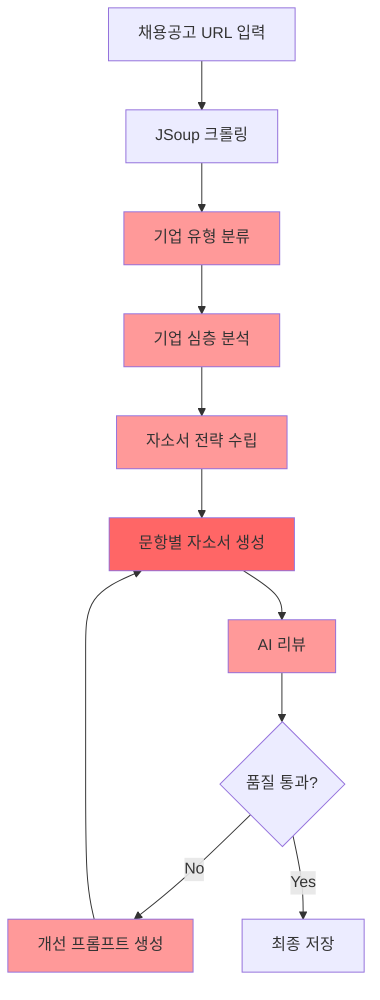
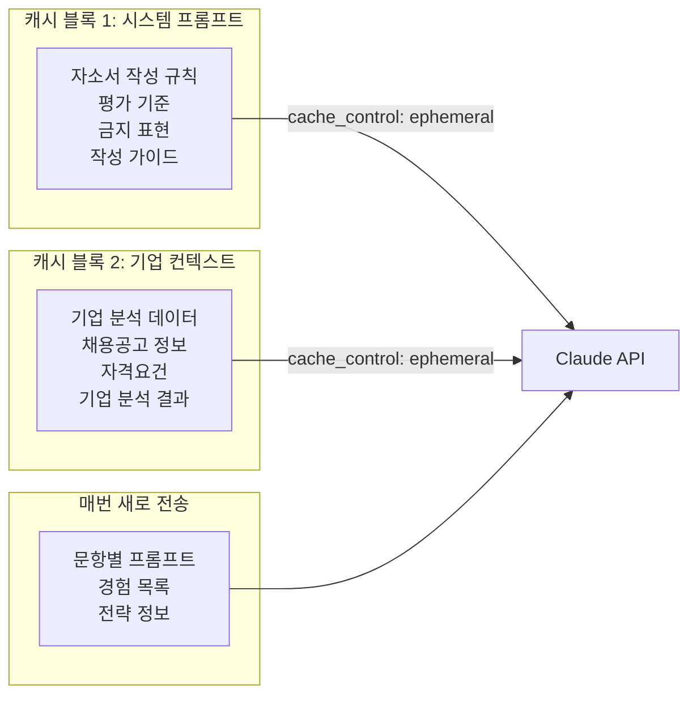
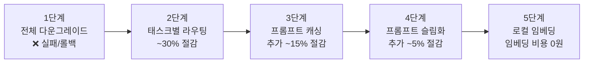

## 들어가며

취업 준비를 돕는 AI 자소서 생성 서비스를 사이드 프로젝트로 만들었습니다. 채용공고 URL을 넣으면 크롤링 → 기업 분석 → 자소서 생성 → AI 리뷰 반복 개선까지 전 과정을 자동으로 수행하는 서비스입니다.

문제는 비용이었습니다. 자소서 하나를 생성하는 데 **AI 호출이 최소 5회** 이상 발생합니다.

```
1. 기업 유형 분류 (Haiku 1회)
2. 기업 심층 분석 (Sonnet 1회)
3. 자소서 생성 (문항 N개 × Sonnet 1회)
4. 리뷰 (문항 N개 × 최대 2회)
5. 개선 (문항 N개 × 최대 1회)
```

자소서 문항이 4개인 공고 기준으로 **한 건당 AI 호출이 14회**까지 발생합니다. 처음에는 모든 호출에 Claude Sonnet을 사용했는데, 한 달 뒤 청구서를 보고 깜짝 놀랐습니다. 사이드 프로젝트 수준의 사용량인데도 비용이 무시할 수 없는 수준이었습니다.

이 글에서는 비용을 절반 이하로 줄이기까지 5단계의 최적화 과정을 **실제 코드와 git 커밋 이력**을 기반으로 공유합니다.

---

## 파이프라인 구조와 비용 발생 지점

먼저 전체 파이프라인에서 AI 호출이 어디에서 발생하는지 파악해야 합니다.



붉은색으로 표시한 노드가 모두 Claude API 호출 지점입니다. 진한 붉은색인 **자소서 생성** 단계가 가장 많은 토큰을 소비합니다. 시스템 프롬프트만 90줄에 달했고, 여기에 기업 분석 데이터, 경험 목록, 작성 가이드라인이 매 호출마다 포함되었습니다.

### 비용 구조 분석

Claude API는 **입력 토큰과 출력 토큰의 단가가 다릅니다**. Sonnet 기준으로 입력이 출력 대비 약 1/5 가격이지만, 시스템 프롬프트가 매 호출마다 반복 전송되면 입력 토큰이 빠르게 누적됩니다.

| 호출 단계 | 입력 토큰(추정) | 출력 토큰(추정) | 호출 빈도 |
|-----------|:---:|:---:|:---:|
| 기업 분류 | ~500 | ~50 | 1회 |
| 기업 분석 | ~2,000 | ~1,500 | 1회 |
| 전략 수립 | ~3,000 | ~800 | 1회 |
| 자소서 생성 | ~5,000 | ~2,000 | 문항 × 1 |
| AI 리뷰 | ~6,000 | ~800 | 문항 × 2 |
| 개선 생성 | ~7,000 | ~2,000 | 문항 × 1 |

4문항 기준 한 건당 **입력 약 50,000토큰 + 출력 약 18,000토큰**이 발생합니다. 여기서 입력 토큰의 상당 부분이 **매 호출마다 반복되는 시스템 프롬프트와 기업 컨텍스트**라는 점이 핵심입니다.

### 실제 비용 시뮬레이션

Claude Sonnet 기준 토큰 단가(2025년 기준)로 한 건당 비용을 추정하면:

| 구분 | 토큰 수 | 단가(1M 토큰당) | 비용 |
|------|:-------:|:---------------:|:----:|
| 입력 | ~50,000 | $3 | ~$0.15 |
| 출력 | ~18,000 | $15 | ~$0.27 |
| **합계** | | | **~$0.42/건** |

하루 50건 생성하면 월 $630, 100건이면 월 $1,260입니다. 사이드 프로젝트 수준에서는 감당하기 어려운 금액입니다. 특히 출력 토큰 단가가 입력의 5배이므로, 자소서처럼 **긴 텍스트를 생성하는 서비스**에서는 출력 비용이 전체의 60% 이상을 차지합니다.

---

## 1단계: 전체 모델 다운그레이드 — 그리고 실패

가장 먼저 시도한 것은 단순합니다. 모든 AI 호출을 Sonnet에서 Haiku로 바꾸는 것이었습니다.

> `e14afc3` refactor: AI API 비용 최적화 — 모델 다운그레이드 및 프롬프트 캐싱 적용

Haiku는 Sonnet 대비 **토큰당 단가가 약 1/10 수준**입니다. 단순 계산으로는 비용이 90% 줄어야 합니다.

### 결과: 비용 40-50% 절감, 하지만 품질 폭락

실제로는 40-50% 정도 절감되었습니다. 출력 토큰이 줄어들고 응답 속도도 빨라졌지만, **자소서 품질이 눈에 띄게 떨어졌습니다**.

Haiku가 생성한 자소서의 대표적인 문제점:

- **추상적 미사여구가 급증** — 구체적 경험 대신 일반론을 나열
- **기업 고유명사 누락** — 회사명만 바꾸면 어디든 쓸 수 있는 범용 자소서
- **문항 의도 파악 실패** — 질문이 묻는 것과 다른 답을 작성

리뷰 에이전트가 매긴 점수로도 차이가 명확했습니다. Sonnet 초안이 평균 65-70점대를 받던 것에 비해, Haiku 초안은 50-55점대에 머물렀습니다. 리뷰를 거쳐 개선해도 Sonnet 초안의 초기 수준에 도달하지 못했습니다.

결국 다시 전체를 Sonnet으로 되돌렸습니다.

> `7c2ce94` fix: 자소서 생성·리뷰 모두 Sonnet으로 변경 — Haiku 품질 문제 해결

**교훈: 비용 절감은 품질을 유지하는 범위 내에서만 의미가 있습니다.**

---

## 2단계: 태스크별 모델 라우팅

전체 다운그레이드가 실패한 후, 한 가지 관찰에서 실마리를 찾았습니다. **모든 태스크가 동일한 수준의 언어 능력을 요구하지는 않는다**는 것입니다.

자소서 **본문 생성**은 높은 문맥 이해력, 창의적 글쓰기 능력, 세밀한 지시 따르기가 필요합니다. 하지만 기업 분석이나 리뷰처럼 **구조화된 JSON을 출력**하는 태스크는 상대적으로 Haiku로도 충분한 품질을 낼 수 있었습니다.

> `0b6ac22` fix: API 비용 최적화 — Sonnet은 자소서 작성에만, 나머지 Haiku

### 태스크별 모델 배분

| 태스크 | 모델 | 근거 |
|--------|------|------|
| 기업 유형 분류 | **Haiku** | 5가지 분류 중 하나를 고르는 단순 분류 |
| 기업 심층 분석 | **Haiku** | JSON 구조화 출력, 사실 기반 분석 |
| 자소서 전략 수립 | **Haiku** | JSON 구조화 출력 |
| 자소서 생성 | **Sonnet** | 창의적 글쓰기, 세밀한 지시 따르기 필수 |
| 1차 리뷰 | **Sonnet** | 개선 방향 결정의 정확도가 전체 품질 좌우 |
| 2차+ 리뷰 | **Haiku** | 1차에서 잡은 방향의 확인 점검 |
| 면접 준비 분석 | **Haiku** | JSON 구조화 출력 |

핵심 원칙은 **자유 형식 한국어 글쓰기에는 Sonnet, 구조화된 JSON 출력에는 Haiku**입니다.

### AiRouter 구현

```java
@Component
@RequiredArgsConstructor
public class AiRouter {

    @Qualifier("claudeSonnet")
    private final AiPort claudeSonnet;

    @Qualifier("claudeHaiku")
    private final AiPort claudeHaiku;

    public AiPort route(CompanyType companyType) {
        // 자소서 생성은 항상 Sonnet — 품질이 최우선
        return claudeSonnet;
    }
}
```

자소서 생성 라우터는 항상 Sonnet을 반환합니다. 반면 리뷰 에이전트는 **반복 횟수에 따라 모델을 전환**합니다.

```java
// ReviewAgent.java
public ReviewResult review(String draft, JobPosting jobPosting, String question,
                           int iterationNum, List<UserExperience> providedExperiences,
                           int charLimit) {
    // 1차 리뷰는 Sonnet (개선 방향 결정), 2차+ Haiku (확인 점검)
    AiPort reviewer = (iterationNum == 1) ? claudeSonnet : claudeHaiku;

    log.info("[에이전트] {}차 검토 — 모델: {}", iterationNum, reviewer.getModelName());
    String response = reviewer.generate(REVIEWER_SYSTEM_PROMPT, jobContext, userPrompt);
    return parseReviewResponse(response);
}
```

1차 리뷰는 **개선 방향을 결정하는 가장 중요한 단계**이므로 Sonnet을 사용하고, 2차 이후 리뷰는 1차에서 잡은 방향이 제대로 반영되었는지 확인하는 점검 성격이므로 Haiku를 사용합니다.

또 하나 흥미로운 전환이 있었습니다. 처음에는 기업 분석에도 Sonnet을 사용했지만, 실제로 Haiku로 전환해도 품질 차이가 거의 없었습니다.

> `3f1aeeb` fix: InterviewPrepAnalyzer Sonnet → Haiku 전환 — 구조화 JSON 출력에 Sonnet 불필요

### 결과

14회 호출 기준으로, Sonnet 호출이 14회에서 **5~6회로 감소**했습니다. 나머지 8~9회는 Haiku로 처리됩니다. 토큰 단가 차이를 고려하면 **비용 약 30% 절감**, 품질은 이전과 동일하게 유지되었습니다.

---

## 3단계: Claude 프롬프트 캐싱

모델 라우팅만으로는 한계가 있었습니다. 같은 채용공고에 대해 문항별로 자소서를 생성하면, **매 호출마다 동일한 시스템 프롬프트와 기업 컨텍스트가 반복 전송**됩니다.

4문항 자소서 기준으로 생성 4회 + 리뷰 8회 + 개선 4회 = **16회 호출에서 시스템 프롬프트(약 2,000토큰)가 16번 중복 전송**됩니다. 기업 분석 데이터(약 1,500토큰)까지 합하면, 한 건당 약 **56,000토큰이 중복**되는 셈입니다.

Claude API에는 **Prompt Caching** 기능이 있습니다. `cache_control` 헤더로 특정 블록을 캐시하면, 5분 이내 동일 블록이 재사용될 때 **입력 토큰 비용이 90% 할인**됩니다.

> `51fc32d` fix: API 비용 절감 — 회사 컨텍스트를 캐시 블록으로 분리하여 반복 입력 토큰 절감

### 캐시 적중률 확인

Claude API의 프롬프트 캐싱을 사용하려면 요청 헤더에 베타 기능을 명시해야 합니다.

```java
.header("anthropic-beta", "prompt-caching-2024-07-31")
```

캐시가 정상 동작하는지는 응답 JSON의 `usage` 필드에서 확인할 수 있습니다.

```json
{
  "usage": {
    "input_tokens": 200,
    "cache_creation_input_tokens": 3500,
    "cache_read_input_tokens": 0
  }
}
```

- `cache_creation_input_tokens`: 첫 호출에서 캐시에 기록된 토큰 수. 정가의 125%가 과금됩니다.
- `cache_read_input_tokens`: 이후 호출에서 캐시에서 읽은 토큰 수. 정가의 10%만 과금됩니다.

첫 호출에서는 `cache_creation_input_tokens`에 값이 찍히고, 5분 이내의 후속 호출에서는 `cache_read_input_tokens`에 동일한 값이 찍히면 캐시가 정상 동작하는 것입니다. `input_tokens`에는 캐시되지 않은 토큰(문항별 프롬프트)만 남게 됩니다.

### 캐싱 전략: 2단계 캐시 구조



핵심 아이디어는 **변하지 않는 부분과 변하는 부분을 분리**하는 것입니다.

- **시스템 프롬프트**: 모든 호출에서 동일 → 캐시
- **기업 컨텍스트**: 같은 공고 내 모든 호출에서 동일 → 캐시
- **문항별 프롬프트**: 매번 다름 → 캐시하지 않음

### ClaudeAdapter 구현

```java
private String callClaude(String systemPrompt, String cachedContext, String userPrompt) {
    // 시스템 프롬프트를 캐시 블록으로 지정
    Map<String, Object> systemBlock = Map.of(
        "type", "text",
        "text", systemPrompt,
        "cache_control", Map.of("type", "ephemeral")
    );

    // 기업 컨텍스트가 있으면 user message를 2블록으로 분리
    Object userContent;
    if (cachedContext != null && !cachedContext.isBlank()) {
        userContent = List.of(
            Map.of("type", "text", "text", cachedContext,
                    "cache_control", Map.of("type", "ephemeral")),
            Map.of("type", "text", "text", userPrompt)
        );
    } else {
        userContent = userPrompt;
    }

    Map<String, Object> requestBody = Map.of(
        "model", modelName,
        "max_tokens", 4096,
        "system", List.of(systemBlock),
        "messages", List.of(Map.of("role", "user", "content", userContent))
    );
    // ...
}
```

시스템 프롬프트에 `cache_control: ephemeral`을 지정하고, 기업 컨텍스트도 별도 캐시 블록으로 분리했습니다. 문항별 프롬프트는 캐시 블록 없이 일반 텍스트로 전송합니다.

> `32ee470` fix: 작성 지침을 시스템 프롬프트로 이동하여 전 호출 캐시 적용

추가로, 원래 user 메시지에 포함되어 있던 작성 지침(평가 기준, 금지 표현 등)을 시스템 프롬프트로 이동시켰습니다. 시스템 프롬프트는 첫 호출에서 캐시된 후 이후 모든 호출에서 재사용되므로, user 메시지에 있을 때보다 캐시 효율이 훨씬 높습니다.

### 결과

16회 호출 기준, 시스템 프롬프트(~2,000토큰) + 기업 컨텍스트(~1,500토큰)가 **첫 호출에서만 정가로 과금되고, 나머지 15회에서는 90% 할인**됩니다.

절감 토큰: `(2,000 + 1,500) × 15회 × 0.9 = ~47,250토큰` 상당의 비용 절감.

---

## 4단계: 시스템 프롬프트 슬림화

프롬프트 캐싱이 효과적이었지만, **캐시 쓰기에도 비용이 발생**합니다. Claude의 프롬프트 캐싱은 캐시 쓰기 시 정가의 25%가 추가 과금됩니다. 시스템 프롬프트가 길수록 캐시 쓰기 비용도 늘어납니다.

> `e5c38b8` perf: 시스템 프롬프트 90줄→12줄 슬림화로 토큰 ~800절약/호출

초기 시스템 프롬프트는 90줄이었습니다. 여기에는 작성 규칙, 평가 기준, 금지 표현, AI 탐지 회피 전략, 키워드 전략 등이 모두 포함되어 있었습니다.

### Before: 90줄 시스템 프롬프트

```
당신은 대한민국 최고의 자소서 전문가입니다...
[핵심 철학] ...
[출력 규칙] ...
[합격 자소서의 3대 조건] ...
[기술 블로그 스타일 금지] ...
[경험 사용 규칙] ...
[HR 평가 포인트] ...
[평가 기준 — 8가지] ...
[키워드 전략] ...
[금지 표현] ...
[AI 판별 회피] ...
[최종 자가검증] ...
```

### 문제 분석

90줄 중 상당 부분이 **개별 문항 프롬프트에서 이미 구체적으로 지시하고 있는 내용의 중복**이었습니다. 예를 들어 시스템 프롬프트에서 구체적 경험 사용을 지시하면서, 문항별 프롬프트에서도 같은 내용을 반복하고 있었습니다.

슬림화의 원칙:

1. **시스템 프롬프트**: 모든 호출에 공통으로 적용되는 **최소한의 핵심 원칙**만 유지
2. **문항별 프롬프트**: 해당 문항에 특화된 **구체적 지시**를 포함

### After: 핵심만 남긴 시스템 프롬프트

최종적으로 시스템 프롬프트에는 역할 정의, 핵심 철학, 출력 규칙, 3대 합격 조건, 경험 사용 규칙, 금지 표현, 자가검증 체크리스트만 남겼습니다. 세부적인 작성 전략은 `CoverLetterPromptBuilder`가 문항별로 동적으로 주입합니다.

### 결과

호출당 입력 토큰이 약 800토큰 감소했습니다. 16회 호출 기준으로 **~12,800토큰 절감**. 캐시 쓰기 비용까지 고려하면 체감 효과는 더 큽니다.

다만 중요한 점은, 프롬프트를 줄인다고 무조건 좋은 것은 아닙니다. **핵심 지시를 제거하면 품질이 떨어집니다**. 실제로 슬림화 과정에서 기업 고유명사 사용 규칙을 빼버렸다가 조직적합도 점수가 급락한 적이 있습니다. 슬림화는 **중복을 제거**하는 것이지, **필요한 지시를 삭제**하는 것이 아닙니다.

---

## 5단계: 로컬 임베딩으로 외부 API 비용 제거

자소서 생성 시 사용자의 경험 데이터에서 관련 경험을 찾아오는 RAG(Retrieval-Augmented Generation) 파이프라인이 있습니다. 처음에는 경험이 적어서 단순히 전체 경험을 프롬프트에 넣었지만, 경험 데이터가 늘어나면서 **벡터 검색으로 관련 경험만 추출**해야 했습니다.

외부 임베딩 API(OpenAI Embeddings 등)를 사용하면 간편하지만, 호출마다 비용이 발생합니다. 자소서 문항 4개 기준으로 경험 검색이 4회, 리뷰 시 추가 검색까지 합하면 **한 건당 최소 8회의 임베딩 API 호출**이 필요합니다.

> `1d9f777` feat: ONNX 로컬 임베딩 + 인메모리 벡터 스토어 구현
> `987af07` feat: 자소서 생성 시 RAG 벡터 검색으로 전환

### ONNX Runtime 로컬 임베딩

외부 API 대신 **ONNX Runtime으로 임베딩 모델을 로컬에서 실행**하는 방식을 선택했습니다.

```groovy
// build.gradle
implementation platform('ai.djl:bom:0.31.1')
implementation 'ai.djl:api'
implementation 'ai.djl.onnxruntime:onnxruntime-engine'
implementation 'ai.djl.huggingface:tokenizers'
```

DJL(Deep Java Library)의 ONNX Runtime 엔진을 사용하면 JVM 위에서 직접 임베딩 모델을 실행할 수 있습니다. 외부 API 호출이 0이 되므로 **임베딩 관련 비용이 완전히 제거**됩니다.

### 임베딩 모델 선택: paraphrase-multilingual-MiniLM-L12-v2

여러 임베딩 모델을 비교한 후 `sentence-transformers/paraphrase-multilingual-MiniLM-L12-v2`를 선택했습니다.

| 모델 | 크기 | 차원 | 한국어 지원 | 비고 |
|------|:----:|:----:|:----------:|------|
| all-MiniLM-L6-v2 | ~80MB | 384 | X | 영어 전용, 한국어 임베딩 품질 매우 낮음 |
| **multilingual-MiniLM-L12-v2** | **~120MB** | **384** | **O** | 50개 이상 언어 지원, 한국어 품질 양호 |
| multilingual-e5-large | ~1.3GB | 1024 | O | 품질 우수하나 모델 크기가 10배 이상 |

선택 이유는 세 가지입니다. 첫째, **한국어 자소서**를 임베딩해야 하므로 다국어 지원이 필수입니다. 둘째, 사이드 프로젝트 서버에서 ~120MB는 감당 가능하지만 1.3GB는 메모리 부담이 큽니다. 셋째, 수십~수백 건 규모의 경험 데이터에서 Top-5를 뽑는 용도이므로, e5-large급 정밀도까지는 필요하지 않습니다.

```java
@PostConstruct
void init() {
    Criteria<String, float[]> criteria = Criteria.builder()
        .setTypes(String.class, float[].class)
        .optModelUrls("djl://ai.djl.huggingface.onnxruntime/sentence-transformers/paraphrase-multilingual-MiniLM-L12-v2")
        .optEngine("OnnxRuntime")
        .optTranslatorFactory(new TextEmbeddingTranslatorFactory())
        .optOption("pooling", "mean")
        .build();
    model = criteria.loadModel();
}
```

`optOption("pooling", "mean")`은 토큰 임베딩을 평균 풀링으로 합산하는 설정입니다. MiniLM 계열은 mean pooling이 기본 전략이고, CLS 토큰 풀링 대비 문장 유사도 태스크에서 더 나은 성능을 보입니다. 첫 실행 시 HuggingFace에서 모델을 자동 다운로드하며, 이후에는 로컬 캐시에서 로드됩니다.

### 인메모리 벡터 스토어

임베딩 벡터를 저장하고 검색하기 위해 별도의 벡터 DB(Pinecone, Qdrant 등)를 도입하는 대신, **인메모리 벡터 스토어**를 직접 구현했습니다. 경험 데이터가 수십~수백 건 수준이므로, 인메모리로 충분합니다.

```java
public List<Long> search(float[] queryVector, int topK, Set<Long> excludeIds) {
    return vectors.entrySet().stream()
        .filter(e -> !excludeIds.contains(e.getKey()))
        .map(e -> Map.entry(e.getKey(), cosineSimilarity(queryVector, e.getValue())))
        .sorted(Map.Entry.<Long, Double>comparingByValue().reversed())
        .limit(topK)
        .map(Map.Entry::getKey)
        .toList();
}
```

코사인 유사도로 가장 관련성 높은 경험 Top-K를 반환합니다.

### 원자적 영속화

벡터 스토어는 JSON 파일로 영속화되어 애플리케이션 재시작 시에도 유지됩니다. 저장 시 데이터 손실을 방지하기 위해 **임시 파일 → 원자적 이동** 전략을 사용합니다.

```java
private synchronized boolean tryPersist() {
    Path tempFile = storePath.resolveSibling(storePath.getFileName() + ".tmp");
    objectMapper.writerWithDefaultPrettyPrinter()
        .writeValue(tempFile.toFile(), serializable);
    Files.move(tempFile, storePath,
        StandardCopyOption.REPLACE_EXISTING, StandardCopyOption.ATOMIC_MOVE);
    return true;
}
```

JSON을 바로 대상 파일에 쓰면, 쓰는 도중 애플리케이션이 종료될 경우 파일이 깨집니다. 임시 파일에 완전히 쓴 뒤 원자적으로 이동(rename)하면, 어느 시점에 종료되어도 기존 파일 또는 새 파일 중 하나가 온전히 남습니다. 영속화 실패 시에는 메모리 변경분을 롤백하여 메모리와 파일의 정합성을 보장합니다.

### 폴백 처리

임베딩 모델 로드에 실패하거나 벡터 스토어가 비어 있는 경우에도 서비스가 중단되지 않도록 **폴백 체인**을 구성했습니다.

```java
public List<UserExperience> retrieveRelevant(String query, int topK, Set<Long> excludeIds) {
    if (!embeddingService.isAvailable() || vectorStore.isEmpty()) {
        return userExperienceRepository.findAll();  // 폴백: 전체 경험 반환
    }
    try {
        float[] queryVector = embeddingService.embed(query);
        List<Long> ids = vectorStore.search(queryVector, topK, excludeIds);
        // ...
    } catch (Exception e) {
        return userExperienceRepository.findAll();  // 폴백: 전체 경험 반환
    }
}
```

벡터 검색이 실패하면 DB에서 전체 경험을 가져와 프롬프트에 넣습니다. 정밀도는 떨어지지만 자소서 생성 자체는 계속 동작합니다. 이 폴백 덕분에 임베딩 인프라 문제가 전체 서비스를 중단시키지 않습니다.

### 증분 동기화

경험이 추가/삭제될 때마다 전체를 재인덱싱하는 것은 비효율적입니다. DB와 벡터 스토어를 비교해서 **차이분만 동기화**하는 증분 방식을 사용합니다.

```java
private void incrementalSync() {
    List<UserExperience> allExperiences = userExperienceRepository.findAll();
    Set<Long> dbIds = allExperiences.stream()
        .map(UserExperience::getId).collect(Collectors.toSet());
    Set<Long> storeIds = vectorStore.ids();

    // 벡터에만 있고 DB에 없는 것 → 삭제
    Set<Long> toRemove = storeIds.stream()
        .filter(id -> !dbIds.contains(id)).collect(Collectors.toSet());
    if (!toRemove.isEmpty()) {
        vectorStore.removeAll(toRemove);
    }

    // DB에만 있고 벡터에 없는 것 → 추가
    List<UserExperience> toIndex = allExperiences.stream()
        .filter(exp -> !storeIds.contains(exp.getId())).toList();

    Map<Long, float[]> batch = new LinkedHashMap<>();
    for (UserExperience exp : toIndex) {
        String text = buildEmbeddingText(exp);
        float[] vector = embeddingService.embed(text);
        batch.put(exp.getId(), vector);
    }
    if (!batch.isEmpty()) {
        vectorStore.putAll(batch);
    }
}
```

### 문항 유형 인식 RAG 쿼리

단순히 문항 텍스트를 벡터 검색하면 **문항 의도와 무관한 경험이 상위에 올라오는 문제**가 있었습니다. 예를 들어 지원동기 문항에 기술적 성과 경험이 매칭되는 식입니다.

이를 해결하기 위해 문항 유형을 먼저 분류하고, 유형에 맞는 키워드를 쿼리에 추가합니다.

```java
private String classifyForRetrieval(String questionText) {
    String q = questionText.toLowerCase();
    if (q.contains("지원동기") || q.contains("지원 동기") || ...) return "지원동기";
    if (q.contains("역량") || q.contains("강점") || ...) return "핵심역량";
    if (q.contains("문제") || q.contains("해결") || ...) return "문제해결";
    // ... 8가지 유형
    return "일반";
}

private String retrievalKeywords(String questionText) {
    return switch (classifyForRetrieval(questionText)) {
        case "지원동기" -> "동기 관심 계기 선택 이유";
        case "핵심역량" -> "역량 기술 성과 전문성";
        case "문제해결" -> "문제 해결 도전 극복 장애";
        // ...
    };
}
```

### 경험 중복 방지

4문항 자소서에서 같은 경험이 모든 문항에 주력으로 사용되면 자소서 전체의 다양성이 떨어집니다. **이전 문항에서 주력으로 사용된 경험 ID를 추적**하고, 다음 문항의 벡터 검색에서 제외합니다.

> `1e3d40d` fix: 자소서 문항별 경험 중복 방지 — 주력 경험 제외 + 문항 중심 검색 쿼리

```java
Set<Long> usedPrimaryIds = new LinkedHashSet<>();
for (EssayQuestion question : essayQuestions) {
    List<UserExperience> experiences = retrieveExperiencesOrFallback(
        jobPosting, question.questionText(), usedPrimaryIds);
    UserExperience primary = getPrimaryExperience(experiences);
    if (primary != null) {
        usedPrimaryIds.add(primary.getId());
    }
    // ... 자소서 생성
}
```

### 결과

- 외부 임베딩 API 비용: **완전 제거** (0원)
- 외부 벡터 DB 비용: **완전 제거** (0원)
- 검색 지연: 외부 API 호출 ~200ms → 인메모리 검색 **<1ms**
- 트레이드오프: 임베딩 모델 품질이 상용 API 대비 다소 낮지만, 수십 건 규모에서는 체감 차이 미미

---

## 종합 비용 절감 효과

5단계 최적화를 종합하면 다음과 같습니다.



| 최적화 단계 | 방법 | 절감 효과 | 품질 영향 |
|-------------|------|:---------:|:---------:|
| 1단계 | 전체 Haiku 전환 | ~40-50% | **품질 폭락 → 롤백** |
| 2단계 | 태스크별 모델 라우팅 | ~30% | 유지 |
| 3단계 | 프롬프트 캐싱 | 추가 ~15% | 유지 |
| 4단계 | 시스템 프롬프트 슬림화 | 추가 ~5% | 유지 |
| 5단계 | ONNX 로컬 임베딩 | 임베딩 비용 제거 | 유지 |
| **종합** | | **~50% 절감** | **유지** |

---

## 마치며

AI API 비용 최적화에서 가장 중요한 교훈은 **비용과 품질은 트레이드오프가 아니라, 구조적으로 분리할 수 있다**는 것입니다.

모든 호출에 동일한 모델을 사용하는 것은 모든 볼트에 같은 크기의 렌치를 쓰는 것과 같습니다. 태스크의 성격을 분석하고, **각 태스크에 적합한 모델을 배치**하는 것만으로도 상당한 비용을 줄일 수 있었습니다.

프롬프트 캐싱은 특히 **파이프라인 구조의 서비스**에서 효과적입니다. 같은 컨텍스트를 공유하는 연속 호출이 많을수록 캐시 적중률이 높아지고, 비용 절감 폭도 커집니다.

로컬 임베딩은 사이드 프로젝트 규모에서 특히 합리적인 선택입니다. 데이터가 수만 건 이하라면 인메모리 벡터 스토어로 충분하고, 외부 의존성 없이 완전히 자체적으로 운영할 수 있습니다.

이 글에서 다룬 최적화는 **Claude API에 국한되지 않습니다**. OpenAI, Gemini 등 대부분의 LLM API가 유사한 과금 구조를 가지고 있으므로, 태스크별 모델 라우팅과 프롬프트 캐싱 전략은 어떤 LLM 기반 서비스에서든 적용할 수 있습니다.

다만 한 가지 주의할 점은, 비용 최적화가 **목적이 되면 안 된다**는 것입니다. 이 프로젝트에서도 1단계(전체 다운그레이드)의 실패가 보여주듯, 품질을 유지하는 범위 내에서만 비용을 줄여야 합니다. 비용을 줄이기 위해 품질을 타협하면, 결국 사용자가 떠나고 서비스 자체가 의미를 잃습니다. **비용 최적화의 진짜 목표는, 같은 비용으로 더 많은 사용자에게 더 나은 품질을 제공하는 것**입니다.

---

## 참고: 커밋 이력으로 보는 최적화 타임라인

| 커밋 | 내용 |
|------|------|
| `e5c38b8` | perf: 시스템 프롬프트 90줄→12줄 슬림화로 토큰 ~800절약/호출 |
| `e14afc3` | refactor: AI API 비용 최적화 — 모델 다운그레이드 및 프롬프트 캐싱 적용 |
| `7c2ce94` | fix: 자소서 생성·리뷰 모두 Sonnet으로 변경 — Haiku 품질 문제 해결 |
| `0b6ac22` | fix: API 비용 최적화 — Sonnet은 자소서 작성에만, 나머지 Haiku |
| `3f1aeeb` | fix: InterviewPrepAnalyzer Sonnet → Haiku 전환 |
| `51fc32d` | fix: API 비용 절감 — 회사 컨텍스트를 캐시 블록으로 분리 |
| `32ee470` | fix: 작성 지침을 시스템 프롬프트로 이동하여 전 호출 캐시 적용 |
| `1d9f777` | feat: ONNX 로컬 임베딩 + 인메모리 벡터 스토어 구현 |
| `987af07` | feat: 자소서 생성 시 RAG 벡터 검색으로 전환 |
