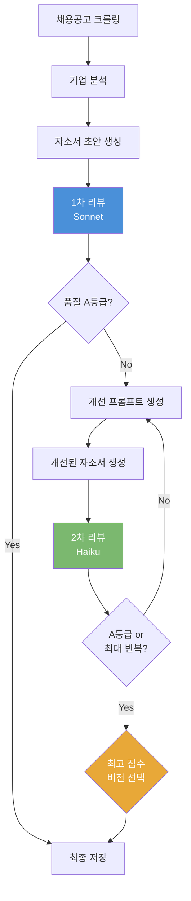
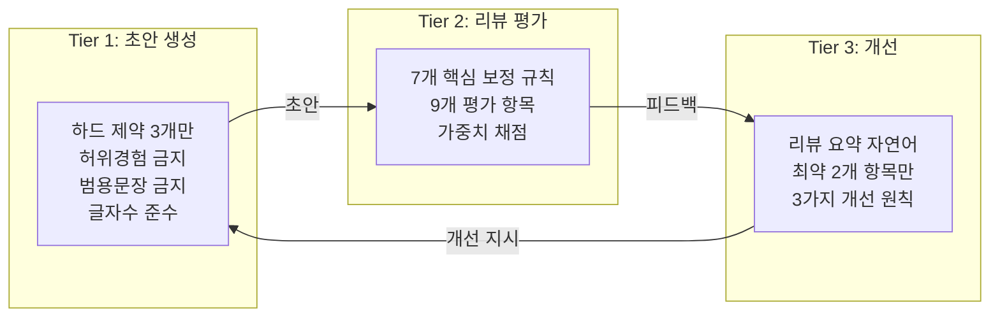
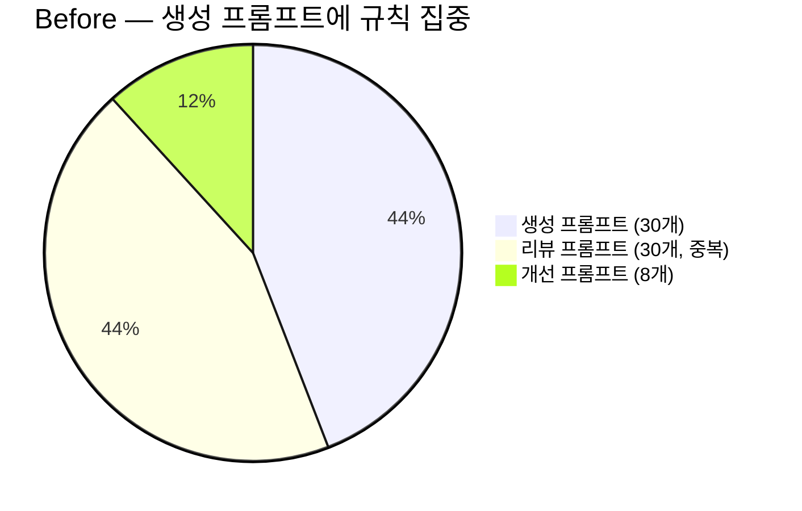
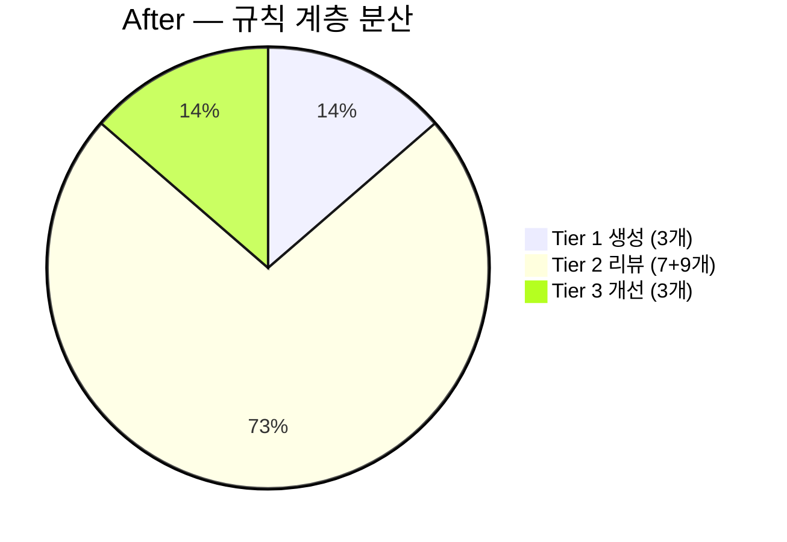

## 들어가며

AI로 자소서를 생성하면 초안의 품질이 들쭉날쭉합니다. 어떤 문항은 수준 높은 글이 나오지만, 같은 프롬프트로도 회사 고유명사를 빠뜨리거나, 질문 의도와 어긋난 답변을 쓰기도 합니다.

사람이 매번 읽고 고쳐주면 되지만, 그러면 자동화의 의미가 없습니다. **AI가 스스로 초안을 검토하고, 문제를 찾고, 개선하는 루프**를 만들면 어떨까? 이 생각에서 리뷰 에이전트가 시작되었습니다.

하지만 구현하면서 예상치 못한 문제들을 마주했습니다.

- AI가 자기 초안에 후한 점수를 매기는 **점수 인플레이션**
- 리뷰 피드백을 반영할수록 **오히려 점수가 떨어지는 역설**
- 규칙을 추가할수록 글이 **체크리스트 충족 게임**이 되어 경직되는 문제

이 글에서는 이 세 가지 문제를 하나씩 해결해 나간 과정을, 실제 코드와 git 커밋 이력을 기반으로 공유합니다.

---

## 전체 파이프라인에서 리뷰 에이전트의 위치



리뷰 에이전트는 **생성 → 리뷰 → 개선의 반복 루프**를 담당합니다. 초안 생성은 Sonnet, 리뷰는 1차 Sonnet / 2차 Haiku, 개선도 Sonnet이 수행합니다. 이 루프에서 세 가지 역할이 분리되어 있습니다.

| 역할 | 담당 | 설명 |
|------|------|------|
| **생성기** | CoverLetterPromptBuilder | 자소서 초안/개선 프롬프트 구성 |
| **평가자** | ReviewAgent | 9개 항목으로 채점, 위반사항/개선점 피드백 |
| **오케스트레이터** | CoverLetterFacade | 루프 제어, 품질 게이트, 최고 버전 추적 |

---

## 리뷰 루프 기본 구조

### 반복 횟수와 품질 게이트

```java
private static final int MAX_ITERATIONS = 2;
private static final int MIN_ITERATIONS = 1;
private static final String QUALITY_GRADE = "A";
```

최대 2회 반복하되, 1회 이후 A등급 이상이면 조기 종료합니다. 처음에는 최대 3회, 임계점수 85점이었지만, 실험을 거치며 현재 값으로 조정되었습니다.

등급 체계는 총점 기반으로 구분됩니다.

```java
public static String resolveGrade(int totalScore) {
    if (totalScore >= 90) return "S";
    if (totalScore >= 80) return "A";
    if (totalScore >= 70) return "B";
    if (totalScore >= 60) return "C";
    return "D";
}
```

| 등급 | 점수 범위 | 의미 | 품질 게이트 통과 |
|:----:|:---------:|------|:---------------:|
| S | 90점 이상 | 현직자도 감탄할 수준 | O |
| A | 80~89점 | 면접에 부르고 싶은 수준 | O |
| B | 70~79점 | 괜찮지만 아쉬움이 남는 수준 | X |
| C | 60~69점 | 평범한 수준, 차별화 부족 | X |
| D | 60점 미만 | 기본기 부족, 전면 재작성 필요 | X |

품질 게이트는 A등급 이상에서만 통과합니다. 처음에는 85점(고정 점수)으로 게이트를 설정했지만, 점수 기준은 채점 보정 규칙의 강도에 따라 의미가 달라지기 때문에 **등급 기준으로 전환**했습니다. 채점 기준을 변경해도 등급 체계만 조정하면 되므로 유지보수가 쉬워집니다.

> `ea11925` feat: 리뷰 채점 기준 강화 및 최소 2회 반복 강제
> `c945357` feat: 자소서 품질 임계값 85→92점 상향

### 9점 루브릭과 가중치 채점

리뷰 에이전트는 9개 평가 항목에 대해 각각 0~100점을 매기고, 가중 평균으로 총점을 산출합니다.

| 항목 | 가중치 | 평가 기준 |
|------|:------:|----------|
| answerRelevance | 10% | 질문이 묻는 것에 정확히 답했는가 |
| **jobFit** | **20%** | 채용공고 자격요건과 경험이 직접 연결되는가 |
| **orgFit** | **20%** | 회사명을 바꾸면 못 쓸 정도로 특화됐는가 |
| specificity | 15% | 숫자, 프로젝트명, 정량적 성과가 있는가 |
| authenticity | 10% | 이 사람만의 고유한 이야기인가 |
| aiDetectionRisk | 10% | AI가 쓴 것 같은 패턴이 있는가 |
| logicalStructure | 3% | 기승전결 흐름이 명확한가 |
| keywordUsage | 10% | 채용공고 키워드가 자연스럽게 녹아있는가 |
| experienceConsistency | 2% | 제공된 경험 목록과 일치하는가 |

**직무적합도(20%)와 조직적합도(20%)가 가장 높은 가중치**를 차지합니다. 이 두 항목이 자소서의 핵심이기 때문입니다. 아무리 잘 쓰여도 직무와 맞지 않거나, 어느 회사든 쓸 수 있는 범용 자소서면 불합격입니다.

### 가중치 총점 계산

총점은 단순 평균이 아니라 **가중 평균**으로 산출됩니다. 실제 계산 코드를 보면 aiDetectionRisk가 반전되는 점이 특이합니다.

```java
public static int calculateTotalScore(Scores s) {
    return (int) Math.round(
        s.answerRelevance * 0.10
        + s.jobFit * 0.20
        + s.orgFit * 0.20
        + s.specificity * 0.15
        + s.authenticity * 0.10
        + (100 - s.aiDetectionRisk) * 0.10  // 반전: 위험도가 높을수록 감점
        + s.logicalStructure * 0.03
        + s.keywordUsage * 0.10
        + s.experienceConsistency * 0.02
    );
}
```

`aiDetectionRisk`는 다른 항목과 방향이 반대입니다. 다른 항목은 점수가 높을수록 좋지만, AI 탐지 위험도는 **낮을수록 좋습니다**. 그래서 `100 - s.aiDetectionRisk`로 반전하여 총점에 반영합니다. 리뷰어가 aiDetectionRisk를 80점으로 채점하면, 총점 계산에서는 20점(100-80)만 반영되는 구조입니다. 이렇게 하면 리뷰어에게는 직관적인 위험도 기준으로 채점을 요구하면서, 총점에서는 자연스럽게 감점 효과를 낼 수 있습니다.

---

## 첫 번째 문제: AI 점수 인플레이션

### 증상

리뷰 에이전트를 처음 배포하고 결과를 보니, **초안에 80~90점을 주는 경우가 빈번했습니다**. 하지만 사람이 읽어보면 회사 고유명사가 하나도 없거나, 추상적 미사여구로 가득한 평범한 자소서였습니다.

AI가 자기가 쓴 글을 평가하면 관대해지는 것은 잘 알려진 현상입니다. 특히 문법적으로 올바르고, 논리적 구조가 갖춰진 글에 높은 점수를 주는 경향이 있습니다.

### 해결: 채점 보정 규칙 도입

> `253bc15` feat: ReviewAgent 채점 규칙 세분화 — 9가지 리뷰 기준 반영

리뷰 시스템 프롬프트에 **채점 보정 규칙**을 추가했습니다. AI의 점수 인플레이션을 억제하는 앵커 포인트입니다.

```
[채점 기준 — 절대 평가, 엄격하게]
- 90점 이상: 현직자도 감탄할 수준. 100건 중 1건 나올까. 사실상 불가능에 가까움.
- 80~89점: 면접에 부르고 싶은 수준.
- 70~79점: 괜찮지만 아쉬움이 남는 수준.
- 60~69점: 평범한 수준. 다른 지원자와 차별화 안 됨.
- 50~59점: 기본기 부족.
- 50점 미만: 전면 재작성 필요.

[핵심 보정 규칙]
1. AI 초안은 대부분 55~70점 범위. 첫 초안에 80점 이상은 거의 없습니다.
2. 숫자/정량적 성과가 하나도 없으면 specificity 최대 40점.
3. 회사 고유명사가 내 경험과 연결 없이 사용되면 orgFit 최대 50점.
4. 기업명 오기재 → orgFit 0점.
5. 제공된 경험에 없는 프로젝트 언급 → experienceConsistency 0점.
```

핵심은 **1번 규칙**입니다. AI에게 명시적으로 기준선을 알려주면, 점수 분포가 현실적으로 변합니다. 이 규칙 추가 후 초안 평균 점수가 80점대에서 **60점대 중반**으로 내려왔고, 개선 루프를 거쳐 70점대 후반까지 올라가는 정상적인 패턴이 나타나기 시작했습니다.

### JSON 파싱 실패 대비: 폴백 점수

AI의 응답이 항상 깨끗한 JSON으로 오지는 않습니다. 마크다운 코드 펜스가 감싸고 있거나, 설명 텍스트가 섞여 있거나, 아예 형식이 깨지는 경우도 있습니다. 파싱 실패 시 전체 루프가 중단되지 않도록 **폴백 점수**를 정의했습니다.

```java
public static ReviewResult fallback() {
    Scores scores = new Scores(50, 50, 50, 50, 50, 50, 50, 50, 80);
    int total = calculateTotalScore(scores);
    return new ReviewResult(
        scores, total, resolveGrade(total),
        List.of("검토 파싱 실패로 기본값 적용"),
        List.of("재검토 필요"),
        "검토 결과 파싱에 실패하여 기본 점수가 적용되었습니다.",
        "{}"
    );
}
```

대부분의 항목을 50점(중간)으로 잡되, experienceConsistency만 80점으로 높입니다. 경험 일관성은 파싱 실패와 무관한 항목이기 때문입니다. 폴백 총점은 약 52점(D등급)으로, **품질 게이트를 통과하지 못하므로 자동으로 개선 루프가 한 번 더 돕니다**. 이렇게 하면 파싱 실패가 곧 개선 기회가 됩니다.

JSON 추출 시에도 마크다운 코드 펜스를 벗기고, `{`와 `}` 사이를 추출하는 정제 로직을 거칩니다.

```java
private String extractJson(String response) {
    String cleaned = response.trim();
    // 마크다운 코드 펜스 제거
    if (cleaned.startsWith("```")) {
        int firstNewline = cleaned.indexOf('\n');
        if (firstNewline > 0) cleaned = cleaned.substring(firstNewline + 1);
        if (cleaned.endsWith("```")) cleaned = cleaned.substring(0, cleaned.length() - 3);
        cleaned = cleaned.trim();
    }
    // { ~ } 추출
    int start = cleaned.indexOf('{');
    int end = cleaned.lastIndexOf('}');
    if (start >= 0 && end > start) return cleaned.substring(start, end + 1);
    return cleaned;
}
```

이 2중 방어 덕분에 리뷰 결과 파싱 실패율이 초기 약 15%에서 **3% 미만**으로 떨어졌습니다.

---

## 두 번째 문제: 개선할수록 점수가 떨어지는 역설

### 증상

리뷰 에이전트가 정상적으로 채점하게 된 후, 새로운 문제가 발생했습니다. **1차 리뷰에서 지적된 사항을 반영하면, 수정하지 않은 다른 부분의 점수가 오히려 떨어지는 현상**이었습니다.

예를 들어 1차에서 orgFit이 낮다고 지적하면, 회사 고유명사를 추가하면서 기존에 잘 쓰여 있던 경험 서술이 약해지는 식입니다. AI가 지적사항을 반영하려다 **기존의 강점까지 훼손**하는 것이었습니다.

```
v1: 65점 → 1차 리뷰 → v2: 61점 (오히려 하락!)
```

> `faf6165` fix: 리뷰 루프에서 최고 점수 버전 추적 및 점수 하락 시 롤백

### 해결: 최고 점수 버전 추적 + 롤백

```java
CoverLetter bestLetter = currentLetter;
int bestScore = -1;

for (int iteration = 1; iteration <= MAX_ITERATIONS; iteration++) {
    ReviewResult review = reviewAgent.review(currentDraft, jobPosting, ...);
    latest.addReview(review.rawJson(), review.totalScore());

    // 최고 점수 버전 추적
    if (review.totalScore() > bestScore) {
        bestScore = review.totalScore();
        bestLetter = latest;
    } else {
        log.warn("[에이전트] 점수 하락 감지 ({}점 → {}점) — 최고 버전: v{}({}점)",
            bestScore, review.totalScore(), bestLetter.getVersion(), bestScore);
    }

    // 품질 등급 통과 시 조기 종료
    if (iteration >= MIN_ITERATIONS && passesQualityGrade(review.grade())) {
        break;
    }
    // ... 개선 프롬프트 생성 및 AI 호출
}

// 최종 확정: 최고 점수 버전 선택
if (bestLetter != latest && bestScore > 0) {
    log.info("[에이전트] 최고 점수 버전(v{}, {}점)을 최종 버전으로 확정",
        bestLetter.getVersion(), bestScore);
    CoverLetter finalVersion = CoverLetter.ofVersion(
        jobPosting, ai.getModelName(), bestLetter.getContent(),
        latest.getVersion() + 1, ...);
    finalVersion.addReview(bestLetter.getFeedback(), bestScore);
    coverLetterRepository.save(finalVersion);
    return finalVersion;
}
```

핵심은 **매 반복마다 최고 점수 버전을 추적**하고, 루프가 끝난 후 점수가 하락한 최신 버전 대신 **최고 점수 버전으로 롤백**하는 것입니다. 이렇게 하면 개선이 실패해도 최소한 기존 최선의 버전은 보존됩니다.

---

## 세 번째 문제: 규칙 충족 게임

### 증상

리뷰 에이전트의 채점이 안정되고, 롤백도 작동하게 되자, 프롬프트를 개선해서 자소서 품질을 높이는 데 집중했습니다. 금지 표현, 첫 문장 후킹 규칙, STAR 금지, 판단 근거 병기, 관점 전환, 기승전결 구조, AI 탐지 회피 전략... **30개 가까운 규칙을 생성 프롬프트에 넣었습니다**.

각 규칙은 모두 유효했습니다. 하지만 한 번에 전부 넣으니, AI가 쓰는 자소서가 **규칙 충족 게임의 산물**이 되었습니다.

실제로 나타난 증상:

- **리스크 회피형 문장**: 금지 표현에 걸릴까봐 안전한 표현만 반복
- **체크리스트 냄새**: 기승전결 각 단락에 지시사항을 기계적으로 배치
- **개성 상실**: 30개 규칙을 동시에 따르다 보니 어떤 공고든 비슷한 톤의 자소서

AI 모델에게 제약을 너무 많이 주면, **자유도가 급격히 줄어들어 창의적 글쓰기가 불가능**해집니다. 모든 규칙은 유효하지만, 한 번에 전부 적용하면 안 됩니다.

### 해결: 규칙 계층화 (Tier 분리)

규칙을 **제거하는 것이 아니라, 적용 시점을 분리**하는 것이 해법이었습니다.



| Tier | 역할 | 규칙 수 | 담당 |
|------|------|:-------:|------|
| Tier 1 | 초안 생성 | **3개** | CoverLetterPromptBuilder |
| Tier 2 | 리뷰 평가 | **7개 보정 + 9개 항목** | ReviewAgent |
| Tier 3 | 개선 지시 | **상위 2~3개만** | CoverLetterFacade |

#### Tier 1: 초안 생성 — 하드 제약만

생성 프롬프트를 **~2,500토큰에서 ~1,200토큰으로** 다이어트했습니다.

**Before**: 절대 금지 6개, 문체 규칙, 관점 전환 상세 가이드, 첫 문장 설계 공식, STAR 금지 + 사고 흐름 구조, 판단 근거 병기, 경험 재구성 원칙

**After**:

```
[절대 금지 사항]
1. 허위 경험 금지: 제공된 경험 목록에 없는 프로젝트·수상·경력을 지어내지 마세요.
2. 범용 문장 금지: 회사명을 바꿔도 그대로 쓸 수 있는 문장은 전부 삭제하고 다시 쓰세요.
3. 글자수 준수: 반드시 N자 이내. 초과 절대 금지.

[관점 전환]
"내가 한 일"이 아닌 "이 회사의 과제를 내가 풀어본 경험"으로 쓰세요.
```

나머지 규칙은 어디로 갔는가? **Tier 2(리뷰)에서 채점 기준으로 평가**합니다. 생성기가 규칙을 지키게 강제하는 대신, 리뷰어가 위반을 탐지하고 개선 루프에서 고치는 구조입니다.

문항 유형별 기승전결 가이드(`getTypeGuide()`)는 삭제하지 않고 유지했습니다. 이것은 **긍정적 가이드(이렇게 쓰세요)**이지 금지 규칙이 아니기 때문에, 생성기의 자유도를 해치지 않으면서 구조적 앵커 역할을 합니다.

#### Tier 2: 리뷰 — 감점 탐지기에서 편집자로

리뷰 시스템 프롬프트도 **~3,000토큰에서 ~1,500토큰으로** 줄였습니다.

**Before**: 30개 이상의 세부 보정 규칙, 8대 평가 기준 매핑, orgFit 세분화 규칙, AI 문체 탐지 강화, 첫 문장 후킹 검증, 관점 전환 검증, 문항 유형별 가중치 조정...

**After**: 7개 핵심 보정 규칙만 유지.

```java
// ReviewAgent.java — 리팩토링 후
private static final String REVIEWER_SYSTEM_PROMPT = """
    당신은 인사팀 소속 15년차 채용팀장입니다.
    ...

    [핵심 보정 규칙 — 엄격 적용]
    1. AI 초안은 대부분 55~70점 범위. 첫 초안에 80점 이상은 거의 없습니다.
    2. 질문 의도 불일치: 문항이 묻는 것에 정면 응답하지 않으면 answerRelevance 최대 40점.
    3. 범용 문장: 회사명을 바꿔도 쓸 수 있는 문장이 50% 이상이면 orgFit 최대 40점.
    4. 숫자/정량적 성과가 하나도 없으면 specificity 최대 40점.
    5. 회사 고유명사가 내 경험과 연결 없이 사용되면 orgFit 최대 50점.
    6. 기업명 오기재 → orgFit 0점 + violations 최우선 기록.
    7. 제공된 경험에 없는 프로젝트 언급 → experienceConsistency 0점.

    [피드백 규칙]
    - violations: 가장 치명적인 문제 최대 3개만 기록.
    - improvements: 수정이 필요한 부분을 구체적으로 지적.
    - overallComment: 2~3문장 총평. 잘 쓴 부분이 있으면 먼저 언급.
      마지막에 "면접 초대 여부: YES/NO — (근거)" 필수.
    ...
""";
```

피드백 규칙도 바뀌었습니다. 이전에는 모든 위반을 빠짐없이 나열하라고 지시했지만, 이제는 **치명적 문제 최대 3개만 기록**하라고 합니다. 그리고 잘 쓴 부분을 먼저 언급하게 했습니다. 감점 탐지기가 아니라 **편집자**로 역할을 전환한 것입니다.

세부 휴리스틱(~했습니다 3연속 → -10점, 구어체 전환어 없으면 +10점 등)은 삭제했습니다. 이런 규칙은 AI가 기계적으로 체크리스트를 채우게 만드는 원인이었습니다. 9개 평가 항목의 설명 자체가 충분한 가이드입니다.

#### Tier 3: 개선 — raw JSON 대신 자연어 요약

이전에는 리뷰 결과의 raw JSON을 그대로 개선 프롬프트에 넣었습니다.

```json
{
  "scores": { "answerRelevance": 65, "jobFit": 55, ... },
  "violations": ["...", "...", "...", "...", "..."],
  "improvements": ["...", "...", "...", "...", "..."]
}
```

AI는 이 JSON을 보고 **하나씩 체크리스트처럼 처리**했습니다. 결과물은 자연스러운 글이 아니라, 각 피드백을 기계적으로 반영한 패치워크가 되었습니다.

이제 `CoverLetterFacade`가 리뷰 결과를 **자연어 요약으로 변환**해서 전달합니다.

```java
String buildReviewSummary(ReviewResult review) {
    StringBuilder sb = new StringBuilder();
    sb.append("[채용팀장 피드백]\n");

    if (!review.violations().isEmpty()) {
        sb.append("치명적 문제:\n");
        for (String v : review.violations()) {
            sb.append("- ").append(v).append("\n");
        }
    }

    if (!review.improvements().isEmpty()) {
        sb.append("\n수정 목표:\n");
        for (String imp : review.improvements()) {
            sb.append("- ").append(imp).append("\n");
        }
    }

    var weakest = review.getWeakestDimensions(2);
    if (!weakest.isEmpty()) {
        sb.append("\n최약 항목:\n");
        for (var dim : weakest) {
            String field = (String) dim.get("field");
            String name = (String) dim.get("name");
            int score = (int) dim.get("score");
            sb.append("▸ ").append(name).append(" (").append(score).append("점): ")
                .append(getFixAdvice(field, score)).append("\n");
        }
    }

    if (review.overallComment() != null && !review.overallComment().isBlank()) {
        sb.append("\n총평: ").append(review.overallComment());
    }

    return sb.toString();
}
```

`getWeakestDimensions(2)`는 9개 평가 항목 중 점수가 가장 낮은 2개를 골라냅니다. 그리고 `getFixAdvice()`가 해당 항목에 맞는 **구체적인 개선 조언**을 생성합니다.

```java
String getFixAdvice(String field, int score) {
    return switch (field) {
        case "answerRelevance" ->
            "질문이 묻는 것에 정면으로 답하세요. 문항 하위 질문을 빠짐없이 다루세요.";
        case "jobFit" ->
            "채용공고 자격요건의 기술 키워드를 본인 경험과 직접 연결하세요.";
        case "orgFit" ->
            "회사의 Pain Point를 짚고, 내 경험이 그것과 어떻게 맞닿는지 연결하세요.";
        case "specificity" ->
            "'많은 개선'→'응답시간 2.3초→0.4초'로 교체하세요. 숫자, KPI를 반드시 포함하세요.";
        case "authenticity" ->
            "이 지원자만 쓸 수 있는 구체적 장면을 추가하세요.";
        case "aiDetectionRisk" ->
            "문장 길이와 어미에 변화를 주세요. 사람이 쓴 글의 호흡을 살리세요.";
        case "keywordUsage" ->
            "채용공고의 핵심 키워드 3~5개를 문맥에 맞게 자연스럽게 포함하세요.";
        case "experienceConsistency" ->
            "제공된 경험 목록에 없는 프로젝트나 경력을 삭제하세요.";
        default -> "해당 항목의 구체성과 관련성을 강화하세요.";
    };
}
```

이 조언이 리뷰 요약에 포함되면, 개선 프롬프트를 받은 생성기가 **어디를 왜 고쳐야 하는지** 구체적으로 알 수 있습니다. 단순히 점수만 전달하면 AI가 무엇을 어떻게 고칠지 판단하기 어렵지만, 항목별 조언이 있으면 개선 방향이 명확해집니다.

그리고 개선 프롬프트 앞에 이 안내를 추가했습니다.

```
아래는 채용팀장이 정리한 핵심 피드백입니다. 이 피드백에 집중하여 자연스럽게 개선하세요.
체크리스트처럼 하나씩 처리하지 마세요.
```

개선 원칙도 8개에서 3개로 줄였습니다.

```
[개선 원칙]
1. 잘 쓴 부분은 반드시 유지하거나 더 강화하세요.
2. 지적된 문제만 고치세요. 괜찮은 부분까지 건드리면 글이 망가집니다.
3. 글 전체의 자연스러운 흐름을 유지하세요.
```

2번 원칙이 핵심입니다. 이전에 점수가 하락했던 근본 원인은, 개선 시 **지적되지 않은 부분까지 손대면서 기존 강점이 훼손**되었기 때문입니다. 이제 명시적으로 **지적된 문제만 고치라고** 지시합니다.

---

## 1차 Sonnet / 2차 Haiku 전략

리뷰 모델 선택도 시행착오를 거쳤습니다.

> `7c2ce94` fix: 자소서 생성·리뷰 모두 Sonnet으로 변경 — Haiku 품질 문제 해결
> `0b6ac22` fix: API 비용 최적화 — Sonnet은 자소서 작성에만, 나머지 Haiku
> `9721f1d` feat: ReviewAgent 1차 Sonnet 전환 및 채점 보정 규칙 강화

처음에는 모든 리뷰를 Haiku로 수행했지만, **개선 방향 자체가 잘못 잡히는 문제**가 있었습니다. Haiku가 중요한 위반을 놓치거나, 우선순위가 낮은 문제를 지적하는 경우가 잦았습니다. 반대로 모든 리뷰를 Sonnet으로 하면 비용이 너무 늘어납니다.

최종 전략은 **반복 횟수에 따른 모델 전환**입니다.

```java
// 1차 리뷰는 Sonnet (개선 방향 결정), 2차+ Haiku (확인 점검)
AiPort reviewer = (iterationNum == 1) ? claudeSonnet : claudeHaiku;
```

1차 리뷰가 가장 중요합니다. 여기서 **어떤 방향으로 개선할지**가 결정되기 때문입니다. 잘못된 방향으로 가면 이후 몇 번을 반복해도 품질이 올라가지 않습니다. 1차에 Sonnet을 투입해서 정확한 진단을 받고, 2차는 Haiku로 개선 결과를 확인하는 점검 성격으로 사용합니다.

### 경험 목록 미제공 시 처리

리뷰 프롬프트에는 사용자의 경험 목록이 함께 전달됩니다. 리뷰어는 이 목록을 기준으로 **자소서에 언급된 경험이 실제 존재하는지** 검증합니다. 그런데 경험 목록이 비어 있는 경우, experienceConsistency를 공정하게 평가할 수 없습니다.

```java
boolean hasExperiences = providedExperiences != null && !providedExperiences.isEmpty();
String experienceInstruction = hasExperiences
    ? "경험 일관성 평가 시, 자소서에 언급된 경험이 [제공된 경험 목록]에 있는지 대조하세요."
    : "경험 목록이 제공되지 않았으므로 experienceConsistency는 80으로 고정 채점하세요.";
```

경험 목록이 없으면 해당 항목을 80점으로 고정합니다. 0점으로 하면 총점이 부당하게 낮아지고, 100점으로 하면 허위 경험을 탐지할 수 없습니다. 80점은 **의심 없이 넘어간다**는 중립적 점수입니다.

---

## 글자수 초과 처리: 문장 트리밍에서 AI 재작성으로

리뷰 루프에서 발견한 또 하나의 문제는 **글자수 초과**였습니다. AI가 내용을 풍부하게 쓰다 보면 제한을 넘기는 경우가 빈번합니다.

기존에는 문장 단위로 잘라냈습니다. 하지만 이 방식은 **결론 단락이 통째로 날아가는** 치명적 문제가 있었습니다.

현재는 초과 정도에 따라 두 가지 전략을 사용합니다.

```java
String enforceCharLimit(String content, int charLimit, AiPort ai, String jobContext) {
    if (content.length() <= charLimit) return content;

    double ratio = (double) content.length() / charLimit;

    // 20% 초과: AI 재작성
    if (ratio > 1.2 && ai != null) {
        String rewritePrompt = """
            아래 자소서가 글자수 제한을 초과했습니다.
            핵심 메시지와 수치를 모두 유지하면서, 군더더기만 제거하여 %d자 이내로 줄여주세요.
            결론 단락은 절대 삭제하지 마세요. 자소서 본문만 출력하세요.
            ...
            """.formatted(charLimit, content.length(), content);
        String rewritten = ai.generateWithContext(jobContext, rewritePrompt);
        if (rewritten != null && rewritten.length() <= charLimit) {
            return rewritten;
        }
        // AI 재작성도 초과면 그 결과에 문장 트리밍 폴백
        if (rewritten != null) content = rewritten;
    }

    // 20% 이내 또는 AI 재작성 폴백: 문장 단위 트리밍
    String[] sentences = content.split("(?<=[.!?。])\\s*");
    StringBuilder trimmed = new StringBuilder();
    for (String sentence : sentences) {
        if (trimmed.length() + sentence.length() > charLimit) break;
        trimmed.append(sentence);
    }
    return trimmed.isEmpty() ? content.substring(0, charLimit) : trimmed.toString();
}
```

20% 초과 시에만 AI 재작성을 호출하는 이유는 **비용과 변동성의 균형** 때문입니다. 10% 초과부터 재작성하면 호출 빈도가 너무 높아지고, 재작성 과정에서 의도치 않은 내용 변경이 생길 수 있습니다. 20% 이내는 문장 단위 트리밍으로도 품질 손실이 크지 않습니다.

---

## 리팩토링 전후 비교

### 프롬프트 토큰 변화

| 프롬프트 | Before | After | 변화 |
|----------|:------:|:-----:|:----:|
| 생성 (build) | ~2,500토큰 | ~1,200토큰 | **-52%** |
| 생성 (buildForQuestion) | ~4,500토큰 | ~2,000토큰 | **-56%** |
| 리뷰 시스템 프롬프트 | ~3,000토큰 | ~1,500토큰 | **-50%** |
| 개선 (buildImprovement) | ~2,000토큰 | ~1,200토큰 | **-40%** |

프롬프트 토큰이 줄어든 것은 비용 절감 효과도 있지만, **모델이 핵심 지시에 더 집중**하게 만드는 효과가 더 큽니다. 프롬프트가 길수록 AI가 중요한 지시를 놓칠 확률이 올라갑니다.

### 규칙 분포 변화





---

## 마치며

AI 리뷰 에이전트를 설계하면서 얻은 핵심 교훈은 세 가지입니다.

**AI에게 자기 평가를 시키면 관대해진다.** 명시적인 점수 앵커(기준선)를 제공해야 현실적인 채점이 나옵니다. 단순히 엄격하게 채점하라는 것보다, 구체적인 수치 기준을 주는 것이 효과적입니다.

**개선 루프에서 최선의 보장이 필요하다.** AI의 개선이 항상 좋은 방향으로 가지는 않습니다. 최고 점수 버전을 추적하고 롤백할 수 있어야, 개선 시도가 오히려 품질을 떨어뜨리는 상황에서 안전망이 됩니다.

**규칙은 제거가 아니라 계층화가 답이다.** 생성기에 모든 규칙을 넣으면 경직되고, 리뷰어에 모든 규칙을 넣으면 중요한 것과 사소한 것이 섞입니다. 역할별로 규칙의 적용 시점을 나누면, 각 단계가 자기 역할에 집중할 수 있습니다.

결국 AI 리뷰 에이전트의 본질은 **사람이 검토하는 과정을 구조화**하는 것입니다. 사람도 글을 검토할 때 한 번에 모든 것을 보지 않습니다. 큰 문제를 먼저 잡고, 세부 표현은 나중에 다듬습니다. AI 에이전트도 마찬가지로, 치명적 문제 탐지 → 방향 설정 → 세부 개선의 순서로 일하게 하면, 사람이 직접 검토하는 것에 가까운 품질을 자동으로 달성할 수 있습니다.

---

## 참고: 커밋 이력으로 보는 리뷰 에이전트 진화

| 커밋 | 내용 |
|------|------|
| `ea11925` | feat: 리뷰 채점 기준 강화 및 최소 2회 반복 강제 |
| `c945357` | feat: 자소서 품질 임계값 85→92점 상향 |
| `9721f1d` | feat: ReviewAgent 1차 Sonnet 전환 및 채점 보정 규칙 강화 |
| `253bc15` | feat: ReviewAgent 채점 규칙 세분화 — 9가지 리뷰 기준 반영 |
| `faf6165` | fix: 리뷰 루프에서 최고 점수 버전 추적 및 점수 하락 시 롤백 |
| `a67edea` | fix: 리뷰 루프 점수 하락 시 draft/review 불일치 및 DB 버전 꼬임 수정 |
| `2a9f82b` | fix: ReviewAgent scores NPE 방어 및 폴백 스코어 리뷰 루프 계속 진행 버그 수정 |
| `fc92045` | fix: 리뷰 평가 가중치 재조정 — 조직적합도↑, 직무·회사 맞춤도 특별 검증 강화 |
| `(미커밋)` | refactor: 규칙 계층화 — 생성 다이어트, 리뷰 편집자 전환, 개선 자연어 요약 |
